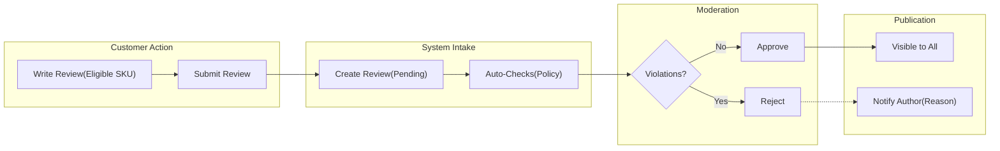
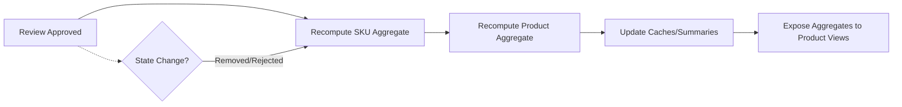
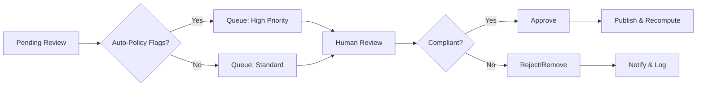
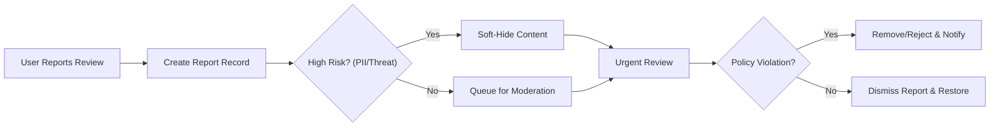
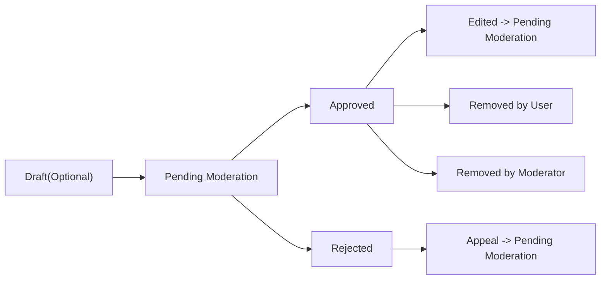

# Functional Requirements – Reviews and Ratings (shoppingMall)

## Overview and Scope
This document defines comprehensive business requirements for product reviews and ratings within the shoppingMall platform. It specifies who can review and when, how ratings are calculated and displayed, how content is moderated, how fraud and spam are handled, and how reports and escalations are processed. It focuses on business rules and user-visible system behavior, not technical implementation (no APIs, schemas, or infrastructure details).

Related documents for broader context:
- See the [Functional Requirements: Product Catalog and Search](./04-functional-requirements-product-catalog-and-search.md) for how products are discovered and listed.
- See the [Functional Requirements: Product Variants and Inventory](./05-functional-requirements-product-variants-and-inventory.md) for SKU-level variant rules relevant to review association.
- See the [Functional Requirements: Checkout, Payment, and Orders](./07-functional-requirements-checkout-payment-and-orders.md) and the [Functional Requirements: Order Tracking and Shipping](./08-functional-requirements-order-tracking-and-shipping.md) for order and delivery states that govern eligibility to review.
- See the [Functional Requirements: Seller Portal](./10-functional-requirements-seller-portal.md) for seller-facing actions on reviews and responses.
- See the [Functional Requirements: Admin Dashboard](./11-functional-requirements-admin-dashboard.md) for central moderation and policy enforcement.
- See the [Business Rules: Data Lifecycle and Events](./12-business-rules-data-lifecycle-and-events.md) for event triggers and audit expectations.
- See the [Non-Functional Requirements: Performance, Security, Compliance](./13-non-functional-requirements-performance-security-compliance.md) for performance targets referenced here.

## Definitions and Entities (Conceptual)
- Review: Customer-authored textual and optional media feedback on a product, optionally with a 1–5 star rating.
- Rating: A numerical score (1–5 stars in 0.5 increments) attached to a review or submitted as rating-only feedback.
- Verified Purchase: A review tied to an order line item that has reached an eligible state (see Eligibility section).
- Product vs. SKU: Reviews are associated to a specific SKU (variant) for accuracy and roll up to the parent product for display and aggregation.
- Moderation State: The lifecycle status of a review (e.g., Pending, Approved, Rejected, Removed).
- Report: A user-submitted complaint about a review for policy violations.
- Roles: guest, customer, seller, supportAgent, operationsManager, financeManager, contentModerator, systemAdmin.

## Roles and Permissions Overview (Business)

| Capability | guest | customer | seller | supportAgent | operationsManager | financeManager | contentModerator | systemAdmin |
|-----------|------|----------|--------|--------------|-------------------|----------------|------------------|-------------|
| View approved reviews and ratings | ✅ | ✅ | ✅ | ✅ | ✅ | ✅ | ✅ | ✅ |
| Submit a review/rating | ❌ | ✅ (if eligible) | ❌ | ❌ | ❌ | ❌ | ❌ | ❌ |
| Edit own review | ❌ | ✅ (time-bound) | ❌ | ❌ | ❌ | ❌ | ❌ | ❌ |
| Delete own review (soft remove) | ❌ | ✅ (time-bound) | ❌ | ❌ | ❌ | ❌ | ❌ | ❌ |
| Report a review | ✅ | ✅ | ✅ | ✅ | ✅ | ✅ | ✅ | ✅ |
| Respond to a review (seller reply) | ❌ | ❌ | ✅ (for own catalog only) | ❌ | ❌ | ❌ | ❌ | ❌ |
| Moderate reviews (approve/reject/remove/restore) | ❌ | ❌ | ❌ | ✅ (within policy) | ✅ | ❌ | ✅ | ✅ |
| Override decisions and manage policies | ❌ | ❌ | ❌ | ❌ | ✅ | ❌ | ✅ (within scope) | ✅ |

EARS (selected permissions):
- THE reviews subsystem SHALL allow "guest" to view only reviews in Approved state.
- WHERE "customer" has eligible order line items, THE reviews subsystem SHALL allow submission of reviews tied to those line items.
- WHERE "seller" owns the product, THE reviews subsystem SHALL allow a single public reply per customer review with edit capability within policy.
- WHERE "contentModerator" is assigned, THE reviews subsystem SHALL provide approve/reject/remove/restore actions within policy constraints.

## Eligibility to Review and Verification Rules

### Core Eligibility
- WHEN a customer’s order line item reaches Delivered state OR 7 calendar days have passed since the first Shipped state (whichever is earlier), THE reviews subsystem SHALL mark that line item as eligible for review submission.
- IF an order line item is fully refunded prior to shipment, THEN THE reviews subsystem SHALL disallow review submission for that item.
- WHERE an order line item is refunded after shipment or after delivery, THE reviews subsystem SHALL allow reviews and SHALL annotate such reviews with a "Refunded Order" badge.
- WHERE the product has multiple variants, THE reviews subsystem SHALL require the review to be associated with the exact SKU purchased; rating aggregation rules shall roll up to product level as specified later.
- WHERE a single order contains multiple quantities of the same SKU, THE reviews subsystem SHALL allow only one review per customer per SKU per order.
- WHERE a customer purchases the same SKU again, THE reviews subsystem SHALL allow an additional review per distinct order up to a maximum of 3 reviews per customer per SKU within a rolling 12 months.

### Verified Purchase and Badges
- WHEN a review is tied to an eligible order line item, THE reviews subsystem SHALL mark the review as Verified Purchase and display a corresponding badge.
- IF a review cannot be tied to an eligible order line item, THEN THE reviews subsystem SHALL reject submission with an eligibility error.
- WHERE seller samples or promotional distributions exist without order linkage, THE reviews subsystem SHALL disallow reviews unless the distribution is recorded as a zero-value order fulfilling eligibility conditions.

### Timing Windows
- WHERE a review eligibility window applies, THE reviews subsystem SHALL allow initial submission from eligibility start until 180 days after delivery date.
- WHERE returns are in progress, THE reviews subsystem SHALL still permit review submission if the item has been delivered; the review badge SHALL reflect "Return Initiated" if return is opened at submission time.

## Review Submission and Editing Policies

### Submission Content Rules
- THE reviews subsystem SHALL accept rating values in 0.5-star increments between 1.0 and 5.0 inclusive.
- THE reviews subsystem SHALL accept optional free-text content up to 5,000 characters in supported languages.
- WHERE media attachments are allowed, THE reviews subsystem SHALL permit up to 5 images and 1 video per review, with each image up to 10 MB and video up to 100 MB; files must be original and non-infringing per policy.
- THE reviews subsystem SHALL require the reviewer to have the "customer" role and a verified email.

### Submission Process and State
- WHEN a review is submitted, THE reviews subsystem SHALL set its state to Pending Moderation and hide it from public view until Approved.
- WHEN a review is Approved, THE reviews subsystem SHALL make it visible to all roles permitted to view reviews.
- IF a review is Rejected, THEN THE reviews subsystem SHALL keep it hidden and notify the author with the reason category.

### Editing Rules
- WHERE the review is Approved, THE reviews subsystem SHALL allow the author to edit rating and text within 30 days of first approval; each edit SHALL transition the review back to Pending Moderation.
- WHERE the review state is Pending Moderation or Rejected, THE reviews subsystem SHALL allow the author to edit at any time within the 180-day submission window.
- WHERE media is edited, THE reviews subsystem SHALL require re-moderation before the edited media is visible.

### Deletion and Withdrawal
- WHEN a customer requests deletion of their own review within 30 days of approval, THE reviews subsystem SHALL remove it from public view and mark state as Removed by User; rating aggregation SHALL be recalculated accordingly.
- WHERE legal or policy requests require removal at any time, THE reviews subsystem SHALL allow contentModerator/systemAdmin to remove reviews and recalculate aggregates.

### Seller Replies
- WHERE a review is Approved, THE reviews subsystem SHALL allow exactly one public seller reply per seller account owning the product, editable by the seller within 14 days of first reply; reply edits SHALL re-enter moderation if policy requires.
- IF a seller reply is removed by moderation, THEN THE reviews subsystem SHALL notify the seller with a reason category and allow one compliant re-reply.

### Submission and Moderation Flow (Diagram)

## Rating Aggregation and Display Rules

### Aggregation Scope
- THE reviews subsystem SHALL maintain rating aggregates at two levels: per SKU and per Product.
- WHERE a product has multiple SKUs, THE reviews subsystem SHALL compute product-level rating as the weighted average of all Approved SKU-level ratings, with each rating weighted equally by default and excluding any Removed or Rejected reviews.
- WHERE the platform enforces Verified Purchase weighting, THE reviews subsystem SHALL optionally apply a +10% weight to Verified Purchase reviews in aggregation (feature-flagged); if enabled, UI indicators SHALL disclose "Verified purchase weighting applied" in business copy.

### Inclusion/Exclusion Rules
- THE reviews subsystem SHALL include only reviews in Approved state for aggregation and display counts.
- IF a review transitions from Approved to Removed or Rejected, THEN THE reviews subsystem SHALL exclude it from aggregates on the next calculation cycle.
- WHERE rating-only submissions exist without text, THE reviews subsystem SHALL include them in aggregates if Approved.

### Calculation Timing and Performance
- WHEN a review state changes to Approved/Removed/Rejected, THE reviews subsystem SHALL update affected aggregates within 60 seconds.
- WHERE product pages request rating summaries, THE reviews subsystem SHALL return aggregated results within 2 seconds for common cases (top categories and popular products).

### Display Rules (Business)
- THE reviews subsystem SHALL display the average rating (to one decimal), total count of Approved reviews, and a histogram of rating distribution (1–5 stars) at both product and SKU levels.
- WHERE SKU-specific context is selected, THE reviews subsystem SHALL prioritize reviews for that SKU while allowing filters to view All SKUs.
- THE reviews subsystem SHALL display a "Verified Purchase" badge and any contextual badges (e.g., "Refunded Order", "Return Initiated") where applicable.

### Aggregation and Event Flow (Diagram)

## Moderation and Content Policy Enforcement

### Policy Categories (Business)
- Hate speech, harassment, and threats
- Obscene or sexually explicit content
- Personally identifiable information (PII) disclosure
- Defamation or false claims
- Off-topic content (e.g., shipping complaints that belong to seller or carrier support channels may be permitted if directly tied to product experience)
- Spam, promotional or affiliate links
- Intellectual property violations (copyright/trademark)
- Dangerous or illegal activity encouragement

### Moderation Roles and Authority
- THE reviews subsystem SHALL allow contentModerator to approve, reject, remove, and restore reviews and seller replies as per policy.
- WHERE escalations arise, THE reviews subsystem SHALL allow operationsManager to override content decisions and apply policy updates.
- THE reviews subsystem SHALL record reason categories and free-text moderator notes for each moderation action.

### Turnaround Targets
- THE reviews subsystem SHALL target initial automated checks instantly and human moderation within 24 hours for flagged content.
- WHERE volume spikes occur, THE reviews subsystem SHALL prioritize Verified Purchase reviews and recent purchases for moderation queueing.

### Moderator Actions and Outcomes
- WHEN content is Approved, THE reviews subsystem SHALL publish immediately and update aggregates.
- IF content is Rejected, THEN THE reviews subsystem SHALL keep it hidden, record reason, and notify the author/seller.
- WHERE content is Removed after approval, THE reviews subsystem SHALL de-publish and annotate action in audit logs with timestamps and actor roles.

### Moderation Workflow (Diagram)

## Fraudulent/Spam Detection (Business)

### Behavioral Controls
- WHERE a customer attempts to submit more than 5 reviews across different products within 10 minutes, THE reviews subsystem SHALL temporarily rate-limit further submissions for 30 minutes.
- WHERE multiple accounts submit reviews from the same device fingerprint or IP block for the same product within 24 hours, THE reviews subsystem SHALL flag those reviews for manual moderation.
- IF a seller account attempts to review products from its own catalog, THEN THE reviews subsystem SHALL block submission and log the incident.
- WHERE a review includes outbound URLs, THE reviews subsystem SHALL strip or block promotional links unless the domain is whitelisted for proof-of-purchase or media hosting.

### Duplicate and Collusion Signals
- WHERE materially identical text is detected across multiple reviews, THE reviews subsystem SHALL flag the content for moderator review.
- WHERE a reviewer repeatedly changes ratings to manipulate aggregates (more than 3 edits in 7 days), THE reviews subsystem SHALL suspend edit privileges for that review and require support intervention.

### Non-ML, Rule-Based Enforcement
- THE reviews subsystem SHALL apply deterministic rule checks as listed; it SHALL NOT require ML models to meet the requirements of this document.

## Reporting and Escalation Flows

### Who Can Report
- THE reviews subsystem SHALL allow any role (guest or authenticated) to report a review for policy violations.

### Report Intake and Handling
- WHEN a report is submitted, THE reviews subsystem SHALL record the review reference, reporter role, reason category, and optional notes, then acknowledge the report within 2 seconds.
- WHERE a review accumulates 3 or more reports within 24 hours, THE reviews subsystem SHALL auto-escalate priority in the moderation queue.
- IF a report concerns imminent harm or PII exposure, THEN THE reviews subsystem SHALL immediately soft-hide the content pending urgent moderation.

### Escalation Paths
- WHERE a review is disputed by the author after Rejection, THE reviews subsystem SHALL allow one appeal within 14 days; contentModerator SHALL re-review with operationsManager override available.
- WHERE a seller disputes a review alleging factual inaccuracy about the product, THE reviews subsystem SHALL allow seller to request a fact-check; supportAgent SHALL facilitate with the reviewer via private communication channels while review remains visible unless policy-violating.

### Reporting Flow (Diagram)

## Incentivization and Abuse Prevention Policies

### Incentive Programs (Optional)
- WHERE the platform offers review incentives (e.g., coupons), THE reviews subsystem SHALL limit incentives to one reward per order line item.
- THE reviews subsystem SHALL require disclosure that a reward may be granted for any review regardless of sentiment.
- WHERE incentives are active, THE reviews subsystem SHALL forbid conditional language implying only positive reviews are rewarded.

### Eligibility and Controls
- THE reviews subsystem SHALL only grant incentives to Verified Purchase reviews that pass moderation.
- WHERE a review is later Removed for policy violation, THE reviews subsystem SHALL claw back or invalidate any associated incentive.
- WHERE suspicious incentive abuse is detected (e.g., many low-effort reviews for rewards), THE reviews subsystem SHALL suspend incentives for the involved accounts pending review.

## Performance, SLAs, and Observability (Business)
- THE reviews subsystem SHALL publish an Approved review with updated aggregates within 60 seconds of approval.
- THE reviews subsystem SHALL return the first page of reviews for a product within 2 seconds under normal load for popular products.
- THE reviews subsystem SHALL support pagination in pages of 20 reviews by default and allow sorting by recency or rating.
- THE reviews subsystem SHALL retain an immutable audit log of moderation actions and state changes, readable by admin roles.

## Error Handling and Edge Cases (Business)

### Eligibility and Submission
- IF a non-eligible customer attempts to submit a review, THEN THE reviews subsystem SHALL reject with an eligibility error explaining the required state.
- IF a guest attempts to submit a review, THEN THE reviews subsystem SHALL reject with an authentication required error.
- IF a review exceeds character or media limits, THEN THE reviews subsystem SHALL reject with a specific validation error listing the violated limits.

### State Conflicts and Concurrency
- IF a review transitions while the author is editing, THEN THE reviews subsystem SHALL require the author to reload the latest state before re-submission.
- IF aggregates are stale due to concurrent updates, THEN THE reviews subsystem SHALL recompute within the specified 60-second window and present the latest consistent aggregate thereafter.

### Product Lifecycle
- WHERE a product is unpublished or delisted, THE reviews subsystem SHALL keep existing Approved reviews accessible via direct links for 180 days for accountability but SHALL exclude them from general search and category listings.
- WHERE a SKU is discontinued, THE reviews subsystem SHALL preserve reviews and maintain product-level aggregates excluding discontinued SKUs unless the product remains active.

### Cross-border and Language
- WHERE multiple locales are supported, THE reviews subsystem SHALL store the review language and allow locale-based filtering; profanity and policy checks SHALL be applied per language rules.

## Compliance, Privacy, and Retention (Business)
- THE reviews subsystem SHALL avoid exposing PII within public reviews; any detected PII SHALL trigger removal and user notification.
- THE reviews subsystem SHALL allow authors to request deletion of their content in accordance with applicable privacy regulations while preserving necessary audit logs.
- THE reviews subsystem SHALL retain public review content for as long as the product is active and for 2 years after delisting for dispute resolution, unless legal holds require longer retention.

## Scope of This Document (Business Requirements Only)
This document specifies business requirements for reviews and ratings, describing WHAT the system must do. All technical implementation decisions (architecture, APIs, database design, storage, caching, and infrastructure) are owned by the development team.

## Appendix – Review State Model (Conceptual)

