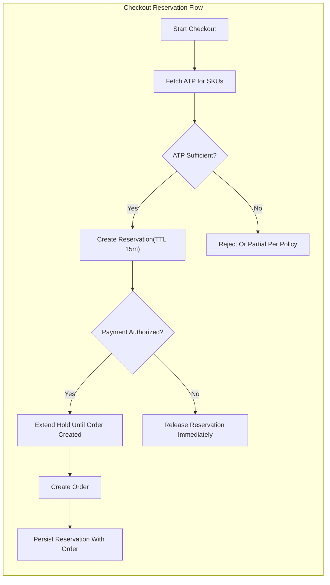
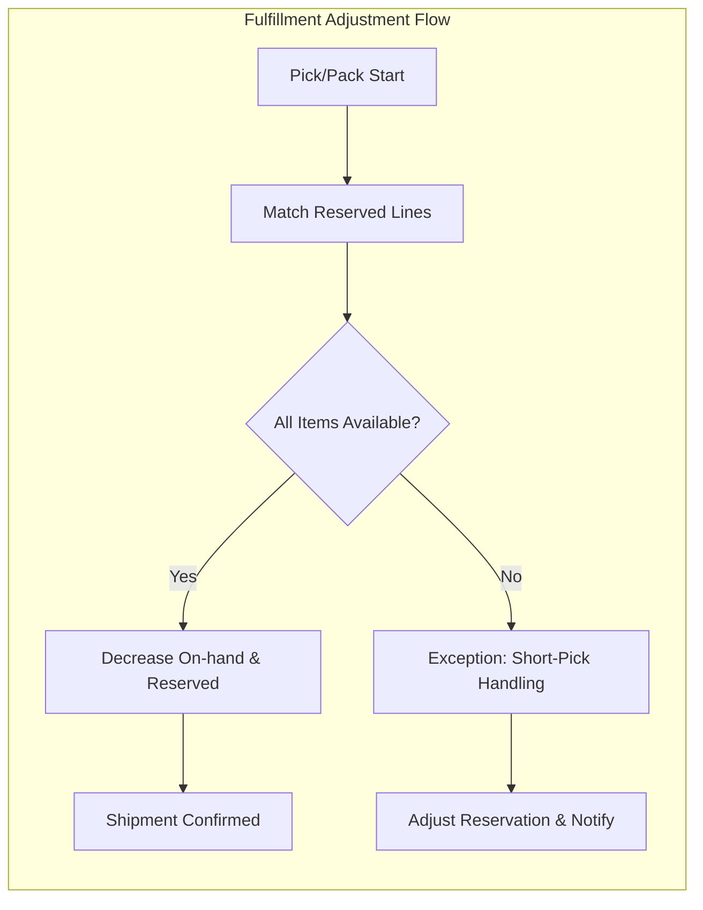
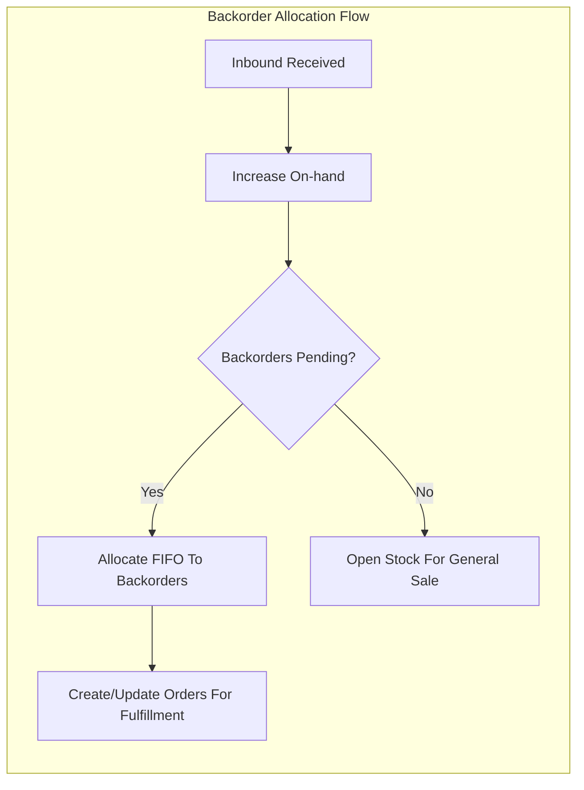
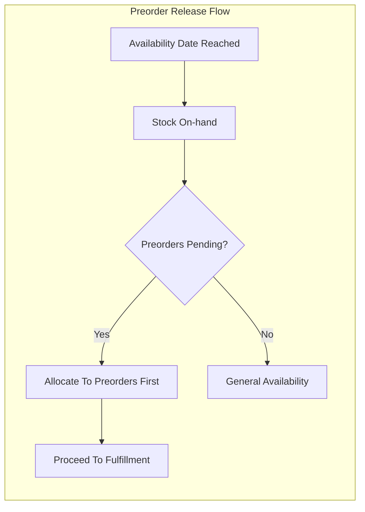
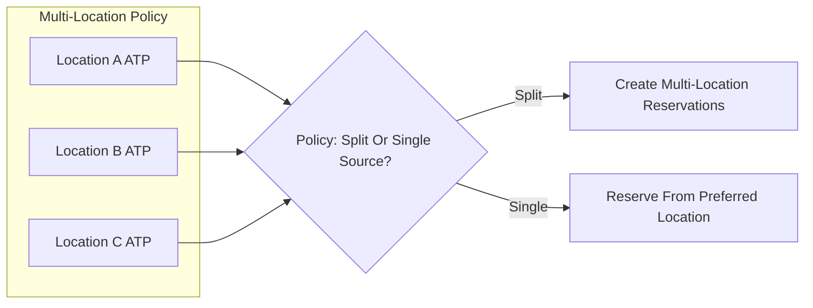

# Inventory Management Requirements — shoppingMall

## 1. Purpose and Scope
Ensure accurate, fair, and auditable control of sellable stock per seller and per SKU with business rules that prevent oversell, support pre- and post-purchase operations, and enable timely fulfillment. Requirements are stated in business terms only, independent of technical implementation.

## 2. Definitions and Core Concepts
- SKU (Stock Keeping Unit): A unique, purchasable product variant owned by a seller.
- Location: A seller-controlled ship-from node such as a warehouse, store, or third-party logistics node recognized for fulfillment.
- On-hand: Quantity of sellable units physically available at a location, excluding damaged/quarantine.
- Reserved: Quantity temporarily held for in-progress orders to prevent oversell.
- ATP (Available to Promise): On-hand minus Reserved, optionally plus confirmed inbound allocated by policy. Unless stated, ATP = On-hand − Reserved.
- Safety Stock: Minimum target quantity below which alerts and protective actions apply.
- Quarantine/Damaged: Non-sellable quantity held for investigation, repair, or disposal.
- Backorder: Acceptance of orders beyond current ATP with promised later fulfillment.
- Preorder: Acceptance of orders before release date.
- Kit/Bundle: A sellable offer composed of component SKUs with shared availability rules.
- UoM (Unit of Measure): The counting unit for selling, stocking, or shipping (e.g., each, pack of 6, case of 24).

EARS (concept clarity):
- THE shoppingMall inventory SHALL use per-seller, per-SKU counting with clear distinctions between On-hand, Reserved, ATP, and Quarantine.
- WHERE multiple locations exist for a seller, THE shoppingMall inventory SHALL maintain counts per location and support location-level policies described herein.

## 3. Actors and Permissions (Business-Level)
Actors:
- Customer: May view stock status cues for purchasable SKUs.
- Seller: May configure stock policies and adjust inventory for owned SKUs/locations.
- Admin: May audit and correct inventory within governance limits and enforce policy.

Permissions matrix (summary):
- View stock status: Customer ✅ (public cues, no exact quantities); Seller ✅ (own); Admin ✅ (all).
- Adjust inventory: Seller ✅ (own SKUs/locations); Admin ✅ (all, with reason and audit).
- Configure backorder/preorder: Seller ✅ (own SKUs, within policy); Admin ✅ (policy/global overrides).
- Release reservations: Admin ✅ (exception handling); Seller ❌; Customer ❌.
- Import/export counts: Seller ✅ (own); Admin ✅ (all).

EARS (permissions):
- IF a seller attempts to adjust inventory for a SKU not owned by them, THEN THE platform SHALL deny the operation.
- WHEN an admin applies a corrective adjustment, THE platform SHALL require a reason code and audit log.
- WHILE an account is suspended, THE platform SHALL block inventory adjustments and configuration changes.

## 4. Multi-Location and Warehousing
- THE platform SHALL support multiple locations per seller with independent On-hand, Reserved, and ATP counters.
- WHERE a SKU is stocked in multiple locations, THE platform SHALL calculate total ATP as the sum of location ATP when presenting overall availability cues to customers.
- WHERE location-specific restrictions exist (e.g., hazmat, region), THE platform SHALL enforce them in checkout and fulfillment planning.
- WHEN a seller designates a default ship-from location per SKU, THE platform SHALL use it for ATP and reservation unless multi-location allocation policy applies.
- WHERE multi-location allocation is enabled, THE platform SHALL allow policy-driven splits for reservations and fulfillment.

## 5. Inventory States and Counters
Business counters per seller/SKU/location:
- On-hand (sellable), Reserved, ATP, Quarantine/Damaged, Inbound Confirmed (non-ATP until received), Backordered/Preordered commitments.

EARS:
- WHEN an order is confirmed per checkout policy, THE inventory SHALL create or extend reservation entries that reduce ATP accordingly.
- WHEN a shipment is confirmed picked/packed, THE inventory SHALL decrease On-hand and decrease Reserved by shipped quantities.
- IF an authorization or checkout session fails or expires, THEN THE inventory SHALL release the reservation immediately.
- WHEN a return passes inspection with restock, THE inventory SHALL increase On-hand at the appropriate location.

## 6. Stock Adjustments and Safeguards
Valid reasons (controlled list; extensible by policy):
- Sales flow: reservation create/release, shipment pick/pack, cancellation release, return-restocked, return-no-restock.
- Operations: cycle count, damaged, shrinkage/loss, supplier return, quarantine, inbound receipt, reclassification.
- Administrative: dispute remediation, compliance correction, initial stock set, audit reconciliation.

EARS:
- THE platform SHALL require a reason code and positive integer quantity for every adjustment line.
- IF an adjustment would cause negative On-hand or Reserved, THEN THE platform SHALL block the adjustment.
- WHERE admin override is permitted, THE platform SHALL require elevated role and a mandatory note.
- WHEN Quarantine is used, THE platform SHALL prevent Quarantine quantities from contributing to ATP.

## 7. Reservations and Holds
Objectives: prevent oversell and ensure fairness during concurrency.

Reservation lifecycle:
- WHEN checkout initiates payment authorization, THE inventory SHALL create per-SKU reservations with a default TTL of 15 minutes (configurable 5–30 minutes by policy).
- WHILE a reservation is active, THE inventory SHALL reduce ATP by the reserved quantity.
- WHEN authorization succeeds, THE inventory SHALL extend reservations until order creation finalizes.
- IF authorization fails or the session expires, THEN THE inventory SHALL release reservations immediately.
- WHEN an order is canceled before shipment, THE inventory SHALL release reservations immediately.

Fairness and limits:
- WHERE per-customer quantity caps exist, THE inventory SHALL enforce caps during reservation creation.
- IF ATP is insufficient, THEN THE inventory SHALL reject the reservation or offer partial reservation only where policy allows.
- THE inventory reservation process SHALL be idempotent at the business level for retried requests using a unique cart/checkout reference.

EARS performance:
- WHEN creating or releasing a reservation, THE inventory operation SHALL complete within 2 seconds at P95 under normal load.

## 8. Backorders and Preorders
Backorders:
- WHERE backorders are enabled for a SKU, THE platform SHALL accept orders beyond ATP up to a defined limit per SKU.
- WHEN backorders are placed, THE platform SHALL track backordered quantities separately and exclude them from On-hand and Reserved until inbound is received and allocated.
- WHEN inbound arrives, THE platform SHALL allocate to backorders in FIFO order unless policy specifies another rule.

Preorders:
- THE platform SHALL require an availability date and may require a cap for preorders.
- WHILE current date is before availability date, THE platform SHALL accept orders up to the cap without reducing On-hand.
- WHEN availability date arrives and stock is on-hand, THE platform SHALL prioritize fulfilling preorders before general sale.

Customer communication:
- WHEN a line is backordered or preordered, THE platform SHALL present expected fulfillment timelines and clearly label the status in customer views.

## 9. Kits, Bundles, and Component Consumption
- WHERE a kit/bundle is defined, THE platform SHALL link the offer to component SKUs for availability evaluation.
- WHEN determining ATP for a kit, THE platform SHALL compute the limiting component (minimum feasible assemblies) and use it as the kit ATP.
- WHEN a kit is ordered, THE platform SHALL reserve component SKUs proportionally to kit composition at reservation time.
- IF a component becomes unavailable, THEN THE platform SHALL prevent additional kit reservations and SHALL handle existing reservations per policy.
- WHERE a bundle uses loose coupling (no component tracking), THE platform SHALL treat bundle ATP independently and SHALL not adjust component counts.

## 10. Unit of Measure and Packaging
- THE platform SHALL support per-SKU selling UoM (each, pack, case) and inventory UoM conversions defined in business policy.
- WHEN inventory increments require steps (e.g., packs of 2), THE platform SHALL enforce increments during reservation and checkout.
- IF selling UoM differs from stocking UoM, THEN THE platform SHALL apply deterministic conversion for ATP and reservations.

## 11. Replenishment, Safety Stock, and Stockout Handling
- WHEN inbound stock is confirmed, THE platform SHALL track expected arrivals without increasing ATP until receipt.
- WHEN inbound is received and marked sellable, THE platform SHALL increase On-hand accordingly.
- WHERE safety stock thresholds are configured, THE platform SHALL generate alerts when ATP falls to or below threshold.
- WHEN ATP reaches zero and backorders are disabled, THE platform SHALL prevent new reservations and present out-of-stock cues to customers.

Seller notifications (business-level):
- WHEN low-stock or stockout occurs per threshold, THE platform SHALL notify the seller within 5 minutes.

## 12. Returns, Restocking, and Condition Handling
- WHEN a return is approved with restocking, THE platform SHALL increase On-hand only after items are received and pass inspection.
- WHERE inspection fails, THE platform SHALL route items to Quarantine or mark no-restock and SHALL not increase On-hand.
- WHERE serial-numbered items exist, THE platform SHALL accept restock only when returned serials match shipped serials or an authorized override exists.
- WHEN partial returns occur, THE platform SHALL adjust On-hand proportionally to approved quantities.

## 13. Order and Fulfillment Coupling
- WHEN pick/pack begins, THE platform SHALL reconcile reserved lines with On-hand and adjust for short-picks (under-picks) and substitutions if permitted by policy.
- IF short-pick occurs, THEN THE platform SHALL decrease Reserved and On-hand for shipped quantities only and release any unfulfilled reserved quantities.
- WHERE substitutions are allowed, THE platform SHALL require explicit policy and customer acceptance before adjusting reservations across SKUs.

## 14. Error Handling, Idempotency, and Edge Cases
Validation errors:
- IF a reservation request exceeds ATP and partial reservations are disallowed, THEN THE platform SHALL reject with an insufficient stock reason.
- IF an adjustment reason code is missing or invalid, THEN THE platform SHALL reject the request.
- IF a negative quantity is provided, THEN THE platform SHALL reject the request.

Concurrency and conflicts:
- WHEN concurrent adjustments target the same SKU/location, THE platform SHALL ensure a consistent final state and reject conflicting changes with guidance to retry.
- WHEN the same reservation is retried with the same business reference, THE platform SHALL process idempotently and avoid double-counting.

Lifecycle anomalies:
- IF a SKU is discontinued, THEN THE platform SHALL prevent new reservations and backorders while allowing returns processing and administrative adjustments.
- IF a location is deactivated, THEN THE platform SHALL block further allocations to that location and guide reallocation where possible.

Customer-facing messaging:
- THE platform SHALL present clear availability types: in stock, low stock, out of stock, preorder, backorder, and SHALL avoid disclosing exact quantities to customers.

## 15. Performance, Freshness, and SLA Expectations
- THE platform SHALL complete reservation create/release within 2 seconds P95 and 5 seconds P99 under normal load.
- THE platform SHALL reflect inventory changes (On-hand or Reserved) in customer-facing availability within 3 seconds P95.
- THE platform SHALL process bulk adjustments with per-SKU confirmation within 2 seconds P95 for typical batch sizes.
- WHILE peak events occur, THE platform SHALL prioritize correctness and reservation integrity over non-critical reporting.

## 16. Auditability, Retention, and Compliance
- THE platform SHALL produce an immutable audit trail for all inventory-affecting events capturing actor role, actor identifier, reason code, timestamp, SKU, location, quantity, and business reference where applicable.
- THE platform SHALL retain inventory audit records for at least 24 months, and longer where legal or dispute policies require.
- THE platform SHALL limit access to audit logs to authorized roles and provide read-only views for compliance auditing.

## 17. Reporting, KPIs, and Reconciliation
Seller views:
- THE platform SHALL provide period summaries: beginning On-hand, increases, decreases, ending On-hand, Reserved, Backordered/Preordered quantities, and low-stock events.
- THE platform SHALL provide exception reports: short-pick incidents, negative adjustment attempts, reservation failures.

Admin views:
- THE platform SHALL provide aggregate stockout rate, oversell incidents, reservation failure rates, backorder fill lead times, preorder fulfillment timeliness, reconciliation variances.

KPIs (illustrative targets):
- Oversell incident rate ≤ 0.1% of successful orders per SKU per month.
- Reservation failure due to contention ≤ 0.5% during peak.
- Audit completion of cycle counts within 5 business days of window close for selected SKUs.

Reconciliation:
- WHEN book inventory diverges from physical counts, THE platform SHALL require an adjustment with reason and supporting notes and SHALL flag repeated variances.

## 18. Visual Flows (Mermaid)

### 18.1 Reservation During Checkout

### 18.2 Fulfillment and Stock Adjustment

### 18.3 Backorder Allocation Upon Replenishment

### 18.4 Preorder Release

### 18.5 Multi-Location Allocation

## 19. Related Documents and Dependencies
- Checkout and reservations: [Checkout and Payment Requirements](./07-shoppingMall-checkout-and-payment.md)
- Order states and shipping: [Order and Shipping Management Requirements](./08-shoppingMall-order-and-shipping-management.md)
- Cancellations, RMAs, refunds: [Returns, Cancellations, and Refunds Requirements](./11-shoppingMall-returns-cancellations-and-refunds.md)
- Seller portal operations: [Seller Portal Requirements](./12-shoppingMall-seller-portal-requirements.md)
- Security, privacy, compliance: [Security, Privacy, and Compliance Requirements](./14-shoppingMall-security-privacy-and-compliance.md)
- Performance targets: [Performance and SLA Requirements](./15-shoppingMall-performance-and-sla.md)

## 20. Consolidated EARS Requirement Index
- THE shoppingMall inventory SHALL maintain per-seller, per-SKU counts for On-hand, Reserved, ATP, and Quarantine.
- WHEN checkout initiates authorization, THE inventory SHALL create reservations with a default TTL of 15 minutes and reduce ATP accordingly.
- WHEN authorization fails or expires, THE inventory SHALL release reservations immediately.
- WHEN orders are picked/packed, THE inventory SHALL decrease On-hand and Reserved by shipped quantities.
- WHERE backorders are enabled, THE platform SHALL accept orders above ATP up to configured limits and allocate FIFO upon replenishment.
- WHERE preorders are enabled, THE platform SHALL accept orders up to caps before release and prioritize fulfillment at release.
- WHEN inbound is received and sellable, THE inventory SHALL increase On-hand and reflect ATP within freshness targets.
- IF an adjustment would make On-hand or Reserved negative, THEN THE platform SHALL reject the adjustment.
- THE platform SHALL require reason codes and audit entries for all inventory-affecting actions.
- THE platform SHALL enforce per-customer quantity limits where configured during reservation creation.
- WHEN kits are sold, THE platform SHALL reserve component SKUs proportional to kit composition and compute kit ATP by limiting component.
- THE platform SHALL enforce increments and UoM conversions for reservation and ATP calculations.
- THE platform SHALL notify sellers within 5 minutes upon low-stock or stockout threshold breaches.
- THE platform SHALL reflect availability changes to customers within 3 seconds at P95 under normal load.
- THE platform SHALL restrict inventory visibility such that customers see status cues only, not exact counts.
- THE platform SHALL provide immutable audit logs with 24-month minimum retention and controlled access.
- THE platform SHALL provide seller/admin reporting views for reconciliation, exceptions, and KPI monitoring.
