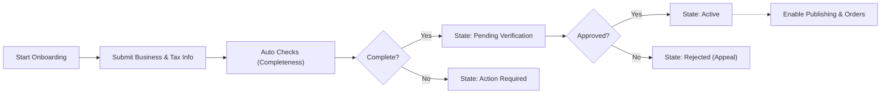
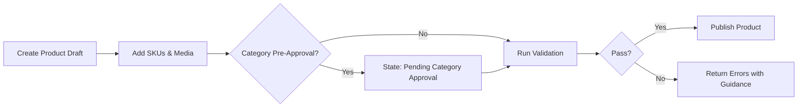
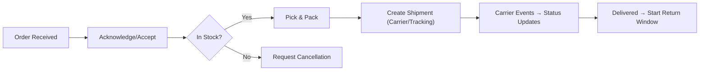
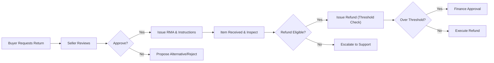
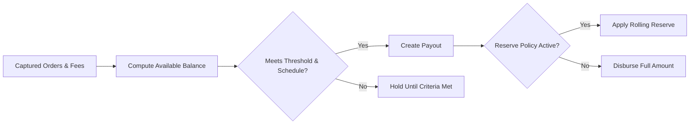
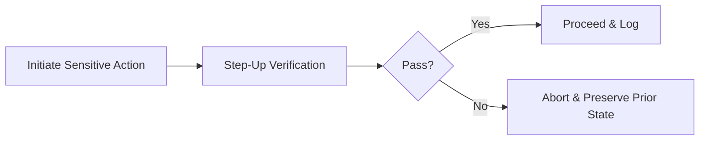

# Functional Requirements – Seller Portal (shoppingMall)

## 1. Scope and Intent
Defines complete business requirements for the seller-facing portal of shoppingMall. Specifies WHAT the platform must achieve for sellers and staff in this domain, in business terms only. Excludes APIs, database schemas, vendor specifics, or UI design prescriptions.

## 2. Roles, Access Control, and Ownership

### 2.1 Roles in Scope
- seller: Merchant operating one or more stores and their catalog, inventory, pricing, orders, and shipping updates.
- supportAgent: Staff assisting customers and sellers with order issues and disputes within policy thresholds.
- operationsManager: Staff managing catalog integrity, categories, and policy enforcement.
- financeManager: Staff approving refunds over thresholds, managing payouts, reconciliation, and reserves.
- contentModerator: Staff moderating UGC related to seller content and replies.
- systemAdmin: Staff managing global configurations, roles, and escalated overrides.

### 2.2 Access Principles (EARS)
- THE shoppingMall Seller Portal SHALL enforce least-privilege and store ownership boundaries for all seller actions.
- WHEN a user acts as seller, THE shoppingMall Seller Portal SHALL restrict create/update/delete actions to entities owned by that seller’s store(s).
- IF a user attempts to access resources outside their ownership or role scope, THEN THE shoppingMall Seller Portal SHALL deny the action and record an audit event with reason.
- WHERE maker-checker is configured for sensitive operations (e.g., high-value refunds), THE shoppingMall Seller Portal SHALL require distinct initiator and approver identities.

### 2.3 Permission Matrix (Business View)
| Feature Area | seller | supportAgent | operationsManager | financeManager | contentModerator | systemAdmin |
|--------------|--------|--------------|-------------------|----------------|------------------|------------|
| Store profile edit | ✅ | ❌ | ⚠️ Policy-only | ❌ | ❌ | ✅ |
| Product/SKU create/edit | ✅ | ❌ | Read-only | ❌ | ❌ | ✅ |
| Inventory/pricing edit | ✅ | ❌ | Read-only | ❌ | ❌ | ✅ |
| Orders view | ✅ | ✅ | ✅ | ✅ | Read-only | ✅ |
| Fulfillment/shipping update | ✅ | ❌ | Read-only | ❌ | ❌ | ✅ |
| Refund/cancel handling | ✅ | ✅ (assist) | Read-only | ✅ (approve) | ❌ | ✅ |
| Payouts view | ✅ | Read-only | Read-only | ✅ | ❌ | ✅ |
| Policy enforcement | ❌ | ❌ | ✅ | ❌ | ✅ (content) | ✅ |

Notes: ⚠️ indicates constrained actions limited to policy fields or oversight controls.

EARS clarifications:
- WHEN supportAgent accesses a seller order for assistance, THE shoppingMall Seller Portal SHALL mask PII by default and require a support case reference to reveal data where policy allows.
- WHERE an operation has financial impact (refund approval, payout adjustment), THE shoppingMall Seller Portal SHALL require appropriate financeManager permissions and log justification text.

## 3. Seller Onboarding and Verification (KYC/KYB)

### 3.1 Preconditions and Required Information
- THE shoppingMall Seller Portal SHALL require authenticated users to request seller onboarding.
- WHEN onboarding starts, THE shoppingMall Seller Portal SHALL collect legal business name, registration number (where applicable), country/region, registered address, tax identifiers, beneficial owner information where required, and contact details.
- WHERE payouts are enabled, THE shoppingMall Seller Portal SHALL collect payout details (account holder name, bank account or equivalent, settlement currency) before first payout.

### 3.2 States and Transitions
States: "Draft" → "Pending Verification" → "Action Required" → "Active" → "Suspended" → "Terminated".

EARS:
- WHEN onboarding is submitted, THE shoppingMall Seller Portal SHALL set state to "Pending Verification" and provide a decision SLA of 1 business day for initial review.
- IF deficiencies are found, THEN THE shoppingMall Seller Portal SHALL set state to "Action Required" and list missing or invalid items with a response deadline ≥ 7 calendar days.
- WHEN verification is approved, THE shoppingMall Seller Portal SHALL set state to "Active" and enable publishing and order intake.
- IF serious policy violations are detected, THEN THE shoppingMall Seller Portal SHALL set state to "Suspended" and communicate reasons and appeal path.
- IF termination is enacted, THEN THE shoppingMall Seller Portal SHALL block new listings and orders and retain records per retention policy.

### 3.3 Sensitive Changes and Step-Up Verification
- WHEN payout details, legal entity data, or beneficial owner data are changed, THE shoppingMall Seller Portal SHALL require step-up verification (e.g., 2FA) and re-verification by operationsManager and/or financeManager per policy.
- IF step-up verification fails or times out, THEN THE shoppingMall Seller Portal SHALL abort the change and preserve prior values.

### 3.4 Onboarding Flow (Mermaid)

## 4. Store Profile, Branding, and Customer Service

EARS:
- THE shoppingMall Seller Portal SHALL ensure store display name is unique across active stores and free of prohibited or impersonating terms.
- WHEN branding assets are uploaded (logo/banner), THE shoppingMall Seller Portal SHALL validate file type, dimensions, and size; non-conforming uploads SHALL be rejected with reasons.
- WHEN customer service settings are configured (email, optional phone, business hours, SLA), THE shoppingMall Seller Portal SHALL track response time adherence against the published SLA.

## 5. Catalog Management by Seller

### 5.1 Product Creation and Publication
EARS:
- THE shoppingMall Seller Portal SHALL require product title, category selection from approved taxonomy, description, at least one compliant image, and at least one valid SKU prior to publishing.
- WHEN a product requires category pre-approval (regulated goods), THE shoppingMall Seller Portal SHALL set product state to "Pending Category Approval" and block publishing until approved.
- IF a product violates policy (prohibited items, misleading claims), THEN THE shoppingMall Seller Portal SHALL block publishing and return violation categories with remediation guidance.

### 5.2 Variant/SKU Definition and Integrity
EARS:
- THE shoppingMall Seller Portal SHALL require unique seller-visible SKU codes within a store and prevent duplicates.
- WHERE universal identifiers are mandated by category, THE shoppingMall Seller Portal SHALL validate presence and format before publishing.
- IF a seller attempts to delete a SKU referenced by pending or completed orders, THEN THE shoppingMall Seller Portal SHALL block deletion and offer discontinuation instead.

### 5.3 Media and Content Standards
EARS:
- THE shoppingMall Seller Portal SHALL reject images with prohibited overlays or watermarks per policy and require minimum resolution.
- WHEN videos are attached, THE shoppingMall Seller Portal SHALL enforce duration and size limits.

### 5.4 Change Management
EARS:
- WHEN critical fields are edited on published products (title, description, category, variant structure), THE shoppingMall Seller Portal SHALL require revalidation and MAY set state to "Under Review"; high-risk content MAY be hidden by operationsManager pending review.

### 5.5 Listing and Publication Flow (Mermaid)

## 6. Inventory, Pricing, and Promotions

### 6.1 Inventory
EARS:
- THE shoppingMall Seller Portal SHALL allow per-SKU inventory updates and enforce non-negative quantities.
- WHEN inventory falls to or below low-stock threshold, THE shoppingMall Seller Portal SHALL flag the SKU and optionally notify subscribers per policy.
- WHILE orders are placed but not shipped, THE shoppingMall Seller Portal SHALL reflect reserved quantities in available-to-sell views within 1 minute.

### 6.2 Pricing and Floors
EARS:
- THE shoppingMall Seller Portal SHALL allow base and compare-at pricing and block prices below category minimum or above policy ceilings where defined.
- WHERE tax-inclusive pricing is required by region, THE shoppingMall Seller Portal SHALL enforce correct configuration and display behavior.

### 6.3 Promotions
EARS:
- THE shoppingMall Seller Portal SHALL allow time-bound promotions at product/SKU level with precedence rules to avoid double-discounts against policy.
- WHEN overlapping promotions conflict, THE shoppingMall Seller Portal SHALL apply the highest-priority promotion and disclose the chosen rule to the seller.
- WHEN a promotion ends, THE shoppingMall Seller Portal SHALL revert to base price within 5 minutes.

### 6.4 Bulk Operations
EARS:
- WHEN bulk edits are submitted, THE shoppingMall Seller Portal SHALL apply atomic validation per row, reject only invalid rows with row-level reasons, and process valid rows.

## 7. Orders, Fulfillment, and Shipping Updates

### 7.1 Order Ingestion and Acknowledgment
EARS:
- WHEN an order including a seller’s SKUs is created, THE shoppingMall Seller Portal SHALL create a seller order view including items, buyer shipping address, shipping method, and any buyer notes.
- THE shoppingMall Seller Portal SHALL require seller acknowledgment within 24 hours of order creation; failure to acknowledge SHALL mark the order as "Late Acknowledgment" and MAY auto-cancel per policy.

### 7.2 Pick, Pack, and Ship
EARS:
- WHEN a shipment is created, THE shoppingMall Seller Portal SHALL require carrier name, tracking number, ship date, and included item quantities; quantities SHALL NOT exceed remaining fulfillable amounts.
- IF tracking number format is invalid for the selected carrier policy, THEN THE shoppingMall Seller Portal SHALL reject the update with a clear message.
- WHEN a shipment is dispatched, THE shoppingMall Seller Portal SHALL update buyer-facing status within 2 minutes and expose carrier and tracking link.

### 7.3 Split Shipments and Exceptions
EARS:
- WHERE multiple fulfillment centers are used, THE shoppingMall Seller Portal SHALL allow multiple shipments and maintain per-shipment tracking.
- IF delivery exceptions arise (lost, damaged, address issue), THEN THE shoppingMall Seller Portal SHALL provide actions to reship, refund, or request investigation per policy and log selected outcome.

### 7.4 Fulfillment Flow (Mermaid)

## 8. Cancellations, Returns, Refunds, and Disputes

### 8.1 Buyer-Initiated Cancellation and Seller-Initiated Cancellation
EARS:
- WHEN a buyer cancels before shipment, THE shoppingMall Seller Portal SHALL allow auto-approval within 2 hours unless the order is already handed to the carrier.
- WHEN the seller lacks stock or cannot fulfill, THE shoppingMall Seller Portal SHALL allow seller-initiated cancellation with reason; penalties MAY apply per policy.

### 8.2 Returns and Inspections
EARS:
- WHEN a return is requested within the policy window, THE shoppingMall Seller Portal SHALL require seller action (approve or propose alternative) within 2 business days.
- WHEN returned goods are received, THE shoppingMall Seller Portal SHALL record inspection outcome (restockable, damaged, wrong item) and compute refund proposal accordingly.

### 8.3 Refund Thresholds and Approvals
EARS:
- WHERE a refund exceeds configured thresholds, THE shoppingMall Seller Portal SHALL route the request to financeManager for approval prior to execution.
- WHEN a refund is approved, THE shoppingMall Seller Portal SHALL trigger the refund and update order and payout adjustments within 1 business day.

### 8.4 Dispute Mediation
EARS:
- WHEN buyer and seller disagree on outcomes, THE shoppingMall Seller Portal SHALL escalate to supportAgent, collect evidence from both parties, and provide an initial response within 3 business days.

### 8.5 Return/Refund Decision Flow (Mermaid)

## 9. Payouts, Balances, Reserves, and Reconciliation

### 9.1 Balances and Visibility
EARS:
- THE shoppingMall Seller Portal SHALL maintain a seller ledger with available and reserved balances reflecting captured orders, fees, refunds, and adjustments.
- WHEN a payout is delayed due to reserve or verification, THE shoppingMall Seller Portal SHALL display reserve amount, rationale, and planned release date.

### 9.2 Schedules and Thresholds
EARS:
- THE shoppingMall Seller Portal SHALL schedule weekly payouts by default and enable daily settlements for eligible sellers starting the next business day after qualification.
- WHERE minimum payout thresholds exist, THE shoppingMall Seller Portal SHALL hold payouts until thresholds are met.

### 9.3 Reserves and Holds
EARS:
- WHERE risk policies apply, THE shoppingMall Seller Portal SHALL place rolling reserves as a percentage of new sales for a configured period and show release timelines.

### 9.4 Reconciliation and Disputes
EARS:
- WHEN a seller disputes a payout statement, THE shoppingMall Seller Portal SHALL allow filing within 30 days and route to financeManager for resolution.

### 9.5 Payout/Reserve Flow (Mermaid)

## 10. Security, Authentication, and Audit (Portal Context)

EARS:
- WHEN a seller performs a sensitive action (payout/bank change, high-value refund, store ownership transfer), THE shoppingMall Seller Portal SHALL require step-up verification and log the action with actor, timestamp, and reason.
- WHEN authentication credentials or 2FA factors are changed, THE shoppingMall Seller Portal SHALL notify the seller and invalidate prior sessions per policy.
- WHERE supportAgent accesses seller data, THE shoppingMall Seller Portal SHALL mask PII by default and require a support case reference to reveal data with audit trail.
- THE shoppingMall Seller Portal SHALL retain audit logs of seller actions for ≥ 2 years and staff audit logs for ≥ 5 years, subject to regional regulation.

### 10.1 Sensitive Action Guardrail (Mermaid)

## 11. Performance and Non-Functional Expectations (Seller Portal)

EARS:
- THE shoppingMall Seller Portal SHALL load seller dashboard views within 2 seconds p95 and within 5 seconds p99 during peak.
- WHEN a seller updates inventory or price, THE shoppingMall Seller Portal SHALL confirm the update within 600 ms p95 and propagate changes to buyer views within 60 seconds.
- WHEN a seller submits shipment details, THE shoppingMall Seller Portal SHALL reflect buyer-visible status within 60 seconds.
- THE shoppingMall Seller Portal SHALL maintain availability ≥ 99.9% monthly for essential seller functions.

## 12. KPIs, Compliance, and Policy Enforcement

### 12.1 Monitored KPIs and Targets
- Order Defect Rate (ODR): < 1.0% rolling 30 days.
- Late Shipment Rate: < 5% rolling 30 days.
- Seller-Initiated Cancellation Rate: < 2% rolling 30 days.
- On-Time Delivery Rate: > 95%.
- Response Time SLA: average ≤ 1 business day to buyer messages.
- Inventory Accuracy: ≥ 99% alignment between listed and actual stock.

EARS:
- WHERE KPI thresholds are breached for a rolling window, THE shoppingMall Seller Portal SHALL issue warnings with remediation steps and a compliance deadline.
- IF repeated or severe breaches occur, THEN THE shoppingMall Seller Portal SHALL allow sanctions including listing suppression, temporary suspension, or termination per policy, with audit trail.

### 12.2 Policy Library and Notices
EARS:
- THE shoppingMall Seller Portal SHALL present a policy library with effective dates and change history; enforcement notices SHALL reference specific policy codes and appeal paths.

## 13. Error Handling and Recovery (Representative)

EARS:
- IF an inventory update would result in a negative quantity, THEN THE shoppingMall Seller Portal SHALL reject the update and display the maximum allowable value.
- IF a bulk update contains invalid rows, THEN THE shoppingMall Seller Portal SHALL process valid rows and return row-level errors for the rest.
- IF shipment quantities exceed remaining fulfillable quantities, THEN THE shoppingMall Seller Portal SHALL reject shipment creation with per-line messages.
- IF tracking number is reused for a different order without authorized override, THEN THE shoppingMall Seller Portal SHALL block the update and suggest valid options.
- IF a refund request exceeds captured amount, THEN THE shoppingMall Seller Portal SHALL block execution and display the remaining refundable amount.
- IF the return window has expired, THEN THE shoppingMall Seller Portal SHALL block initiation and reference applicable policy.

## 14. EARS Requirement Index (Selected)

- WHEN a seller edits critical product fields, THE shoppingMall Seller Portal SHALL revalidate and MAY set state to "Under Review".
- WHEN a seller fails to acknowledge an order within 24 hours, THE shoppingMall Seller Portal SHALL mark "Late Acknowledgment" and MAY auto-cancel per policy.
- WHEN shipment is delivered, THE shoppingMall Seller Portal SHALL start the return window timer per category/region.
- WHEN a refund is approved, THE shoppingMall Seller Portal SHALL adjust seller payout in the next settlement cycle.
- WHEN a payout is scheduled, THE shoppingMall Seller Portal SHALL generate a statement with fees, reserves, and taxes where applicable.
- WHERE high-risk actions occur, THE shoppingMall Seller Portal SHALL require step-up verification and log the event.

## 15. Related Documents and Glossary

Related specifications:
- Roles and permissions: [User Roles and Permissions](./02-user-roles-and-permissions.md)
- Catalog and search: [Product Catalog and Search Requirements](./04-functional-requirements-product-catalog-and-search.md)
- Variants and inventory: [Product Variants and Inventory Requirements](./05-functional-requirements-product-variants-and-inventory.md)
- Cart and wishlist: [Cart and Wishlist Requirements](./06-functional-requirements-cart-and-wishlist.md)
- Checkout and orders: [Checkout, Payment, and Orders Requirements](./07-functional-requirements-checkout-payment-and-orders.md)
- Order tracking and shipping: [Order Tracking and Shipping Requirements](./08-functional-requirements-order-tracking-and-shipping.md)
- Reviews and ratings: [Reviews and Ratings Requirements](./09-functional-requirements-reviews-and-ratings.md)
- Admin oversight: [Admin Dashboard Requirements](./11-functional-requirements-admin-dashboard.md)
- Data lifecycle and events: [Business Rules, Data Lifecycle, and Events](./12-business-rules-data-lifecycle-and-events.md)
- NFRs and compliance: [Non-Functional Requirements](./13-non-functional-requirements-performance-security-compliance.md)

Glossary (Business Terms):
- Available-to-sell (ATS): Inventory immediately available for sale after reservations.
- Maker-checker: Dual-control approval where a second authorized user must approve a sensitive change before it takes effect.
- Reserve (rolling): Percentage of sales held for a period to cover returns/chargebacks.
- RMA: Return merchandise authorization used to track return shipments.
- KPI: Key performance indicator used to track seller operational performance.
