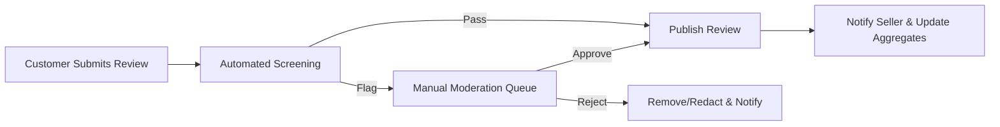
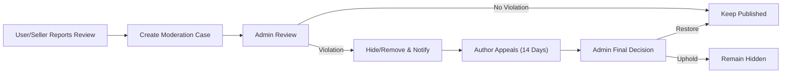
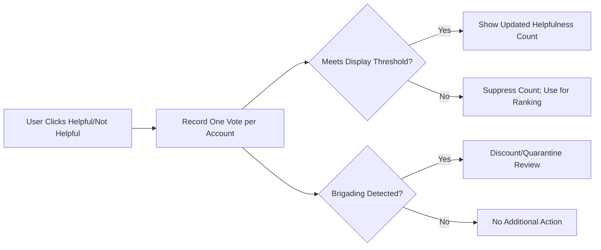
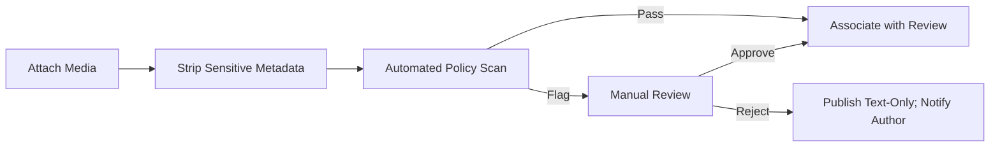

# 10 — shoppingMall Reviews and Ratings (Business Requirements)

Business requirements for product reviews and ratings within shoppingMall, covering eligibility, submission, moderation, seller responses, visibility and sorting, incentives, anti-abuse, notifications, analytics, privacy, and performance expectations. Statements specify WHAT outcomes must occur in business terms and avoid technical implementation detail.

## 1. Purpose and Scope
- Establish trustworthy social proof that improves buyer confidence and product quality feedback loops.
- Protect users and sellers through clear eligibility, content rules, moderation, and appeal processes.
- Provide sellers actionable insight and the ability to respond without manipulating public opinion.
- Ensure compliance with privacy and consumer protection policies.

In scope:
- Product-level and SKU-level review flows, ratings, media, moderation, responses, visibility, analytics, incentives, notifications, and anti-abuse measures.

Out of scope:
- UI/UX design, API schemas, database models, vendor-specific tooling.

## 2. Definitions and Assumptions
- "Review": Textual feedback authored by a customer about a purchased product or SKU; can include optional media.
- "Rating": Integer score 1–5 indicating satisfaction.
- "Verified Purchase": A review linked to a completed order line for the exact SKU; eligible for a verified badge and higher weight.
- "SKU-level Aggregation": Reviews authored at SKU; public views may aggregate to product-level with variant filters.
- "Moderation": Automated and manual processes enforcing policy (e.g., profanity, hate, spam, PII exposure, illegal products/services).
- "Defamation Claims": Allegations of false harmful statements, handled via an escalated moderation workflow.
- "Actors": customer, seller, admin as defined in platform actor documents.

## 3. Actors and Permissions (Business-Level)

| Action | Customer | Seller | Admin |
|-------|----------|--------|-------|
| Submit review/rating (eligible) | ✅ | ❌ | ❌ |
| Edit/delete own review | ✅ | ❌ | ❌ |
| Report a review | ✅ | ✅ | ✅ |
| Vote helpful/not helpful | ✅ | ❌ | ❌ |
| Respond once to a review (own product) | ❌ | ✅ | ❌ |
| Edit seller response (limited) | ❌ | ✅ | ❌ |
| Moderate content / appeals | ❌ | ❌ | ✅ |
| Pin/feature (policy-based) | ❌ | ❌ | ✅ |

EARS permissions:
- IF an actor attempts an action outside role permissions, THEN THE platform SHALL deny with a business reason and record the attempt for audit.
- WHERE seller actions relate to reviews, THE platform SHALL restrict scope to the seller’s own products only.

## 4. Eligibility to Review
- THE platform SHALL restrict review creation to customers with a qualifying purchase of the exact SKU.
- WHEN an order line reaches "Delivered", THE platform SHALL mark the SKU as eligible for the purchasing customer.
- WHERE delivery confirmation is missing for 7 days post-ship, THE platform SHALL enable eligibility based on shipment date.
- THE platform SHALL allow one review per order line per SKU; additional purchases of the same SKU SHALL create additional review opportunities.
- THE platform SHALL deny reviews for canceled orders that never shipped and for fully refunded orders prior to delivery.
- WHERE returns occur post-delivery, THE platform SHALL allow the original review and annotate internal status for context.
- WHERE gifts identify a recipient, THE platform SHALL allow a tagged "Gifted Purchase" review if recipient verification succeeds.
- IF eligibility is not met, THEN THE platform SHALL block creation and state which condition is unmet.

Timing windows:
- THE platform SHALL open eligibility at delivery or fallback timing per above and SHALL allow edits within 30 days of submission unless locked by policy or moderation.
- THE platform SHALL allow author-initiated deletion at any time; deletion SHALL be soft-deletion for audit and aggregate recalculation.

## 5. Submission Rules (Rating, Text, Media, Rate Limits)
- THE platform SHALL accept integer ratings 1–5 inclusive.
- THE platform SHALL accept text length 10–5,000 characters when text is present.
- WHERE media is enabled, THE platform SHALL accept up to 5 images and 1 short video per review, subject to content and size guidelines.
- THE platform SHALL strip or redact sensitive metadata from media (e.g., precise geolocation) before publication.
- THE platform SHALL enforce per-account rate limits (e.g., max 10 reviews per rolling 24 hours) to reduce spam without blocking legitimate buyers.
- WHEN duplicate submissions for the same order line occur within 60 seconds, THE platform SHALL deduplicate.
- WHEN a user edits a review within the allowed window, THE platform SHALL reset moderation checks and republish only upon passing.

Error states:
- IF required fields are missing or invalid, THEN THE platform SHALL block submission and specify fields.
- IF media upload fails, THEN THE platform SHALL proceed with text-only submission and allow media attach later.

## 6. Moderation and Abuse Handling
Policy categories (non-exhaustive): hate speech, harassment, threats, illegal activity, doxxing/PII exposure, explicit sexual content, counterfeit promotion, spam/solicitation, conflicts of interest (self-reviews, competitor manipulation), defamation claims.

Automated screening:
- WHEN a review or edit is submitted, THE platform SHALL run automated checks and flag violations for manual review; compliant items may auto-approve.

Manual review and SLAs:
- THE platform SHALL decide standard flags within 24 hours and high-severity content within 4 hours.
- IF moderation exceeds SLA, THEN THE platform SHALL escalate to Moderation Manager and notify stakeholders in operational channels.

Redaction, removal, defamation handling:
- WHERE content contains PII or minor policy-violating fragments, THE platform SHALL prefer redaction when feasible and record the redaction.
- IF content violates policy materially, THEN THE platform SHALL hide/remove it, notify the author with reason codes, and support a single appeal within 14 days.
- WHEN a defamation claim is filed, THE platform SHALL hide the review pending expedited assessment and require substantiation before restoration or permanent removal.

Abuse mitigation:
- THE platform SHALL detect brigading and manipulation patterns (e.g., new-account swarms, correlated IP/device) and downrank or quarantine affected reviews pending evaluation.
- THE platform SHALL throttle or suspend review privileges for accounts exhibiting abuse signals subject to policy and audit.

## 7. Seller Responses
- THE platform SHALL allow exactly one public seller response per review for the seller’s own product.
- WHILE within 24 hours of response creation, THE platform SHALL allow one edit by the seller; later edits require admin assistance with reason codes.
- THE platform SHALL prohibit seller responses from containing PII, promotional codes, off-platform solicitations, or harassment.
- IF a seller attempts to respond to a review for a product not owned by them, THEN THE platform SHALL deny the action.

## 8. Visibility, Aggregation, Sorting, and Filtering
Publication states:
- THE platform SHALL maintain states: "Pending moderation", "Published", "Hidden (policy)", "Hidden (author deleted)", "Under appeal"; only "Published" appears publicly and participates in aggregates.

Badges and verification:
- WHERE reviews are verified purchases, THE platform SHALL display a "Verified Purchase" badge; media presence SHALL display a "With Media" indicator.

Aggregation and weighting:
- THE platform SHALL compute product average ratings as a weighted mean with verified reviews weighted at 2.0 and non-verified (if allowed) at 1.0.
- THE platform SHALL maintain histogram counts per star and segment by verified/non-verified where applicable.

Sorting and tie-breakers:
- THE platform SHALL support sorting by Most helpful, Most recent, Highest rating, Lowest rating, With media.
- WHERE helpfulness scores are equal, THE platform SHALL break ties by recency and verification status.

Filtering:
- THE platform SHALL provide filters for stars, verified-only, language, purchase date range, and media presence.

## 9. Helpfulness Voting and Reporting
- THE platform SHALL allow one helpful/not helpful vote per account per review and allow retraction/change.
- THE platform SHALL hide raw helpfulness count until a minimum threshold (e.g., 5 total votes) to reduce early bias; early votes contribute to ranking without display.
- THE platform SHALL detect vote manipulation (e.g., related accounts/devices, sudden spikes) and discount suspicious votes from ranking and display.
- THE platform SHALL allow users and sellers to report a review for policy violations with reason codes and optional comments.

EARS examples:
- WHEN an account votes on a review, THE platform SHALL record exactly one current vote state and recalculate helpfulness score.
- IF brigading is detected for a review, THEN THE platform SHALL quarantine the review from "Most helpful" sorting pending re-evaluation.

## 10. Incentives and Verification
- THE platform SHALL allow incentives for honest reviews (e.g., coupons, points) only if incentives are awarded irrespective of rating.
- THE platform SHALL display an "Incentivized Review" badge for reviews that received incentives.
- THE platform SHALL prohibit incentives contingent on positive sentiment and SHALL deny seller-offered incentives that would violate policy.
- WHERE free samples or discounts are given for review, THE platform SHALL require disclosure and SHALL badge accordingly (e.g., "Sampled").
- WHEN incentives are offered, THE platform SHALL award only after moderation approval and publication.

## 11. Notifications and Communications
- WHEN a review is published, THE platform SHALL notify the seller (own product) within 1 minute and optionally notify the customer author.
- WHEN a review is removed/redacted, THE platform SHALL notify the author with reason codes and provide appeal instructions.
- WHEN a seller responds, THE platform SHALL notify the customer author (opt-out honored).
- Notification behavior SHALL align with the Notifications specification for timing and channels.

## 12. Error Handling and Edge Cases
- IF a customer tries to review before eligibility, THEN THE platform SHALL deny and explain the condition (e.g., not delivered yet).
- IF media violates policy or fails to upload, THEN THE platform SHALL allow text-only, preserve draft media state, and allow retry.
- IF two reviews are created concurrently for the same order line, THEN THE platform SHALL keep the earliest and soft-delete duplicates.
- IF a review is edited during an active moderation case, THEN THE platform SHALL reset moderation and pause publication until decision.
- IF a product is delisted, THEN THE platform SHALL retain existing published reviews and hide new submissions unless re-enabled by policy.

## 13. Performance and SLA Expectations (User-Perceived)
- THE platform SHALL acknowledge review submissions within 2 seconds excluding media upload time.
- THE platform SHALL update aggregated ratings and counts within 5 seconds of publish/hide/restore.
- THE platform SHALL deliver seller notifications for new published reviews within 1 minute.
- THE platform SHALL process standard moderation queues within 24 hours and high-severity within 4 hours.

## 14. Reporting and Analytics (Business Views)
Seller analytics:
- THE platform SHALL provide dashboards for average rating over time, distribution by stars, verified vs non-verified mix, review volume per product/SKU, media usage rate, helpfulness score distribution, and seller response rates.

Admin analytics:
- THE platform SHALL provide policy violation rates, time-to-decision, appeal outcomes, incentivized share, suspected manipulation cases, and top reported products.

Exports:
- THE platform SHALL allow export of aggregated, non-PII analytics for internal analysis over selected date ranges.

## 15. Compliance, Privacy, and Retention
- THE platform SHALL minimize exposure of PII in reviews; WHERE detected, THE platform SHALL redact or remove content swiftly.
- THE platform SHALL avoid exposing customer contact details to sellers; sellers view pseudonymous identifiers only.
- THE platform SHALL honor account deletion by anonymizing authored reviews where legally permissible while retaining audit trails and aggregates integrity.
- THE platform SHALL retain moderation and audit records for at least the minimum period set in Security/Privacy requirements.

## 16. Mermaid Diagrams — Key Flows

### 16.1 Review Submission to Publication

### 16.2 Reporting and Appeal Flow

### 16.3 Helpfulness Vote Flow

### 16.4 Media Moderation Flow

## 17. Consolidated EARS Requirement Index
Eligibility and timing:
- WHEN order line is delivered or fallback window elapses, THE platform SHALL enable review eligibility for the purchasing customer.
- IF eligibility conditions are not met, THEN THE platform SHALL block creation and explain the unmet condition.
- WHILE within the 30-day edit window and not locked, THE platform SHALL allow edits; deletion SHALL be allowed anytime (soft delete).

Submission and rate limits:
- THE platform SHALL accept integer ratings 1–5 and text 10–5,000 characters.
- WHEN duplicate submissions occur within 60 seconds, THE platform SHALL deduplicate.
- WHERE media is attached, THE platform SHALL strip sensitive metadata before publication.
- THE platform SHALL enforce per-account submission rate limits to reduce spam.

Moderation and abuse:
- WHEN automated checks flag content, THE platform SHALL route to manual review and decide within SLA windows.
- WHERE PII is present, THE platform SHALL redact or remove promptly.
- IF defamation claims are filed, THEN THE platform SHALL hide pending assessment and follow escalated review.
- IF brigading/manipulation is detected, THEN THE platform SHALL discount suspicious votes and quarantine content from helpful sorting.

Seller response:
- THE platform SHALL allow one public seller response per review for owned products and allow one edit within 24 hours.

Visibility, aggregation, sorting:
- THE platform SHALL publish only compliant content and compute weighted averages favoring verified reviews.
- THE platform SHALL provide sorting (helpful, recent, highest/lowest rating, with media) and filters (stars, verified-only, language, date, media).

Incentives and disclosure:
- WHERE incentives or samples exist, THE platform SHALL require disclosure, badge accordingly, and award incentives only after publication.
- THE platform SHALL prohibit incentives conditioned on positive ratings.

Notifications and performance:
- WHEN publication/removal occurs, THE platform SHALL notify relevant parties within defined timing.
- THE platform SHALL meet submission acknowledgment and aggregate update SLAs.

Privacy and retention:
- THE platform SHALL minimize PII in reviews and anonymize content upon account deletion where permissible, retaining necessary audit records.

## 18. Related Documents
- User actors and permissions: [shoppingMall – User Actors and Permissions](./03-shoppingMall-user-actors-and-permissions.md)
- Order and shipping lifecycle (for delivery eligibility): [Order and Shipping Management Requirements](./08-shoppingMall-order-and-shipping-management.md)
- Security, privacy, and compliance: [Security, Privacy, and Compliance Requirements](./14-shoppingMall-security-privacy-and-compliance.md)
- Notifications and timing: [Notifications, Communications, and Reporting Requirements](./16-shoppingMall-notifications-communications-and-reporting.md)
- Performance targets: [Performance and SLA Requirements](./15-shoppingMall-performance-and-sla.md)
