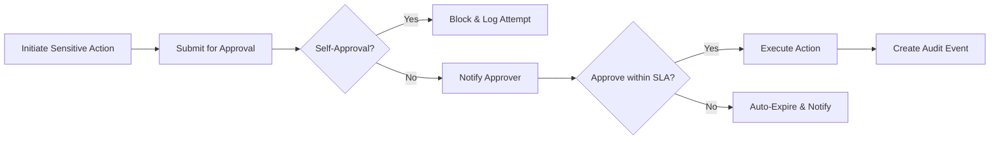
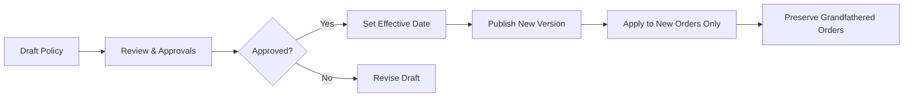
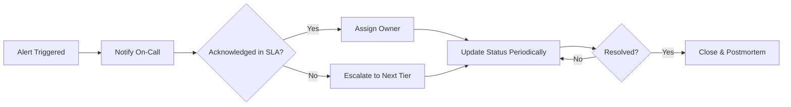
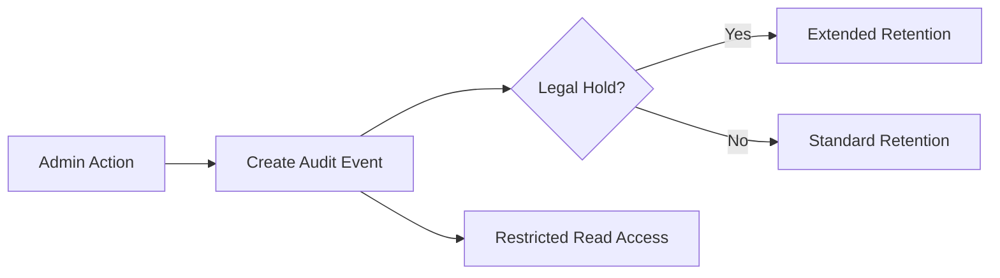

# 11 – Functional Requirements: Admin Dashboard (shoppingMall)

## 1. Scope and Intent
Provide a centralized, permissioned workspace for staff to manage catalog integrity, orders and escalations, refunds and payouts governance, users and roles, content moderation, and platform-wide business policies with full auditability and privacy controls.

Objectives
- Unambiguous role-based capabilities for supportAgent, operationsManager, financeManager, contentModerator, and systemAdmin.
- Maker-checker (dual-control) approvals for sensitive actions.
- Idempotent, auditable actions with clear SLAs, privacy guardrails, and performance targets.

EARS
- THE admin dashboard SHALL restrict access to authenticated staff roles only.
- THE admin dashboard SHALL render only capabilities permitted by the signed-in staff role and current policy configuration.
- WHEN a staff action changes business state, THE admin dashboard SHALL create an immutable audit event with who/what/when/why and before/after state.
- WHERE maker-checker applies, THE admin dashboard SHALL require a distinct approver identity and SHALL prevent self-approval.

## 2. Roles and Access Model
Roles (business definitions)
- supportAgent: Customer/seller support; order interventions, cancellations/refunds within thresholds, dispute triage.
- operationsManager: Catalog/category governance, product status controls, policy enforcement, feature flag control, operational monitoring.
- financeManager: Refund approvals above thresholds, chargebacks, payouts governance, financial reconciliation.
- contentModerator: Reviews and UGC moderation decisions; policy enforcement on public content.
- systemAdmin: Global role/permission administration, configuration, integrations, emergency overrides (with audit and dual control).

Principles (EARS)
- THE admin dashboard SHALL enforce least-privilege access for all staff roles.
- IF a staff member attempts an action beyond their permissions, THEN THE admin dashboard SHALL deny the action and display the policy reference.
- WHERE impersonation (view-as) is allowed for support, THE admin dashboard SHALL provide read-only impersonation with visible banner and SHALL log the session with case ID.
- WHEN a staff member requests write actions while impersonating, THE admin dashboard SHALL block the action unless a specific policy exception allows it and SHALL log the exception.
- WHEN a role or permission mapping changes, THE admin dashboard SHALL take effect at the next authorization decision and SHALL invalidate long-lived sessions if policy dictates.

## 3. Permission Matrix by Feature Area (Business)
Legend: ✅ allowed, ❌ not allowed, 🔒 allowed with constraints/approval/maker-checker.

| Capability | supportAgent | operationsManager | financeManager | contentModerator | systemAdmin |
|---|---|---|---|---|---|
| View customer profile (masked PII by default) | ✅ | ✅ | ✅ | ❌ | ✅ |
| View/resolve order issues within thresholds | ✅ | ✅ | ✅ | ❌ | ✅ |
| Place/remove order hold | ✅ | ✅ | ❌ | ❌ | ✅ |
| Approve cancellations within thresholds | ✅ | ✅ | 🔒 | ❌ | ✅ |
| Approve refunds above thresholds | ❌ | 🔒 | ✅ | ❌ | ✅ |
| Manage chargebacks and representment | ❌ | ❌ | ✅ | ❌ | ✅ |
| Manage categories/taxonomy | ❌ | ✅ | ❌ | ❌ | ✅ |
| Publish/unpublish/suspend products | ❌ | ✅ | ❌ | ❌ | ✅ |
| Inspect variant/SKU, inventory anomalies | ✅ (read) | ✅ | ✅ (read) | ❌ | ✅ |
| Moderate reviews/UGC | ❌ | ❌ | ❌ | ✅ | ✅ |
| Configure policies/feature flags | ❌ | ✅ | ❌ | ❌ | ✅ |
| Manage sellers (verify/suspend/terminate) | ❌ | ✅ | ❌ | ❌ | ✅ |
| Manage payouts/reserves | ❌ | ❌ | ✅ | ❌ | ✅ |
| Manage staff roles/permissions | ❌ | ❌ | ❌ | ❌ | ✅ |
| Data export (customer/order/seller) | 🔒 | 🔒 | 🔒 | ❌ | ✅ |

EARS
- WHEN a capability is marked 🔒, THE admin dashboard SHALL require additional justification and/or approvals per policy before execution.

## 4. Authentication and Authorization (Admin Context)
EARS
- THE admin dashboard SHALL require multi-factor authentication for systemAdmin and financeManager; optional for others per policy.
- WHEN suspicious activity is detected (unusual geo/velocity/high-risk action), THE admin dashboard SHALL require step-up verification before permitting policy changes, refunds, payouts, or role changes.
- WHEN a staff member resets password or role changes materially, THE admin dashboard SHALL revoke existing refresh tokens and SHALL require re-authentication.
- WHEN a staff account is suspended, THE admin dashboard SHALL block privileged actions and SHALL log attempted access.
- WHERE session inactivity exceeds policy, THE admin dashboard SHALL expire the session and preserve in-progress context where safe to resume after login.

## 5. Catalog and Content Oversight
Category Governance (EARS)
- WHEN a category is created/edited, THE admin dashboard SHALL capture name, description, hierarchy placement, visibility state, and category-level attributes.
- IF a category change creates a cycle or orphaned items, THEN THE admin dashboard SHALL block the change and present corrective guidance.
- WHEN a category is archived, THE admin dashboard SHALL hide it from customer navigation and prevent new assignments, preserving historical references.

Product Publishing and Governance (EARS)
- WHEN reviewing a product for publish, THE admin dashboard SHALL verify required business fields (title, description, primary category, at least one purchasable SKU with price and tax class).
- IF required fields are missing or policy flags are violated, THEN THE admin dashboard SHALL block publish and present actionable error reasons.
- WHEN a product is suspended for policy, THE admin dashboard SHALL remove it from customer discovery and notify the seller with reason code.

Variant/SKU Oversight (EARS)
- WHEN an inventory anomaly is detected (negative stock, unfulfillable quantity), THE admin dashboard SHALL flag the SKU and notify responsible parties for remediation.
- IF a SKU is recalled or restricted, THEN THE admin dashboard SHALL suspend availability immediately and trigger impacted-order notifications.

Content Moderation (EARS)
- WHEN a review/UGC is reported or auto-flagged, THE admin dashboard SHALL queue it for contentModerator decision and record rationale for approve/reject/remove/restore.
- IF repeat violations occur, THEN THE admin dashboard SHALL escalate to operationsManager for sanctions per policy.

## 6. Order Management and Escalations
Order Search and Review (EARS)
- THE admin dashboard SHALL support filtering by status, date ranges, buyer, seller, SKU, payment state, fulfillment state, and risk flags.
- WHEN opening an order detail, THE admin dashboard SHALL display payment authorization/capture state, shipment tracking, line-level refunds, holds, and communication history per role.

Holds and Reviews (EARS)
- WHEN fraud risk is flagged, THE admin dashboard SHALL allow placing an order hold with reason and SLA timer, block fulfillment, and notify stakeholders.
- WHEN hold is cleared, THE admin dashboard SHALL resume normal fulfillment and notify stakeholders.

Cancellations and Refunds (EARS)
- WHEN a pre-fulfillment cancellation is within thresholds, THE admin dashboard SHALL allow supportAgent to approve and SHALL void/reverse payment where applicable.
- WHERE cancellation/refund exceeds thresholds, THE admin dashboard SHALL require financeManager approval and SHALL enforce maker-checker where configured.
- WHEN a refund is approved, THE admin dashboard SHALL compute eligible amount (full/partial/less fees per policy) and SHALL trigger refund and state updates.

Disputes and Chargebacks (EARS)
- WHEN evidence is requested for disputes, THE admin dashboard SHALL capture documents, set deadlines, and route outcomes to the appropriate role.
- WHEN a chargeback is received, THE admin dashboard SHALL freeze related payouts and SHALL notify financeManager and supportAgent.

## 7. Finance Controls (Refunds, Payouts, Reserves)
EARS
- THE admin dashboard SHALL allow financeManager to configure refund approval thresholds and maker-checker requirements by amount/category/region.
- WHEN a refund exceeds auto-approval limits, THE admin dashboard SHALL require a distinct approver and SHALL block self-approval.
- WHEN scheduling payouts, THE admin dashboard SHALL enforce settlement eligibility (return windows elapsed, reserves) and SHALL display available vs. reserved balances to financeManager.
- WHERE reserves/holds apply to a seller, THE admin dashboard SHALL display calculation basis, percentage, and release dates.
- WHEN credit notes are required due to fee reversals, THE admin dashboard SHALL generate credit notes for the next billing cycle with references to the affected invoices.

## 8. Policy Management and Feature Flags
Returns/Cancellations (EARS)
- THE admin dashboard SHALL support return window days, condition requirements, reason codes, and refund calculation rules with versioning and effective dating.
- WHEN policy changes are published, THE admin dashboard SHALL apply the new version to orders created after the effective timestamp and SHALL preserve grandfathered rules for earlier orders.

Pricing/MAP and Discounts (EARS)
- THE admin dashboard SHALL enforce MAP and discount ceilings per category/seller policy.
- IF a seller attempts to publish a price below MAP or exceeds discount ceilings, THEN THE admin dashboard SHALL block the change and notify operationsManager.

Inventory/Shipping/Tax Regions (EARS)
- THE admin dashboard SHALL allow configuration of low-stock thresholds, backorder/preorder rules, shipping carriers/regions, and tax/duties approaches in business terms.

Feature Flags (EARS)
- WHEN enabling a risky feature, THE admin dashboard SHALL require justification, rollout scope, optional approval, and a rollback plan and SHALL log the change with actor and timestamp.

## 9. User, Seller, and Staff Administration
User Account Oversight (EARS)
- THE admin dashboard SHALL mask PII by default and SHALL allow reveal for authorized roles with purpose logging.
- WHEN a verified data erasure request is processed, THE admin dashboard SHALL anonymize personal data within policy timelines while retaining transactional records as required by law.

Seller Account Oversight (EARS)
- WHEN a seller submits verification, THE admin dashboard SHALL allow operationsManager to approve/reject/request info and SHALL track status and reasons.
- IF a seller breaches policies, THEN THE admin dashboard SHALL support sanctions (warnings, listing suppression, suspension, termination) and SHALL log actions.
- WHILE a seller is suspended, THE admin dashboard SHALL block new listings and orders while allowing returns/refund obligations to complete.

Staff Roles and Permissions (EARS)
- THE admin dashboard SHALL allow systemAdmin to create/update/deactivate staff accounts and assign roles with two-person approvals for sensitive grants.
- WHEN permissions change, THE admin dashboard SHALL enforce changes at next authorization decision and SHALL log the event.

Impersonation Safeguards (EARS)
- WHERE view-as is used, THE admin dashboard SHALL display a persistent banner naming the impersonated account and SHALL disable write actions unless explicitly permitted.
- THE admin dashboard SHALL require a support case ID and justification before starting impersonation and SHALL limit duration per policy.

## 10. Data Export, Audit, Compliance, and Privacy
Data Export Governance (EARS)
- THE admin dashboard SHALL require authorization and justification for exports, SHALL scope data minimally, and SHALL log who/what/when/why and delivery channel.
- WHEN exporting PII, THE admin dashboard SHALL mask sensitive fields unless explicitly permitted and SHALL watermark exports with requester identity and timestamp.

Audit Coverage and Retention (EARS)
- THE admin dashboard SHALL emit audit events for authentication, role/permission changes, product publish/unpublish, price changes, inventory adjustments, order/payment/refund transitions, shipment changes, moderation actions, policy/flag changes, and data exports.
- THE admin dashboard SHALL retain audit logs for at least 5 years (default) and SHALL enforce legal holds where configured.

DSAR and Privacy (EARS)
- WHEN a data subject request is received, THE admin dashboard SHALL acknowledge within jurisdictional timelines and SHALL fulfill within policy (e.g., ≤30–45 days).
- WHERE consent is withdrawn, THE admin dashboard SHALL cease non-transactional communications within 48 hours and SHALL record the change.

## 11. Operational Alerts and SLAs
Alert Conditions (EARS)
- THE admin dashboard SHALL monitor order holds backlog, payment auth/capture failure spikes, shipment SLA breaches, inventory anomalies, moderation backlog, and critical configuration changes.
- WHEN an alert triggers, THE admin dashboard SHALL notify the designated on-call role(s) immediately and SHALL escalate if unacknowledged within SLA.

Change Management (EARS)
- WHEN high-impact policy/flag changes are scheduled, THE admin dashboard SHALL require a change record including justification, risk, and rollback plan and SHALL flag emergency changes for post-implementation review.

## 12. Performance and Non-Functional Expectations
Latency (p95 targets) (EARS)
- THE admin dashboard SHALL return list views (orders/products/users) within 2 seconds under nominal load.
- THE admin dashboard SHALL open entity details (order/product/user) within 2 seconds under nominal load.
- THE admin dashboard SHALL acknowledge bulk actions immediately and SHALL provide progress updates at least every 60 seconds for long-running jobs.

Availability and Reliability (EARS)
- THE admin dashboard SHALL meet monthly availability ≥ 99.90% for essential functions and ≥ 99.95% for critical order/payment interventions.
- IF partial outages occur, THEN THE admin dashboard SHALL degrade gracefully (read-only views, queued writes) and SHALL preserve admin session context for at least 30 minutes.

Idempotency and Safety (EARS)
- WHEN the same admin action is submitted with the same idempotency token within 24 hours, THE admin dashboard SHALL execute it at most once and SHALL return the original outcome for duplicates.

## 13. KPIs and Success Metrics
EARS
- THE admin dashboard SHALL track catalog integrity (<0.5% published items missing required fields), moderation timeliness (>95% flagged reviewed ≤24h), and refund/cancellation SLA compliance (>95%).
- THE admin dashboard SHALL track alert acknowledgment SLA adherence (≥99% within target) and audit completeness (100% write-actions audited).

## 14. Error Handling and Edge Cases (Admin Functions)
EARS
- IF a staff member attempts an unauthorized action, THEN THE admin dashboard SHALL block the action and display the applicable policy reference.
- IF a bulk operation partially fails, THEN THE admin dashboard SHALL provide a structured failure report and allow retry for failed items only.
- WHEN a policy change conflicts with existing orders, THE admin dashboard SHALL apply effective dating and SHALL prevent retroactive changes unless explicitly permitted by policy with maker-checker approval.
- IF a data export exceeds maximum scope, THEN THE admin dashboard SHALL block and request narrower criteria.
- IF an impersonation session exceeds duration limits, THEN THE admin dashboard SHALL terminate the session and log the event.

## 15. Visual Diagrams (Mermaid)

Maker-Checker Approval Flow

Policy Versioning and Rollout

Alert Escalation Flow

Audit Lifecycle

## 16. Glossary
- Maker-Checker: Dual-control approval pattern requiring two distinct identities for sensitive changes.
- MAP: Minimum Advertised Price policy.
- DSAR: Data Subject Access Request (privacy right to access/correct/delete/export personal data).
- PII: Personally Identifiable Information viewed under masking and access controls.
- Idempotency Token: A business-safe unique key ensuring at-most-once execution for sensitive admin actions.

---
Business-only statement: All requirements define WHAT the admin dashboard must achieve in business terms; implementation details (APIs, schemas, tooling) remain at the development team’s discretion.