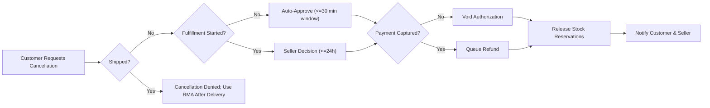
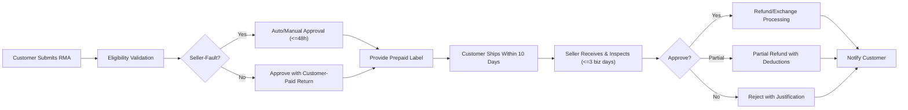
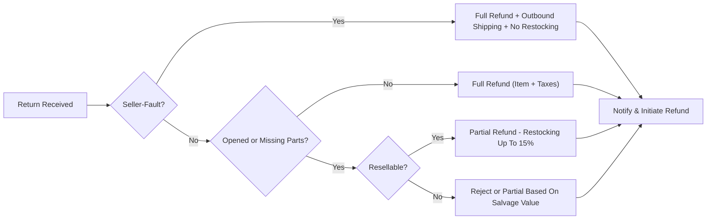

# shoppingMall - Returns, Cancellations, and Refunds Requirements

## 1. Overview and Scope
Business policies and workflows governing cancellations, returns (RMA), exchanges, and refunds for a multi-seller marketplace. Defines customer protections, seller obligations, and platform governance to ensure consistent, fair, and auditable outcomes. Content uses business requirements only and avoids technical implementation details.

Scope includes:
- Pre-shipment cancellations, post-shipment restrictions, and conversion to returns where applicable
- RMA lifecycle: request, approval, shipping back, inspection, decision, and refund/exchange execution
- Refund eligibility and calculation rules including taxes, shipping, promotions, fees, and multi-tender handling
- Exchanges: direct swap versus return-and-repurchase models
- Dispute handling and escalations
- Communications and SLAs for after-sales operations

Out of scope:
- UI/UX design
- Provider-specific integrations and payment rails
- API or database schemas; infrastructure or vendor tooling

## 2. Actors and Responsibilities (Business-Level)
- Customer: Requests cancellations, returns, exchanges, and refunds for their own orders; provides evidence where required; ships returns within deadlines.
- Seller: Processes cancellations prior to shipment; issues return labels where required; inspects returns; proposes refund or exchange outcomes; meets decision SLAs.
- Admin: Configures policy; arbitrates disputes; enforces SLAs; applies overrides for compliance or fraud.

Selected responsibilities matrix:

| Action | Customer | Seller | Admin |
|--------|----------|--------|-------|
| Initiate cancellation (eligible window) | ✅ | ➖ | ➖ |
| Approve/deny pre-shipment cancellation (after fulfillment start) | ➖ | ✅ | ✅ (override) |
| Initiate RMA | ✅ | ➖ | ➖ |
| Approve/deny RMA | ➖ | ✅ | ✅ (appeal) |
| Provide prepaid return label (seller-fault) | ➖ | ✅ | ✅ (enforce) |
| Inspect return and propose refund/exchange | ➖ | ✅ | ✅ (override) |
| Issue refund (business authorization) | ➖ | ✅ | ✅ (platform-controlled cases) |
| Resolve disputes/fraud flags | ➖ | ➖ | ✅ |

Legend: ✅ permitted, ➖ not applicable.

EARS permissions:
- IF a user attempts an action outside their role permissions, THEN THE platform SHALL deny the action with a business reason and record the attempt.
- WHERE an admin override occurs, THE platform SHALL require a reason code and record actor and timestamp.

## 3. Definitions and Policy Parameters
- Shipment: Hand-off to carrier with a valid tracking identifier.
- Delivery: Carrier-confirmed date/time of delivery at the customer’s address.
- Pre-shipment cancellation: Cancellation before shipment occurs.
- Post-shipment cancellation: Not allowed; handled as a return (or refused delivery where permitted by carrier).
- Return Merchandise Authorization (RMA): Approval token and instructions for sending items back.
- Reasons (normalized): change_of_mind, wrong_item_sent, damaged_in_transit, defective_product, missing_items, size_fit_issue, late_delivery, other_seller_fault, other_customer_reason.
- Non-returnable categories (illustrative): perishable goods, intimate/personal care items once unsealed, digital goods after access, made-to-order/personalized items (unless defective/seller-fault), hazardous materials where regulations prohibit reverse logistics.

Default policy windows (configurable; subject to law):
- Immediate auto-cancel window: within 30 minutes of order confirmation if fulfillment not started.
- Pre-shipment cancellation window: until shipment; may require seller approval after picking/packing begins.
- RMA windows: 14 calendar days from delivery (change_of_mind, size_fit_issue); 30 calendar days (defective_product, wrong_item_sent, damaged_in_transit, missing_items, late_delivery, other_seller_fault); 48 hours for perishable/temperature-sensitive (seller-fault only).

Fees and allocations (configurable; subject to law):
- Restocking fee: Up to 15% of item price for opened but resellable items returned for change_of_mind or size_fit_issue; 0% for seller-fault.
- Return shipping cost: Customer bears for change_of_mind/size_fit_issue; seller bears for seller-fault.
- Outbound shipping fee refund: Refunded only when entire shipment is returned due to seller-fault; not refunded for change_of_mind/size_fit_issue. Expedited premiums not refunded unless seller-fault.

EARS legal alignment:
- WHERE local law imposes stricter protections, THE platform SHALL apply the stricter rule and disclose the applicable variation to affected parties.

## 4. Cancellation Windows and Conditions
Business rules:
- Pre-shipment cancellations permitted subject to fulfillment status and time windows.
- Once shipped, cancellations are not allowed; use RMA after delivery or refused delivery where supported.
- Line-level cancellations permitted for unshipped items.
- Multi-seller orders may be canceled per seller shipment part; outcomes are independent by seller scope.

EARS requirements (cancellation):
- THE platform SHALL allow customers to request cancellation for unshipped items within defined policy windows.
- WHEN a cancellation is requested within 30 minutes of order confirmation and fulfillment has not started, THE platform SHALL auto-approve the cancellation.
- WHEN a cancellation is requested after picking/packing has started but before shipment, THE platform SHALL notify the seller to approve or deny within 24 hours.
- IF the seller does not respond within 24 hours, THEN THE platform SHALL auto-approve the cancellation for unshipped items.
- IF any item has already shipped, THEN THE platform SHALL deny cancellation for that item and direct the customer to RMA after delivery.
- WHERE an order contains items from multiple sellers, THE platform SHALL process cancellations per seller shipment part independently.
- WHEN a cancellation is approved and payment capture has not occurred, THE platform SHALL void the payment authorization for affected items.
- WHEN a cancellation is approved and payment capture has occurred, THE platform SHALL queue a refund for the captured amount of the canceled items.
- WHEN a cancellation is denied, THE platform SHALL communicate the reason and available next steps (e.g., RMA post-delivery).
- THE platform SHALL release any related stock reservations for canceled items immediately upon cancellation approval.

Validation and constraints:
- Cancellation requests must include order identifier, items/quantities, reason category, and optional notes (max 500 characters).
- Customers can cancel only their own orders.
- Sellers may cancel for stockout or operational failure; such cancellations are seller-fault.
- Seller-initiated cancellations post-capture must trigger refunds of affected items and applicable shipping fees.

Mermaid — Cancellation flow:

## 5. Return Merchandise Authorization (RMA)
Eligibility rules:
- change_of_mind and size_fit_issue: 14 calendar days from delivery; UNUSED and in original packaging for full refund; opened but resellable may incur restocking fee.
- Seller-fault (defective_product, wrong_item_sent, damaged_in_transit, missing_items, late_delivery, other_seller_fault): eligible within 30 calendar days; no restocking fee; seller pays return shipping.
- Perishable/temperature-sensitive: eligible for seller-fault only; report within 48 hours with photographic evidence.
- Non-returnable categories are ineligible except for seller-fault.
- Digital goods: ineligible after access/download unless technical defect prevents access and no usage has occurred.

Required data for RMA:
- Order identifier; item identifiers and quantities; reason category; evidence for damage/defect/missing; desired outcome (refund or exchange where available).

EARS requirements (RMA intake and approval):
- THE platform SHALL require RMA approval before accepting physical returns.
- WHEN a customer submits an RMA within the eligible window, THE platform SHALL validate reason, timing, and item eligibility.
- IF the request is for seller-fault with sufficient evidence, THEN THE platform SHALL auto-approve or route to seller with a 48-hour SLA for decision.
- IF the request is for change_of_mind or size_fit_issue, THEN THE platform SHALL approve subject to category rules and assign return shipping to the customer.
- WHEN an RMA is approved, THE platform SHALL generate an RMA identifier and return instructions.
- WHERE seller-fault is confirmed, THE platform SHALL provide a prepaid return label or reimbursement mechanism as configured.
- WHILE an RMA is open, THE platform SHALL track shipment back to the seller and expected arrival window.
- IF the customer fails to ship the return within 10 calendar days of RMA approval, THEN THE platform SHALL expire the RMA unless extended by the seller.

Packaging and condition:
- Items must include all original accessories, manuals, and packaging; missing components may result in partial refunds.
- Hygiene/personal care items must be unopened for change_of_mind returns.
- Serial-numbered items must match the shipped serial numbers.

Inspection and decision:
- Sellers must inspect within 3 business days of receipt and propose outcomes: full refund, partial refund with itemized deductions, exchange, or rejection with justification.
- Admin may override outcomes violating policy or showing abuse.

Mermaid — RMA flow:

## 6. Refund Eligibility and Calculation
Components of refund:
- Item price per line
- Taxes associated with returned items (jurisdictional proration)
- Outbound shipping fees (refunded only when the entire shipment is returned for seller-fault; not refunded for change_of_mind/size_fit_issue)
- Return shipping fees (customer-paid for change_of_mind/size_fit_issue; seller-paid for seller-fault)
- Restocking fees (up to 15% for opened but resellable change_of_mind/size_fit_issue; 0% seller-fault)
- Deductions for missing/damaged accessories not attributable to carrier/seller fault

Calculation rules:
- Proportional tax refunds: Taxes refunded in proportion to refunded item amounts.
- Bundled promotions: Refunds reflect effective price after discounts.
- Coupon proration: Order-level discounts prorated across items by pre-discount extended value.
- Gift cards/store credit: Refunded to original gift card balance where applicable; cash equivalents follow provider rules.
- Multi-tender: Refunds returned to each original tender in capture order subject to provider constraints.

EARS requirements (refund processing):
- WHEN a cancellation is approved pre-capture, THE platform SHALL void the authorization and stop further collection attempts.
- WHEN a refund is approved post-capture, THE platform SHALL initiate refund processing within 5 business days and record breakdowns (items, tax, shipping, fees).
- WHERE a refund involves multiple items, THE platform SHALL compute prorated taxes and discounts per item.
- IF a restocking fee applies, THEN THE platform SHALL itemize the fee and deduct it from the refund amount.
- IF return shipping is customer-paid via prepaid label, THEN THE platform SHALL deduct the label cost from the refund amount.
- WHERE seller-fault is established, THE platform SHALL refund outbound shipping fees for the returned shipment in full.
- WHEN a refund is rejected or adjusted, THE platform SHALL provide an itemized explanation to the customer.
- THE platform SHALL restrict refunds to original payment methods wherever feasible.
- WHERE regulatory deadlines apply, THE platform SHALL meet refund initiation or completion windows required by law.

Examples (illustrative):
- Example A (Change of Mind): Item $100 + $10 tax; outbound $8; prepaid label $6; unopened → Refund = $100 + $10 − $6 = $104. Outbound $8 not refunded.
- Example B (Seller-Fault): Item $100 + $10 tax; outbound $8; expedited premium $12; → Refund = $100 + $10 + $8 + $12 = $130. Restocking = $0.
- Example C (Opened Return with Restocking): Item $200 + $20 tax; restocking 10% = $20 → Refund = $200 + $20 − $20 = $200.

Mermaid — Refund decision tree:

## 7. Exchanges
Principles:
- Exchanges accommodate size/color/variant changes via direct swap (stock permitting) or return-and-repurchase.
- Price differences are settled by charging/refunding the delta; promotions/coupons follow the new purchase terms.

EARS requirements (exchange):
- WHERE the requested exchange is for the same product family and price is equal, THE platform SHALL allow a direct exchange subject to stock availability.
- IF direct exchange is not feasible, THEN THE platform SHALL process a return followed by a new order.
- WHEN an exchange is approved for seller-fault (wrong_item_sent/defective), THE platform SHALL provide prepaid return and ship the replacement without additional outbound charges.
- WHERE an exchange is customer-initiated for size_fit_issue/change_of_mind, THE platform SHALL require the customer to pay any incremental outbound shipping and price difference.

## 8. Dispute Resolution and Escalation
Process:
- Initial resolution by seller under SLAs; escalation to admin when deadlines missed or outcomes contested.
- Evidence: photos/videos, tracking events, inspection notes, serial checks, communications.
- Outcomes: refund (full/partial), replacement, denial with policy-grounded rationale.

EARS requirements (disputes):
- WHEN a seller misses the decision SLA on RMA or cancellation, THE platform SHALL auto-approve in favor of the customer for eligible cases.
- WHEN a customer escalates a dispute, THE platform SHALL assign the case for admin review within 1 business day.
- WHILE a dispute is under admin review, THE platform SHALL pause refund disbursement until a decision is recorded, except where mandated by auto-approval.
- IF policy violations or fraud indicators are found, THEN THE platform SHALL enforce penalties (e.g., refund enforcement, fee adjustments, account flags) consistent with governance policy.

## 9. Communication and Timeline Expectations
Notification triggers (selected):
- Cancellation: request received, decision, refund initiation
- Returns: RMA approved (instructions), RMA expiring soon, return received, inspection outcome, refund initiation, refund completion
- Exchanges: exchange approval and shipment
- Disputes: case opened, information requested, decision

EARS requirements (communication):
- WHEN a customer submits cancellation or RMA, THE platform SHALL acknowledge within 2 seconds with a reference identifier.
- WHEN key state changes occur (approval/denial, label ready, refund initiated), THE platform SHALL notify impacted parties within 60 seconds.
- WHERE deadlines are expressed in business days, THE platform SHALL calculate using the seller’s operating calendar and display in the customer’s local timezone (default Asia/Seoul if unknown).
- IF a deadline falls on a non-operating day, THEN THE platform SHALL roll the deadline to the next operating day.

## 10. Error Handling and Edge Cases
Eligibility errors:
- IF a cancellation is requested after shipment, THEN THE platform SHALL deny and suggest RMA after delivery.
- IF an RMA is submitted outside the eligible window, THEN THE platform SHALL deny and cite the deadline missed.
- IF the category is non-returnable and reason is change_of_mind, THEN THE platform SHALL deny the RMA.
- IF required evidence is missing for damage/defect claims, THEN THE platform SHALL set the case to pending evidence and request upload within 72 hours.

Quantity and item mismatches:
- IF requested return quantity exceeds purchased or previously returned quantity, THEN THE platform SHALL deny the excess.
- IF serial numbers do not match shipped items, THEN THE platform SHALL reject unless seller confirms equivalency.

Logistics exceptions:
- IF a return is lost in transit with carrier-confirmed loss, THEN THE platform SHALL refund for seller-fault cases and adjudicate liability with the seller per policy.
- IF the return is delivered after RMA expiry due to carrier delay, THEN THE platform SHALL allow processing at seller discretion or escalate.
- IF customer refuses delivery and the carrier returns to sender, THEN THE platform SHALL process as a return according to applicable reason and condition.

Abuse prevention:
- IF repeated change_of_mind returns exceed policy thresholds, THEN THE platform SHALL flag the account and may restrict future RMAs subject to admin decision.
- IF evidence indicates fraudulent claims, THEN THE platform SHALL deny the request and record the incident for compliance review.

## 11. Performance and Service Expectations (User-Perceived)
- WHEN customers submit cancellation or RMA forms, THE platform SHALL acknowledge within 2 seconds.
- WHILE generating an RMA label or instructions, THE platform SHALL complete typical cases within 10 seconds.
- THE platform SHALL present updated order and return statuses within 5 seconds of state changes under normal conditions.

## 12. Compliance and Record-Keeping (Business-Level)
- THE platform SHALL retain records of cancellations, RMAs, inspection results, and refund decisions for at least 24 months for audit or longer where law requires.
- THE platform SHALL store reason codes, monetary breakdowns, and timestamps for all decisions.
- THE platform SHALL support exportable reports for admins on return rates, reasons, refund amounts, and SLA compliance.
- THE platform SHALL treat evidence (images/videos) as personal data and limit access per privacy policy.
- IF a legal hold or fraud investigation applies, THEN THE platform SHALL suspend deletion of relevant data until hold is lifted.

## 13. KPIs and Success Metrics (Illustrative)
- Returns rate by category (% of orders with RMA)
- RMA approval lead time (median and P95)
- Refund initiation lead time (approval → initiation)
- Refund completion lead time (initiation → completion)
- Restocking fee utilization rate (eligible returns with fees applied)
- Dispute reversal rate (seller decision overturned by admin)
- SLA compliance rates (seller decision windows, inspection timelines)
- Carrier-related loss/damage incidence per 1,000 shipments

EARS KPI governance:
- THE platform SHALL calculate KPIs consistently and publish any changes to formulas before they take effect.
- WHEN KPI targets are missed for two consecutive periods, THE platform SHALL trigger a cross-functional review and corrective action plan.

## 14. Related Documents
- For purchase completion and payment states, see the Checkout and Payment Requirements.
- For shipment status definitions and delivery milestones, see the Order and Shipping Management Requirements.
- For inventory holds and releases on cancellations/returns, see the Inventory Management Requirements.
- For seller task obligations and statements, see the Seller Portal Requirements.
- For moderation and review responses, see the Reviews and Ratings Requirements.
- For platform governance and admin controls, see the Admin Operations and Governance Requirements.
- For notification triggers and reporting views, see the Notifications, Communications, and Reporting Requirements.

## 15. Appendices — Mermaid Diagrams (Validated Syntax)

### 15.1 Cancellation Flow

### 15.2 RMA Flow

### 15.3 Refund Decision Tree

## 16. Glossary
- RMA: Return Merchandise Authorization for returns approval and tracking.
- Restocking Fee: A percentage deduction for opened but resellable returns in select reasons.
- Seller-Fault: Reason categories where seller bears costs (defective, wrong item, damaged in transit, missing items, late delivery).
- Refund Initiation vs Completion: Initiation is the platform-side start; completion is funds reaching the original tender per provider timing.

End of requirements.