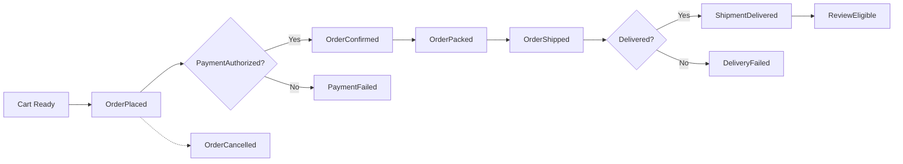
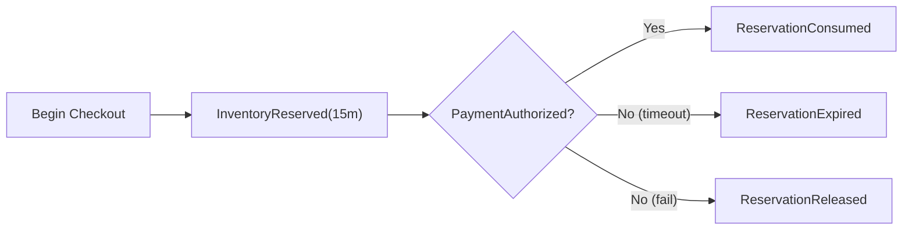
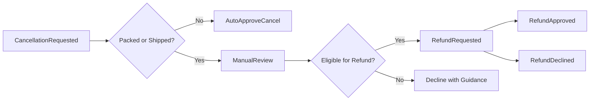
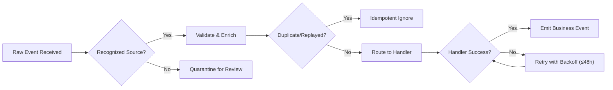

# Business Rules, Data Lifecycle, and Events (shoppingMall)

This artifact specifies WHAT the shoppingMall platform must do in terms of business rules, data lifecycle, event handling, and observability. It intentionally avoids technical specifications such as APIs, schemas, storage engines, or infrastructure. Requirements use EARS to ensure clarity and testability. All user-facing times in examples follow the user’s locale, and business cutoffs default to Asia/Seoul (KST) unless stated otherwise.

## 1. Canonical Business Entities (Conceptual)

Business entities and relationships are defined at a conceptual level only (not data schemas):

| Entity | Purpose (Business) | Primary Business Identifiers | Key Relationships (Business) |
|-------|---------------------|------------------------------|------------------------------|
| User | Person using the platform (guest or authenticated). | Email, phone (optional), platform user number. | Has Addresses, Carts, Wishlists, Orders, Reviews. |
| Address | Delivery/billing location associated with a User. | Recipient name, country/region, postal code. | Belongs to User; used by Orders and Shipments. |
| Seller | Merchant listing products and fulfilling orders. | Seller name, legal entity info, seller ID. | Owns Products/SKUs, manages Inventory, fulfills Orders. |
| Category | Hierarchical classification for discoverability. | Category name, category code. | Contains Products; managed by operations. |
| Product | Sellable item concept with variants. | Product title, product code (human-friendly), product status. | Has SKUs (variants), belongs to Seller and Categories. |
| SKU (Variant) | Specific purchasable configuration (e.g., color/size). | Seller SKU, platform SKU number, option values. | Has Inventory, Pricing, is in Orders, Carts, Wishlists. |
| InventoryRecord | Quantity and availability policy for a SKU. | Stock on hand, reserved, thresholds, policy flags. | Belongs to SKU; impacted by Orders and Returns. |
| Cart | Temporary collection of line items pending checkout. | Cart number, ownership (guest/customer). | Contains Line Items referencing SKUs. |
| Wishlist | Saved SKUs for future interest. | Wishlist ID. | Contains SKUs; belongs to User. |
| Order | Commercial contract created at checkout. | Order number, order status. | Has OrderItems (SKUs), Payment(s), Shipment(s). |
| OrderItem | Line in an Order tied to SKU and quantity. | Order number + line position. | References SKU; participates in shipment/returns/refunds. |
| Payment | Authorization and/or capture records for an Order. | Payment reference, provider reference. | Linked to Order; may include refunds. |
| Shipment | Movement of OrderItems to customer. | Shipment number, carrier/tracking. | Linked to Order/OrderItems; has delivery events. |
| Review | Customer feedback and rating for products. | Review ID, rating, author. | Linked to User and Product; subject to moderation. |
| CancellationRequest | Customer or seller request to cancel order or items. | Request ID, status. | References Order/OrderItems; linked to Payments. |
| RefundRequest | Request to return funds post-capture. | Request ID, reason, status. | References Order/Payment/OrderItems. |
| Payout | Funds disbursed to sellers. | Payout ID, period, status. | Aggregates cleared Orders/Items less fees/returns. |
| Promotion/Coupon | Discount rules applied to carts/orders. | Code or rule ID, validity window. | Evaluated on Carts/Orders; may be per-SKU. |
| AuditEvent | Immutable record of important business actions. | Event ID, timestamp, actor. | References affected entities and outcomes. |
| ConsentRecord | Customer permissions for marketing or personalization. | Consent ID, scopes, timestamp. | Linked to User; used by messaging/personalization. |

EARS – Entity governance
- THE platform SHALL treat Order, Payment, Shipment, Refund, and Payout details as business-critical records with immutable histories of state transitions.
- WHERE sensitive attributes (e.g., PII, payout details) appear, THE platform SHALL mask or minimize exposure for all non-essential viewers by default.

## 2. Timestamps, Locales, and Timezones

EARS – Business time handling
- THE platform SHALL record system events in UTC with nanosecond or millisecond granularity (business perspective; exact precision is implementation-defined) and SHALL display times to users in their preferred locale.
- WHERE business cutoffs are required (e.g., return windows), THE platform SHALL apply a store operating timezone defaulting to Asia/Seoul unless overridden by policy.
- WHEN a user’s locale changes, THE platform SHALL re-render human-readable timestamps without altering the underlying event times.

## 3. Data Creation, Update, and Retention Rules (Business)

General principles
- THE platform SHALL store timestamped state transitions for Orders, Payments, Shipments, Inventory, and Requests to enable complete reconstruction of lifecycles.
- WHERE configurable retention policies exist, THE platform SHALL apply the active policy set labeled by jurisdiction and business unit without ambiguity.

Creation rules (selected entities)
- WHEN a User registers, THE platform SHALL create a User with verified status "pending" until email or equivalent verification completes.
- WHEN a Customer adds an Address, THE platform SHALL validate country/region, postal code format, and required fields before accepting.
- WHEN a Seller publishes a Product, THE platform SHALL require at least one purchasable SKU with valid price, tax category, and inventory policy.
- WHEN a Cart is created for a guest, THE platform SHALL bind it to a temporary guest token and persist it for 30 days of inactivity.
- WHEN a Customer starts checkout, THE platform SHALL validate Cart lines for SKU availability, price freshness (≤ 5 minutes), and promotion eligibility.
- WHEN an Order is placed, THE platform SHALL snapshot prices, taxes, discounts, shipping costs, and addresses as of order time.
- WHEN a Review is submitted, THE platform SHALL verify reviewer eligibility (e.g., completed purchase of the product within the past 180 days) before publishing.

Update rules (selected entities)
- IF a Product is updated, THEN THE platform SHALL prevent changes that invalidate already-placed Orders (e.g., removing a SKU referenced by an open Order) and instead mark end-of-sale going forward.
- WHEN Inventory is adjusted (manual or system), THE platform SHALL record the reason code (sale, return, correction, receipt, damage) and actor.
- WHEN a Customer updates the default Address, THE platform SHALL apply the new default to future Orders only and SHALL NOT retroactively change existing Orders.
- WHEN a Price changes for a SKU, THE platform SHALL take effect for new Carts and Orders only; existing Orders SHALL remain priced at snapshot values.

Retention rules (default policy set "KR_Default")
- THE platform SHALL retain Orders, Payments, and Contracts for at least 5 years.
- THE platform SHALL retain Delivery/Shipment records for at least 1 year after completion.
- THE platform SHALL retain Customer complaint and dispute records for at least 3 years.
- THE platform SHALL retain Accounting/Payout records for at least 5 years.
- THE platform SHALL retain Web access logs for at least 3 months for security and operational analysis.
- WHERE a Customer deletes their account, THE platform SHALL anonymize personal identifiers in Orders while retaining transactional records for statutory periods.

Deletion and anonymization
- WHEN a Customer requests account deletion, THE platform SHALL complete personal data anonymization within 30 days, excluding data under statutory retention.
- IF a Review is removed due to policy violation, THEN THE platform SHALL retain a redacted copy for audit for 12 months and remove it from public view immediately.
- WHERE a Seller offboards, THE platform SHALL freeze catalog updates, process pending Orders to completion, and retain financial records per retention policy.

Jurisdictional policy sets (illustrative)
- WHERE the jurisdiction is EU/EEA, THE platform SHALL align retention and DSR windows with GDPR and national laws while honoring the default KR policy minimums when stricter.
- WHERE the jurisdiction is US-CA, THE platform SHALL honor CCPA/CPRA timelines for access and deletion while retaining tax records as required by law.

## 4. Event Types and Business Reactions

Event families and representative reactions are defined without technical payloads.

Identity and profile
- WHEN "UserRegistered" occurs, THE platform SHALL send verification, create a default empty Wishlist, and initialize preferences with privacy-by-default.
- WHEN "UserVerified" occurs, THE platform SHALL lift new-customer limitations and mark eligibility for reviews after deliveries.
- WHEN "AddressAdded" occurs, THE platform SHALL validate serviceability for configured shipping regions and mark as usable for checkout if valid.

Catalog and pricing
- WHEN "ProductPublished" occurs, THE platform SHALL index the Product for discovery, set visibility to "available" where inventory policy allows, and notify followers where permitted.
- WHEN "ProductSuspended" occurs, THE platform SHALL hide the Product from guest/customer discovery and notify the Seller with reasons and remediation steps.
- WHEN "PriceChanged" for a SKU occurs, THE platform SHALL reprice affected active Carts within 5 minutes and notify customers only where configured business rules allow.
- WHEN "PromotionApplied" occurs on a Cart, THE platform SHALL record the rule ID and discount breakdown on the Cart and then on the Order snapshot.
- WHEN "PromotionExpired" occurs, THE platform SHALL prevent new applications and SHALL re-evaluate active Carts on next interaction.

Inventory and reservations
- WHEN "InventoryReserved" occurs during checkout, THE platform SHALL decrement available-to-sell (ATS) and start a reservation timer of 15 minutes.
- WHEN "ReservationExtended" occurs due to verified payment-retry flow, THE platform SHALL extend the timer once up to a total of 25 minutes.
- WHEN "ReservationExpired" occurs, THE platform SHALL restore reserved quantity to ATS and log the expiry reason.
- WHEN "SKUStockChanged" occurs, THE platform SHALL evaluate threshold crossings and trigger back-in-stock or out-of-stock reactions based on subscriptions and policy.

Cart and order
- WHEN "CartCreated" occurs, THE platform SHALL set an inactivity TTL of 30 days for guests and 90 days for customers.
- WHEN "CartAbandoned" occurs (no activity for 24 hours with items), THE platform SHALL flag for remarketing where consent exists and skip for users without consent.
- WHEN "OrderPlaced" occurs, THE platform SHALL assign an immutable order number, lock the snapshot, and request Payment Authorization.
- WHEN "OrderOnHold" occurs due to risk, THE platform SHALL block fulfillment actions until resolved and notify stakeholders.

Payments
- WHEN "PaymentAuthorized" occurs, THE platform SHALL transition the Order to "confirmed" and notify Seller to fulfill.
- IF "PaymentFailed" occurs, THEN THE platform SHALL place the Order in "payment_failed" and release any reservations tied to failed authorizations.
- WHEN "PaymentCaptured" occurs, THE platform SHALL mark funds as captured and eligible for downstream Payout after return/refund windows.

Fulfillment and delivery
- WHEN "OrderPacked" occurs, THE platform SHALL create a Shipment with items and handoff target.
- WHEN "OrderShipped" occurs, THE platform SHALL store carrier/tracking references and expose customer-facing tracking.
- WHEN "ShipmentDelivered" occurs, THE platform SHALL transition Order items to "delivered" and enable review eligibility.
- IF "DeliveryFailed" occurs, THEN THE platform SHALL trigger a customer notification and a seller action queue to arrange reattempts or return-to-sender.

Service/UGC and moderation
- WHEN "ReviewSubmitted" occurs, THE platform SHALL run eligibility and policy checks and publish or queue for moderation accordingly within 1 hour.
- WHEN "ReviewFlagged" occurs, THE platform SHALL hide the review from public display pending moderation outcome within 48 hours.

Finance and payouts
- WHEN "PayoutScheduled" occurs, THE platform SHALL notify the Seller of upcoming settlement with statement details; upon "PayoutCompleted" it SHALL mark as paid.
- WHEN "ChargebackNotified" occurs, THE platform SHALL freeze related payouts and start dispute workflows.

Policy and admin
- WHEN "PolicyChanged" occurs, THE platform SHALL version the policy and apply it only to new transactions effective from the policy timestamp.
- WHEN "StaffRoleChanged" occurs, THE platform SHALL invalidate active sessions as required and audit the change.

Event propagation SLA
- THE platform SHALL propagate key order and shipment events to customer-visible views within 5 minutes for 99% of cases and within 10 minutes for 99.9% under peak load.

## 5. Idempotency and Deduplication Policies (Business)

Order placement and payments
- WHERE an idempotency key is provided for checkout confirmation, THE platform SHALL treat repeated submissions with the same key within 24 hours as the same operation and return the original outcome.
- IF duplicate "OrderPlaced" events are detected for the same Cart state, THEN THE platform SHALL keep only the first successful Order and reject subsequent duplicates with a descriptive business error state.
- WHEN capturing Payment for an Order, THE platform SHALL ensure only one successful capture per authorization per OrderItem group.

Refunds and cancellations
- WHEN a Refund is requested with the same reason, amount, and items within a 24-hour window, THE platform SHALL deduplicate and return the original decision.
- IF repeated "CancellationRequested" events occur after the Order is shipped, THEN THE platform SHALL reject as ineligible and guide the user to return/refund processes.

Inventory and reservations
- WHEN multiple reservation requests arrive for the same Cart and SKUs, THE platform SHALL union them under the same reservation context and extend the reservation timer to the latest confirmed action within the 25-minute ceiling.
- IF repeated "ReservationExpired" notifications are received for the same reservation, THEN THE platform SHALL process only the first and ignore duplicates.

Event ingestion and replay
- THE platform SHALL ignore replays of already-processed business events that carry the same correlation ID and monotonic sequence number per source stream.
- WHERE upstream systems can resend events, THE platform SHALL design reconciliation windows of 48 hours during which duplicates are safely absorbed.

Idempotency windows (summary)
- Checkout confirmation: 24 hours
- Payment capture: lifetime of authorization
- Refund requests: 24 hours
- Reservation holds: 15 minutes (extendable once to 25 minutes)

## 6. Access Control and Visibility of Data and Events

Visibility principles
- THE platform SHALL enforce least-privilege role-based access to entity data and event histories.
- WHERE PII is present, THE platform SHALL mask sensitive fields for staff by default, revealing only when justified and logged.

Role-based access (business view)
- Customers: View their own Orders, Shipments, Payments, Reviews, and Audit timelines relevant to their purchases.
- Sellers: View Orders and Shipments for their own catalog only; view payout statements for their own store; cannot view other sellers’ data.
- SupportAgent: View customer and seller data required for case resolution; can annotate timelines and trigger policy-limited actions; PII masked by default.
- OperationsManager: View and govern catalog policies, shipping policies, and risk holds; approve or reject escalations.
- FinanceManager: View and approve refunds/payouts over thresholds; access reconciliation reports.
- ContentModerator: View and moderate UGC; cannot access Payments/Payouts.
- SystemAdmin: Configure roles, policies, and integrations; all actions audited with maker-checker where configured.

EARS – Access
- IF an actor requests access beyond role scope, THEN THE platform SHALL deny access and record an authorization denial audit event with role, attempted action, and reason.
- WHEN a supportAgent performs view-as for troubleshooting, THE platform SHALL display a visible banner and log the session with case reference.

## 7. Privacy, Consent, and Data Subject Rights (Business)

Consent and lawful basis
- WHEN a User registers, THE platform SHALL set marketing consent to "opt-out" by default and SHALL collect explicit consent for promotional communications.
- WHERE personalization is enabled, THE platform SHALL allow Users to opt-out while maintaining core purchase functions.

Data minimization and purpose limitation
- THE platform SHALL collect only data elements necessary for account creation, payment, shipping, and support.
- THE platform SHALL separate operational data (Orders, Shipments) from marketing preferences to honor opt-out without impairing purchases.

Data subject rights (DSR) timing
- WHEN a User requests data access, THE platform SHALL provide a consolidated export of personal data and recent activity within 30 days.
- WHEN a User requests rectification, THE platform SHALL update personal data prospectively without altering historical Order snapshots.
- WHEN a User requests deletion, THE platform SHALL anonymize personal data within 30 days subject to statutory retention of transactional records.
- WHEN a User withdraws marketing consent, THE platform SHALL cease non-transactional messages within 48 hours.

International considerations
- WHERE cross-border data transfers apply, THE platform SHALL ensure contractual safeguards are recorded in business configuration and observed in processing.

Logging and privacy by design
- THE platform SHALL avoid storing full payment instrument numbers and SHALL reference tokens provided by payment processors.
- THE platform SHALL pseudonymize personal identifiers in operational logs while preserving traceability via correlation IDs.

## 8. Auditability and Traceability Expectations

Coverage
- THE platform SHALL emit an AuditEvent for authentication changes, role changes, product publish/unpublish, price changes, inventory adjustments, order state transitions, payment/refund actions, shipment status changes, review moderation actions, and payout state changes.

Content
- THE platform SHALL record who performed the action (user, seller, staff, or system), what entity was affected, the before/after business state or value, when it occurred, and why (reason code).
- THE platform SHALL include correlation IDs linking AuditEvents to the triggering business event and to any downstream changes.

Immutability and access
- THE platform SHALL prevent modification or deletion of AuditEvents except under legally mandated purges, in which case a purge record SHALL be created.
- WHERE staff access AuditEvents, THE platform SHALL enforce least-privilege access and log access views for sensitive entities (Orders, Payments, Users).

Retention
- THE platform SHALL retain AuditEvents for at least 5 years under the default policy set.

Traceability
- THE platform SHALL enable reconstruction of an Order from creation through delivery or refund using recorded events and state transitions.
- THE platform SHALL ensure every inventory adjustment is attributable to a business cause (sale, return, manual correction, receipt, damage).

## 9. Monitoring, SLAs, and KPIs (Business)

Event and workflow SLAs
- THE platform SHALL process 99% of "OrderPlaced" to "PaymentAuthorized" transitions within 10 seconds and 99.9% within 60 seconds.
- THE platform SHALL propagate "OrderShipped" updates to customer-visible status within 5 minutes for 99% of cases.
- THE platform SHALL reflect "InventoryReserved" effects on purchasable availability within 2 seconds for 99% of requests.
- THE platform SHALL finalize "ReviewSubmitted" eligibility evaluation within 1 hour for 99% of reviews.
- THE platform SHALL provide "RefundRequested" decision outcomes within 5 business days for 95% of cases.

Data quality KPIs
- THE platform SHALL maintain price/discount mismatch incidents below 0.1% of Orders monthly.
- THE platform SHALL maintain duplicate Order creation rate below 0.01% of checkouts.
- THE platform SHALL maintain inventory oversell rate below 0.05% of SKUs monthly.

Operational monitoring
- THE platform SHALL expose business-level dashboards for Order funnel stages, payment outcomes, shipment statuses, review moderation queues, inventory health, and seller fulfillment performance.
- THE platform SHALL alert operations when SLA breaches exceed agreed thresholds for two consecutive measurement windows.
- THE platform SHALL maintain reconciliation reports for payments, refunds, and payouts at daily and monthly cadences.

## 10. Visual Lifecycles and Flows (Mermaid)

Order lifecycle (business states)

Inventory reservation flow

Refund and cancellation flow

Event ingestion and retry (business)

## 11. Examples and Scenarios

Example 1 – Duplicate checkout submission
- WHEN a buyer presses "Place Order" twice within 1 minute for the same checkout token, THE platform SHALL create at most one Order and return the same order number on both attempts.
- Success criteria: QA observes a single Order number, no duplicate Payments, and an AuditEvent linking both attempts to one outcome.

Example 2 – Reservation expiry during payment retry
- WHEN payment fails and the buyer retries within 10 minutes, THE platform SHALL extend the reservation once (not exceeding 25 minutes total) and preserve Cart state.
- Success criteria: ATS remains reduced during the retry window, and InventoryReserved transitions to ReservationConsumed on approval or ReservationExpired on timeout.

Example 3 – Privacy and audit access
- WHEN a supportAgent views a customer Order, THE platform SHALL mask PII by default and log the access with a case reference.
- Success criteria: AuditEvent shows supportAgent actor, masked fields, and case reference; the supportAgent cannot export raw PII without elevated approval.

Example 4 – Review moderation timeline
- WHEN a Review is flagged by three users within 24 hours, THE platform SHALL auto-prioritize it in the moderation queue and hide it from public view pending review.
- Success criteria: Review state changes to hidden within 15 minutes; moderation decision within 48 hours; aggregates updated upon decision.

## 12. Cross-References to Related Documents
- For discovery and visibility, see the Functional Requirements for Product Catalog and Search.
- For SKU inventory policies, see the Functional Requirements for Product Variants and Inventory.
- For cart and wishlist behaviors, see the Functional Requirements for Cart and Wishlist.
- For checkout, payment, and order creation, see the Functional Requirements for Checkout, Payment, and Orders.
- For fulfillment and tracking, see the Functional Requirements for Order Tracking and Shipping.
- For review policies, see the Functional Requirements for Reviews and Ratings.
- For seller-facing operations, see the Functional Requirements for Seller Portal.
- For centralized admin controls, see the Functional Requirements for Admin Dashboard.
- For performance, security, and compliance expectations, see the Non-Functional Requirements.

Scope note
- This document provides business requirements only. All technical implementation decisions, including architecture, APIs, and data storage, are determined by the development team.