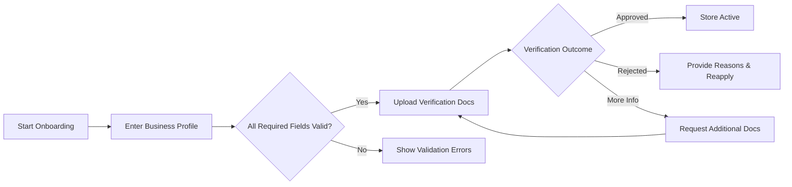
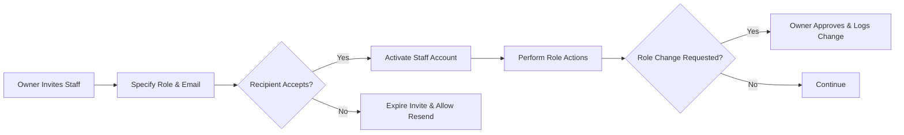
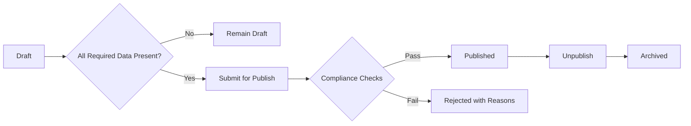
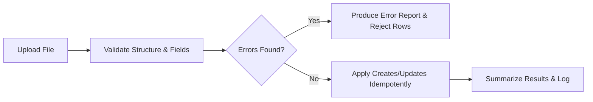
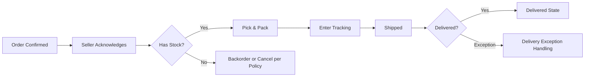
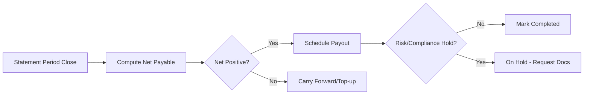

# shoppingMall Seller Portal Requirements (Enhanced)

This specification defines the complete business requirements for the seller portal of shoppingMall. It expands seller-facing workflows from onboarding to payouts, clarifies sub-roles, introduces business SLAs, adds error and escalation handling, and consolidates EARS-formatted requirements. Statements are implementation-neutral and avoid technical design details.

## 1. Introduction and Scope

### 1.1 Purpose
THE seller portal SHALL enable merchants ("sellers") to operate stores on shoppingMall by providing onboarding, catalog authoring, inventory and price control, order processing and fulfillment, messaging within policy, returns and refunds handling, financial transparency (fees, reserves, payouts), and role-based access with auditability.

### 1.2 In Scope
- Onboarding and verification (KYB/KYC) with re-verification policies
- Store profile, policies, calendars, and notification preferences
- Product and SKU management with category governance
- Bulk imports/exports of listings and inventory (business rules)
- Order processing, partial shipments, exceptions
- Buyer messaging within policy guardrails
- Returns, cancellations, refunds task handling
- Inventory controls, reservations, backorders/preorders
- Pricing, scheduled changes, promotions participation (business-level)
- Financials: fees, statements, reserves, payouts, disputes
- Role management, elevated action controls, audit and compliance
- Performance targets, SLAs, and acceptance criteria

### 1.3 Out of Scope
- UI design, page layouts, or style guides
- API endpoints, database schemas, provider-specific integrations
- Low-level infrastructure or vendor selection

### 1.4 Definitions
- Store: A seller’s business presence on shoppingMall.
- Listing: A product with content, attributes, and variants.
- SKU: Unique purchasable variant combination owned by a seller.
- Fulfillment: Seller actions to ship goods.
- Statement: Periodic financial summary of sales, fees, and payouts.
- Asia/Seoul: Default timezone for platform-wide schedules and cutoffs unless seller-configured otherwise.

## 2. Seller Onboarding and Verification

### 2.1 Objectives
- Ensure compliant sellers operate on the platform with verified identity, tax, and business credentials.
- Set store readiness gates before publication and order intake.

### 2.2 Core Requirements (EARS)
- THE seller portal SHALL collect legal business name, registration number, tax identification, primary contact, business address, and payout preferences (business-level) during onboarding.
- WHEN onboarding data is submitted, THE seller portal SHALL validate required fields and formats, recording submission timestamp and source.
- WHEN document verification is required, THE seller portal SHALL set state "Pending Verification" and block listing publication and order intake until approval.
- IF documents are incomplete or invalid, THEN THE seller portal SHALL return rejection reasons and allow resubmission.
- WHEN verification is approved, THE seller portal SHALL set store state to "Active" and enable listing publication.
- WHERE enhanced due diligence is required by risk policy, THE seller portal SHALL pause activation and request supplementary documents.
- WHERE annual or risk-triggered re-verification is required, THE seller portal SHALL request updated documents and restrict payouts if deadlines are missed.

### 2.3 States
- onboarding → verification_pending → verified_active → limited → suspended → deleted

### 2.4 SLAs (Business-Level)
- Verification review (standard): target <= 3 business days p95.
- Additional documents review: target <= 5 business days p95.
- Seller response windows for requests: minimum 7 calendar days unless risk mandates shorter.

### 2.5 Onboarding Flow (Mermaid)

## 3. Store Profile, Policies, and Settings

### 3.1 Identity and Branding
- THE seller portal SHALL allow configuration of store name (2–50 chars), description (≤ 2,000 chars), logo/brand assets subject to content policy.
- IF a store name conflicts or violates policy, THEN THE seller portal SHALL block the name and prompt for alternatives.

### 3.2 Operational Settings
- THE seller portal SHALL allow configuration of operating timezone, country/region, ship-from addresses (single or multiple), and business calendars (operating and holiday closures).
- WHEN operating timezone is absent, THE seller portal SHALL default to Asia/Seoul.
- WHEN calendars are updated, THE seller portal SHALL recalculate ship-by promises for new orders.

### 3.3 Policy Pages
- THE seller portal SHALL allow definition of store-specific shipping, returns, and warranty policies within platform limits.
- IF policy content violates platform rules, THEN THE seller portal SHALL block publication and provide reason categories.

### 3.4 Notifications and Preferences
- THE seller portal SHALL allow opt-in preferences for operational alerts (new orders, SLA risks, low stock, disputes, payout updates).
- WHEN preferences change, THE seller portal SHALL apply them within 5 minutes and log the change.

## 4. Team and Role Management (Seller Sub-Roles)

### 4.1 Sub-Roles
- Owner: Full control including payouts and settings.
- Manager: Listings, pricing, inventory, orders, returns; view statements.
- Fulfillment: Orders, shipments, limited inventory edits.
- Support: Buyer messaging, review responses, view orders.

### 4.2 Access Controls (EARS)
- WHEN a non-owner attempts to access payouts or fee configurations, THE seller portal SHALL deny access and log the attempt.
- WHEN a fulfillment role attempts to change pricing, THE seller portal SHALL deny access and log the event.
- THE seller portal SHALL audit all permission-sensitive actions with actor, timestamp, and context.
- WHERE sensitive actions occur (payout detail change, mass price update), THE seller portal SHALL require step-up authentication and justification.
- WHERE dual control is mandated (e.g., payout destination change), THE seller portal SHALL require approval by a second user with sufficient role before applying.

### 4.3 Invitation and Role Changes (Mermaid)

## 5. Product and SKU Management

### 5.1 Creation and Validation
- WHEN a product is created, THE seller portal SHALL require taxonomy selection and category-required attributes.
- IF mandatory attributes are missing or invalid, THEN THE seller portal SHALL block publish and show field-level reasons.
- THE seller portal SHALL support listing states: Draft, Published, Unpublished, Archived.

### 5.2 Variants and Uniqueness
- THE seller portal SHALL generate distinct SKUs for unique variant combinations and enforce per-store unique SKU codes.
- IF a duplicate SKU code is submitted, THEN THE seller portal SHALL reject with a duplicate error.

### 5.3 Media Standards
- THE seller portal SHALL validate image count/size/type and block media violating content policy (e.g., watermarks, prohibited overlays).

### 5.4 Listing Lifecycle (Mermaid)

## 6. Bulk Operations and Data Exchange (Business Rules)

### 6.1 Imports
- THE seller portal SHALL allow bulk import of products, variants, and inventory via structured files (business-level mapping).
- WHEN an import is uploaded, THE seller portal SHALL validate headers, required fields, and value domains per category.
- IF row-level errors exist, THEN THE seller portal SHALL reject invalid rows, accept valid rows, and provide an error report with line numbers and reasons.
- WHERE idempotency keys or natural keys (SKU code) are present, THE seller portal SHALL treat reuploads as updates rather than duplicates.

### 6.2 Exports
- THE seller portal SHALL allow filtered exports of listings, inventory, and prices within policy limits (e.g., up to 10,000 rows per export).

### 6.3 Bulk Import Flow (Mermaid)

## 7. Pricing and Promotions Participation

### 7.1 Pricing Controls
- THE seller portal SHALL allow per-SKU price setting and scheduled effective dates.
- WHEN the effective date arrives, THE seller portal SHALL apply the new price to new orders and log the change.
- IF category-regulated price minimums/maximums apply, THEN THE seller portal SHALL enforce those limits.

### 7.2 Promotions Enrollment (Business-Level)
- WHERE platform or seller promotions exist, THE seller portal SHALL display eligibility rules and projected price impacts for selected SKUs.
- WHEN a promotion is applied, THE seller portal SHALL clearly disclose whether discounts are seller-funded or platform-funded for statement clarity.

## 8. Order Processing and Fulfillment

### 8.1 Acknowledgment and SLA
- WHEN an order is confirmed for the seller, THE seller portal SHALL notify and list the order within 10 seconds.
- THE seller portal SHALL require acknowledgment within 24 hours (configurable) for manual fulfillment.
- IF acknowledgment SLA is missed, THEN THE seller portal SHALL flag at-risk orders and escalate per policy.

### 8.2 Pick, Pack, Ship
- THE seller portal SHALL provide pick lists and packing slips in business terms.
- WHEN tracking details (carrier, service, tracking ref) are saved, THE seller portal SHALL set line(s) to "Shipped" and trigger customer notification.
- THE seller portal SHALL support partial shipments and multiple tracking numbers per order.

### 8.3 Delivery Exceptions
- IF a shipment is returned to sender or exception occurs, THEN THE seller portal SHALL prompt remediation (reship, refund, cancel) according to policy and inform the customer.

### 8.4 Fulfillment Flow (Mermaid)

## 9. Buyer Messaging via Portal

### 9.1 Principles
- THE seller portal SHALL provide buyer messaging limited to order-related topics; off-platform solicitation is prohibited.
- THE seller portal SHALL mask sensitive customer data and restrict file types per policy.

### 9.2 EARS
- WHEN a buyer message is received, THE seller portal SHALL notify the seller and display the message in the order context.
- WHEN a seller replies, THE seller portal SHALL deliver the message to the buyer and retain an audit trail.
- IF a seller attempts to share prohibited content, THEN THE seller portal SHALL block the message and log the violation.
- WHERE time-bound responses are required (e.g., returns questions), THE seller portal SHALL surface deadlines and escalate overdue messages.

## 10. Returns, Cancellations, and Refunds Handling (Seller Tasks)

### 10.1 Integrations with Policy
- Seller tasks SHALL align with the platform [Returns, Cancellations, and Refunds Requirements](./11-shoppingMall-returns-cancellations-and-refunds.md) and [Order and Shipping Management Requirements](./08-shoppingMall-order-and-shipping-management.md).

### 10.2 EARS
- WHEN a cancellation request is received pre-dispatch, THE seller portal SHALL prompt the seller to approve/deny within SLA; auto-approve on SLA breach where policy mandates.
- WHEN an RMA is approved, THE seller portal SHALL show instructions, deadlines, and expected inbound tracking; sellers SHALL update inspection outcome within 3 business days of receipt.
- WHEN inspection passes, THE seller portal SHALL compute refund suggestions per policy; admins MAY override per dispute outcomes.
- IF inspection fails due to mismatch/abuse, THEN THE seller portal SHALL allow rejection with reason codes and notify the customer with appeal path.

## 11. Inventory and Availability Controls

- THE seller portal SHALL allow inventory adjustments per SKU with required reason codes; prevent going below reserved quantities from active checkouts.
- WHEN a checkout reservation is released (failure/abandonment), THE seller portal SHALL restore availability immediately.
- WHERE backorders/preorders are enabled, THE seller portal SHALL enforce backorder limits and preorder release dates.
- WHEN low-stock thresholds are breached, THE seller portal SHALL send alerts within 5 minutes.

## 12. Financials: Fees, Reserves, Statements, and Payouts

### 12.1 Transparency
- THE seller portal SHALL itemize commissions, platform fees, payment processing (pass-through or blended), dispute fees, reserves, and adjustments.

### 12.2 Statements and Payouts
- THE seller portal SHALL generate statements per cycle and show opening balance, sales, fees, refunds, reserves, adjustments, closing balance, and payout.
- WHEN payout is scheduled, THE seller portal SHALL show status (Scheduled, In Process, Completed, On Hold) with expected dates.
- IF net payable is negative, THEN THE seller portal SHALL carry forward or request top-up per policy.
- WHERE reserves apply, THE seller portal SHALL show reserve percentage, duration, and expected release dates.

### 12.3 Disputes and Chargebacks
- WHEN a chargeback opens, THE seller portal SHALL notify sellers with evidence deadlines and allow document upload (business-level) for admin review.

### 12.4 Payout Overview (Mermaid)

## 13. Permissions and Access Control (Business Matrix)

| Capability | Owner | Manager | Fulfillment | Support |
|---|---|---|---|---|
| Configure store profile/policies | ✅ | ✅ | ❌ | ❌ |
| Invite/manage staff and roles | ✅ | ✅ (within limits) | ❌ | ❌ |
| Create/edit products and SKUs | ✅ | ✅ | ❌ | ❌ |
| Publish/unpublish/archive listings | ✅ | ✅ | ❌ | ❌ |
| Adjust inventory levels | ✅ | ✅ | ✅ (limited) | ❌ |
| Set pricing/scheduled price changes | ✅ | ✅ | ❌ | ❌ |
| View orders | ✅ | ✅ | ✅ | ✅ |
| Acknowledge/fulfill orders | ✅ | ✅ | ✅ | ❌ |
| Enter tracking | ✅ | ✅ | ✅ | ❌ |
| Handle cancellations/returns/refunds | ✅ | ✅ | ✅ (limited) | ❌ |
| Buyer messaging & review responses | ✅ | ✅ | ❌ | ✅ |
| View statements/payout status | ✅ | ✅ | ❌ | ❌ |
| Submit fee disputes | ✅ | ✅ | ❌ | ❌ |
| Change payout destination | ✅ (dual control) | ❌ | ❌ | ❌ |

EARS (controls):
- IF a user attempts an action outside their role, THEN THE seller portal SHALL deny the action and log the attempt.
- WHERE dual control is required (e.g., payout destination change), THE seller portal SHALL enforce proposer/approver separation.
- WHEN step-up authentication is required for sensitive actions, THE seller portal SHALL prompt for successful verification before proceeding.

## 14. Performance and SLA (Seller Portal)

Targets (user-perceived, P95):
- Login: ≤ 1.8s
- Product list view: ≤ 2.5s
- Create/update product: ≤ 3.0s
- Inventory adjustment: ≤ 1.5s; reflect availability immediately
- Order processing view: ≤ 2.5s
- Mark order shipped: ≤ 1.5s
- Statement view: ≤ 2.5s
- Export initiation: confirmation ≤ 2.0s; delivery ≤ 2 minutes for up to 10,000 rows

EARS:
- WHEN a seller marks an order as shipped, THE seller portal SHALL reflect shipment status and notify the customer within 10 seconds.
- WHEN an export is requested, THE seller portal SHALL generate a downloadable file or link within 2 minutes for up to the policy-defined record limit.

## 15. Error Handling and Edge Cases

### 15.1 Common Errors (EARS)
- IF mandatory onboarding fields are missing, THEN THE seller portal SHALL identify each missing field and block submission.
- IF SKU code duplicates an existing one, THEN THE seller portal SHALL reject with the conflicting code reference.
- IF shipment details are incomplete, THEN THE seller portal SHALL block marking as shipped and request completion.
- IF inventory adjustment would go below reserved amounts, THEN THE seller portal SHALL block the change and present current reserved levels.
- IF a cancellation request arrives after dispatch, THEN THE seller portal SHALL route to returns workflow.
- IF bulk import contains mixed results, THEN THE seller portal SHALL accept valid rows, reject invalid rows, and provide a per-row error report.
- IF a prohibited message is attempted in buyer messaging, THEN THE seller portal SHALL block the message and cite policy category.

### 15.2 Concurrency and Consistency
- WHEN multiple staff attempt conflicting edits, THE seller portal SHALL prevent silent overwrites and require conflict resolution based on the latest version.
- WHEN reservations exist from checkout, THE seller portal SHALL keep sellable quantity from dropping below reserved.

### 15.3 Policy Violations
- IF listing or policy text violates restricted terms, THEN THE seller portal SHALL block publication and provide reason categories.
- IF fee dispute is filed after the allowed window, THEN THE seller portal SHALL deny submission and state the deadline.

## 16. Compliance, Privacy, and Auditability

- THE seller portal SHALL mask customer PII and show only what is necessary to fulfill orders (e.g., shipping details for that order).
- THE seller portal SHALL maintain audit trails for onboarding decisions, listing publication changes, price changes, inventory adjustments, order state transitions, messaging, and payout changes for at least 24 months.
- WHERE regulatory retention requires longer periods (statements, tax documents), THE seller portal SHALL retain records per applicable laws.
- WHEN staff access sensitive views (e.g., payout details), THE seller portal SHALL record purpose and actor in the audit log.

## 17. Reporting and Operational Visibility

- THE seller portal SHALL provide operational dashboards for open orders, late orders, low-stock SKUs, pending returns, recent reviews, and payout status.
- THE seller portal SHALL support filtered exports for orders, listings, inventory, and statements with date/status filters and role-based scope.
- WHEN payout status changes or SLAs are breached, THE seller portal SHALL send notifications per preferences and log events.

## 18. Acceptance Criteria (Business-Level)

Onboarding and Roles
- WHEN valid onboarding data is provided and documents approved, THE seller portal SHALL activate the store and allow listing publication.
- WHEN a staff member is invited and accepts, THE seller portal SHALL grant the specified role and log the event.
- WHEN a payout destination change is proposed, THE seller portal SHALL require step-up authentication and dual control before applying.

Catalog and Inventory
- WHEN a product with valid category-required attributes is submitted, THE seller portal SHALL publish it after compliance checks.
- WHEN an inventory adjustment with valid reason codes is applied, THE seller portal SHALL reflect updated availability and log the adjustment.

Orders and Fulfillment
- WHEN a new order is confirmed, THE seller portal SHALL display it to the seller within 10 seconds and track SLA.
- WHEN tracking is entered, THE seller portal SHALL mark shipped and trigger notifications.

Returns and Refunds
- WHEN an approved RMA item is received and passes inspection, THE seller portal SHALL compute refund suggestion per policy and initiate processing.

Financials
- WHEN a statement cycle closes, THE seller portal SHALL display statements with itemized fees, reserves, and net payout.
- WHEN payout status changes, THE seller portal SHALL show updated status and send alerts if On Hold.

## 19. Consolidated EARS Requirements Index (Selected)

- THE seller portal SHALL enforce sub-role permissions and log sensitive actions.
- WHEN onboarding data is submitted, THE seller portal SHALL validate and set state to verification_pending until approval.
- IF duplicate SKU codes are submitted, THEN THE seller portal SHALL reject with a duplicate error.
- WHEN orders are confirmed, THE seller portal SHALL notify sellers and render within 10 seconds.
- WHEN shipments are updated with tracking, THE seller portal SHALL transition lines to Shipped and notify customers.
- WHEN low-stock thresholds are breached, THE seller portal SHALL alert sellers within 5 minutes.
- WHEN statements are generated, THE seller portal SHALL itemize fees, reserves, and payouts.
- WHERE dual control is required, THE seller portal SHALL enforce proposer/approver separation for sensitive actions.

## 20. Related Documents
- Actor permissions and identity controls: [User Actors and Permissions](./03-shoppingMall-user-actors-and-permissions.md)
- Catalog and variants: [Catalog, Search, and Variants Requirements](./05-shoppingMall-catalog-search-and-variants.md)
- Cart and wishlist: [Cart and Wishlist Requirements](./06-shoppingMall-cart-and-wishlist.md)
- Checkout and payment: [Checkout and Payment Requirements](./07-shoppingMall-checkout-and-payment.md)
- Orders and shipping: [Order and Shipping Management Requirements](./08-shoppingMall-order-and-shipping-management.md)
- Inventory controls: [Inventory Management Requirements](./09-shoppingMall-inventory-management.md)
- Reviews and responses: [Reviews and Ratings Requirements](./10-shoppingMall-reviews-and-ratings.md)
- Returns/cancellations/refunds: [Returns, Cancellations, and Refunds Requirements](./11-shoppingMall-returns-cancellations-and-refunds.md)
- Admin governance: [Admin Operations and Governance Requirements](./13-shoppingMall-admin-operations-and-governance.md)
- Security/privacy/compliance: [Security, Privacy, and Compliance Requirements](./14-shoppingMall-security-privacy-and-compliance.md)
- Performance and SLA: [Performance and SLA Requirements](./15-shoppingMall-performance-and-sla.md)
- Notifications/reporting: [Notifications, Communications, and Reporting Requirements](./16-shoppingMall-notifications-communications-and-reporting.md)
