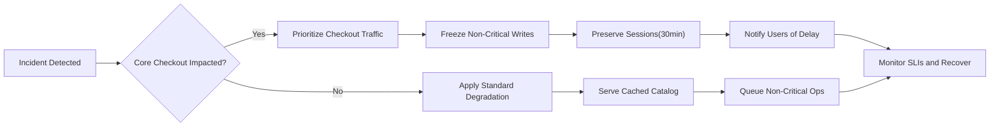
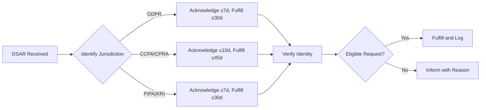
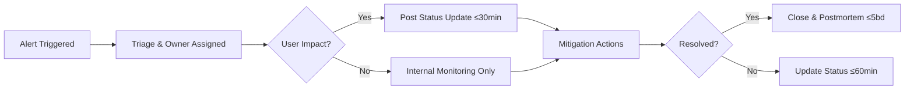

# Non-Functional Requirements – Performance, Security, and Compliance (shoppingMall)

This specification defines clear, measurable non-functional requirements for the shoppingMall e-commerce marketplace. The focus is on WHAT outcomes must be achieved, not HOW to implement them. All technical choices (architecture, APIs, databases, tooling) remain at the discretion of the development team. Language is en-US, and business times reference Asia/Seoul (KST) unless stated otherwise.

## 1. Scope, Principles, and Measurement Standards
- THE shoppingMall platform SHALL prioritize fast, reliable, secure experiences across buyer journeys (browse/search, product detail, variant selection, cart, checkout/payment, order tracking/history), seller operations, and administrative oversight.
- THE shoppingMall platform SHALL be validated using a combination of synthetic tests, real-user monitoring (RUM), and operational metrics.
- THE shoppingMall platform SHALL define SLIs, SLOs, and error budgets for each critical flow with monthly measurement windows unless otherwise noted.
- THE shoppingMall platform SHALL use percentile-based latency targets (p50, p90, p95, p99) measured server-side from request receipt to last byte of response, excluding client rendering, and SHALL state any exceptions.
- THE shoppingMall platform SHALL present user-facing datetimes localized to the user’s locale while recording UTC timestamps; business cutoffs use Asia/Seoul timezone.

Measurement windows and error budgets
- THE shoppingMall platform SHALL measure availability SLOs monthly (UTC calendar month) and compute error budgets as (1 − SLO) of total minutes per month.
- WHEN 50% of a flow’s monthly error budget is consumed, THE shoppingMall platform SHALL trigger a yellow alert; WHEN 75% is consumed, THE shoppingMall platform SHALL trigger an orange alert with mitigation; WHEN 100% is consumed, THE shoppingMall platform SHALL trigger a red alert and freeze non-critical releases for that flow until recovery.

## 2. Performance and Latency Expectations

### 2.1 Browse and Search
- THE shoppingMall platform SHALL achieve p95 ≤ 800 ms for category listing requests under normal load and p95 ≤ 960 ms during peak events (≤ +20% tolerance).
- THE shoppingMall platform SHALL achieve p95 ≤ 700 ms for typical keyword search queries (top 80% frequency) and p95 ≤ 900 ms for queries with advanced filters and sorting.
- WHEN a search matches > 10,000 results, THE shoppingMall platform SHALL paginate with p95 ≤ 900 ms per page under normal load.
- WHEN providing typeahead/auto-suggest, THE shoppingMall platform SHALL respond p95 ≤ 200 ms for the top 95% of keystrokes during 09:00–22:00 KST.

### 2.2 Product Details and Variant Selection
- WHEN opening a product detail, THE shoppingMall platform SHALL return core content p95 ≤ 500 ms under normal load.
- WHEN the user selects variant options (e.g., color/size), THE shoppingMall platform SHALL resolve the SKU price and availability p95 ≤ 300 ms for products with < 50 SKUs and p95 ≤ 400 ms for products with ≥ 50 SKUs.

### 2.3 Cart and Wishlist
- WHEN adding a line item to cart, THE shoppingMall platform SHALL complete the operation p95 ≤ 400 ms and return the updated cart.
- WHEN updating quantity or removing items, THE shoppingMall platform SHALL respond p95 ≤ 400 ms.
- WHEN retrieving a cart, THE shoppingMall platform SHALL respond p95 ≤ 450 ms for guests and p95 ≤ 500 ms for authenticated customers including promotions recalculation.
- WHEN adding/removing wishlist items, THE shoppingMall platform SHALL respond p95 ≤ 400 ms.

### 2.4 Checkout, Payment, and Order Placement
- WHEN loading the checkout view (selected address and shipping), THE shoppingMall platform SHALL respond p95 ≤ 700 ms.
- WHEN computing shipping rates, THE shoppingMall platform SHALL respond p95 ≤ 800 ms for domestic and p95 ≤ 1,200 ms for cross-border shipments.
- WHEN submitting order placement including payment authorization, THE shoppingMall platform SHALL provide final order confirmation p95 ≤ 2,000 ms for successful authorizations.
- IF payment authorization exceeds 10,000 ms, THEN THE shoppingMall platform SHALL show a pending state and complete the flow asynchronously with user notification.
- WHERE step-up verification applies (e.g., 3-D Secure), THE shoppingMall platform SHALL complete the round trip within 120 seconds or provide a recovery path.

### 2.5 Order Tracking and History
- WHEN listing orders (≤ 50 orders), THE shoppingMall platform SHALL respond p95 ≤ 700 ms; for paginated views up to 200 orders, p95 ≤ 900 ms.
- WHEN viewing an order detail with up to 5 shipments, THE shoppingMall platform SHALL respond p95 ≤ 600 ms.
- WHEN shipment status updates are ingested, THE shoppingMall platform SHALL reflect them to customers within 60 seconds.

### 2.6 Seller and Admin Workspaces
- WHEN loading the seller orders dashboard (≤ 500 orders with pagination), THE shoppingMall platform SHALL respond p95 ≤ 800 ms.
- WHEN a seller updates inventory or price for a SKU, THE shoppingMall platform SHALL confirm success p95 ≤ 600 ms and update buyer-facing views within 60 seconds for inventory and within 2 minutes for price.
- WHEN loading admin catalog lists (≤ 1,000 items with filters), THE shoppingMall platform SHALL respond p95 ≤ 900 ms; cross-entity admin search SHALL respond p95 ≤ 1,200 ms.

### 2.7 Background Jobs With User Impact
- WHERE catalog changes trigger repricing/re-promotion, THE shoppingMall platform SHALL update product and list views within 10 minutes.
- WHERE bulk imports are processed, THE shoppingMall platform SHALL show progress updated at least every 60 seconds and complete 95% of jobs within the user-estimated time ±20%.

## 3. Scalability, Capacity, and Throughput
- THE shoppingMall platform SHALL sustain at least 300 requests/sec for catalog + search, 60 requests/sec for cart operations, and 20 order placements/sec under normal load while maintaining p95 targets in Section 2.
- WHERE peak seasonal events occur, THE shoppingMall platform SHALL scale to ≥ 5× normal throughput for browse/search and ≥ 3× for checkout with p95 degradation not exceeding +20% of targets.
- WHEN bursts reach 10× normal for ≤ 2 minutes, THE shoppingMall platform SHALL prioritize checkout/payment over non-critical operations and maintain order placement p95 ≤ 2,500 ms.
- THE shoppingMall platform SHALL maintain at least 30% headroom over observed 95th percentile load during business hours.
- WHEN capacity approaches 80% of provisioned thresholds for ≥ 10 minutes, THE shoppingMall platform SHALL trigger capacity scale-up workflows and notify operations.

Warm-up and recovery
- WHEN a scale-up or failover event occurs, THE shoppingMall platform SHALL restore SLO-compliant service within 10 minutes for browse/search and within 5 minutes for checkout.

## 4. Availability, Reliability, and Resilience
- THE shoppingMall platform core flows (browse, search, product detail, cart, checkout, order view) SHALL achieve availability ≥ 99.90% monthly.
- THE shoppingMall platform payment authorization and order placement flows SHALL achieve availability ≥ 99.95% monthly.
- THE shoppingMall platform seller essential functions (order processing, inventory updates) SHALL achieve availability ≥ 99.90% monthly.
- THE shoppingMall platform admin essential functions SHALL achieve availability ≥ 99.90% monthly.

Degradation and continuity
- IF a partial outage occurs, THEN THE shoppingMall platform SHALL degrade gracefully by: serving cached catalog content where feasible; allowing cart read-only when writes are impaired; queueing review submissions; and preserving checkout sessions for ≥ 30 minutes for recovery.
- THE shoppingMall platform SHALL target RTO ≤ 60 minutes and RPO ≤ 15 minutes for transactional data.
- WHEN idempotent operations are retried (orders, payments, reviews), THE shoppingMall platform SHALL prevent duplicates with business-safe deduplication within a 10-minute window.

Backup and restore
- THE shoppingMall platform SHALL perform disaster recovery exercises including restore validation at least quarterly and record pass/fail and recovery timings.
- THE shoppingMall platform SHALL verify backup integrity weekly and SHALL retain backups aligned to retention requirements in Section 8.

### Degraded Mode Decision Flow (Business)

## 5. Security, Access Control, and Abuse Prevention (Business)
- THE shoppingMall platform SHALL enforce role-based access aligned to roles: guest, customer, seller, supportAgent, operationsManager, financeManager, contentModerator, systemAdmin.
- WHEN authentication succeeds, THE shoppingMall platform SHALL constrain session validity appropriate to risk: ≤ 30 minutes of inactivity for high-risk flows (checkout, payouts); ≤ 24 hours for low-risk preferences.
- IF suspicious activity is detected (abnormal geo-velocity, rapid credential failures, unusual transaction patterns), THEN THE shoppingMall platform SHALL require step-up verification before sensitive actions (payment, payout, role/policy changes).
- WHEN sensitive account fields (email, phone, password, payout details) change, THE shoppingMall platform SHALL notify the user immediately and offer clear recovery paths.
- WHERE PII is presented to staff, THE shoppingMall platform SHALL mask by default and require explicit justification to reveal, recording an audit event.

Rate limiting and bot defense
- THE shoppingMall platform SHALL apply per-account, per-IP, and per-device rate limits tuned by flow: authentication (e.g., ≤ 10 failed attempts/10 min/account before cooldown), checkout submission (e.g., ≤ 5 attempts/5 min/account), and search (e.g., ≤ 120 req/min/IP) with business-tuned thresholds.
- IF a client exceeds a rate limit, THEN THE shoppingMall platform SHALL throttle with user-appropriate messaging and preserve legitimate sessions.

Data protection expectations (business)
- THE shoppingMall platform SHALL protect payment data by delegating card handling to compliant providers; raw cardholder data SHALL NOT be stored or logged.
- THE shoppingMall platform SHALL require encryption in transit for user interactions and SHALL require encryption at rest for stored personal and transactional data as a business expectation, without prescribing ciphers.

Vulnerability and change governance
- THE shoppingMall platform SHALL maintain a vulnerability disclosure and triage process with the following goals: critical exposure remediation target ≤ 7 days; high ≤ 14 days; medium ≤ 30 days.
- WHEN high-risk releases are planned, THE shoppingMall platform SHALL require a change record including risk, roll-back plan, and approval by an authorized role before deployment.

## 6. Compliance and Regulatory
- THE shoppingMall platform SHALL comply with privacy laws applicable to served regions, including GDPR (EU/EEA), CCPA/CPRA (California), and PIPA (Korea).
- THE shoppingMall platform SHALL comply with PCI-DSS scope limitations by using compliant payment providers and avoiding raw card storage.

Data subject rights (DSR) and consent
- WHEN a data subject request is received, THE shoppingMall platform SHALL acknowledge within 7 days and fulfill within jurisdiction timelines: GDPR ≤ 30 days (extendable with notice), CCPA/CPRA ≤ 45 days (extendable with notice), PIPA (Korea) generally ≤ 30 days.
- WHEN marketing consent is withdrawn, THE shoppingMall platform SHALL cease non-transactional messaging within 48 hours.

Record retention and data residency
- THE shoppingMall platform SHALL retain transactional records consistent with business policy and law: Orders/Payments ≥ 5 years; Shipments ≥ 1 year after completion; Disputes ≥ 3 years; Payout/Accounting ≥ 5 years; Security/audit logs ≥ 1 year; Operational logs ≥ 90 days at full fidelity and ≥ 365 days aggregated.
- WHERE cross-border data transfers occur, THE shoppingMall platform SHALL use lawful transfer mechanisms and respect regional data residency requirements as configured by business policy.

### Data Subject Rights Handling (Business)

## 7. Localization, Internationalization, and Accessibility
- THE shoppingMall platform SHALL support en-US and ko-KR initially and be extensible to additional locales without functional regression.
- THE shoppingMall platform SHALL display dates, addresses, numerals, and currencies in the user’s locale conventions; monetary values SHALL include currency codes.
- WHEN validating addresses, THE shoppingMall platform SHALL apply country-specific rules without rejecting legitimate local variations (e.g., Korean road names vs. lot numbers).
- WHEN presenting taxes and duties, THE shoppingMall platform SHALL show estimated amounts and appropriate disclaimers before order placement.
- WHILE order tracking is displayed, THE shoppingMall platform SHALL convert carrier timestamps to the user’s timezone and retain original event times for audit.
- THE shoppingMall platform SHALL comply with WCAG 2.1 AA accessibility targets for critical user flows.

Accessibility EARS
- WHEN accessibility regressions are detected via audits, THE shoppingMall platform SHALL prioritize remediation for checkout and payment pages within 30 days and for other pages within 60 days.

## 8. Observability, Auditability, and Operability
- THE shoppingMall platform SHALL define SLIs for latency, error rate, availability, freshness/staleness, and queue delay for each critical journey.
- WHEN SLO burn reaches 80% of the monthly error budget, THE shoppingMall platform SHALL trigger alerts and initiate incident response within 15 minutes during 09:00–22:00 KST and within 30 minutes otherwise.
- THE shoppingMall platform SHALL log security-sensitive actions (auth successes/failures, role/permission changes, data exports, payouts, price changes) with retention ≥ 1 year and role-based access.
- THE shoppingMall platform SHALL pseudonymize or mask PII in operational logs while preserving correlation IDs for traceability.

Reporting and dashboards
- THE shoppingMall platform SHALL provide dashboards summarizing funnel stages, payment outcomes, shipments, moderation queues, inventory health, and seller performance with daily and monthly rollups.

Incident communication cadence
- WHEN a user-facing incident occurs, THE shoppingMall platform SHALL publish a status update within 30 minutes of detection and at least every 60 minutes until resolution, followed by a postmortem within 5 business days.

### Incident Communication and Response (Business)

## 9. Third-Party and Dependency Expectations
- THE shoppingMall platform SHALL define pass-through SLOs for critical dependencies (payments, carriers, KYC/verification, email/SMS). Where partner SLOs are lower than platform SLOs, THE shoppingMall platform SHALL implement fallbacks and user messaging to preserve core experience.
- WHEN a third-party dependency degrades, THE shoppingMall platform SHALL switch to safe-mode behaviors (e.g., reduced payment methods, deferred notifications) and communicate clearly to users.

## 10. Change Management, Release Governance, and Testing Cadence
- THE shoppingMall platform SHALL schedule planned maintenance with ≥ 48 hours notice during 02:00–05:00 KST and limit total downtime to ≤ 60 minutes/month.
- THE shoppingMall platform SHALL define release freeze periods during high-risk sales events; exceptions require authorized approval and rollback plans.
- THE shoppingMall platform SHALL perform periodic chaos/resilience tests at least quarterly and track findings to closure.
- THE shoppingMall platform SHALL conduct security testing on a recurring cadence: automated scanning continuously; targeted penetration tests at least annually.

## 11. Acceptance Criteria and Validation Approach
Load and performance
- THE shoppingMall platform SHALL pass load tests simulating normal, peak (5×), and burst (10×, 2 minutes) traffic while maintaining p95 targets within stated tolerances in Section 2.
- THE shoppingMall platform SHALL demonstrate monthly availability SLO compliance for flows in Section 4 with error-budget tracking and reports.

Security and privacy
- THE shoppingMall platform SHALL demonstrate account lockout, step-up verification on risk, PII masking for staff views, and audit logging for exports and payouts.
- THE shoppingMall platform SHALL demonstrate DSAR handling within jurisdiction timelines, marketing opt-out honoring within 48 hours, and record retention behaviors per Section 6.

Localization and accessibility
- THE shoppingMall platform SHALL validate locale-specific formats (dates, numbers, addresses), currency display, timezone correctness for order/shipping events, and WCAG 2.1 AA compliance scans for critical flows.

Idempotency and resilience
- THE shoppingMall platform SHALL prove duplicate-prevention for order placement and payment capture within a 10-minute retry window and demonstrate disaster recovery restore exercises with successful outcomes within the RTO/RPO targets.

## 12. Consolidated EARS Requirements Catalogue (Selected)
Performance
- THE shoppingMall platform SHALL meet browse/search p95 ≤ 800 ms (normal), ≤ 960 ms (peak). WHEN advanced filters apply, THE shoppingMall platform SHALL meet p95 ≤ 900 ms.
- WHEN users open product detail, THE shoppingMall platform SHALL meet p95 ≤ 500 ms; WHEN selecting variants, THE shoppingMall platform SHALL meet p95 ≤ 300–400 ms based on SKU count.
- WHEN adding items to cart or updating/removing them, THE shoppingMall platform SHALL respond p95 ≤ 400 ms.
- WHEN submitting orders with payment authorization, THE shoppingMall platform SHALL confirm within p95 ≤ 2,000 ms for successful authorizations.

Availability & resilience
- THE shoppingMall platform core flows SHALL meet ≥ 99.90% monthly availability; payments/checkout SHALL meet ≥ 99.95%.
- IF partial outages occur, THEN THE shoppingMall platform SHALL degrade gracefully and preserve sessions ≥ 30 minutes.
- THE shoppingMall platform SHALL achieve RTO ≤ 60 minutes and RPO ≤ 15 minutes.

Security & abuse prevention
- THE shoppingMall platform SHALL enforce least-privilege by role and require step-up verification under suspicious activity.
- THE shoppingMall platform SHALL apply rate limits per flow and throttle with appropriate messaging on breach.

Compliance & privacy
- WHEN DSARs are received, THE shoppingMall platform SHALL acknowledge and fulfill within jurisdictional timelines; WHEN consent is withdrawn, THE shoppingMall platform SHALL cease non-transactional messaging within 48 hours.
- THE shoppingMall platform SHALL avoid storing raw cardholder data and SHALL rely on compliant providers.

Localization & accessibility
- THE shoppingMall platform SHALL support en-US and ko-KR initially and present localized formats; THE shoppingMall platform SHALL comply with WCAG 2.1 AA for critical flows.

Observability & incident response
- WHEN 80% of an error budget is consumed, THE shoppingMall platform SHALL trigger alerts and initiate incident response within 15–30 minutes depending on hours.
- WHEN incidents impact users, THE shoppingMall platform SHALL publish status updates within 30 minutes and at least every 60 minutes thereafter.

## 13. Visual Reference Index (Mermaid)
- Degraded Mode Decision Flow (Section 4)
- Data Subject Rights Handling (Section 6)
- Incident Communication and Response (Section 8)

Business-only statement
All requirements herein describe WHAT the shoppingMall platform must achieve in business terms. Implementation details (architecture, APIs, data schemas, vendor selections) are intentionally excluded and left to the development team’s discretion.