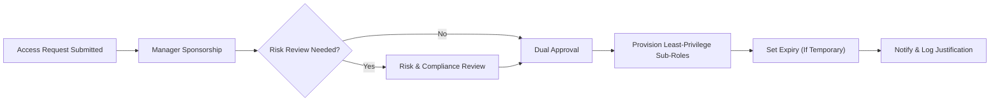
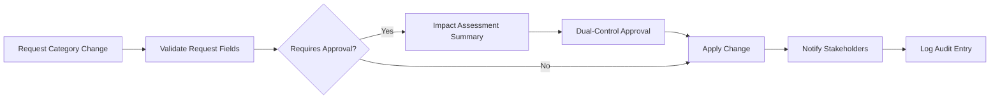
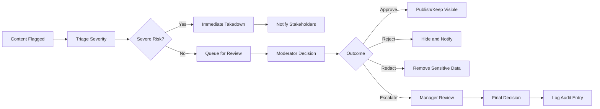
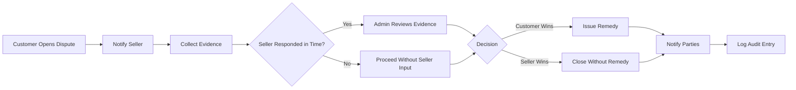
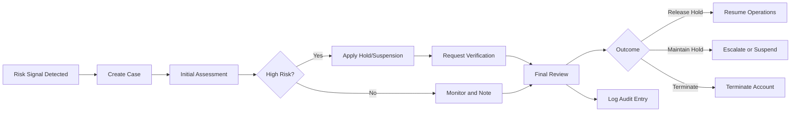
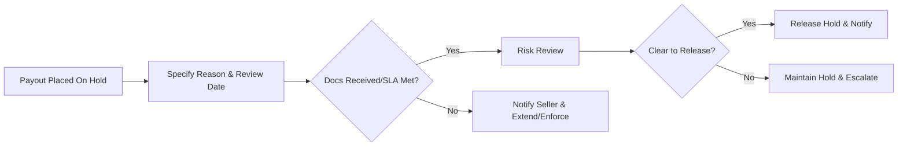

# shoppingMall — Admin Operations and Governance Requirements

## 1. Admin Roles and Responsibilities (Business-Level)

Sub-roles ensure separation of duties and least privilege while enabling complete operational coverage.

- Super Admin: emergency powers, full platform oversight, final authority for irreversible actions under dual control.
- Catalog Manager: taxonomy, attributes/templates, restricted products, brand approvals, listing data quality.
- Moderation Manager: UGC moderation (reviews/ratings/Q&A), policy enforcement, appeals routing.
- Operations Manager: order/shipping exceptions, SLA oversight, incident coordination, backlog triage.
- Risk & Compliance Admin: fraud reviews, holds, KYC/KYB escalations, disputes/chargebacks adjudication.
- Finance Admin: fee configuration, refunds/adjustments above thresholds, settlement corrections, payout approvals.
- Support Agent: scoped customer/seller support actions without access to sensitive configurations or payouts.
- Read-only Auditor: view-only access to records and immutable audit trails.

EARS role-scoping requirements:
- THE admin module SHALL restrict each sub-role to only the business capabilities assigned to that sub-role.
- WHERE an emergency operation is invoked by Super Admin, THE platform SHALL require an explicit justification and record actor identity and timestamp.
- IF a requested action falls outside an admin’s assigned sub-role, THEN THE platform SHALL deny the action with a business-meaningful reason and log the attempt.

## 2. Governance Principles

- Separation of Duties: initiate vs approve segregation for sensitive actions.
- Least Privilege: minimum necessary scopes for data and functions.
- Auditability: immutable logs for all sensitive state changes with actor, reason code, and timestamps.
- Policy Consistency: uniform application of rules across users, sellers, and content.
- Timeliness: defined SLAs for decisions and communications.
- Reversibility: compliant rollback paths where feasible.

EARS governance requirements:
- THE governance process SHALL require a reason code for all sensitive actions affecting users, sellers, payouts, fees, or taxonomy.
- WHERE a change impacts multiple entities, THE governance process SHALL require an impact summary before approval.
- IF a rollback is requested within the configured window, THEN THE platform SHALL restore the prior state where business-safe and SHALL log both changes.

## 3. Permission Model and Capability Matrix (Business Terms)

Illustrative capability mapping by sub-role:

| Capability | Super Admin | Catalog Manager | Moderation Manager | Operations Manager | Risk & Compliance | Finance Admin | Support Agent | Auditor |
|---|---|---|---|---|---|---|---|---|
| Manage categories/attributes | ✅ | ✅ | ❌ | ❌ | ❌ | ❌ | ❌ | 🔍 |
| Approve restricted products | ✅ | ✅ | ❌ | ❌ | ✅ | ❌ | ❌ | 🔍 |
| Moderate reviews/Q&A | ✅ | ❌ | ✅ | ❌ | ❌ | ❌ | ✅ (limited) | 🔍 |
| Suspend/reactivate users | ✅ | ❌ | ❌ | ✅ | ✅ | ❌ | ❌ | 🔍 |
| Suspend/reactivate sellers | ✅ | ❌ | ❌ | ✅ | ✅ | ❌ | ❌ | 🔍 |
| Override order status (policy-bound) | ✅ | ❌ | ❌ | ✅ | ✅ | ❌ | ❌ | 🔍 |
| Approve refunds/adjustments | ✅ | ❌ | ❌ | ✅ (within policy) | ✅ | ✅ | ❌ | 🔍 |
| Configure fees/commissions | ✅ | ❌ | ❌ | ❌ | ❌ | ✅ | ❌ | 🔍 |
| Manage payouts/holds | ✅ | ❌ | ❌ | ❌ | ✅ | ✅ | ❌ | 🔍 |
| Access audit logs | ✅ | 🔍 | 🔍 | 🔍 | 🔍 | 🔍 | 🔍 | 🔍 |

EARS permission rules:
- THE permission model SHALL prevent any single non‑Super Admin sub-role from both initiating and approving refunds above the configured threshold.
- WHERE a capability is read-only (🔍), THE platform SHALL display data but SHALL NOT allow state-changing operations for that sub-role.
- IF a restricted action is attempted by a sub-role, THEN THE platform SHALL deny with a business explanation and SHALL log context.

## 4. Admin Access Provisioning and Deprovisioning

EARS access lifecycle requirements:
- THE platform SHALL require manager sponsorship and dual approval for granting any admin sub-role.
- WHEN a new admin account is provisioned, THE platform SHALL assign the minimum sub-roles necessary and record justification, sponsors, and approvers.
- WHERE elevated privileges are time-bound (e.g., emergency access), THE platform SHALL auto-expire the grant and notify stakeholders before expiry.
- WHEN an admin changes department or leaves the organization, THE platform SHALL deprovision access within 24 hours of notification and log the completion.
- THE platform SHALL require recurring access reviews at least quarterly; reviewers SHALL attest to necessity or revoke access with reason.

Access provisioning flow:

## 5. User and Seller Management

Business capabilities:
- Search, review, and update business-allowable fields; manage identity/compliance states; apply suspensions/terminations; record KYC/KYB outcomes.

EARS account-state requirements:
- WHEN an admin updates an account state, THE platform SHALL record actor identity, timestamp, reason code (controlled list), and optional note up to 1,000 characters.
- THE platform SHALL support account states for users and sellers: active, suspended, terminated, pending‑verification, verification‑failed.
- IF a seller is suspended, THEN THE platform SHALL block listings, order processing, and payouts while permitting dispute responses.
- WHERE a customer account is terminated due to fraud, THE platform SHALL retain necessary transaction records per compliance policy.
- WHEN a seller onboarding application is approved, THE platform SHALL transition the store to active and notify the seller with policy excerpts.
- IF a seller onboarding application is rejected, THEN THE platform SHALL record the reason and notify the applicant with remediation guidance where permitted.
- THE platform SHALL enforce dual control for irreversible actions such as permanent termination or mass product takedown.

Error recovery:
- IF a state change lacks a reason code, THEN THE platform SHALL block the action and prompt for a valid reason.
- IF conflicting actions occur concurrently, THEN THE platform SHALL resolve per policy and log both with sequence metadata.
- IF a terminated account has open disputes, THEN THE platform SHALL block termination until resolution or Super Admin override with justification.

## 6. Catalog and Category Governance

Business capabilities:
- Manage taxonomy and attribute templates; approve restricted products; govern brand usage; enforce data quality.

EARS catalog rules:
- THE catalog governance process SHALL require an impact assessment for any category move affecting ≥100 SKUs.
- WHEN a restricted product is submitted, THE platform SHALL queue it for Catalog Manager or Risk & Compliance approval.
- IF a listing violates policy, THEN THE platform SHALL reject/unlist it and notify the seller with reason codes and remediation options.
- WHERE a brand requires authorization, THE platform SHALL require rights documentation before listing under that brand.
- WHILE a mass taxonomy change is pending, THE platform SHALL block overlapping edits to the same subtree.
- THE platform SHALL support rollback to the prior taxonomy version within a defined window and SHALL log all affected product associations.

Category change governance flow:

## 7. Content Moderation and Policy Enforcement

Business capabilities:
- Review, approve, reject, redact, or escalate UGC; manage abuse categories; handle appeals.

EARS moderation rules:
- WHEN content is reported or auto-flagged, THE platform SHALL queue it for moderation with trigger source recorded.
- THE moderation process SHALL support outcomes: approve, reject, redact, escalate.
- IF content is rejected, THEN THE platform SHALL store a reason code and notify the author where policy allows.
- WHERE personal data exposure is detected, THE platform SHALL prioritize redaction and document the action.
- WHEN an appeal is submitted, THE platform SHALL route it to a different moderator or manager within the appeal SLA.

Moderation workflow:

## 8. Dispute and Fraud Management

Business capabilities:
- Manage disputes (INR, not-as-described, defective, unauthorized charge); coordinate evidence; handle chargebacks; apply fraud holds.

EARS dispute and risk rules:
- WHEN a dispute is filed, THE platform SHALL assign a dispute ID, record reason, and notify the seller to provide evidence within the response SLA.
- WHERE the seller misses the response SLA, THE platform SHALL adjudicate based on available evidence and policy.
- IF resolved for the customer, THEN THE platform SHALL apply the remedy (refund/partial/refund/replacement) and notify both parties.
- THE risk process SHALL support actions: order hold, payout hold, request verification, account suspension.
- WHEN a risk action is applied, THE platform SHALL record rationale, actor, and review date, and SHALL notify impacted parties as policy allows.
- IF a payout hold exceeds the maximum hold period, THEN THE platform SHALL escalate to Risk & Compliance for decision.
- WHERE a chargeback is received, THE platform SHALL capture metadata and initiate seller evidence collection immediately.

Dispute resolution flow:

Fraud review flow:

Payout hold lift flow:

## 9. Operational Dashboards and Alerts (Conceptual)

Business views:
- Platform Health: order intake, checkout success, payment auth success, shipping exception rate, moderation queue time, dispute backlog.
- Seller Operations: on-time fulfillment, cancellation rate by reason, SLA breaches, payout holds.
- Catalog Quality: pending restricted approvals, attribute completeness, policy takedowns, taxonomy requests.
- Risk & Compliance: active holds, chargeback rate, fraud cases by severity, KYB pending.

Alerting expectations (business-level):
- WHEN a key metric breaches a threshold (e.g., payment authorization success < 95% over 15 minutes), THE platform SHALL generate alerts to relevant sub-roles.
- WHERE an alert is generated, THE platform SHALL include current value, threshold, timeframe, and a link to the relevant view.
- IF a high-severity alert is not acknowledged within its SLA, THEN THE platform SHALL escalate to Super Admin.

## 10. Change Management and Rollback

EARS change rules:
- WHEN a sensitive change is proposed (fees, commissions, mass category edits, irreversible account actions), THE platform SHALL require dual-control approvals from distinct sub-roles.
- WHERE a change request is rejected, THE platform SHALL require a rejection reason and notify stakeholders.
- IF a change is approved, THEN THE platform SHALL apply it within the designated maintenance window where defined and SHALL log before-and-after snapshots.

## 11. Incident Management (Business-Level)

Severities and SLAs align with platform-wide performance documents.

EARS incident rules:
- WHEN a Sev‑1 incident is declared, THE platform SHALL limit sensitive actions to Super Admin and Operations Manager until resolution or downgrade.
- WHILE an incident is active, THE platform SHALL display an incident banner on relevant admin views and record all workarounds.
- IF a Sev‑1 or Sev‑2 incident is confirmed, THEN THE platform SHALL publish status updates within 10 minutes and every 30 minutes until resolved.
- WHEN an incident is resolved, THE platform SHALL capture a post-incident review with timeline, impact, root cause, and corrective actions.

## 12. Data Corrections and Financial Adjustments

EARS correction controls:
- WHEN an authorized admin corrects business data, THE platform SHALL store prior and new values, actor, timestamp, and reason code.
- WHERE a correction affects financial amounts or order outcomes above a threshold, THE platform SHALL require dual control and Finance Admin approval.
- IF a correction would violate policy or create inconsistencies, THEN THE platform SHALL block the action and suggest compliant alternatives.

## 13. Auditability and Reporting

EARS audit rules:
- THE platform SHALL record sensitive actions (auth changes, account states, payouts, refunds, fees, category changes, moderation decisions, dispute outcomes) with immutable identifiers.
- WHEN an audit export is requested by authorized roles, THE platform SHALL include generation timestamp, scope summary, and sign the export with a business reference number.
- IF an audit export exceeds allowed scope or time window, THEN THE platform SHALL block export and prompt for a narrower scope.
- THE platform SHALL retain audit logs for at least 12 months and up to statutory requirements where longer retention is mandated.

## 14. Performance and SLA Expectations (Admin-Facing)

User-perceived targets:
- WHEN an admin queries a single record by ID, THE platform SHALL return the result within 2 seconds under normal load.
- WHEN listing records with default filters, THE platform SHALL return the first page within 3 seconds under normal load.
- WHEN applying a state change (e.g., suspend seller), THE platform SHALL confirm success/failure within 3 seconds under normal load.
- WHERE batch operations are initiated (e.g., apply attribute template to 10,000 SKUs), THE platform SHALL present progress and completion results within business-acceptable timeframes.
- IF a dashboard cannot refresh due to upstream issues, THEN THE platform SHALL show a stale indicator and last-updated timestamp.

## 15. Error Handling and Recovery Scenarios

Business error categories: authorization violation, invalid reason code, conflict with current state, dependent tasks open, SLA violations.

EARS recovery rules:
- IF an admin attempts an action without required privileges, THEN THE platform SHALL deny with a business explanation and reference to the required sub-role.
- IF a required reason code is missing or invalid, THEN THE platform SHALL block the action and present valid codes.
- IF a state conflict exists (e.g., reactivating a terminated seller), THEN THE platform SHALL block and present prerequisite steps or roles required.
- WHEN an SLA breach is detected for a pending admin task, THE platform SHALL flag and escalate to the configured sub-role.

## 16. Acceptance Criteria (Business-Level)

- WHEN a sensitive change is executed, THE platform SHALL show evidence of dual-control approvals with reason codes and timestamps.
- WHEN a payout hold is applied and lifted, THE platform SHALL show reason, documents requested/received, review outcome, and notification trail.
- WHEN a category change is applied, THE platform SHALL show impact assessment, approval chain, affected SKU count, and rollback availability within the window.
- WHEN a moderation appeal is decided, THE platform SHALL show original decision, appeal reviewer (distinct), outcome, and timing relative to SLA.
- WHEN an admin export is generated, THE platform SHALL include scope, generation time, and immutable reference number.

## 17. Mermaid Diagrams Summary

- Admin Access Provisioning (Section 4)
- Category Change Governance (Section 6)
- Moderation Workflow (Section 7)
- Dispute Resolution (Section 8)
- Fraud Review (Section 8)
- Payout Hold Lift Flow (Section 8)

## 18. Related Documents

- User Actors and Permissions: authentication and role definitions.
- Catalog, Search, and Variants: taxonomy and listing rules.
- Checkout and Payment: payment states and order creation.
- Order and Shipping Management: lifecycle states and shipping milestones.
- Inventory Management: reservations and stock integrity.
- Returns, Cancellations, and Refunds: dispute/refund policies and windows.
- Security, Privacy, and Compliance: data handling, DSARs, incident response.
- Performance and SLA: platform-wide response and availability targets.
- Notifications, Communications, and Reporting: alerts, messaging, and reporting.

## 19. Glossary

- Dual Control: two distinct authorized approvers required for a sensitive action.
- Impact Assessment: business summary of scope and expected outcomes for a proposed change.
- Hold (Risk): temporary restriction on an order, payout, or account pending review.
- SLA: time-bound expectation for operational actions and communications.
- UGC: user-generated content such as reviews and Q&A.
- KYB/KYC: business or customer identity verification processes.
