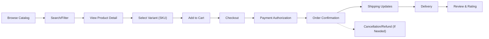
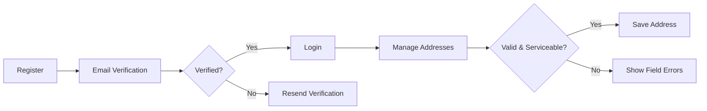
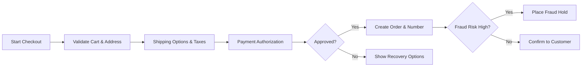
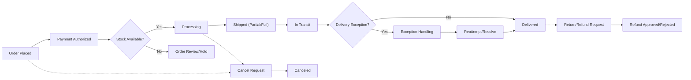
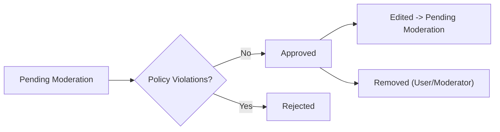
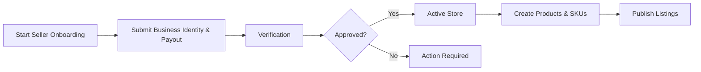

# E-commerce Shopping Mall Platform — Requirements Analysis (shoppingMall)

## 1. Executive Overview
shoppingMall is a multi-seller e-commerce marketplace providing end-to-end shopping and selling experiences. Capabilities include: user registration and login with address management; catalog and search; variant-aware product pages with per-SKU pricing and stock; shopping cart and wishlist; checkout and payment; order tracking with shipping updates; reviews and ratings; seller tools; inventory per SKU; order history with cancellation and refund handling; and an admin dashboard for governance. Requirements are expressed in business language using EARS to eliminate ambiguity.

## 2. Vision, Scope, and Objectives
- Vision: Enable trustworthy, convenient shopping with transparent post-purchase experiences and empower sellers to grow under clear policies.
- Scope (in scope): Core buyer journey (discover → select → cart → pay → track → review), seller portal features, per-SKU inventory and pricing, post-purchase flows (cancellations, returns/refunds), and administrative oversight.
- Out of scope: Database schemas, API specifications, UI layouts, payment/carrier protocol details, infrastructure choices.
- Objectives:
  - Deliver accurate SKU-level availability and pricing.
  - Maintain reliable checkout, payment, and order creation with clear confirmations.
  - Provide timely shipping updates and exception handling.
  - Safeguard review integrity and platform trust.
  - Ensure clear seller responsibilities, KPIs, and payouts.

## 3. User Roles and Permission Overview (Business)
Roles: guest, customer, seller, supportAgent, operationsManager, financeManager, contentModerator, systemAdmin.

EARS:
- THE shoppingMall platform SHALL enforce least-privilege access aligned with business responsibilities per role.
- WHEN access is requested for a resource with an owner (e.g., order line, product), THE shoppingMall platform SHALL permit access only to the owner, authorized staff, or system actors by policy.
- IF a user attempts an action beyond role permissions, THEN THE shoppingMall platform SHALL deny the action and present a clear reason.

## 4. Primary User Scenarios
- Guest discovers products, filters, and reads reviews; creates a pre-login cart.
- Customer authenticates, manages addresses, builds a cart/wishlist, completes checkout, tracks orders, requests cancellation/refund, and submits reviews.
- Seller onboards, lists products with variants, manages inventory/pricing, fulfills orders, updates shipping, and handles refunds.
- Staff (supportAgent, operationsManager, financeManager, contentModerator, systemAdmin) govern policies, resolve exceptions, approve refunds above thresholds, moderate content, and manage roles.

Mermaid — High-Level Buyer Journey

## 5. Functional Requirements by Domain (EARS)

### 5.1 Registration, Login, and Address Management
- THE shoppingMall platform SHALL allow users to register with email-based identity and to log in/out securely.
- WHEN a new user registers, THE shoppingMall platform SHALL send a verification message and mark the account unverified until completion.
- IF an unverified user attempts to place an order, THEN THE shoppingMall platform SHALL block checkout and prompt verification.
- THE shoppingMall platform SHALL allow customers to store up to 10 addresses labeled by type (e.g., Shipping, Billing) and to set one default per type.
- WHEN a customer saves an address, THE shoppingMall platform SHALL validate required fields (recipient name, phone format, street, city, region where applicable, postal code, country) and serviceability.
- IF an address fails validation or is not serviceable, THEN THE shoppingMall platform SHALL reject it with field-level guidance.
- WHEN an address is referenced by an open order, THE shoppingMall platform SHALL prevent deletion and allow edits only.

Mermaid — Authentication and Address Flow

### 5.2 Catalog, Categories, and Search
- THE shoppingMall platform SHALL maintain a hierarchical category taxonomy with at least 3 levels and prevent cyclic hierarchies.
- WHEN a user browses categories or submits a search, THE shoppingMall platform SHALL return relevant products with filters for category, brand, price, availability, rating, seller, and variant attributes (color, size).
- THE shoppingMall platform SHALL display paginated results (default 24 items/page) and deterministic ordering per query/sort.
- WHILE a product is unpublished, suspended, discontinued, or archived, THE shoppingMall platform SHALL hide it from guest/customer results and allow appropriate staff visibility.
- WHERE a product has mixed SKU availability, THE shoppingMall platform SHALL show the product if at least one SKU is purchasable, while indicating per-SKU availability.
- WHEN a user selects sorting, THE shoppingMall platform SHALL support relevance (default), newest, price (low→high/high→low), rating, and best-selling.
- IF a query yields zero results, THEN THE shoppingMall platform SHALL show alternative suggestions and explain the empty result.

### 5.3 Product Variants (SKU) and Inventory
- THE shoppingMall platform SHALL represent product variants as option combinations mapping to a single SKU with its own price and inventory.
- WHEN a user selects variant values, THE shoppingMall platform SHALL resolve to the correct SKU and display accurate price and stock status within 1 second.
- IF a selected SKU is unavailable or invalid, THEN THE shoppingMall platform SHALL prevent add-to-cart and suggest available alternatives.
- WHERE backorder or preorder is enabled, THE shoppingMall platform SHALL display expected ship/release windows and enforce quantity caps.
- THE shoppingMall platform SHALL support safety stock thresholds; Low Stock status occurs when available ≤ threshold and > 0; Out of Stock occurs when available = 0 without backorder/preorder.

### 5.4 Cart and Wishlist
- THE shoppingMall platform SHALL allow guests to hold a device-scoped cart for 30 days of inactivity and customers to maintain a persistent cart across sessions.
- WHEN adding a SKU to cart, THE shoppingMall platform SHALL validate existence, sellability, and purchase limits before acceptance.
- THE shoppingMall platform SHALL recalculate prices and promotions on each cart change and at checkout start; ineligible promotions SHALL be dropped with reasons.
- WHEN a guest logs in, THE shoppingMall platform SHALL merge the guest cart into the customer cart, aggregate identical SKUs, cap by limits, and recalculate.
- THE shoppingMall platform SHALL allow authenticated customers to maintain a wishlist (up to 100 items) and to subscribe to optional back-in-stock or price-drop notifications.
- IF a cart line references a discontinued or unpublished SKU, THEN THE shoppingMall platform SHALL flag it and block checkout until resolved.

### 5.5 Checkout, Payment, and Order Creation
- THE shoppingMall platform SHALL require authenticated customers to submit orders unless guest checkout is explicitly enabled by policy.
- WHEN checkout starts, THE shoppingMall platform SHALL re-validate stock, price, promotions, and address deliverability.
- THE shoppingMall platform SHALL compute shipping options per seller and present costs and ETA windows before authorization.
- WHEN the buyer submits payment, THE shoppingMall platform SHALL attempt to authorize the full amount; upon success, THE shoppingMall platform SHALL create an order with a unique order number formatted as "ORD-YYYYMMDD-NNNNNN".
- IF authorization fails or times out, THEN THE shoppingMall platform SHALL not create an order and SHALL present recovery options (retry, alternate method).
- WHERE fraud risk exceeds threshold, THE shoppingMall platform SHALL place the order on hold pending review and prevent capture until cleared.
- WHEN authorization succeeds, THE shoppingMall platform SHALL reserve inventory for ordered SKUs and convert reservations to allocations upon confirmation.

Mermaid — Checkout to Order

### 5.6 Order Tracking and Shipping Status Updates
- THE shoppingMall platform SHALL expose order-level states: Pending Confirmation, Confirmed, Partially Shipped, Shipped, Partially Delivered, Delivered, Completed, Canceled, Refunded, On Hold, Under Review.
- THE shoppingMall platform SHALL expose shipment-level states: Ready to Ship, In Transit, Out for Delivery, Delivery Attempted, Delivered, Exception, Return to Sender, Returned.
- WHEN a seller updates shipment with carrier and tracking, THE shoppingMall platform SHALL update the shipment state and notify the customer within minutes.
- IF an exception occurs (delay, lost, damage, customs), THEN THE shoppingMall platform SHALL surface the exception reason and provide next steps.
- WHEN all shipments are delivered, THE shoppingMall platform SHALL set order state to Delivered within 5 minutes and start post-delivery timers.

### 5.7 Reviews and Ratings
- WHERE a customer has a delivered order for a SKU, THE shoppingMall platform SHALL allow review submission within an eligibility window (e.g., up to 180 days post-delivery).
- THE shoppingMall platform SHALL verify reviews as Verified Purchase when tied to eligible order lines, and queue reviews for moderation prior to publication.
- THE shoppingMall platform SHALL aggregate ratings at SKU and product levels with only Approved reviews; transitions to Removed/Rejected SHALL update aggregates within 60 seconds.
- IF a review violates policy, THEN THE shoppingMall platform SHALL withhold or remove it and notify the author with a reason category.
- WHERE seller replies are permitted, THE shoppingMall platform SHALL allow one public reply per review for the owning seller.

### 5.8 Seller Accounts and Store Operations
- THE shoppingMall platform SHALL allow seller onboarding with business identity and payout details, subject to verification before publishing products.
- WHEN a product is created, THE shoppingMall platform SHALL validate required fields (title, category, images, description) and at least one SKU with price/inventory.
- THE shoppingMall platform SHALL allow sellers to manage inventory and pricing per SKU, create shipments with carrier/tracking, and acknowledge orders within SLA.
- IF policy violations or SLA breaches occur, THEN THE shoppingMall platform SHALL enable operationsManager to warn, suspend, or terminate seller access per policy.

### 5.9 Inventory Management per SKU
- THE shoppingMall platform SHALL maintain stock counts per SKU, compute Low Stock thresholds, and prevent sales when Out of Stock unless backorder/preorder is enabled.
- WHEN checkout enters the payment step, THE shoppingMall platform SHALL create time-bounded reservations (default 15 minutes) and reduce available-to-sell counts accordingly.
- IF reservation expires or payment fails, THEN THE shoppingMall platform SHALL release reserved quantities immediately.

### 5.10 Order History, Cancellations, and Refunds
- THE shoppingMall platform SHALL present order history with line itemization, payments, and shipment timelines to customers.
- WHEN a customer requests cancellation before shipment, THE shoppingMall platform SHALL allow auto-approval within policy windows.
- WHEN a customer requests refund/return, THE shoppingMall platform SHALL collect reason and evidence as needed and route to seller/finance for decisions per thresholds.
- IF a refund is approved, THEN THE shoppingMall platform SHALL initiate the refund and update financial and order states accordingly.

### 5.11 Admin Dashboard and Governance
- THE shoppingMall platform SHALL allow staff roles to manage categories, review product status, oversee orders and refunds, moderate content, configure policies, and audit actions.
- WHEN sensitive actions are taken (policy changes, role assignments, payouts, refunds), THE shoppingMall platform SHALL require justification and record audit events with before/after business states.

## 6. Authentication and Session Management (Business Rules)
- THE shoppingMall platform SHALL support sessions for guests and authenticated users with clear expiration; high-risk actions (checkout, payout) SHALL require fresh authentication or step-up verification.
- WHEN a user changes password or critical credentials, THE shoppingMall platform SHALL revoke active sessions and require re-login.
- WHEN permission or role changes occur, THE shoppingMall platform SHALL invalidate refresh sessions and require re-authentication.
- IF suspicious activity is detected (velocity anomalies, geo-risk), THEN THE shoppingMall platform SHALL enforce step-up verification before proceeding.

## 7. Role-Based Access Control (Business Matrix)

| Capability | guest | customer | seller | supportAgent | operationsManager | financeManager | contentModerator | systemAdmin |
|-----------|------|----------|--------|--------------|-------------------|----------------|------------------|-------------|
| Browse catalog/search | ✅ | ✅ | ✅ | ✅ | ✅ | ✅ | ✅ | ✅ |
| Create/maintain cart | ✅ (session) | ✅ | ✅ (as buyer) | ❌ | ❌ | ❌ | ❌ | ✅ |
| Maintain wishlist | ❌ | ✅ | ✅ | ❌ | ❌ | ❌ | ❌ | ✅ |
| Checkout/place order | ❌ | ✅ | ✅ (as buyer) | ❌ | ❌ | ❌ | ❌ | ✅ |
| View own order history | ❌ | ✅ | ✅ | 🔒 case-bound | 🔒 read-only | ❌ | ❌ | ✅ |
| Manage products/SKUs | ❌ | ❌ | ✅ (own) | ❌ | 🔒 oversight | ❌ | ❌ | ✅ |
| Update shipping | ❌ | ❌ | ✅ (own) | ❌ | 🔒 oversight | ❌ | ❌ | ✅ |
| Moderate reviews | ❌ | ❌ | ❌ | 🔒 assist | 🔒 policy | ❌ | ✅ | ✅ |
| Approve refunds > threshold | ❌ | ❌ | ❌ | ❌ | 🔒 | ✅ | ❌ | ✅ |
| Configure policies/roles | ❌ | ❌ | ❌ | ❌ | ✅ | 🔒 finance roles | ❌ | ✅ |

Notes: 🔒 indicates constraints (ownership checks, thresholds, approvals).

EARS:
- WHEN ownership applies, THE shoppingMall platform SHALL verify the requester’s identity matches the resource owner before permitting mutations.
- IF no policy grants access, THEN THE shoppingMall platform SHALL deny by default.

## 8. Non-Functional Requirements (Business)
- Performance (p95 under normal load):
  - Category/search responses ≤ 1.5 s; product detail ≤ 1.0 s; variant selection ≤ 1.0 s.
  - Add/update cart ≤ 1.0 s; checkout confirmation (auth to order) ≤ 10 s.
  - Order status view ≤ 2.0 s; seller order dashboard ≤ 2.0 s; admin lists ≤ 2.0 s.
- Availability (monthly): core flows ≥ 99.90%; checkout/payment ≥ 99.95%.
- Scalability: handle 5× seasonal browse/search and 3× checkout with ≤ +20% latency degradation.
- Security: enforce least-privilege; notify on sensitive account changes; protect payment data by delegating to compliant providers; mask PII for staff by default.
- Localization: support en-US initially; present times in user locale; business operations align with Asia/Seoul timezone where policy specifies.
- Observability: define SLIs/SLOs; alert on early budget burn; publish incident status updates within 30 minutes when user-visible.

## 9. Error Handling and Edge Cases (Cross-Cutting)
- WHEN a query or input is invalid, THE shoppingMall platform SHALL respond with precise, actionable errors within 2 seconds.
- WHEN price or promotion changes during checkout, THE shoppingMall platform SHALL present updated totals and require explicit acceptance.
- WHEN shipping options become unavailable, THE shoppingMall platform SHALL force reselection and explain constraints.
- WHEN payment authorization fails, THE shoppingMall platform SHALL allow safe retry and alternate method selection without duplicating orders.
- WHEN tracking events regress out-of-order, THE shoppingMall platform SHALL ignore regression and maintain the most advanced state, recording the late event.

## 10. KPIs and Success Metrics
- Conversion lift from SKU-accurate availability and reliable checkout.
- Authorization approval rate by payment method and region.
- Cart abandonment reduction via persistent cart and fast recalculations.
- On-time shipment and delivery rates with breach notifications.
- Refund cycle time (median ≤ 7 business days) and dispute resolution within policy SLAs.
- Review integrity: ≥ 98% verified-purchase reviews; moderation SLA ≤ 2 business days.
- Seller performance: fulfillment SLA adherence ≥ 97%; inventory accuracy ≥ 99%.

EARS:
- THE shoppingMall platform SHALL expose events/metrics enabling computation of the above KPIs and dashboards for authorized roles.

## 11. Acceptance Criteria
- A verified customer completes checkout, receives an order number, and views status updates through delivery.
- A multi-seller order splits into separate shipments with correct partial captures and aggregated order status.
- A seller onboards, publishes products with SKUs, updates inventory and pricing, acknowledges and fulfills orders within SLA, and processes a refund.
- A review is submitted by an eligible customer, passes moderation, and aggregates correctly at SKU and product levels.
- Admin staff enforce a policy change with versioning and observe that audit logs capture before/after states.

## 12. Mermaid Diagrams (Additional Flows)

Order and Shipping States (Business View)

Review and Moderation State Machine

Seller Onboarding and Listing

## 13. Glossary
- SKU (Stock Keeping Unit): Unique identifier for a specific sellable variant (e.g., color/size) with its own price and stock.
- Variant: A combination of option values under a product that resolves to a SKU.
- Reservation: Temporary hold of inventory during checkout to prevent oversell.
- Allocation: Deduction from inventory for confirmed orders.
- Order: A confirmed purchase with an immutable order number; may include items from multiple sellers.
- Shipment: A package grouping order items moving through a carrier with tracking updates.
- Verified Purchase: A review tied to an eligible delivered order line.
- Low Stock: Available quantity at or below threshold but above zero.
- Out of Stock: No available quantity and no backorder/preorder enabled.

End of requirements analysis.