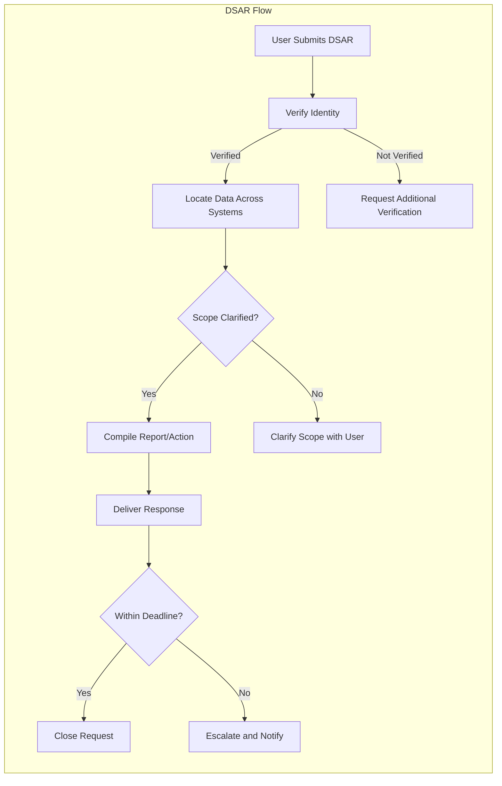
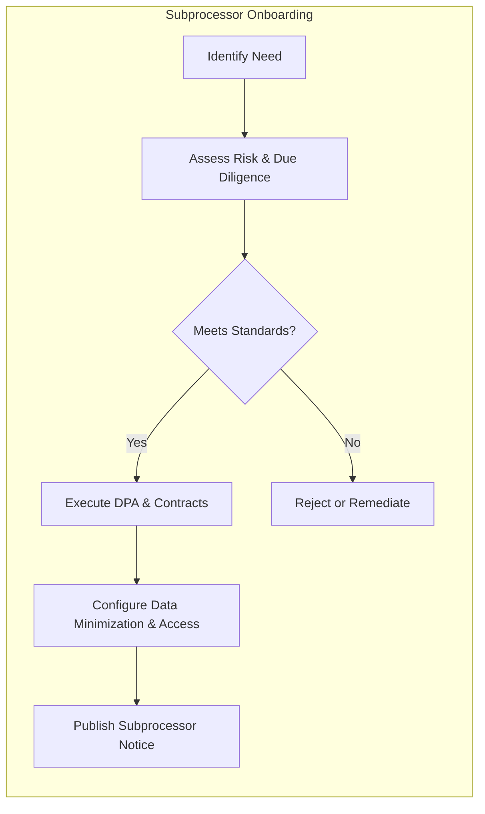
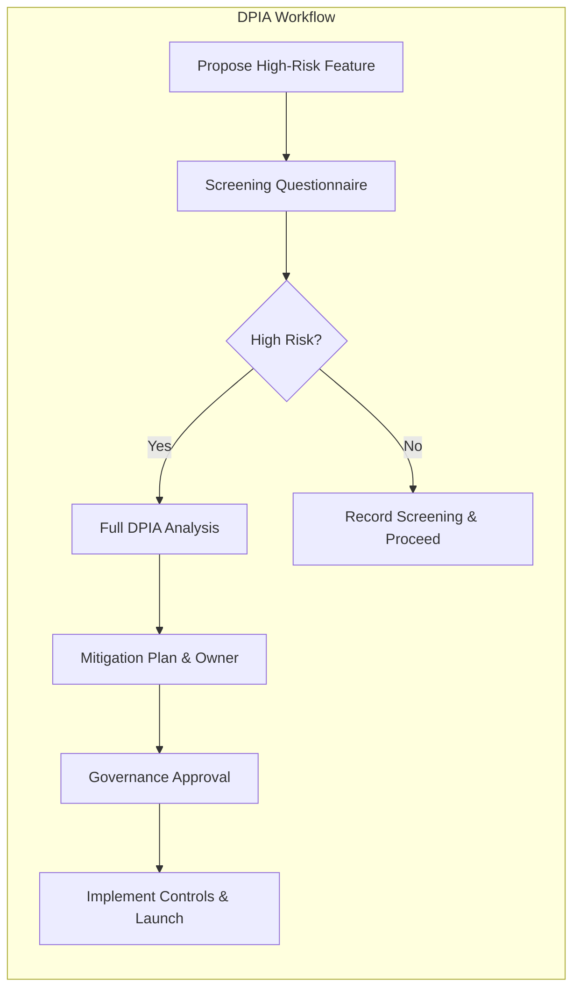
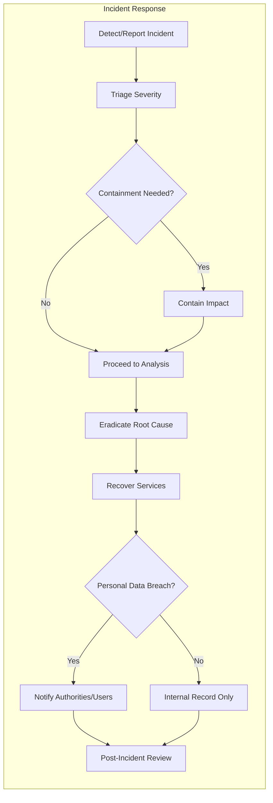

# shoppingMall Security, Privacy, and Compliance Requirements

## 1. Scope and Applicability
- THE platform SHALL protect customer, seller, and administrative data across registration, authentication, catalog browsing, cart and checkout, orders and shipping, reviews, returns, payouts, and communications.
- THE requirements herein SHALL apply to all environments and services processing personal data for shoppingMall and SHALL bind internal staff, contractors, and subprocessors.
- WHERE local law imposes stricter obligations than global policy, THE platform SHALL apply the stricter rule.

## 2. Governance, Roles, and Accountability
### 2.1 Ownership and RACI (Business-Level)
- THE platform SHALL assign a Privacy Owner accountable for data protection policies and a Security Owner accountable for information security.
- THE platform SHALL define a governance group including Legal/Privacy, Security, Engineering, Product, and Operations to review high-risk changes.
- WHEN a policy affecting personal data is changed, THE platform SHALL record approver identity, rationale, effective date, and impacted systems.

### 2.2 Separation of Duties
- THE platform admin capabilities SHALL enforce least privilege and separation of duties for sensitive changes (refund approvals, payout holds, category mass changes) as defined in Admin Operations and Governance.
- IF a single role attempts to both initiate and approve a sensitive change above threshold, THEN THE platform SHALL block the action and require dual control.

## 3. Personal Data Principles
### 3.1 Data Classification and Access (Business View)
| Data Category | Examples | Sensitivity | Legitimate Access (Business Roles) |
|---|---|---|---|
| Identity | Name, email, phone | Medium | User (self), Admin (support), Seller (for their orders only) |
| Address | Ship/bill address | Medium | User (self), Seller (their orders), Admin (support/compliance) |
| Payment Metadata | Status, last4, brand, txn refs | High | User (self), Seller (status only), Admin (finance/compliance) |
| Order Data | Items, totals, shipping | Medium | User (self), Seller (their orders), Admin |
| Device/Usage | IP, UA, session IDs | Medium | Admin (ops/security) |
| Reviews | Rating, text, media | Low/Medium | Public (published), Admin (moderation), Seller (respond) |
| Seller KYB/SPI | Registration docs, tax IDs | High | Admin (verification/compliance), Seller (own docs) |

- THE platform SHALL document data categories and sensitivity and SHALL restrict access according to the “Legitimate Access” column.

### 3.2 Lawful Bases and Purpose Limitation
- THE platform SHALL process personal data under lawful bases including contract (order processing), consent (marketing), legal obligation (tax/accounting), and legitimate interests (fraud prevention) where permitted.
- IF processing purpose changes to an incompatible purpose, THEN THE platform SHALL obtain fresh consent or identify a new lawful basis before processing.

### 3.3 Data Minimization and Collection Rules
- THE platform SHALL collect the minimum personal data necessary to provide services; optional fields SHALL be clearly marked and non-blocking for unrelated functions.
- IF optional data is declined, THEN THE platform SHALL not deny core services that do not depend on it.

### 3.4 Consent and Preference Management
- THE platform SHALL obtain explicit opt-in before sending marketing communications and SHALL maintain granular preferences for categories (general offers, seller promotions, back-in-stock, price-drop).
- WHEN consent is withdrawn, THE platform SHALL cease processing for that purpose within 72 hours and reflect updated preferences across downstream processing.
- WHERE cookies or similar technologies are not strictly necessary, THE platform SHALL obtain consent before activation and respect quiet hours and frequency caps for marketing messages.

## 4. Privacy by Design and Default
- THE platform SHALL embed privacy by design in product lifecycle checkpoints: discovery, design, implementation, testing, launch, and post-launch review.
- WHEN a feature introduces new data collection, THE platform SHALL document data categories, purposes, retention, sharing, and security controls before development start.
- WHERE the least-privilege configuration is available, THE platform SHALL default to the least-privilege setting (privacy by default).
- IF an alternative design can achieve the same business outcome with less data, THEN THE platform SHALL adopt the less data-intensive design.

## 5. Records of Processing Activities (RoPA)
- THE platform SHALL maintain a record of processing activities describing purposes, data categories, recipients (including subprocessors), retention periods, and transfer mechanisms.
- WHEN a processing activity is added or changed, THE platform SHALL update RoPA within 30 days and link to relevant policies and DPAs.

## 6. Data Subject Rights (DSAR)
### 6.1 Rights and Timelines
- THE platform SHALL allow users to exercise rights of access, rectification, deletion, restriction, portability, and objection as applicable by jurisdiction.
- WHEN a DSAR is received, THE platform SHALL acknowledge within 72 hours and complete valid access/portability/rectification/deletion requests within 30 calendar days, with one permissible 30-day extension where allowed and communicated.
- IF identity verification fails, THEN THE platform SHALL pause processing and request additional verification.

### 6.2 DSAR Handling Flow

## 7. Access Control and Least Privilege (Business-Level)
- THE platform SHALL enforce actor-based access per User Actors and Permissions, restricting customers to their own data, sellers to their own stores’ orders, and admins to business-justified scopes.
- WHERE high-risk operations occur (refunds, payout changes, order overrides, policy enforcement), THE platform SHALL require elevated authorization with recorded justification.
- WHEN suspicious activity is detected (e.g., unusual device, geovelocity), THE platform SHALL require step-up verification before sensitive operations.
- IF an account is under investigation or suspended, THEN THE platform SHALL restrict risky operations and record all attempted access.

## 8. Data Retention and Deletion
### 8.1 Schedules (Business-Level)
- THE platform SHALL retain orders, invoices, and tax-relevant data for 5–7 years per jurisdictional requirements.
- THE platform SHALL retain customer profiles while active and for up to 24 months after last activity unless deletion is requested and no legal hold applies.
- THE platform SHALL retain audit logs for at least 12 months or longer where legally required.
- THE platform SHALL purge or anonymize carts for authenticated users after 30 days of inactivity and earlier for guests.

### 8.2 Legal Holds and Exceptions
- IF a legal hold, dispute, or fraud investigation is active, THEN THE platform SHALL suspend deletion of relevant records until the hold is lifted and document the scope and duration.

### 8.3 Deletion and Anonymization
- WHEN an account is closed or deletion requested, THE platform SHALL delete or irreversibly anonymize personal data within 30 calendar days, preserving only the minimal data necessary for legal obligations.
- WHERE deletion would break financial record integrity, THE platform SHALL retain required non-identifying references and remove direct identifiers.

### 8.4 Retention Matrix (Illustrative)
| Data Type | Default Retention | Notes |
|---|---|---|
| Orders/Invoices | 5–7 years | Per tax/accounting laws |
| Customer Profile | Active + 24 months | Delete/anonymize earlier on request |
| Addresses | Active + 24 months | Delete on account deletion |
| Carts (Auth) | 30 days inactivity | Shorter for guests |
| Reviews | While listing active | Remove if policy violation or upon lawful request |
| Audit Logs | ≥ 12 months | Longer if required |

## 9. Cross-Border Transfers and Localization
- WHERE personal data is transferred across borders, THE platform SHALL use valid transfer mechanisms (e.g., SCCs or other recognized instruments) and SHALL conduct a Data Transfer Impact Assessment (DTIA) for high-risk transfers.
- WHERE law requires data localization, THE platform SHALL store and process the required data within the mandated geography.
- WHEN transfer impact cannot be mitigated to an acceptable level, THE platform SHALL suspend the transfer or apply supplementary safeguards.

## 10. Subprocessors and Vendor Management
### 10.1 Onboarding and Contracts
- THE platform SHALL require a Data Processing Agreement (DPA) with all subprocessors handling personal data, including security, confidentiality, breach notification, and deletion/return of data on termination.
- WHEN a new subprocessor is proposed, THE platform SHALL complete due diligence (security, privacy, compliance checks) before onboarding.

### 10.2 Subprocessor Onboarding Flow

### 10.3 Oversight and Changes
- THE platform SHALL maintain an up-to-date public list of subprocessors and SHALL provide advance notice before material changes where required.
- WHEN a subprocessor fails to meet obligations, THE platform SHALL suspend processing or terminate the relationship and initiate data return/deletion.

## 11. Cookies and Tracking Technologies
- THE platform SHALL categorize cookies and similar technologies as strictly necessary, performance, functionality, and marketing.
- WHEN a user provides consent via a consent management platform (CMP), THE platform SHALL honor the selected categories and SHALL not activate non-essential categories before consent.
- IF a user withdraws consent or opts out of a category, THEN THE platform SHALL cease further use of that category within 72 hours and update preferences across sessions where possible.

## 12. Children’s Data and Age Gating
- WHERE age restrictions apply, THE platform SHALL block account creation by users under the minimum legal age and SHALL require parental/guardian consent where legally mandated.
- IF underage usage is detected post-registration, THEN THE platform SHALL suspend the account and remove or anonymize data as legally required.

## 13. Security Controls (Business-Level Outcomes)
### 13.1 Encryption and Key Management (Conceptual)
- THE platform SHALL protect personal data in transit and at rest using industry-standard cryptographic controls appropriate to data sensitivity.
- THE platform SHALL segregate key management duties from data processing duties to support least privilege and SHALL restrict key access to authorized roles with audit.

### 13.2 Logging and Monitoring
- THE platform SHALL log security-relevant events (authentication attempts, account changes, address edits, permission changes, order and refund state changes, payout state changes) for at least 12 months and SHALL minimize PII in logs.
- WHEN administrators access sensitive information (e.g., seller SPI), THE platform SHALL record purpose and scope of access.

### 13.3 Vulnerability and Change Management
- THE platform SHALL perform regular vulnerability assessments and SHALL triage and remediate high-severity findings within policy-defined timelines.
- WHEN changes affect security posture or personal data processing, THE platform SHALL require review and approval before deployment.

## 14. DPIA/PIA (Data Protection Impact Assessment)
- WHEN a change introduces high risk to individuals (e.g., new profiling, large-scale monitoring, new categories of sensitive data), THE platform SHALL perform a DPIA prior to launch.
- THE DPIA SHALL document processing purposes, data categories, risks to individuals, mitigations, and residual risk decisions by the governance group.

### 14.1 DPIA Workflow

## 15. Incident Response and Breach Notification
- WHEN a security incident is detected, THE platform SHALL triage severity, contain, eradicate, recover, and document actions (see diagram below).
- IF a personal data breach likely to result in risk to individuals is confirmed, THEN THE platform SHALL notify regulators within 72 hours of awareness where required and affected users without undue delay when risk is high.
- THE platform SHALL preserve relevant evidence and logs for investigation and SHALL conduct a post-incident review within 10 business days of closure for major incidents.

### 15.1 Incident Response Flow

## 16. Abuse Prevention and Rate Limiting
- WHEN repeated failed login attempts exceed thresholds, THE platform SHALL slow or block attempts and present safe recovery paths.
- WHEN abnormal surges in registrations or search/cart mutations are detected from the same source, THE platform SHALL apply rate limits or challenges while preserving P0 user flows.
- WHERE review manipulation or spam is detected, THE platform SHALL throttle submissions, queue for moderation, and restrict visibility pending review.

## 17. Auditing and Reporting
- THE platform SHALL maintain immutable audit logs for sensitive actions with actor, timestamp, target entity, reason code, and outcome and SHALL support export for authorized roles with scope summaries and timestamps.
- WHEN audit exports exceed scope/time limits, THE platform SHALL block export and request a narrower scope.

## 18. Performance and SLA Expectations (Security/Privacy Tasks)
- WHEN users submit login credentials, THE platform SHALL respond within 2 seconds at P95 under normal load.
- WHEN users request password resets or verification links, THE platform SHALL dispatch within 60 seconds at P95.
- WHEN users withdraw consent for optional processing, THE platform SHALL reflect the change within 72 hours across downstream processes.
- WHEN DSARs are acknowledged, THE platform SHALL do so within 72 hours and SHALL complete within 30 days as noted in Section 6.
- WHEN breach notifications are required, THE platform SHALL initiate regulator notifications within 72 hours of awareness and user notifications without undue delay for high-risk cases.

## 19. Metrics and KPIs
- DSAR On-Time Completion Rate: ≥ 95% within the legal deadline.
- Consent Update Propagation: ≥ 99% reflected across systems within 72 hours.
- Incident Mean Time to Acknowledge (MTTA): ≤ 5 minutes for Sev‑1, ≤ 10 minutes for Sev‑2.
- Incident Mean Time to Resolve (MTTR): ≤ 60 minutes for Sev‑1, ≤ 4 hours for Sev‑2.
- Audit Log Retention Compliance: 100% adherence to ≥ 12 months.
- Subprocessor Due Diligence Completion: 100% prior to data processing start.

## 20. Dependencies and References
- Refer to User Actors and Permissions for role scoping and session expectations.
- Refer to Checkout and Payment Requirements for payment metadata handling and timelines.
- Refer to Order and Shipping Management for shipping status and notifications.
- Refer to Notifications, Communications, and Reporting for communication triggers and timelines.
- Refer to Performance and SLA for cross-cutting timing and availability targets.
- Refer to Admin Operations and Governance for dual control, moderation, and dispute processes.

## 21. Error Handling and User-Facing Messaging (Business-Level)
- IF access is denied due to insufficient privileges, THEN THE platform SHALL show a clear business reason without exposing sensitive details.
- IF a DSAR cannot be completed due to identity verification failure, THEN THE platform SHALL communicate required steps and pause processing until verification succeeds.
- IF rate limiting is triggered, THEN THE platform SHALL present a concise message indicating too many requests and recommend a retry window.

## 22. Appendices
### 22.1 DPIA Triggers (Illustrative)
- Large-scale profiling or behavioral monitoring
- Processing special categories of data or children’s data
- Systematic monitoring of publicly accessible areas at scale
- New matching or combining of datasets that increases risk

### 22.2 Consent Categories (Illustrative)
- General offers and newsletters
- Seller-specific promotions for followed stores
- Back-in-stock alerts for watchlisted items
- Price-drop alerts for watched products

### 22.3 Glossary
- DPIA: Data Protection Impact Assessment
- DTIA: Data Transfer Impact Assessment
- DPA: Data Processing Agreement
- RoPA: Record of Processing Activities
- SCCs: Standard Contractual Clauses

End of requirements.