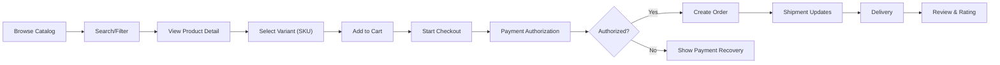
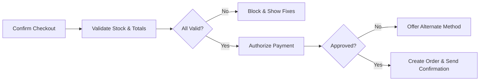
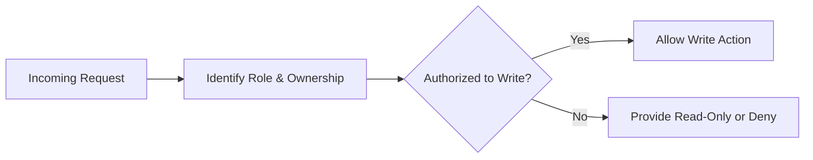

# shoppingMall – Requirements Analysis Report (Business Requirements)

## Executive Summary
shoppingMall operates a two-sided e-commerce marketplace connecting customers and third-party sellers through unified discovery, checkout, and post‑purchase experiences. Capabilities include registration and login with address management; product catalog with categories and search; variant-true SKU browsing; cart and wishlist; checkout and payment; order history; order tracking and shipping updates; reviews and ratings; seller portal; per‑SKU inventory; cancellation and refund handling; and an admin dashboard for governance. Requirements are expressed in EARS style to ensure testability and unambiguous outcomes. Timings reference Asia/Seoul for operating cutoffs while customer‑facing times display in each user’s local timezone.

## Scope, Principles, and Service Context
- Marketplace model: multi-seller catalog, platform-managed checkout and post‑purchase.
- Business-only specification: behaviors, policies, roles, states, SLAs, KPIs; no APIs, schemas, or vendor details.
- Outcomes over implementation: measurable p95 latencies, windows, limits, SLAs, and decision rules.
- Time and localization: operational dates/times in Asia/Seoul (KST); customer UI reflects user timezone and locale.

EARS principles
- THE platform SHALL define measurable behaviors and visible states for all user journeys.
- WHEN ambiguity arises in system behavior, THE platform SHALL prefer user‑safe defaults and provide clear guidance to complete tasks.

## User Roles and Access Control
Roles: guest, customer, seller, supportAgent, operationsManager, financeManager, contentModerator, systemAdmin.

High-level role capabilities (business perspective)
- guest: browse catalog, view products and reviews, create a device‑scoped cart; cannot place orders.
- customer: manage profile and addresses; maintain persistent cart/wishlist; place and pay for orders; track shipments; submit reviews; request cancellation/refund.
- seller: manage own store profile, products/SKUs, inventory, pricing/promotions; process orders and shipping; respond to cancellations/refunds.
- supportAgent: assist with orders, cancellations/refunds, disputes; view and annotate customer/seller cases.
- operationsManager: oversee catalog integrity, categories, policies, feature flags, operational KPIs.
- financeManager: approve high‑value refunds, oversee payouts, reconciliation, financial reporting.
- contentModerator: moderate reviews and seller content per policy.
- systemAdmin: platform configuration, roles/permissions, integrations, audit access.

EARS (access control)
- THE platform SHALL enforce least‑privilege access by role for every capability listed in this report.
- WHEN a user attempts an action beyond their role, THE platform SHALL deny the action and show a role‑appropriate explanation.
- WHERE ownership applies, THE platform SHALL restrict seller access to their own products, SKUs, and order lines only.

## Authentication, Identity, and Address Management
Identity
- THE platform SHALL support email‑based registration, login, logout, email verification, password reset, and session revocation.
- WHEN a new user registers, THE platform SHALL create an unverified account and send a time‑limited verification.
- IF an unverified account attempts checkout, THEN THE platform SHALL block the action and prompt verification.
- WHEN a password is changed, THE platform SHALL revoke active sessions and require re‑authentication.

Sessions
- THE platform SHALL maintain access sessions with reasonable inactivity limits appropriate to risk (e.g., 20–30 minutes for high‑risk steps such as payment).
- WHERE suspicious activity is detected, THE platform SHALL require step‑up verification before allowing risky operations (payment, payout, role change).

Addresses
- THE platform SHALL allow each customer to store up to 10 addresses labeled by type (Shipping, Billing) with one default per type.
- WHEN a customer adds or edits an address, THE platform SHALL validate mandatory fields (name, phone, street, city, region, postal code where applicable, country) and deliverability before acceptance.
- IF an address is incomplete or fails validation, THEN THE platform SHALL block its use for checkout and display field‑level reasons.
- WHEN a customer deletes an address used by an open order, THE platform SHALL prevent deletion and allow editing only.

## Business Concepts and Entities (Conceptual)
- Product: sellable concept; may have variants.
- SKU (variant): specific sellable combination of options (e.g., color, size) with its own price and inventory.
- Category: taxonomy node for discovery and policy flags (e.g., age‑restricted).
- Inventory: per‑SKU available‑to‑sell, reservations, allocations, thresholds.
- Cart/Wishlist: pre‑purchase collections; wishlist does not reserve stock.
- Order/OrderItem: confirmed purchase snapshot with prices, taxes, discounts, shipping, addresses, and payment state.
- Shipment: movement unit with carrier/tracking and delivery events.
- Review: customer feedback for purchased products, moderated per policy.

## Functional Requirements by Capability

### 1) Catalog and Search
Navigation and visibility
- THE platform SHALL maintain a hierarchical category taxonomy with unique sibling names and no cycles.
- WHEN a category is hidden or archived, THE platform SHALL exclude it from guest/customer discovery while keeping admin/staff visibility per role.

Search and filters
- THE platform SHALL accept free‑text queries up to 200 characters, normalize whitespace/case, and support filters for category, brand, price, availability, rating, seller, and variant attributes (e.g., color, size).
- WHEN a user searches within a category context, THE platform SHALL scope results to that category and its descendants unless the user opts out.
- IF a search yields zero results, THEN THE platform SHALL provide alternative queries and relaxed filter suggestions.

Relevance, sorting, pagination
- THE platform SHALL provide sorts for relevance (default), newest, price asc/desc, rating desc, and best‑selling.
- WHERE ties occur, THE platform SHALL use deterministic tie‑breakers to ensure stable pagination.

Performance (UX targets)
- WHEN loading a category or search page, THE platform SHALL respond within 1.5 seconds at p95 under normal load.

EARS (catalog/search)
- WHEN a product is unpublished or suspended, THE platform SHALL hide it from guest/customer results while retaining staff visibility per role.
- WHERE any SKU of a product is in stock, THE platform SHALL allow the product to appear in listings and communicate variant availability at the SKU level.

### 2) Product Variants and SKU‑level Inventory
Variant modeling
- THE platform SHALL allow per‑product option types and values; valid combinations SHALL generate distinct SKUs.
- IF a selected combination does not exist, THEN THE platform SHALL show unavailability and prevent add‑to‑cart.

Inventory states
- THE platform SHALL support In Stock, Low Stock, Out of Stock, Backorder, Preorder, and Discontinued as business states.
- WHEN a SKU is Out of Stock without backorder/preorder, THE platform SHALL prevent add‑to‑cart and display the reason.

Reservation and allocation
- THE platform SHALL avoid reserving stock on add‑to‑cart under standard policy.
- WHEN payment authorization succeeds, THE platform SHALL convert any active reservation to allocation and deduct from available inventory.

Performance
- WHEN a user changes variant selections, THE platform SHALL resolve SKU price and availability within 1 second at p95.

EARS (variants/inventory)
- WHEN stock falls below the safety threshold, THE platform SHALL mark the SKU as Low Stock and notify the seller via dashboard indicators.
- IF a manual inventory adjustment would result in negative on‑hand, THEN THE platform SHALL block the change with a reason.

### 3) Cart and Wishlist
Cart behavior
- THE platform SHALL maintain one active cart per customer; guests may hold a device‑scoped cart.
- WHEN a guest logs in, THE platform SHALL merge the device cart into the account cart, summing identical SKUs subject to purchase limits and stock checks.

Line operations and limits
- THE platform SHALL enforce per‑SKU quantity limits (default max 10 per order) and a maximum of 100 line items per cart.
- WHEN quantity exceeds stock or limits, THE platform SHALL cap to the allowable quantity and annotate the line.

Recalculation
- WHEN cart contents change or context changes (promotions, currency), THE platform SHALL recalculate prices and totals within 1 second at p95 for typical carts (≤50 lines).

Wishlist
- THE platform SHALL allow authenticated customers to maintain wishlists (default up to 10 lists, 500 items each) without reserving stock or locking price.
- WHEN a wishlist item returns to stock or drops in price and the user has opted in, THE platform SHALL notify no more than once per 24 hours per item.

EARS (cart/wishlist)
- THE platform SHALL not reserve stock at add‑to‑cart; reservations occur at checkout/payment initiation per policy.
- IF a SKU is discontinued after being in cart, THEN THE platform SHALL block checkout for that line and provide guidance.

### 4) Checkout, Payment, and Order Creation
Preconditions
- THE platform SHALL require an authenticated customer with at least one validated shipping address for shippable items.
- WHEN checkout begins, THE platform SHALL re‑validate stock, prices, promotions, and purchase limits for all cart lines.

Shipping, taxes, totals
- WHEN a valid address is present, THE platform SHALL present available shipping options with costs and delivery windows.
- WHEN computing totals, THE platform SHALL calculate taxes per destination and product tax class and disclose duties for cross‑border cases per business policy.

Payment and authorization
- WHEN the buyer submits payment, THE platform SHALL attempt authorization for the order total and either proceed to order creation on approval or provide clear recovery on decline.
- WHERE COD is allowed by policy and destination, THE platform SHALL create the order without authorization and mark method as COD.

Order creation and numbering
- WHEN authorization (or COD acceptance) succeeds, THE platform SHALL create an order with an immutable order number in the format "ORD-YYYYMMDD-NNNNNN".

Fraud review
- WHERE risk exceeds threshold, THE platform SHALL place the order in "On Hold – Fraud Review" and prevent capture until cleared.

Performance
- WHEN submitting payment and creating an order, THE platform SHALL return confirmation within 10 seconds at p95 for successful authorizations.

EARS (checkout)
- IF authorization fails, THEN THE platform SHALL not create the order and SHALL allow alternate payment selection.
- WHEN an order is created, THE platform SHALL send an order confirmation notification immediately.

### 5) Order Management, History, and Self‑Service
Order list and detail
- THE platform SHALL show customers their order history with itemization, payment state, shipping status, and downloadable confirmations.

Cancellations and refunds
- WHEN a customer requests cancellation before shipment, THE platform SHALL auto‑approve if the order has not been handed to a carrier per policy.
- WHEN a customer requests a refund within the return window, THE platform SHALL collect reason and evidence if required and start the approval workflow.

Timing
- THE platform SHALL target median refund cycle time ≤ 7 business days from request to resolution.

EARS (post‑purchase)
- WHEN cancellation is accepted, THE platform SHALL release any reservations or void authorizations and notify the customer.
- WHEN refund is approved, THE platform SHALL initiate refund and update financial status accordingly.

### 6) Shipping, Tracking, and Delivery Exceptions
Statuses
- THE platform SHALL present shipment statuses: Ready to Ship, In Transit, Out for Delivery, Delivery Attempted, Delivered, Exception, Return to Sender, Returned.

Notifications
- WHEN shipment transitions to In Transit, THE platform SHALL notify the customer within 5 minutes including carrier and tracking link.
- WHEN Delivered, THE platform SHALL notify within 10 minutes and start the return‑window timer.

Exceptions
- IF a delivery exception occurs (loss, damage, address issue), THEN THE platform SHALL reflect it and present next steps (reship, refund, reattempt).

EARS (shipping)
- WHEN any shipment is delivered and others are pending, THE platform SHALL label the order "Partially Delivered" and show counts delivered vs. total.
- WHEN all shipments are delivered, THE platform SHALL mark the order "Delivered" within 5 minutes.

### 7) Reviews and Ratings
Eligibility and timing
- WHERE a customer has a delivered order line, THE platform SHALL permit one review per SKU per order within 180 days.
- THE platform SHALL mark eligible reviews as Verified Purchase.

Moderation and display
- WHEN a review is submitted, THE platform SHALL set state to Pending and publish after approval; Rejected reviews SHALL remain hidden with reason notified to the author.
- THE platform SHALL compute SKU‑level and product‑level rating aggregates and update them within 60 seconds of state changes.

Abuse controls
- WHERE excessive submissions are detected (e.g., >5 reviews in 10 minutes), THE platform SHALL rate‑limit for 30 minutes.

EARS (reviews)
- IF an ineligible user attempts to submit a review, THEN THE platform SHALL reject with eligibility guidance.
- WHEN a review is Approved, THE platform SHALL display a Verified Purchase badge if linked to an eligible order line.

### 8) Seller Portal
Onboarding and verification
- THE platform SHALL require legal business identity, address, and payout details; store state transitions: Draft → Pending Verification → Action Required → Active → Suspended → Terminated.

Catalog and inventory
- THE platform SHALL allow sellers to create products and SKUs, set prices, promotions, and inventory; publishing requires passing policy validations.

Orders and shipping
- WHEN an order is received, THE platform SHALL require acknowledgment within the SLA (e.g., 24 hours) and allow shipment creation with carrier and tracking.

Refunds and disputes
- WHEN a return arrives, THE platform SHALL allow the seller to set inspection outcomes (restockable, damaged) and propose refunds, subject to finance approval above thresholds.

EARS (seller)
- WHEN a seller updates inventory, THE platform SHALL constrain changes to SKUs owned by that seller and log the reason for audit.
- WHERE SLA breaches occur (late acknowledgment, late shipment), THE platform SHALL flag the store for operational review.

### 9) Admin Dashboard
Governance
- THE platform SHALL enable staff to manage categories, product publishing, policy enforcement, orders, refunds, disputes, and content moderation with full audit.

Approvals and holds
- WHERE maker‑checker is configured, THE platform SHALL require dual approval for sensitive actions (e.g., high‑value refunds, role grants).

Reporting
- THE platform SHALL provide dashboards for order funnel, payment outcomes, shipment states, moderation queues, inventory health, and seller performance.

EARS (admin)
- WHEN policy violations are detected, THE platform SHALL enable corrective actions (suspend listing, warn seller) with recorded reasons.
- WHEN roles/permissions change, THE platform SHALL apply changes immediately and record audit events.

## Notifications and Communication Rules
- THE platform SHALL deliver transactional notifications (order confirmation, shipment updates, exception alerts) promptly per timing above via email and in‑app, with optional SMS/push where opted in.
- WHERE locale preferences exist, THE platform SHALL localize notifications to the user’s language and show times in the user’s timezone.

## Non‑Functional Requirements (Business)
Performance (selected p95 targets)
- Category/search page ≤ 1.5 s; product detail ≤ 1.0 s; variant selection ≤ 1.0 s; add‑to‑cart ≤ 1.0 s; checkout confirmation ≤ 10 s; order status read ≤ 2.0 s; seller inventory update confirm ≤ 0.6 s.
Availability and reliability
- Core flows monthly availability ≥ 99.90%; payment/checkout ≥ 99.95%.
Security and privacy
- Enforce least‑privilege; mask PII for staff by default; notify users on account or payout detail changes; avoid raw card storage (use compliant providers).
Localization
- Support en‑US with extensibility; present currency with clear codes; validate addresses per country rules; record events in UTC, operate business cutoffs in Asia/Seoul.

EARS (non‑functional)
- WHEN SLO breaches are detected (e.g., early warning thresholds), THE platform SHALL alert operations and prioritize checkout integrity.
- IF partial outages occur, THEN THE platform SHALL degrade non‑critical writes and preserve checkout sessions for at least 30 minutes.

## Error Handling, Idempotency, and Edge Cases
Idempotency
- THE platform SHALL treat repeat order submissions within 10 minutes as a single operation via idempotent handling to prevent duplicates.

Common recoveries
- IF address validation fails, THEN THE platform SHALL show field‑level guidance and block progression.
- IF payment authorization is declined, THEN THE platform SHALL allow alternate methods and preserve the checkout context.
- IF shipping options become unavailable, THEN THE platform SHALL force re‑selection and recompute totals.

Partial failures
- WHERE multi‑seller orders are involved, THE platform SHALL allow partial shipments, cancellations, and refunds per item or shipment without blocking unaffected items.

## KPIs and Success Metrics
Customer experience
- Conversion uplift after variant‑true availability; search and product load p95 under 2 s; cart abandonment reduced by 10–20%.
Fulfillment
- On‑time shipment ≥ 95%; on‑time delivery ≥ 92%; first‑attempt delivery ≥ 90%.
Trust and safety
- ≥ 98% of reviews are Verified Purchase; moderation SLA < 2 business days.
Seller operations
- Seller fulfillment SLA adherence ≥ 97%; inventory accuracy ≥ 99%; payout timeliness ≥ 99% of eligible payouts.
Reliability
- Checkout and payment availability ≥ 99.95% monthly.

EARS (KPIs)
- THE platform SHALL compute the above KPIs on rolling windows and flag breaches for remediation planning.

## Assumptions, Constraints, and Out‑of‑Scope
Assumptions
- Email‑based identity is primary; platform supports regionally appropriate address and tax rules; sellers accept platform policies and SLAs.
Constraints
- Business‑only requirements; no APIs or database schemas; no UI layouts.
Out‑of‑scope
- Gateway protocol details, carrier API specifics, infrastructure architecture, and machine learning internals.

## Visual Flow Diagrams (Mermaid)

Overall buyer journey

Checkout authorization to confirmation

Role‑based decision (read‑only view vs write)

## Glossary
- Available‑to‑sell (ATS): immediate sellable inventory for a SKU (on‑hand minus reservations).
- Reservation: temporary hold of ATS during checkout/payment to reduce oversell risk.
- Snapshot pricing: immutable capture of prices, taxes, discounts, shipping at order time.
- Maker‑checker: dual‑control approval process for sensitive operations.
- Verified Purchase: review tied to a delivered order line by the authoring customer.
