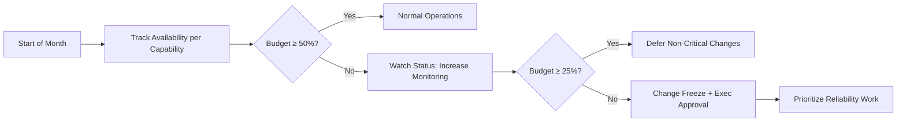
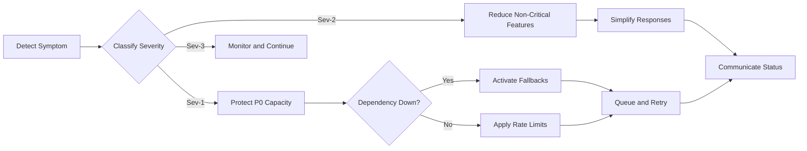
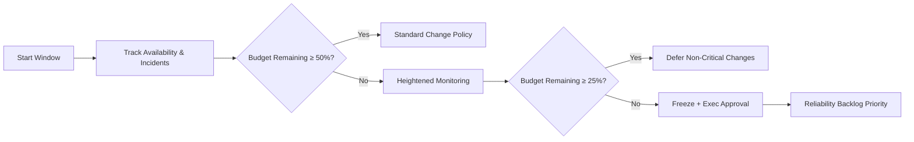
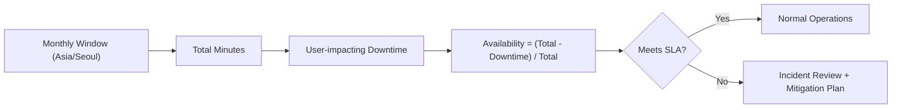

# shoppingMall Performance and SLA Requirements

## 1. Purpose and Scope
THE shoppingMall platform SHALL meet user-perceived performance, availability, and data-freshness expectations that are measurable, testable, and suitable for peak retail events. These expectations apply to customers, sellers, and admins across browsing, purchasing, fulfillment visibility, post-purchase operations, and governance.

- THE scope SHALL include response time targets, throughput and concurrency expectations, availability SLO/SLA, maintenance windows, error budgets, degradation behaviors, scalability objectives, data freshness timelines, monitoring and alerting thresholds, release/change guardrails, capacity testing, and acceptance criteria.
- THE scope SHALL exclude implementation specifics (APIs, database schemas, provider choices) and SHALL express business outcomes only.
- All timing and availability calculations SHALL use Asia/Seoul timezone unless stated otherwise.

## 2. Definitions and Measurement Principles
- User-Perceived Response Time: Elapsed time from request acceptance at platform boundary to response readiness, excluding client-side rendering but including platform processing and third-party roundtrips.
- Percentiles: P50 (median), P90, P95, P99 measured over rolling 5-minute windows unless explicitly noted.
- Availability: (Total Time − User-impacting Downtime) / Total Time measured monthly in Asia/Seoul; planned maintenance windows excluded per policy.
- Severity Levels: Sev-1 (checkout/login widely unavailable), Sev-2 (major function impaired with workarounds), Sev-3 (non-critical degradation), Sev-4 (minor issues/no user impact).
- Business Day: Used for operational SLAs; defaults to the actor’s business calendar; if unspecified, defaults to platform calendar.

EARS principles:
- THE platform SHALL measure response times and availability using rolling windows and timezone rules defined above.
- WHEN reporting percentiles, THE platform SHALL use P50/P90/P95/P99 consistently across all dashboards and reports.

## 3. Response Time Targets by Use Case and Actor
Targets below represent P95 unless specified; P50 and P99 targets are provided for proportional quality expectations.

### 3.1 Customer-Facing Targets
| Operation | P50 | P95 | P99 | Notes |
|---|---:|---:|---:|---|
| Category browse | ≤ 800 ms | ≤ 1.5 s | ≤ 2.5 s | Includes default filters/sort |
| Product detail (PDP) | ≤ 600 ms | ≤ 1.2 s | ≤ 2.0 s | Price, stock, variant resolution included |
| Search (full-text) | ≤ 900 ms | ≤ 2.0 s | ≤ 3.0 s | Facet aggregation included |
| Add to cart | ≤ 400 ms | ≤ 1.0 s | ≤ 1.5 s | No reservation yet |
| Update cart qty | ≤ 400 ms | ≤ 1.0 s | ≤ 1.5 s | Immediate recalculation |
| Remove cart item | ≤ 400 ms | ≤ 1.0 s | ≤ 1.5 s | |
| Wishlist add/remove | ≤ 400 ms | ≤ 1.2 s | ≤ 1.8 s | |
| Registration | ≤ 1.0 s | ≤ 2.0 s | ≤ 3.0 s | Excludes email delivery |
| Login | ≤ 800 ms | ≤ 1.5 s | ≤ 2.5 s | |
| Address add/edit | ≤ 1.0 s | ≤ 2.0 s | ≤ 3.0 s | |
| Shipping options (checkout) | ≤ 1.0 s | ≤ 2.0 s | ≤ 3.0 s | After address selection |
| Apply coupon/gift card | ≤ 900 ms | ≤ 1.5 s | ≤ 2.5 s | Validation and recompute |
| Payment authorization | ≤ 1.5 s | ≤ 2.5 s | ≤ 4.0 s | Includes gateway roundtrips |
| Place order (finalize) | ≤ 1.5 s | ≤ 3.0 s | ≤ 5.0 s | Stock commit & order number |
| Order details view | ≤ 700 ms | ≤ 1.5 s | ≤ 2.5 s | Timeline included |
| Cancellation request | ≤ 800 ms | ≤ 1.5 s | ≤ 2.5 s | Pre-dispatch windows |
| Refund status view | ≤ 700 ms | ≤ 1.5 s | ≤ 2.5 s | |
| Tracking status view | ≤ 700 ms | ≤ 1.5 s | ≤ 2.5 s | Excludes carrier lag |
| Review submit | ≤ 1.0 s | ≤ 2.0 s | ≤ 3.0 s | Moderation async allowed |

EARS:
- WHEN a customer performs "Product detail (PDP)", THE platform SHALL respond at P95 ≤ 1.2 seconds.
- WHEN a customer applies a coupon, THE platform SHALL return updated totals at P95 ≤ 1.5 seconds.
- WHEN a customer finalizes "Place order", THE platform SHALL return confirmation at P95 ≤ 3.0 seconds and P99 ≤ 5.0 seconds.

### 3.2 Seller-Facing Targets
| Operation | P50 | P95 | P99 | Notes |
|---|---:|---:|---:|---|
| Seller login | ≤ 900 ms | ≤ 1.8 s | ≤ 3.0 s | |
| Product list view | ≤ 1.2 s | ≤ 2.5 s | ≤ 4.0 s | Paginated |
| Create/update product | ≤ 1.5 s | ≤ 3.0 s | ≤ 5.0 s | Variants included |
| Inventory adjustment | ≤ 800 ms | ≤ 1.5 s | ≤ 2.5 s | Reflect ATP quickly |
| Order processing view | ≤ 1.2 s | ≤ 2.5 s | ≤ 4.0 s | |
| Mark order shipped | ≤ 800 ms | ≤ 1.5 s | ≤ 2.5 s | Tracking persistence |

EARS:
- WHEN a seller submits an "Inventory adjustment", THE platform SHALL persist and reflect new availability at P95 ≤ 1.5 seconds.
- WHEN a seller marks an order "Shipped", THE platform SHALL confirm at P95 ≤ 1.5 seconds.

### 3.3 Admin-Facing Targets
| Operation | P50 | P95 | P99 | Notes |
|---|---:|---:|---:|---|
| Admin login | ≤ 900 ms | ≤ 1.8 s | ≤ 3.0 s | |
| Category management | ≤ 1.2 s | ≤ 2.5 s | ≤ 4.0 s | |
| Review moderation | ≤ 800 ms | ≤ 1.5 s | ≤ 2.5 s | Approve/reject/hide |
| Dispute decision | ≤ 1.5 s | ≤ 3.0 s | ≤ 5.0 s | |
| Summary report view | ≤ 1.5 s | ≤ 3.0 s | ≤ 5.0 s | Pre-aggregated |

EARS:
- WHEN an admin performs a "Review moderation" action, THE platform SHALL confirm at P95 ≤ 1.5 seconds.

## 4. Throughput and Concurrency Expectations
- THE platform SHALL support at least 50,000 concurrent authenticated customer sessions and 5,000 guest sessions under normal operations; and at least 200,000 authenticated and 20,000 guest sessions during peak seasons.
- THE platform SHALL sustain at least 500 browse/search RPS and 50 write RPS (cart updates, orders) in normal conditions; and at least 2,000 browse/search RPS and 250 write RPS in peak seasons.
- THE platform SHALL absorb short bursts (≤ 60 seconds) of 3,000 browse/search RPS and 400 write RPS without exceeding P95 targets by more than 25%.
- THE platform SHALL handle at least 1,000 concurrent checkout sessions and 300 concurrent payment authorizations in normal operations; and at least 5,000 checkout and 1,500 authorizations during peak promotions.
- THE platform SHALL process at least 1,200 order placements/min and 6,000 inventory reservations/min in normal operations; and at least 6,000 orders/min and 30,000 reservations/min in peak.

## 5. Availability SLO/SLA and Maintenance Windows
### 5.1 Monthly SLO/SLA Targets by Capability
| Capability | SLO (Monthly Availability) | SLA (Monthly Availability) | Max Single Outage |
|---|---:|---:|---:|
| Authentication | 99.95% | 99.90% | 10 minutes |
| Checkout & Payments | 99.95% | 99.90% | 10 minutes |
| Catalog & Search | 99.90% | 99.80% | 20 minutes |
| Order Tracking & Notifications | 99.90% | 99.80% | 20 minutes |
| Seller Portal | 99.90% | 99.80% | 20 minutes |
| Admin Operations | 99.50% | 99.00% | 30 minutes |

EARS:
- THE platform SHALL meet or exceed the SLA targets in Table 5.1 measured on the Asia/Seoul monthly window.
- IF a capability’s availability drops below its SLA in a month, THEN THE platform SHALL initiate an incident review and publish a mitigation plan within 24 hours.

### 5.2 Availability Calculation Example
- Example: In a 30-day month (43,200 minutes), an SLA of 99.90% allows 43.2 minutes of user-impacting downtime; a single 20-minute outage and two 8-minute outages consume 36 minutes, leaving 7.2 minutes of budget.

### 5.3 Maintenance Windows and Notices
- THE platform SHALL schedule planned maintenance on Sundays between 02:00 and 05:00 Asia/Seoul.
- THE platform SHALL provide at least 72 hours advance notice to affected users via durable channels for planned maintenance.
- THE platform SHALL limit monthly planned downtime to ≤ 60 minutes and per-event to ≤ 15 minutes where downtime is unavoidable.
- WHERE zero-downtime is feasible, THE platform SHALL prefer it and SHALL not count such events toward downtime.

## 6. Error Budgets and Breach Handling
- Error Budget Definition: Error budget = 1 − SLO for the capability over monthly window.
- THE platform SHALL track per-capability error budgets continuously and expose remaining budget to admins.

EARS:
- WHEN a capability consumes 50% of its monthly error budget, THE platform SHALL enter watch status and increase monitoring frequency.
- WHEN a capability consumes 75% of its monthly error budget, THE platform SHALL initiate a change freeze for non-critical releases affecting that capability and escalate to Operations Manager.
- WHEN a capability exhausts 100% of its monthly error budget, THE platform SHALL enforce a change freeze for that capability, require executive approval for any release, and prioritize reliability backlog until the next window.

Error Budget Policy Flow:

## 7. Degradation and Graceful Failure Behavior
### 7.1 Priority Tiers
- P0: Authentication, cart operations, checkout, payment authorization, order placement.
- P1: Catalog browse/search, product detail, order status views.
- P2: Wishlist, reviews and ratings, seller responses.
- P3: Reporting dashboards, batch exports, non-critical background jobs.

EARS:
- WHILE under resource pressure, THE platform SHALL preserve P0 functions before P1–P3.
- IF P3 contends with P0 for capacity, THEN THE platform SHALL shed or defer P3 first.

### 7.2 Degradation Rules
- IF search is slow, THEN THE platform SHALL return best-effort results with simplified ranking and reduced facets at P95 ≤ 2.8 seconds.
- IF inventory is slow, THEN THE platform SHALL allow cart updates but complete reservation asynchronously with visible status and SHALL block final order commit until reservation succeeds or times out within 30 seconds.
- IF payment authorization latency exceeds targets, THEN THE platform SHALL use a non-blocking in-progress state and complete within 2 minutes or fail with clear guidance.
- IF notification delivery is delayed, THEN THE platform SHALL not block order placement and SHALL deliver within 15 minutes.
- IF image/media delivery is constrained, THEN THE platform SHALL serve lower-resolution assets without blocking core operations.
- IF rate limits are exceeded by a single source, THEN THE platform SHALL throttle non-essential actions and preserve P0 flows.

Degradation Decision Flow:

## 8. Scalability and Peak Season Considerations
- THE platform SHALL handle at least 5× baseline sustained load and 10× burst load during seasonal peaks without violating availability SLAs.
- THE platform SHALL handle flash sales (≤ 30 minutes) at 8× baseline checkout concurrency and 12× payment authorization throughput.
- THE platform SHALL keep oversell rate ≤ 0.1% of successful orders for a SKU during peak and SHALL deliver reservation success/failure within 30 seconds for 99% of attempts.
- THE platform SHALL maintain full-text search P95 ≤ 2.0 seconds up to 10 million SKUs and ≤ 2.5 seconds up to 50 million SKUs with progressive reduction.

## 9. Data Freshness and Timeliness
- THE platform SHALL reflect inventory changes on product detail and cart within 3 seconds (P95) of a stock change.
- THE platform SHALL update order status visible to customers and sellers within 1 minute (P95) of the underlying event.
- THE platform SHALL post shipment tracking updates within 15 minutes (P95) of carrier event ingestion.
- THE platform SHALL reflect payment capture status to order timelines within 1 minute (P95) of capture completion.
- THE platform SHALL publish seller payout statement summaries within 24 hours (P95) after settlement cycle close.

## 10. Monitoring, Alerting, and Status Communications
### 10.1 Service Health Indicators
- THE platform SHALL monitor P50/P95/P99 latencies, error rates, checkout success, payment authorization success, reservation latency and failure rate, order creation success, notification backlog, and critical queue depths.
- THE platform SHALL track business outcomes including orders/min, GMV/hour, refunds/hour, active carts, and abandoned checkout rate.

### 10.2 Alert Thresholds and Escalation
- WHEN P95 latency for "Place order" exceeds 3.0 seconds for 5 consecutive minutes, THE platform SHALL trigger a Sev-2 alert within 2 minutes.
- WHEN payment authorization success rate drops below 97% for 3 consecutive minutes, THE platform SHALL trigger a Sev-1 alert within 2 minutes.
- WHEN authentication error rate exceeds 1% for 5 minutes, THE platform SHALL trigger a Sev-1 alert within 2 minutes.
- WHEN reservation failure rate exceeds 0.5% for 10 minutes, THE platform SHALL trigger a Sev-2 alert within 5 minutes.
- WHEN notification backlog time-to-send exceeds 15 minutes, THE platform SHALL trigger a Sev-3 alert within 10 minutes.

### 10.3 Status Communication Cadence
- WHEN a Sev-1 or Sev-2 incident is confirmed, THE platform SHALL publish a status update within 10 minutes and every 30 minutes thereafter until resolved.
- WHEN a Sev-3 incident is confirmed, THE platform SHALL publish a status update within 30 minutes and every 60 minutes thereafter until resolved.

## 11. Release, Change, and Capacity Testing Policies
### 11.1 Release Windows and Freezes (Asia/Seoul)
- THE platform SHALL schedule routine releases Monday–Thursday between 10:00 and 16:00 Asia/Seoul.
- THE platform SHALL avoid routine releases on Fridays, weekends, or the last business day before national holidays in Korea.
- THE platform SHALL enforce seasonal freeze windows (e.g., major holidays) with executive approval required for exceptions.

### 11.2 Performance Regression Gates
- THE platform SHALL block releases that degrade any P95 target by more than 10% under baseline load in controlled tests.
- THE platform SHALL block releases that increase error rate by more than 0.3 percentage points in core flows.

### 11.3 Load and Capacity Testing
- THE platform SHALL execute quarterly load tests at 5× baseline sustained and 10× burst to validate capacity and degradation behaviors.
- THE platform SHALL execute pre-event load tests for planned flash sales at required multipliers and SHALL document pass/fail and remediation.

### 11.4 Capacity Reviews
- THE platform SHALL conduct monthly capacity reviews summarizing utilization, headroom versus targets, and planned scaling actions.

## 12. Acceptance Criteria (Black-Box Validation)
- WHEN executing baseline load profiles, THE platform SHALL meet all P95 response targets listed in Section 3.
- WHEN executing peak profiles, THE platform SHALL meet availability SLAs per Section 5 while observing degradation rules in Section 7.
- WHEN simulating incident conditions per severity classes, THE platform SHALL meet alert timelines and communication cadence per Section 10.
- WHEN applying maintenance windows, THE platform SHALL meet notice and downtime limits per Section 5.3.
- WHEN validating data freshness, THE platform SHALL meet the timelines in Section 9 in controlled scenarios.
- WHEN enforcing change policies, THE platform SHALL block releases that violate regression gates per Section 11.2.

## 13. Consolidated EARS Requirements Index
- THE platform SHALL measure P50/P90/P95/P99 using rolling 5-minute windows in Asia/Seoul.
- THE platform SHALL achieve monthly availability per capability at or above SLA in Section 5.1.
- WHEN SLA shortfall occurs, THE platform SHALL publish mitigation within 24 hours.
- WHEN a customer places an order, THE platform SHALL confirm at P95 ≤ 3.0 seconds.
- WHEN payment authorization occurs, THE platform SHALL respond at P95 ≤ 2.5 seconds and P99 ≤ 4.0 seconds.
- WHEN inventory changes, THE platform SHALL reflect on PDP/cart within 3 seconds (P95).
- WHEN carrier events arrive, THE platform SHALL update shipment status within 15 minutes (P95).
- WHEN a Sev-1 condition is detected, THE platform SHALL protect P0 capacity and communicate status within 10 minutes.
- WHEN error budget reaches 75%, THE platform SHALL initiate change freeze for the impacted capability.
- WHEN planned maintenance is required, THE platform SHALL notice users 72 hours in advance and keep downtime within monthly and per-event caps.
- WHEN peak events occur, THE platform SHALL support 5× sustained and 10× burst without violating SLA.
- THE platform SHALL run quarterly load tests at 5× sustained and 10× burst and SHALL block releases failing regression gates.

## 14. Visual Appendices (Mermaid)

### 14.1 Error Budget Policy Flow (Detailed)

### 14.2 Degradation Decision Flow (Reference)

### 14.3 Availability Computation Example

End of specification.
