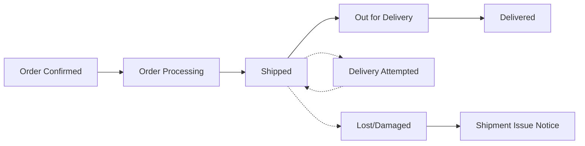
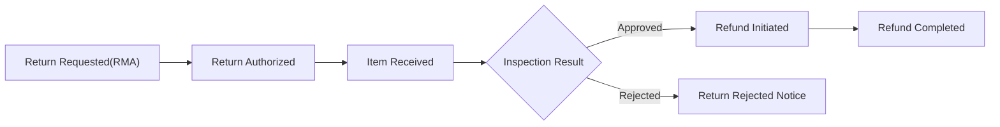

# shoppingMall Notifications, Communications, and Reporting Requirements

## 1. Scope and Intent
- Define business requirements governing all user- and system-initiated communications, including triggers, recipients, delivery timing, suppression, fallbacks, auditability, and reporting views.
- Exclude technical implementations, vendor specifics, APIs, database schemas, and infrastructure details. All delivery mechanisms and tooling remain at the discretion of the development team.
- Ensure alignment with performance targets, availability expectations, privacy/consent controls, and role-based access requirements across the platform.

## 2. Actors, Audience, and Channels

### 2.1 Actors
- Customer: Places orders, manages addresses and payments, receives transactional, security, and opted-in marketing communications.
- Seller: Operates a store, receives operational communications (orders, SLAs, inventory, disputes), and periodic summaries and payout statements.
- Admin: Oversees governance, risk, moderation, disputes, and platform health; receives risk and incident alerts and reporting summaries.

### 2.2 Communication Categories
- Transactional: Order, shipping, delivery, return, cancellation, refund, payout confirmations.
- Account & Security: Registration, verification, credential recovery, sign-in alerts, payout detail changes, policy notices, DSAR updates.
- Marketing (opt-in): Offers, newsletters, seller promotions, back-in-stock, price-drop alerts.
- Operational (Seller/Admin): Inventory, SLAs, disputes/chargebacks, policy enforcement, incident status.

### 2.3 Channels (Business-Level)
- Channels include email, SMS, push, and in-app notifications.
- Transactional and security communications require at least one durable channel (e.g., email or in-app archive) for retrievability.

EARS:
- THE notification service SHALL respect user preferences for non-transactional communications by channel and category.
- WHERE a message is transactional or security-critical, THE notification service SHALL deliver via at least one durable channel regardless of marketing opt-out.
- WHERE a user disables a specific marketing channel, THE notification service SHALL suppress that channel while allowing other consented channels.

## 3. Global Principles and Constraints

### 3.1 Delivery Timeliness and Performance
- Transactional: send within 60 seconds of event creation.
- Security-critical: send within 30 seconds of event creation.
- Marketing: honor quiet hours and frequency caps.

EARS:
- WHEN a transactional event occurs, THE notification service SHALL enqueue a message within 1 minute and dispatch within 2 minutes P95 under normal operations.
- WHEN a security event occurs, THE notification service SHALL dispatch within 60 seconds P95.

### 3.2 Idempotency and De-duplication
- Each business event yields at most one notification per intended channel unless state changes.

EARS:
- THE notification service SHALL ensure idempotent processing keyed by business event identifiers to prevent duplicates.
- IF a retry occurs for the same event and channel, THEN THE notification service SHALL suppress duplicate user-visible messages.

### 3.3 Mandatory Information Elements
- Transactional: business identifier(s) (e.g., order number), current state, event timestamp, responsible party (seller or platform), next steps, and a link/reference to view details.
- Security: event description, time, location context (if available), and remediation instructions.

EARS:
- THE notification content SHALL include mandatory information elements appropriate to the message category.
- IF a mandatory element cannot be determined, THEN THE notification service SHALL delay dispatch and raise an internal alert to resolve data gaps.

### 3.4 Eligibility, Suppression, and Sensitive States
- Honor consent, quiet hours, and legal suppression.
- Restrict messaging during fraud or compliance investigations to factual, required updates only.

EARS:
- WHERE a user lacks consent for a marketing category or channel, THE notification service SHALL suppress the message in that channel.
- WHILE an account is suspended or under fraud investigation, THE notification service SHALL restrict outbound communications to transactional and security essentials only.

### 3.5 Archival, Auditability, and Retention
- Maintain a retrievable history of transactional and security communications for the longer of 24 months or statutory requirement.

EARS:
- THE notification service SHALL retain history and link communications to their business context (orders, returns, payouts, disputes) to support reporting and audits.
- WHEN a DSAR deletion request is completed, THE notification service SHALL remove marketing communication history while preserving legally required transactional records per retention rules.

### 3.6 Quiet Hours and Frequency Caps (Marketing Only)
- Default cap: max 3 marketing messages per 24-hour period per recipient unless a higher limit is explicitly consented.
- Quiet hours: defer marketing sends to outside the recipient’s quiet window by timezone.

EARS:
- WHERE quiet hours are configured, THE notification service SHALL schedule marketing messages outside the configured window in the recipient’s local timezone.
- WHERE frequency caps would be exceeded, THE notification service SHALL defer or suppress marketing messages accordingly.

### 3.7 Channel Fallback and Escalation
- Define fallback precedence to increase delivery success.

EARS:
- IF a transactional notification delivery fails on the primary channel, THEN THE notification service SHALL retry on the same channel and, upon persistent failure, SHALL fall back to an alternate durable channel within 5 minutes.
- WHERE security-critical notifications fail delivery, THE notification service SHALL attempt alternative channels sequentially within 5 minutes and log all attempts.

### 3.8 Accessibility and Clarity (Business-Level)

EARS:
- THE notification content SHALL use plain, inclusive language and avoid jargon, enabling clear understanding of next steps.
- WHERE visual assets are used, THE notification content SHALL include concise text equivalents.

## 4. Transactional Notifications (Order, Shipping, Refund)

### 4.1 Order Placement and Payment
EARS:
- WHEN payment authorization succeeds, THE notification service SHALL send an "Order Confirmation" to the customer within 60 seconds including order number, item summary, total amount, payment authorization reference, delivery estimate window, and seller identity per line item.
- WHEN payment authorization fails, THE notification service SHALL send "Payment Authorization Failed" within 60 seconds including attempt reference, failure reason category, and retry guidance.
- WHEN a customer’s order is pending asynchronous payment, THE notification service SHALL send "Order Pending Payment" and subsequently "Payment Confirmed" or "Payment Expired" within 60 seconds of resolution.
- WHEN an order includes multiple sellers, THE notification service SHALL send separate seller-facing notifications per seller scope with only their items.

### 4.2 Order Processing and Fulfillment
EARS:
- WHEN a seller accepts and starts processing, THE notification service SHALL send "Order Processing" to the customer with the expected ship-by date.
- WHEN a shipment is created, THE notification service SHALL send "Shipped" including carrier, tracking reference, service level, and delivery window.
- WHEN partial shipments occur, THE notification service SHALL send "Partial Shipment Notice" listing shipped items and remaining items with updated estimates.
- IF a fulfillment delay is known, THEN THE notification service SHALL send "Fulfillment Delay" to the customer with the revised estimate and cancellation rights where policy permits.

### 4.3 Delivery and Exceptions
EARS:
- WHEN the carrier updates status to "Out for Delivery", THE notification service SHALL send "Out for Delivery" early in the recipient’s local morning where feasible.
- WHEN a delivery attempt fails, THE notification service SHALL send "Delivery Attempted" with next attempt or pickup instructions.
- WHEN a shipment is delivered, THE notification service SHALL send "Delivered" with delivery timestamp and proof-of-delivery availability when provided by the carrier.
- WHEN a shipment is lost or damaged, THE notification service SHALL send "Shipment Issue" explaining next steps (replacement, refund, or investigation).

### 4.4 Cancellations, Returns, and Refunds
EARS:
- WHEN a customer submits a cancellation request within policy, THE notification service SHALL send "Cancellation Request Received" to the customer and "Cancellation Action Required" to the seller.
- WHEN a cancellation completes pre-shipment, THE notification service SHALL send "Order Canceled" to the customer and seller including refund initiation timestamp and expected timeline.
- WHEN a return is authorized, THE notification service SHALL send "Return Authorized" with RMA number, return instructions, and ship-by deadline.
- WHEN a return is received and inspected, THE notification service SHALL send "Return Inspected" with per-line outcomes and next steps.
- WHEN a refund is initiated or completed, THE notification service SHALL send "Refund Initiated" and "Refund Completed" with amount breakdowns, method, and timestamps.
- IF a return is rejected by policy, THEN THE notification service SHALL send "Return Rejected" including reason code and appeal window.

### 4.5 Error Handling and Recovery (Transactional)
EARS:
- IF a notification cannot be delivered on the chosen channel, THEN THE notification service SHALL retry and attempt a durable fallback within 5 minutes and record the failure.
- IF conflicting state updates occur, THEN THE notification service SHALL send the latest authoritative state with clarification and log superseded state changes for audit.
- WHILE an order is under dispute or chargeback, THE notification service SHALL limit communications to factual, required updates.

## 5. Account and Security Communications

### 5.1 Registration, Verification, and Profile Changes
EARS:
- WHEN a user registers, THE notification service SHALL send "Welcome/Verification" with verification reference and validity period.
- WHEN an email changes, THE notification service SHALL confirm to the new address and alert the old address.
- WHEN a phone changes, THE notification service SHALL send a confirmation code to the new number and notify the old number via a verified channel.
- WHEN a postal address is added or edited, THE notification service SHALL send "Address Updated" with the nickname and postal code hint.
- WHEN a seller updates payout details, THE notification service SHALL send "Payout Details Changed" to the seller and notify admins for risk review.

### 5.2 Authentication and Security Alerts
EARS:
- WHEN password reset is requested, THE notification service SHALL send "Password Reset" with a 15-minute validity period and instructions.
- WHEN a sign-in occurs from a new device or location, THE notification service SHALL send "New Sign-in Alert" with device, approximate location, and time.
- WHEN an account is locked due to repeated failures, THE notification service SHALL send "Account Locked" with unlock steps.
- WHEN 2FA is enabled or disabled, THE notification service SHALL send a confirmation to at least one durable channel.

### 5.3 Compliance and Data Rights
EARS:
- WHEN a data export is ready, THE notification service SHALL send "Data Export Ready" with availability window.
- WHEN an account deletion request is filed, THE notification service SHALL send "Deletion Requested" and later "Deletion Completed" following execution.
- WHERE policy updates affect rights, THE notification service SHALL send "Policy Update Notice" with effective date and summary.

## 6. Marketing and Preference Management

### 6.1 Consent and Preferences
EARS:
- THE notification service SHALL maintain separate opt-in preferences for general offers, newsletters, seller promotions, back-in-stock, and price-drop alerts.
- WHERE a user follows a store or product and consents, THE notification service SHALL enable seller promotions and product alerts.
- WHEN a user withdraws consent, THE notification service SHALL suppress future marketing in that category and channel within 24 hours.

### 6.2 Frequency Capping and Quiet Hours
EARS:
- THE notification service SHALL enforce per-recipient marketing frequency caps of 3 per rolling 24-hour window by default.
- WHERE quiet hours are enabled, THE notification service SHALL defer marketing sends outside the quiet window in the recipient’s timezone.
- WHERE urgent promotions require delivery during quiet hours, THE notification service SHALL send only with explicit user consent.

### 6.3 Eligibility and Suppression
EARS:
- WHERE a product is out-of-stock, THE notification service SHALL defer back-in-stock alerts until ATP > 0.
- WHERE a user recently purchased a SKU, THE notification service SHALL suppress price-drop alerts for that SKU for 7 days unless consented for post-purchase rebates.
- IF a user has globally unsubscribed from marketing, THEN THE notification service SHALL send only transactional and security messages.

## 7. Seller and Admin Communications

### 7.1 Seller Operational Alerts
EARS:
- WHEN inventory for a SKU falls below a seller-defined threshold, THE notification service SHALL send "Low Inventory" with ATP and 7-day sales velocity.
- WHEN a SKU goes out-of-stock, THE notification service SHALL send "Out-of-Stock" with last-sale timestamp and guidance on backorder policy where applicable.
- WHEN order handling SLA is at risk within 12 hours of ship-by, THE notification service SHALL send "SLA at Risk" with affected order count and deadlines.
- WHEN a policy-relevant review is published, THE notification service SHALL send "New Review Alert" including rating, moderation status, and verified purchase indicator where applicable.
- WHEN a dispute or chargeback opens, THE notification service SHALL send "Dispute Opened" with response deadline and required evidence.

### 7.2 Seller Business Summaries
EARS:
- THE notification service SHALL provide daily order summaries with order count, gross sales, cancellations, and refunds initiated.
- THE notification service SHALL provide weekly performance summaries with top products, conversion proxies (business-level), fulfillment lead time median, and late shipment rate.
- WHEN a payout is issued, THE notification service SHALL send "Payout Statement" including date range, gross sales, fees, adjustments, and net payout.

### 7.3 Admin Governance and Risk Alerts
EARS:
- WHEN a seller’s refund or chargeback rate spikes above thresholds (e.g., > 3σ over a 7-day baseline), THE notification service SHALL alert admins for review.
- WHEN prohibited content or policy violations are detected, THE notification service SHALL send "Policy Enforcement Required" to admins and corresponding "Listing Action" to the seller.
- WHEN system-wide degradation affects order or notification SLAs, THE notification service SHALL alert admins with impacted metrics and next steps.

## 8. Reports and Analytics (Business Views)

### 8.1 Customer Views
EARS:
- THE system SHALL provide a "My Notifications" history for at least 12 months with filters by category and order reference.
- THE system SHALL show delivery status indicators (delivered, failed, suppressed) in business terms.
- THE system SHALL allow export of order-related communications history for personal records.

### 8.2 Seller Views
EARS:
- THE system SHALL provide a "Communications Center" that lists notifications sent to customers concerning the seller’s orders.
- THE system SHALL provide alert logs (inventory, SLA, disputes) with timestamps and state transitions.
- THE system SHALL provide daily and weekly summary reports with selectable ranges up to 24 months.

### 8.3 Admin Views
EARS:
- THE system SHALL provide aggregate notification volumes by category and actor, with daily granularity.
- THE system SHALL show delivery outcomes and suppression reasons (invalid address, unsubscribed, quiet hours, legal suppression).
- THE system SHALL provide audit views linking communications to orders, returns, payouts, and disputes for 36 months.
- THE system SHALL provide dashboards for consent coverage and opt-out rates by channel.

### 8.4 KPIs and Time Windows
EARS:
- THE system SHALL target transactional send latency median ≤ 30 seconds and P95 ≤ 120 seconds.
- THE system SHALL target security send latency median ≤ 20 seconds and P95 ≤ 60 seconds.
- WHILE seasonal peaks occur, THE system SHALL maintain KPI targets or alert admins for degradation.

## 9. Localization and Timezone Considerations
EARS:
- THE system SHALL store recipient locale and timezone and render timestamps in the recipient’s local timezone with abbreviation or offset.
- WHERE locale is unknown, THE system SHALL default to en-US and use shipping address timezone for order-related messages.
- WHERE a seller operates across regions, THE system SHALL align seller summaries to the seller’s business timezone for daily/weekly cutoffs.
- WHERE jurisdiction-specific legal language is required, THE system SHALL select the appropriate policy text variant by recipient country/region.

## 10. Error Handling, Edge Cases, and Escalations
EARS:
- IF primary channel fails repeatedly, THEN THE notification service SHALL fall back to an alternate durable channel within 5 minutes and record attempts.
- IF a recipient’s address is invalid or undeliverable for a chosen channel, THEN THE notification service SHALL mark the outcome as failed with a reason and prompt profile correction at next user interaction.
- IF deduplication keys collide across unrelated events, THEN THE notification service SHALL use composite identifiers (event type + entity ID + timestamp) to prevent loss of messages.
- WHERE conflicting events occur (e.g., delivered then undeliverable), THE notification service SHALL prefer the latest authoritative state and annotate clarifications.
- WHERE incidents affect broad communications, THE notification service SHALL publish status updates to admins within 10 minutes and every 30 minutes until resolved.

## 11. Mermaid Diagrams: Key Flows

### 11.1 Order Confirmation to Delivery Flow (Customer-Facing)

### 11.2 Refund and Return Flow

## 12. Matrices and Detailed Triggers

### 12.1 Transactional Events Matrix (Customer)
| Event | Recipient | Timing Expectation | Required Business Elements |
|-------|-----------|--------------------|----------------------------|
| Order Confirmation (paid) | Customer | ≤ 60s from payment success | Order number, item summary, totals, payment auth ref, delivery window, seller identity |
| Payment Authorization Failed | Customer | ≤ 60s from failure | Attempt reference, failure reason category, retry guidance |
| Order Processing | Customer | ≤ 60s from seller acceptance | Order number, ship-by date, items |
| Partial Shipment | Customer | ≤ 60s from partial fulfillment | Shipped items, remaining items, tracking refs if any, updated estimates |
| Shipped | Customer | ≤ 60s from label creation | Carrier, tracking ref, service level, delivery window |
| Out for Delivery | Customer | Local morning of delivery day | Tracking ref, delivery window |
| Delivery Attempted | Customer | ≤ 60s from carrier event | Next attempt/pickup info |
| Delivered | Customer | ≤ 60s from carrier event | Delivery timestamp, proof availability |
| Shipment Issue | Customer | ≤ 60s from issue detection | Issue category, next steps |
| Cancellation Request Received | Customer | ≤ 60s from request | Order reference, next steps |
| Order Canceled | Customer | ≤ 60s from cancellation | Refund initiation timestamp, amount |
| Return Authorized | Customer | ≤ 60s from approval | RMA number, return instructions, deadline |
| Return Inspected | Customer | ≤ 60s from inspection | Per-line outcome, next steps |
| Refund Initiated | Customer | ≤ 60s from initiation | Amount breakdown, expected timeline |
| Refund Completed | Customer | ≤ 60s from completion | Completion timestamp, reference |

### 12.2 Transactional Events Matrix (Seller)
| Event | Recipient | Timing Expectation | Required Business Elements |
|-------|-----------|--------------------|----------------------------|
| New Order Received | Seller | ≤ 60s from payment success | Order reference, items per seller, requested service level, handling time |
| SLA at Risk | Seller | At T-12h to ship-by | Count of affected orders, ship-by times |
| Low Inventory | Seller | On threshold breach | SKU, ATP, 7-day velocity |
| Out-of-Stock | Seller | On stockout event | SKU, last-sale timestamp |
| Cancellation Action Required | Seller | ≤ 60s from request | Order reference, response deadline |
| Dispute Opened | Seller | ≤ 60s from event | Dispute reference, response deadline, required documents |
| Payout Statement | Seller | On payout issuance | Date range, gross, fees, adjustments, net |

### 12.3 Account and Security Matrix
| Event | Recipient | Timing | Required Business Elements |
|-------|-----------|--------|----------------------------|
| Welcome/Verification | Customer/Seller | ≤ 60s from registration | Verification reference, validity period |
| Password Reset | Customer/Seller | ≤ 30s from request | Reset reference, validity period |
| New Sign-in Alert | Customer/Seller | ≤ 30s from event | Device, location, time, remediation |
| Account Locked | Customer/Seller | ≤ 30s from lock | Unlock steps, timing |
| Address Updated | Customer | ≤ 60s from change | Address nickname, postal code hint |
| Payout Details Changed | Seller | ≤ 60s from change | Change summary; Admin notified |
| Data Export Ready | Customer/Seller | On ready | Availability window |
| Deletion Requested/Completed | Customer/Seller | On events | Waiting period; completion timestamp |

### 12.4 Marketing and Preferences Matrix
| Event | Recipient | Eligibility | Suppress If |
|-------|-----------|------------|-------------|
| General Offers | Customer | Opted-in general offers | Global unsubscribe; quiet hours |
| Seller Promotions | Customer (followers) | Opted-in seller promos; follows store | Unsubscribed seller promos; quiet hours |
| Back-in-Stock | Customer (watchlist) | SKU ATP > 0 | Out-of-stock persists; unsubscribed |
| Price-Drop | Customer (watchlist/recent view) | Opted-in | Recent purchase ≤ 7 days; unsubscribed |

## 13. SLA Alignment and Acceptance
EARS:
- THE system SHALL meet or exceed response-time targets in the Performance and SLA document for send latencies and page/view generation.
- IF notification SLA breaches exceed thresholds, THEN THE system SHALL alert admins and log breaches for post-incident review.
- WHEN validating, THE system SHALL demonstrate idempotency, fallback, and suppression behaviors under controlled tests.

## 14. Privacy, Security, and Compliance Alignment
EARS:
- THE system SHALL honor data minimization and least-privilege access to communication history per role.
- THE system SHALL avoid including sensitive PII beyond what is required for the event.
- WHEN legal holds apply, THE system SHALL suspend deletion of communication records within scope until holds are lifted.

## 15. Dependencies and Cross-References
- Aligns with: [Performance and SLA Requirements](./15-shoppingMall-performance-and-sla.md) and [Security, Privacy, and Compliance Requirements](./14-shoppingMall-security-privacy-and-compliance.md).
- Related domain flows: [Checkout and Payment Requirements](./07-shoppingMall-checkout-and-payment.md), [Order and Shipping Management Requirements](./08-shoppingMall-order-and-shipping-management.md), [Returns, Cancellations, and Refunds Requirements](./11-shoppingMall-returns-cancellations-and-refunds.md), and [Seller Portal Requirements](./12-shoppingMall-seller-portal-requirements.md).

## 16. Acceptance Criteria (Business-Level)
- WHEN transactional events occur, THE notification service SHALL deliver within defined windows with idempotency and durable archival.
- WHEN users modify preferences, THE notification service SHALL apply changes within 24 hours and honor quiet hours and frequency caps.
- WHEN delivery failures occur, THE notification service SHALL attempt fallback channels and log outcomes.
- WHEN audits are requested, THE system SHALL present linked communications by business entity within retention periods.

End of document.