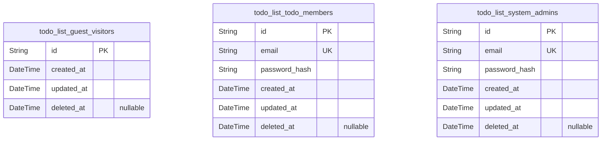
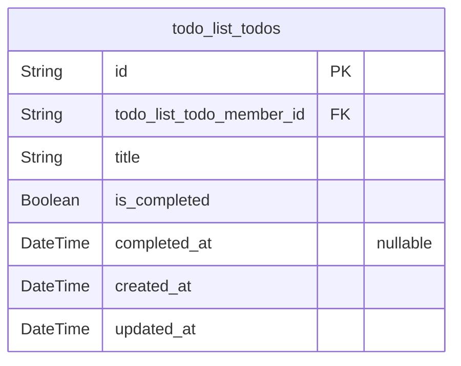

# Prisma Markdown

> Generated by [`prisma-markdown`](https://github.com/samchon/prisma-markdown)

- [Actors](#actors)
- [Todos](#todos)

## Actors

### `todo_list_guest_visitors`

Registry of unauthenticated visitor actors for the Minimal Todo List
service. Represents anonymous users that may interact with public entry
points before authentication. These entries are standalone within the
Actors domain and are not linked to business entities in this minimal
scope. Useful for optional auditing or policy analysis; typically not
user-managed directly. No authentication credentials are stored here.

Properties as follows:

- `id`: Primary Key.
- `created_at`: Creation timestamp for this guest visitor actor record.
- `updated_at`: Last update timestamp for this record, refreshed on any modification.
- `deleted_at`
  > Soft deletion timestamp to mark this actor as logically removed or
  > deactivated. Null means active.

### `todo_list_todo_members`

Actor records for authenticated members of the Minimal Todo List service.
Represents owners of personal Todos. Includes authentication fields for
password-based login and a unique email identifier. Emails should be
normalized to lowercase at the application layer; for DB-level
case-insensitive uniqueness, consider a functional unique index on
lower(email) via migration. Passwords are never stored in plaintext;
store only strong password hashes (Argon2id/Bcrypt).

Properties as follows:

- `id`: Primary Key.
- `email`
  > Member’s login identifier (email). Must be unique across members.
  > Normalize to lowercase at application layer; business policy may require
  > case-insensitive uniqueness.
- `password_hash`
  > Hashed password for authentication (e.g., Argon2id/Bcrypt). Plaintext
  > passwords must never be stored.
- `created_at`: Creation timestamp for this member actor record.
- `updated_at`: Last update timestamp for this record, refreshed on any modification.
- `deleted_at`
  > Soft deletion timestamp to mark this actor as logically removed or
  > deactivated. Null means active.

### `todo_list_system_admins`

Actor records for administrative users responsible for service-level
settings and policy oversight. Requires authentication via unique email
and password_hash. Emails should be normalized to lowercase at the
application layer; for DB-level case-insensitive uniqueness consider
functional unique index on lower(email) via migration. No routine access
to private Todos is implied; access is policy-gated and audited.

Properties as follows:

- `id`: Primary Key.
- `email`
  > Administrator’s login identifier (email). Must be unique across admins.
  > Normalize to lowercase at application layer; business policy may require
  > case-insensitive uniqueness.
- `password_hash`
  > Hashed password for authentication (e.g., Argon2id/Bcrypt). Plaintext
  > passwords must never be stored.
- `created_at`: Creation timestamp for this system admin actor record.
- `updated_at`: Last update timestamp for this record, refreshed on any modification.
- `deleted_at`
  > Soft deletion timestamp to mark this actor as logically removed or
  > deactivated. Null means active.

## Todos

### `todo_list_todos`

Core Todo items for the minimal personal task list. Each record belongs
to exactly one member (owner) and represents a single task with a
required title and a simple completion state. Business operations include
create, list (scoped to owner), update title, toggle complete/uncomplete,
and delete. Completion timestamp is recorded when a Todo transitions to
completed and cleared when uncompleted. No soft deletion is used in
minimal scope; created_at/updated_at track lifecycle changes.

Properties as follows:

- `id`: Primary Key.
- `todo_list_todo_member_id`
  > Owner member's [todo_list_todo_members.id](#todo_list_todo_members). Establishes strict
  > per-owner scoping for all Todo operations.
- `title`
  > Required single-line task title. Application enforces trimming and length
  > policy (e.g., 1–100 chars) and disallows newline characters per business
  > rules.
- `is_completed`
  > Completion state of the Todo. Defaults to false on creation; toggled
  > explicitly by the user.
- `completed_at`
  > Timestamp recorded when the Todo transitions to completed. Cleared when
  > the Todo is marked active (uncompleted).
- `created_at`
  > Creation timestamp for the Todo. Set once at creation and never modified
  > thereafter.
- `updated_at`
  > Last modification timestamp. Updated whenever mutable fields change
  > (title or completion state).
