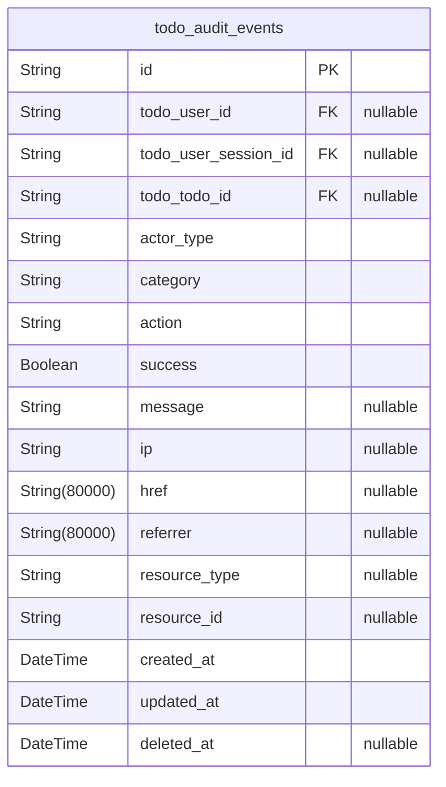
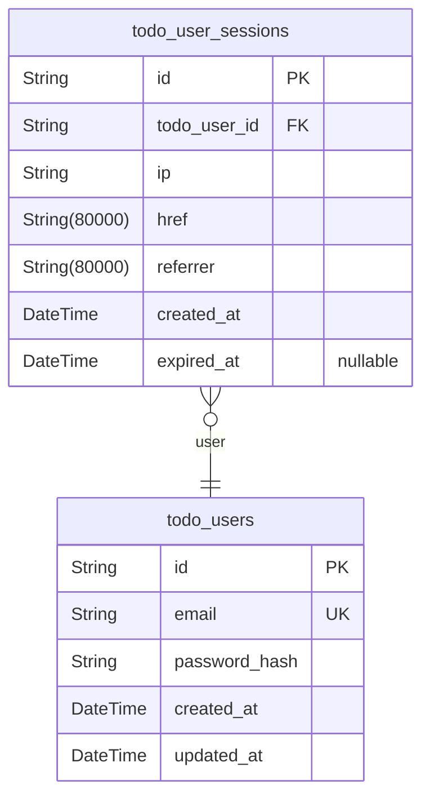
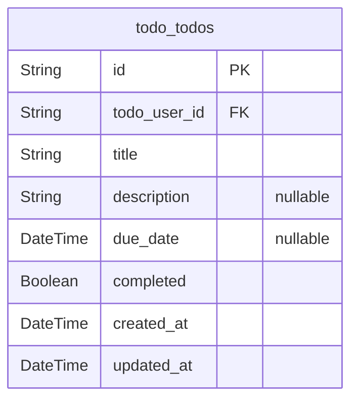

# Prisma Markdown

> Generated by [`prisma-markdown`](https://github.com/samchon/prisma-markdown)

- [Systematic](#systematic)
- [Actors](#actors)
- [Todos](#todos)

## Systematic

```mermaid
erDiagram
"todo_audit_events" {
  String id PK
  String todo_user_id FK "nullable"
  String todo_user_session_id FK "nullable"
  String todo_todo_id FK "nullable"
  String actor_type
  String category
  String action
  Boolean success
  String message "nullable"
  String ip "nullable"
  String(80000) href "nullable"
  String(80000) referrer "nullable"
  String resource_type "nullable"
  String resource_id "nullable"
  DateTime created_at
  DateTime updated_at
  DateTime deleted_at "nullable"
}
```

### `todo_audit_events`

System-wide audit trail capturing security- and business-relevant events
such as registration, login/logout, todo CRUD operations, and
unauthorized attempts. Each record optionally references the acting
[todo_users](#todo_users) and the originating [todo_user_sessions](#todo_user_sessions), and
may point to the affected [todo_todos](#todo_todos) resource when applicable.
The table centralizes observability while keeping domain models clean.
Rows are append-only in practice; soft deletion is reserved for
exceptional redaction needs.

Properties as follows:

- `id`: Primary Key.
- `todo_user_id`
  > Acting user's [todo_users.id](#todo_users). Enables attribution of who performed
  > the action.
- `todo_user_session_id`
  > Originating session's [todo_user_sessions.id](#todo_user_sessions). Provides connection
  > context for the action.
- `todo_todo_id`
  > Target todo resource's [todo_todos.id](#todo_todos) when the event pertains to a
  > specific todo item.
- `actor_type`
  > Actor class that originated the event (e.g., "user", "system"). Used for
  > quick filtering without joining.
- `category`: High-level category for the event (e.g., "auth", "todo", "security").
- `action`
  > Concrete action keyword (e.g., "register", "login", "logout",
  > "todo_create", "todo_update", "todo_delete", "unauthorized_attempt").
- `success`
  > Whether the attempted action completed successfully (true) or failed
  > (false).
- `message`
  > Human-readable summary appropriate for operator review. Optional to avoid
  > storing redundant text.
- `ip`: Client IP address captured at the time of the event, if available.
- `href`: Request URL at the time of the event, if available.
- `referrer`: Referrer URL associated with the request, if available.
- `resource_type`
  > Type name of the affected resource (e.g., "user", "todo"). Present when
  > the event is tied to a specific resource.
- `resource_id`
  > Opaque identifier of the affected resource when the event refers to a
  > specific entity. Not a foreign key to allow polymorphism beyond current
  > domains.
- `created_at`: Event creation timestamp (when the event was recorded).
- `updated_at`
  > Timestamp of the last modification to this audit row, typically equal to
  > creation in append-only usage.
- `deleted_at`
  > Soft deletion timestamp for exceptional redaction needs. Null means
  > active.

## Actors

```mermaid
erDiagram
"todo_users" {
  String id PK
  String email UK
  String password_hash
  DateTime created_at
  DateTime updated_at
}
"todo_user_sessions" {
  String id PK
  String todo_user_id FK
  String ip
  String(80000) href
  String(80000) referrer
  DateTime created_at
  DateTime expired_at "nullable"
}
"todo_user_sessions" }o--|| "todo_users" : user
```

### `todo_users`

Authenticating user accounts for the minimal todo service. Each user owns
personal todos in [todo_todos](#todo_todos) (defined in another component).
Stores the unique login identifier and the password hash required for
authentication. Sessions are tracked in [todo_user_sessions](#todo_user_sessions).
Business rules: unique email per user; account deletion is hard delete in
MVP; timestamps support ordering and audit expectations.

Properties as follows:

- `id`: Primary Key.
- `email`
  > Unique login identifier for the user in email format. Used for
  > authentication and account recovery flows (future).
- `password_hash`
  > Secure password hash (never the plaintext password). Required for login
  > verification.
- `created_at`: Timestamp when the user account was created.
- `updated_at`: Timestamp when the user account was last updated.

### `todo_user_sessions`

Authentication sessions established after successful login for {@link
todo_users}. Captures connection context (IP, URL, referrer), creation
time, and optional expiration. Managed exclusively by authentication
flows; supports many sessions per user. Composite index on (todo_user_id,
created_at) optimizes recent-session lookups.

Properties as follows:

- `id`: Primary Key.
- `todo_user_id`: Owning user’s [todo_users.id](#todo_users).
- `ip`: IP address of the client establishing the session.
- `href`: The request URL at session establishment.
- `referrer`: The referrer URL at session establishment.
- `created_at`: Session creation time.
- `expired_at`
  > Session end/invalidated time. Null means the session is currently active
  > or expiry not yet recorded.

## Todos

```mermaid
erDiagram
"todo_todos" {
  String id PK
  String todo_user_id FK
  String title
  String description "nullable"
  DateTime due_date "nullable"
  Boolean completed
  DateTime created_at
  DateTime updated_at
}
```

### `todo_todos`

Personal todo items owned by a single user. Each record represents one
task with a required title, optional description, optional date-only due
date (interpreted at application level), a boolean completion state, and
standard timestamps. Ownership is enforced via foreign key to {@link
todo_users}. No soft delete in MVP (deletion is permanent). Overdue and
due-today states are computed in application logic; no derived fields are
stored. This model is the core business entity and is managed
independently of sessions or audit events.

Properties as follows:

- `id`: Primary Key.
- `todo_user_id`
  > Owning user’s [todo_users.id](#todo_users). Exactly one owner per todo; no
  > cross-user access.
- `title`
  > Required single-line short text naming the task. Business rules: 1–120
  > characters after trimming; no line breaks or control characters.
- `description`
  > Optional multi-line details elaborating the task. Business rule: up to
  > 1,000 characters after trimming; store as absent when empty.
- `due_date`
  > Optional date-only due date. Store as a date-only value at DB level if
  > possible (PostgreSQL DATE via Prisma @db.Date); otherwise interpret as
  > calendar date without time-of-day in application logic.
- `completed`
  > Completion status. false for not completed, true for completed. Defaults
  > to not completed at creation (enforced by application or DB default).
- `created_at`
  > Creation timestamp of the todo. Set at insert time for ordering and audit
  > expectations.
- `updated_at`
  > Last update timestamp of the todo. Updated on each modification for
  > deterministic secondary ordering.
