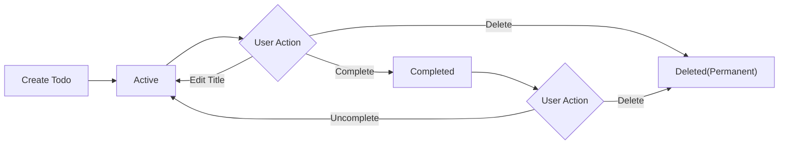
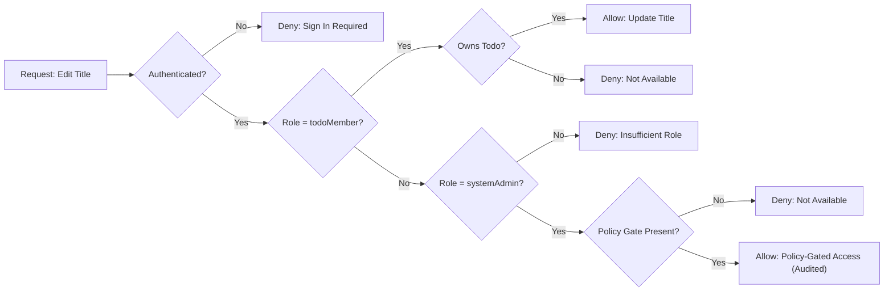
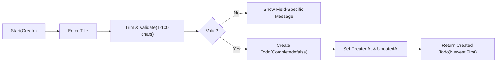

# Minimal Todo List – Requirements Analysis (todoList)

Version: v1.0.0
Date: 2025-10-08 (KST)
Service identifier (prefix): todoList

## Vision and Goals
A personal task list that prioritizes speed, clarity, and predictability. The goal is to move tasks from intention to completion with the fewest possible steps and the least cognitive load. Delivery focuses on the minimal feature set that still supports effective daily use.

Objectives
- Capture tasks instantly with a single required field.
- Review what needs attention now through a simple list with minimal filtering.
- Mark tasks complete and, when needed, revert them to active.
- Remove tasks that are no longer needed.
- Keep the experience consistent, fast, and privacy-first.

Success criteria (business outcomes)
- New users create the first Todo within 30 seconds.
- Core actions (create, list, toggle, update, delete) complete within about 1 second for typical usage conditions (user-perceived).
- No cross-user data exposure incidents.

## Scope Boundaries
In-scope (minimal capability)
- Create a Todo with a required Title.
- List personal Todos for the current user.
- Update the Title of an existing personal Todo.
- Mark complete and mark active (uncomplete).
- Delete a personal Todo.
- Basic filter by state (All, Active, Completed) and default ordering (newest first).
- Pagination in business terms (pages of up to 20 items by default; range-limited customization allowed).

Out-of-scope (initial release)
- Sharing/collaboration; viewing others’ Todos.
- Subtasks, tags/labels, priorities, due dates, reminders, recurring tasks.
- Attachments, images, comments.
- Advanced search, saved filters, bulk operations, import/export tools.
- UI/UX design specifications; API/database/infrastructure details.

## Users and Roles
Roles
- guestVisitor: Unauthenticated visitor. Cannot view, create, or manage any Todo.
- todoMember: Authenticated user managing only their own Todos.
- systemAdmin: Administrative oversight for settings and policy. No routine access to private Todos; exceptional access only via policy gates with audit.

Ownership and visibility
- Each Todo belongs to exactly one owner (the creating member). Only the owner can view or modify the Todo in normal operation.

Optional Single-User Local Mode
- A deployment option where registration/sign-in are disabled and the environment acts as one implicit member. All Todos are private to the device/session context.

## Business Processes and Workflows
Each flow is described in business terms with preconditions, triggers, main path, alternates, and postconditions.

Create Todo
- Preconditions: User is a todoMember (or implicit member in Single-User Local Mode).
- Trigger: User submits a non-empty Title.
- Main path: Validate Title → Create Todo with default not completed → Set timestamps → Return created Todo.
- Alternates: Invalid Title (reject with guidance); guestVisitor attempt (deny, suggest sign-in).
- Postconditions: New Todo exists and appears in the list according to ordering rules.

List and Filter Todos
- Preconditions: User is a todoMember.
- Trigger: User requests their list with optional state filter and pagination.
- Main path: Scope to owner → Apply state filter (All/Active/Completed) → Order newest first → Paginate → Return results with page context.
- Alternates: guestVisitor attempt (deny, suggest sign-in); empty list (return empty set without error).
- Postconditions: User sees an accurate list per selected filter and page.

Update Title
- Preconditions: User is the owner and provides a new valid Title.
- Trigger: User submits a new Title for an owned Todo.
- Main path: Validate Title → Update Title → Update last modified time → Return updated Todo.
- Alternates: Invalid Title (reject with guidance); non-owner or missing Todo (deny without leaking existence).
- Postconditions: Title reflects the new value; timestamps updated.

Complete / Uncomplete
- Preconditions: User is the owner; Todo exists.
- Trigger: User requests to set state to Completed or to Active.
- Main path: Set state accordingly → Update timestamps (including completion time when completing) → Return updated Todo.
- Alternates: Non-owner or missing Todo (deny without leaking existence); idempotent no-op if already in the requested state.
- Postconditions: State matches requested value; listings reflect the change.

Delete Todo
- Preconditions: User is the owner.
- Trigger: User confirms deletion of an owned Todo.
- Main path: Permanently remove the Todo → Confirm removal → Exclude from all lists.
- Alternates: Cancellation before confirmation (no change); missing Todo at action time (inform not available); non-owner attempt (deny without leaking existence).
- Postconditions: Todo is no longer accessible or listed.

Sign In/Out (if enabled)
- Preconditions: Guest has no access to private Todos.
- Trigger: User registers/signs in or signs out.
- Main path: Successful sign-in establishes a member session and routes to personal context; sign-out ends session.
- Alternates: Invalid credentials (reject with guidance); suspended account (deny with neutral message).
- Postconditions: Authenticated users can manage personal Todos; guests cannot.

## Functional Requirements (EARS)
Item definition (business fields)
- THE todoList service SHALL represent a Todo with: Identifier, Title, Completed (boolean), CreatedAt, UpdatedAt, and optionally CompletedAt when Completed=true.
- THE todoList service SHALL require Title to be non-empty after trimming leading/trailing whitespace and SHALL accept length from 1 to 100 characters after trimming.

Create
- WHEN a todoMember submits a valid Title, THE todoList service SHALL create a Todo owned by that member with Completed=false and SHALL set CreatedAt and UpdatedAt.
- IF Title is missing or invalid, THEN THE todoList service SHALL reject creation with a clear, field-specific message.
- IF the actor is guestVisitor, THEN THE todoList service SHALL deny creation and SHALL suggest signing in.

Read (single)
- WHEN a todoMember requests their own Todo by Identifier, THE todoList service SHALL return Identifier, Title, Completed, CreatedAt, UpdatedAt, and CompletedAt when applicable.
- IF the Todo is not available in the requester’s scope, THEN THE todoList service SHALL respond with a neutral not-available message that does not reveal ownership.

Update Title
- WHEN a todoMember submits a valid new Title for an owned Todo, THE todoList service SHALL update Title and UpdatedAt.
- IF the new Title is invalid, THEN THE todoList service SHALL reject the update with a clear message.
- IF the Todo does not exist or is not owned by the requester, THEN THE todoList service SHALL deny with a neutral not-available message.

Complete / Uncomplete
- WHEN a todoMember marks an owned Todo as completed, THE todoList service SHALL set Completed=true, set CompletedAt, and set UpdatedAt.
- WHEN a todoMember marks an owned Todo as active, THE todoList service SHALL set Completed=false, clear CompletedAt, and set UpdatedAt.
- IF the Todo is already in the requested state, THEN THE todoList service SHALL return success without changing state.

Delete
- WHEN a todoMember confirms deletion of an owned Todo, THE todoList service SHALL permanently remove it and SHALL exclude it from all subsequent listings.
- IF the Todo is not available to the requester, THEN THE todoList service SHALL deny deletion with a neutral message.

List, Filter, Ordering, Pagination
- WHEN a todoMember requests a list, THE todoList service SHALL return only that member’s Todos.
- THE todoList service SHALL support filters: All, Active (Completed=false), Completed (Completed=true).
- THE todoList service SHALL order results by CreatedAt descending (newest first) by default.
- THE todoList service SHALL paginate results with a default page size of 20 items and SHALL allow a requested page size between 10 and 50 inclusive.
- WHEN a page beyond available results is requested, THE todoList service SHALL return an empty set with page context indicating no items on that page.

## Authentication and Authorization (Business-Level)
- THE todoList service SHALL enforce least-privilege access by role.
- WHEN unauthenticated (guestVisitor), THE todoList service SHALL deny all Todo operations and SHALL guide the user to sign in.
- WHEN authenticated as todoMember, THE todoList service SHALL allow management of only the member’s own Todos.
- WHEN authenticated as systemAdmin, THE todoList service SHALL allow administrative settings and policy actions without default access to private content; exceptional access requires documented policy gates and audit.
- WHERE Single-User Local Mode is enabled, THE todoList service SHALL operate without registration/sign-in and SHALL bind all Todos to the implicit member, disabling multi-user administrative features.

## Error Handling and Recovery (Business Terms)
Taxonomy
- Validation errors (invalid Title, pagination bounds).
- Authentication errors (not signed in).
- Authorization errors (not owner; admin without policy gate).
- Missing resource (item deleted or never existed in user scope).
- Conflict-like situations (stale views, rapid toggles).
- Temporary system conditions (transient unavailability).

EARS
- WHEN validation fails, THE todoList service SHALL reject the action, keep user input where feasible, and present field-specific guidance.
- WHEN authentication is required, THE todoList service SHALL deny the action and suggest signing in, without revealing any Todo data.
- WHEN authorization fails, THE todoList service SHALL present a neutral “not available” message without confirming item existence.
- WHEN an item is missing, THE todoList service SHALL indicate unavailability and SHALL offer to refresh the list.
- WHEN conflicting actions are detected, THE todoList service SHALL prevent silent overwrites and SHALL guide the user to refresh and retry; results remain idempotent.
- WHEN a temporary condition occurs, THE todoList service SHALL advise a brief retry without technical jargon and SHALL avoid creating duplicates.

## Non-Functional Requirements (User-Centric)
Performance
- THE todoList service SHALL complete creation, update, delete, and completion toggle with user-visible confirmation within 1 second for at least 95% of attempts under normal conditions and within 2 seconds at worst.
- THE todoList service SHALL present the first page of a list (up to 20 items by default) within 1 second for at least 95% of attempts and within 2.5 seconds at worst.

Reliability and availability
- THE todoList service SHALL meet a monthly availability objective of at least 99.5% excluding scheduled maintenance with prior notice.
- THE todoList service SHALL ensure that once an action is confirmed to the user, the result is durable and reflected across views.

Accessibility and usability
- THE todoList service SHALL confirm outcomes concisely after each core action.
- THE todoList service SHALL be operable via keyboard-only interaction for core actions.
- THE todoList service SHALL present state changes and errors in ways perceivable without reliance on color alone.

Scalability envelope
- THE todoList service SHALL maintain the performance targets for users with up to 1,000 active Todos and 10,000 total historical Todos per user.

Observability outcomes
- THE todoList service SHALL measure user-perceived latencies and error rates for core actions and SHALL alert internally when targets are not met.

## Data Lifecycle and Privacy (Business Semantics)
- THE todoList service SHALL bind each Todo to a single owner and SHALL restrict access to that owner.
- THE todoList service SHALL record CreatedAt at creation and SHALL update UpdatedAt when mutable fields change; CompletedAt is set when moving to Completed and cleared when reverting to Active.
- THE todoList service SHALL treat deletion as permanent in the minimal scope (no recovery window).
- THE todoList service SHALL present timestamps in the user’s timezone; where unavailable, the default is Asia/Seoul.
- THE todoList service SHALL avoid exposing sensitive information in user messages and SHALL not disclose existence of other users’ content.

## Assumptions and Constraints
- Minimalism: Only the fields and actions specified here are required; advanced features are intentionally excluded.
- Device-agnostic: No dependency on a specific device or form factor.
- Language and locale: en-US copy; times shown in user’s timezone with Asia/Seoul as default when unspecified.
- No technical specifications: No APIs, data models, or infrastructure details are mandated by this analysis.

## Visual Diagrams (Mermaid)
Core lifecycle

Authorization decision (edit action)

Create flow (happy path)

## Acceptance Criteria Summary (EARS)
- THE todoList service SHALL require Title length 1–100 after trimming.
- WHEN a valid Title is submitted, THE todoList service SHALL create a Todo with Completed=false and set CreatedAt and UpdatedAt.
- WHEN a member lists Todos, THE todoList service SHALL return only their Todos, ordered newest first, with optional filtering by Active/Completed and page size default 20 (range 10–50).
- WHEN a member updates Title with a valid value, THE todoList service SHALL save it and update UpdatedAt.
- WHEN a member toggles completion, THE todoList service SHALL set Completed and CompletedAt accordingly or clear CompletedAt when uncompleting.
- WHEN a member deletes a Todo, THE todoList service SHALL remove it permanently and exclude it from all subsequent operations.
- IF a guestVisitor attempts any Todo operation, THEN THE todoList service SHALL deny and suggest signing in.
- IF a member targets a Todo outside their ownership, THEN THE todoList service SHALL deny without revealing existence.
- THE todoList service SHALL complete core actions within about 1 second for at least 95% of attempts under normal conditions.

## Glossary
- Todo: A single task entry owned by a member, identified by an Identifier and a Title, with a completion state and timestamps.
- Active: Not completed.
- Completed: Marked done by the owner; may have CompletedAt set.
- Deleted: Permanently removed in the minimal scope.
- List: A view of a member’s Todos with optional filter and paging.
- Ownership: Binding of a Todo to exactly one member; only the owner may access or change it.
- Single-User Local Mode: Deployment option with no sign-in; one implicit member bound to the local environment.
