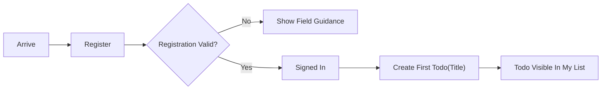
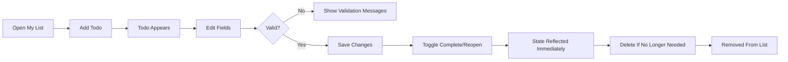
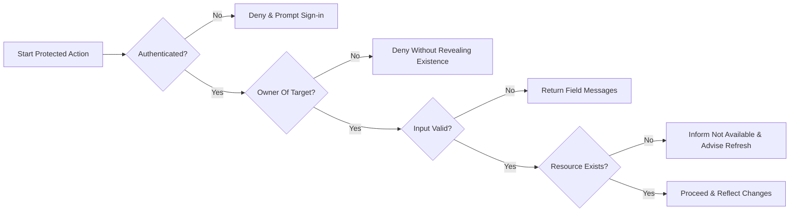

# Minimal Todo Application — Requirements Analysis (MVP)

## Purpose and Scope
Enable an individual to manage personal tasks with the smallest viable feature set: register/login, create/read/update/delete (CRUD) personal todos, toggle completion, and optionally set a date‑only due date. Keep ownership strictly personal; no collaboration, sharing, or notifications. Express all requirements in natural language using testable, EARS‑style statements to guide implementation without prescribing technical designs.

## Actors and Permissions (business-level)
- Authenticated User ("User"): A person who has a personal account and manages only their own todos.
- Unauthenticated State: A state in which a person has not successfully signed in; personal todo operations are not permitted.

EARS requirements:
- THE todo service SHALL recognize "User" as the only actor capable of managing todo items.
- WHERE a person is not authenticated, THE todo service SHALL deny access to all personal todo operations.
- THE todo service SHALL restrict every todo to exactly one owning User and prevent cross‑user access.

## Definitions and Glossary
- Todo: A personal task with a required title, optional description, optional date‑only due date, completion status, and timestamps for creation and last update (timestamps are concept-only; not user-editable).
- Completion Status: Boolean business state "completed" or "not completed"; defaults to not completed.
- Due Date (date‑only): Calendar date without time-of-day; used to indicate intent, not to trigger reminders.
- Ownership: Association of each todo with exactly one User; ownership never transfers in MVP.
- Listing: Returning a User’s own todos in a deterministic order with optional basic filtering.

## Business Goals and Success Criteria
- Simplicity: Capture and manage tasks quickly, with low cognitive load.
- Privacy: Strict isolation so a User never sees another User’s todos.
- Immediate value: Create the first todo within minutes of sign-up; changes reflect immediately in the list.

EARS goals:
- THE todo service SHALL allow a new User to create their first todo within 1 minute of successful registration under normal conditions.
- THE todo service SHALL present a User’s list within a perceived 1–2 seconds for typical personal lists.
- THE todo service SHALL keep todos private to the owner at all times.

## Scope
### In‑Scope (MVP)
- THE todo service SHALL support registration, login, and logout for an individual account.
- THE todo service SHALL allow the User to create, list, read, update, delete, and toggle completion for their own todos only.
- THE todo service SHALL accept a required title and optional description and optional date‑only due date.
- THE todo service SHALL provide a predictable default ordering and basic status filtering (all, active, completed).

### Out‑of‑Scope (Deferred)
- THE todo service SHALL NOT include collaboration, sharing, or multi‑user access to a single todo.
- THE todo service SHALL NOT include notifications, reminders, or recurrence.
- THE todo service SHALL NOT include projects, tags, priorities, attachments, subtasks, custom fields, or full‑text search.
- THE todo service SHALL NOT include administrative roles or dashboards in MVP.

## User Scenarios (brief)
- First‑time setup: A person registers, signs in, and creates the first todo with a short title.
- Daily routine: A User reviews the list, adds tasks, edits details, completes items, reopens mistakes, and deletes items that are no longer needed.
- Light planning: A User sets or removes a due date to signal urgency without reminders.

EARS:
- WHEN a User submits a valid title, THE todo service SHALL create the todo and show it in the list immediately.
- WHEN a User marks an item complete or reopens it, THE todo service SHALL reflect the new state without delay.
- WHEN a User removes a due date, THE todo service SHALL store the todo without a due date and stop showing urgency tied to that date.

## Functional Requirements (EARS)

### 1) Account Lifecycle
- WHEN a person provides valid registration details, THE todo service SHALL create a personal account.
- IF provided registration details are invalid or the identifier is already used, THEN THE todo service SHALL reject registration with clear guidance in business terms.
- WHEN a User submits valid credentials, THE todo service SHALL establish an authenticated state enabling personal todo actions.
- IF credentials are invalid, THEN THE todo service SHALL deny login and avoid revealing whether a particular account exists.
- WHEN a User logs out, THE todo service SHALL end the authenticated state and require login for further personal actions.
- IF an authenticated state expires due to inactivity, THEN THE todo service SHALL require re‑authentication before allowing protected actions.

### 2) Ownership and Data Isolation
- THE todo service SHALL associate each todo with exactly one User at creation time.
- THE todo service SHALL deny any attempt to read, list, update, delete, or toggle completion of a todo not owned by the requesting User.
- WHERE a request references any todo outside the User’s ownership, THE todo service SHALL deny the request without confirming whether such items exist.

### 3) Todo Lifecycle (Create, Read, Update, Delete)
Fields (business-level): required title; optional description; optional date‑only due date; completion status (default not completed); creation/last update timestamps.

Create
- WHEN a User submits a new todo with a non‑empty title (after trimming), THE todo service SHALL create the todo with completion set to not completed.
- WHERE description is provided, THE todo service SHALL accept up to 1,000 characters after trimming.
- WHERE a due date is provided, THE todo service SHALL accept a valid calendar date (date‑only).
- IF title is missing, whitespace‑only, longer than 120 characters, or contains line breaks, THEN THE todo service SHALL reject creation with a clear business message.
- IF description exceeds 1,000 characters, THEN THE todo service SHALL reject creation with a clear business message.
- IF the due date is not a recognizable calendar date, THEN THE todo service SHALL reject creation with a clear business message.

Read (single)
- WHEN a User requests a todo they own, THE todo service SHALL return current business fields.
- IF the todo does not exist, THEN THE todo service SHALL respond that the resource is not available.

List (overview)
- WHEN a User lists todos, THE todo service SHALL return only that User’s items according to ordering and filtering rules below.

Update
- WHEN a User updates owned todo fields (title, description, due date), THE todo service SHALL validate inputs, apply accepted changes, and reflect them on subsequent reads.
- IF an updated field violates a rule, THEN THE todo service SHALL reject the update and preserve existing values.

Delete
- WHEN a User deletes a todo they own, THE todo service SHALL remove it from subsequent listings immediately.
- THE deletion behavior SHALL be permanent (no restore) in MVP.

### 4) Completion Toggle and Due Date Semantics
Completion
- WHEN a User marks a todo complete, THE todo service SHALL set completion to completed and keep other fields unchanged.
- WHEN a User reopens a completed todo, THE todo service SHALL set completion to not completed and keep other fields unchanged.
- WHERE the requested state equals the current state, THE todo service SHALL accept the request and confirm the current state (idempotent).

Due Date (date‑only)
- THE due date SHALL be optional and interpreted as a calendar date without time-of-day.
- THE todo service SHALL consider a todo "overdue" if today’s date is later than the due date and the todo is not completed.
- THE todo service SHALL consider a todo "due today" if today’s date equals the due date and the todo is not completed.
- WHILE a User has not selected a timezone, THE todo service SHALL interpret date‑only due dates in the "Asia/Seoul" timezone by default.

### 5) Listing, Ordering, Filtering, and Pagination
- THE default ordering for lists SHALL be newest first by creation time.
- WHERE two items share the same creation moment, THE todo service SHALL order deterministically using last updated time as a secondary key (newer first).
- THE todo service SHALL support a status filter:
  - "all": includes all owned todos
  - "active": includes only not‑completed todos
  - "completed": includes only completed todos
- THE todo service SHALL return results in pages of 20 items by default and SHALL allow a requested page size up to a maximum of 100.
- WHERE a requested page size exceeds 100, THE todo service SHALL cap results at 100 and indicate a cap was applied in business terms.

### 6) Validation Rules and Business Messages
- WHEN text fields are received, THE todo service SHALL trim leading and trailing whitespace.
- WHEN a required field becomes empty after trimming, THE todo service SHALL treat it as missing.
- WHEN title exceeds 120 characters, includes line breaks, or trims to empty, THE todo service SHALL reject the action with a clear message.
- WHEN description exceeds 1,000 characters, THE todo service SHALL reject the action with a clear message.
- WHEN due date is malformed, THE todo service SHALL reject the action with a clear message.
- WHERE multiple validation errors occur, THE todo service SHALL report all field issues together in concise language.

### 7) Auditability (business-level)
- WHEN registration completes, WHEN login succeeds, WHEN logout occurs, and WHEN todos are created, updated (including toggle and due date changes), or deleted, THE todo service SHALL record who performed the action and when in business terms.
- WHEN an unauthorized attempt occurs (e.g., access to a non‑owned todo), THE todo service SHALL record a security‑relevant audit event without exposing sensitive data to end users.

## Non‑Functional Requirements (user‑perceived)
Performance
- WHEN core actions are performed under normal conditions and typical personal volumes (≤ 1,000 todos per User), THE todo service SHALL complete:
  - Login within 2 seconds perceived time.
  - List page retrieval within 0.5–1.5 seconds depending on item count.
  - Single‑item create/update/delete within 0.7 seconds, and toggle completion within 0.5 seconds.
Reliability
- THE todo service SHALL target 99.9% monthly availability and graceful degradation during incidents.
Usability
- THE todo service SHALL provide clear, non‑technical business messages for errors and guidance to recover.
Privacy
- THE todo service SHALL collect only data necessary for personal task management and SHALL not expose a User’s data to others.

## Data Lifecycle and Privacy
- WHEN a User deletes a todo, THE todo service SHALL remove it from the User’s view immediately after success.
- WHEN a User deletes their account, THE todo service SHALL delete all of that User’s active todos from user access immediately after success.
- THE todo service SHALL retain disaster recovery backups for no longer than 30 calendar days and SHALL prevent any User access to backup‑only data.
- WHEN an export of personal data is requested by the authenticated User, THE todo service SHALL deliver a complete, human‑readable export of the User’s account identifiers and todos within 24 hours under normal operating conditions.

## Error Handling and Recovery (business‑level)
Authentication
- IF a request is made without an active authenticated state, THEN THE todo service SHALL deny the action and direct the person to sign in.
Authorization
- IF a User attempts to access another User’s todo, THEN THE todo service SHALL deny the action without revealing existence of the resource.
Validation
- IF validation fails, THEN THE todo service SHALL reject the action, present field‑specific messages, and perform no partial writes.
Resource State
- IF an action targets a non‑existent or already deleted item, THEN THE todo service SHALL inform that the item is not available and advise refreshing the list.
Transient/System
- IF a transient failure or timeout occurs, THEN THE todo service SHALL present a friendly message and allow a safe retry without creating duplicates.

## Conceptual User Flows (Mermaid)
### Sign‑up to First Todo

```mermaid
graph LR
  A["Arrive"] --> B["Register"]
  B --> C{"Registration Valid?"}
  C -->|"No"| D["Show Field Guidance"]
  C -->|"Yes"| E["Signed In"]
  E --> F["Create First Todo(Title)"]
  F --> G["Todo Visible In My List"]
```

### Daily Management

```mermaid
graph LR
  A["Open My List"] --> B["Add Todo"]
  B --> C["Todo Appears"]
  C --> D["Edit Fields"]
  D --> E{"Valid?"}
  E -->|"No"| F["Show Validation Messages"]
  E -->|"Yes"| G["Save Changes"]
  G --> H["Toggle Complete/Reopen"]
  H --> I["State Reflected Immediately"]
  I --> J["Delete If No Longer Needed"]
  J --> K["Removed From List"]
```

### Protected Action Guardrails

```mermaid
graph LR
  A["Start Protected Action"] --> B{"Authenticated?"}
  B -->|"No"| C["Deny & Prompt Sign‑in"]
  B -->|"Yes"| D{"Owner Of Target?"}
  D -->|"No"| E["Deny Without Revealing Existence"]
  D -->|"Yes"| F{"Input Valid?"}
  F -->|"No"| G["Return Field Messages"]
  F -->|"Yes"| H{"Resource Exists?"}
  H -->|"No"| I["Inform Not Available & Advise Refresh"]
  H -->|"Yes"| J["Proceed & Reflect Changes"]
```

## Permission Matrix (business terms)

| Action | Unauthenticated State | User |
|-------|------------------------|------|
| Register/Login | ✅ Allowed to attempt | ✅ Allowed |
| Logout | ❌ Not applicable | ✅ Allowed |
| List Own Todos | ❌ Not allowed | ✅ Allowed |
| Create Todo | ❌ Not allowed | ✅ Allowed |
| Read Own Todo | ❌ Not allowed | ✅ Allowed |
| Update Own Todo | ❌ Not allowed | ✅ Allowed |
| Delete Own Todo | ❌ Not allowed | ✅ Allowed |
| Toggle Completion | ❌ Not allowed | ✅ Allowed |
| Access Others’ Todos | ❌ Not allowed | ❌ Not allowed |

EARS summary:
- WHERE a User is authenticated, THE todo service SHALL allow listing, creating, reading, updating, deleting, and toggling completion for that User’s own todos only.
- IF an Unauthenticated State attempts any personal todo action, THEN THE todo service SHALL deny access and indicate sign‑in is required.
- IF a User attempts to operate on another User’s item, THEN THE todo service SHALL deny the action without confirming the item exists.

## Acceptance Criteria (consolidated)
Registration and Login
- WHEN valid registration details are submitted, THE todo service SHALL create the account and allow immediate login.
- IF registration details are invalid or the identifier is already used, THEN THE todo service SHALL reject registration with field‑specific guidance.
- WHEN valid credentials are used, THE todo service SHALL establish an authenticated state; IF invalid, deny without revealing account existence.

Create
- WHEN a title 1–120 characters (single line) is provided, THE todo service SHALL create the todo with completion=false.
- IF title is empty/whitespace, contains line breaks, or exceeds 120 characters, THEN THE todo service SHALL reject creation with a clear message.
- WHERE description ≤1,000 characters or a valid date‑only due date is provided, THE todo service SHALL accept and store them; IF invalid, reject with a clear message.

Read & List
- WHEN the owner requests an existing todo, THE todo service SHALL return its fields; IF not available, return a not‑available message.
- WHEN listing without filters, THE todo service SHALL return up to 20 of the User’s items ordered newest first; WHERE page size >100 requested, cap at 100 and indicate the cap.
- WHERE status filter is active/completed/all, THE todo service SHALL return items matching the selected filter.

Update
- WHEN the owner updates title/description/due date within constraints, THE todo service SHALL persist and reflect changes; IF invalid, reject and preserve existing values.

Toggle
- WHEN the owner marks complete or reopens, THE todo service SHALL set the requested state and reflect it immediately; repeated requests SHALL be idempotent.

Delete
- WHEN the owner deletes a todo, THE todo service SHALL remove it from listings immediately and not show it again; IF already deleted or not found, inform unavailability.

Ownership & Isolation
- IF a User attempts to access a non‑owned item, THEN THE todo service SHALL deny the action without confirming existence.

Performance
- WHEN core actions occur under normal conditions, THE todo service SHALL meet the user‑perceived response times specified in Non‑Functional Requirements.

Auditability
- WHEN authentication events or todo mutations occur, THE todo service SHALL record who and when in business terms; unauthorized attempts SHALL be recorded as security‑relevant.

## Risks, Assumptions, and Constraints
Assumptions
- Single actor model (User) with personal, private todos only.
- Due date is date‑only; no reminders in MVP.
Constraints
- Minimal feature set; no collaboration, reminders, or advanced organization features.
Risks
- Scope creep toward collaboration or reminders; guard with explicit out‑of‑scope list.
- Ambiguity around date interpretation; default to "Asia/Seoul" timezone unless the User selects another.
