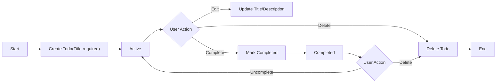
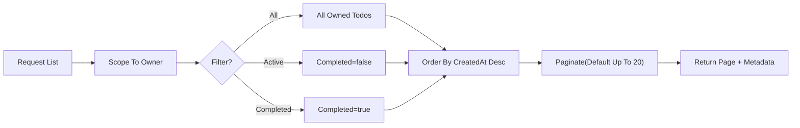

# Minimal Todo List – Requirements Analysis Report (todoList)

Version: v1.0.0 — 2025-10-08 (Asia/Seoul)

## Vision and Goals
Deliver the smallest set of capabilities that enables an individual to capture, review, update, complete, and delete simple personal tasks reliably and quickly. Emphasize predictability, low friction, and focus over breadth of features.

Goals:
- Enable fast task entry and clear task state (Active vs. Completed).
- Keep user attention on doing tasks, not managing a tool.
- Provide unambiguous, testable behavior so developers can implement with confidence.

## Scope Boundaries

### In-Scope Minimal Feature Set
- Create Todo with required title and optional description.
- Read and list personal Todos.
- Update title and description.
- Toggle completion (complete/uncomplete) for personal Todos.
- Delete personal Todos.
- Basic filtering by state (All, Active, Completed).
- Default ordering (newest first); simple pagination in business terms.

### Out-of-Scope Items (Initial Release)
- Collaboration or sharing; multi-owner items.
- Subtasks, tags/labels, priorities, reminders, due dates, recurring tasks, attachments.
- Advanced filters, search syntax, saved searches, reporting.
- UI design specifications, wireframes, or visual styling.
- Technical specifications: API endpoints, database schemas/ERDs, infrastructure and deployment details, library/architecture choices.

## Stakeholders, Personas, and Roles
- guestVisitor: Unauthenticated visitor; cannot view or manage any Todos.
- todoMember: Authenticated user; can fully manage only their own Todos.
- systemAdmin: Administrative user; manages service-level settings and policy/abuse handling without routine access to private Todos.

Principles:
- Least-privilege access; privacy-first boundaries.
- Personal list only; each Todo has exactly one owner.

## Definitions and Entities (Business Terms)
- Todo: A personal task with a required "title" and optional "description"; completion state indicates whether it is done.
- Active: A Todo that is not completed.
- Completed: A Todo marked as done by its owner.
- List: A user’s view of their Todos, optionally filtered and paginated.
- Owner: The member who created the Todo.
- Page: A group of results shown together for readability (e.g., up to 20 items by default).

## Assumptions and Constraints
- Single-person usage per list; no shared lists.
- Language: en-US; timestamps shown in the user’s local timezone; default Asia/Seoul when unspecified.
- Device-agnostic business behavior; no device-specific rules.
- Deletion is permanent in the minimal scope (no recovery window).
- No API, schema, or UI commitments in this report.

## User Journeys and Core Workflows

### Overview Flow

### Listing Flow

## Functional Requirements (EARS)

### Create Todo
- THE todoList service SHALL require "title" to be non-empty after trimming.
- THE todoList service SHALL allow an optional "description" up to a reasonable length (e.g., 1000 characters).
- WHEN a todoMember submits valid data, THE todoList service SHALL create a Todo owned by that member with Completed=false and record creation and update times.
- IF the supplied "title" is missing or exceeds the allowed length, THEN THE todoList service SHALL reject creation with a clear validation message while preserving user input where feasible.
- IF the actor is guestVisitor, THEN THE todoList service SHALL deny creation and guide the actor to authenticate.

### Read Single Todo
- WHEN a todoMember requests an owned Todo by identifier, THE todoList service SHALL return its fields (identifier, title, description if present, completed state, creation and last update times, and completion time if completed).
- IF the Todo does not exist in the requester’s accessible scope, THEN THE todoList service SHALL respond with a not-available message without confirming existence.
- IF the actor is guestVisitor, THEN THE todoList service SHALL deny access and guide to authenticate.

### Update Todo
- WHEN a todoMember submits valid changes to title and/or description for an owned Todo, THE todoList service SHALL apply the changes and update the last update time.
- IF the new content violates validation rules, THEN THE todoList service SHALL reject the update with a field-specific message.
- IF the Todo does not exist or is not owned by the requester, THEN THE todoList service SHALL deny with a neutral not-available message.
- IF the actor is guestVisitor, THEN THE todoList service SHALL deny the update and guide to authenticate.

### Complete and Uncomplete
- WHEN a todoMember requests completion of an owned Todo currently Active, THE todoList service SHALL set Completed=true and record completion time.
- WHEN a todoMember requests uncompletion of an owned Todo currently Completed, THE todoList service SHALL set Completed=false and clear completion time.
- IF the Todo is already in the requested state, THEN THE todoList service SHALL perform no state change and return the current state.
- IF the Todo does not exist or is not owned, THEN THE todoList service SHALL deny with a neutral not-available message.

### Delete Todo
- WHEN a todoMember requests deletion of an owned Todo, THE todoList service SHALL permanently remove it from the member’s perspective so it no longer appears in lists or detail views.
- IF the Todo does not exist or is not owned, THEN THE todoList service SHALL deny deletion with a neutral not-available message.
- IF the actor is guestVisitor, THEN THE todoList service SHALL deny deletion and guide to authenticate.

### List, Filter, Ordering, Pagination
- WHEN a todoMember requests a list, THE todoList service SHALL return only that member’s Todos.
- THE todoList service SHALL support filters: "All", "Active" (Completed=false), "Completed" (Completed=true).
- THE todoList service SHALL order results by CreatedAt descending by default.
- THE todoList service SHALL return results in pages with default page size up to 20 items and allow a policy-defined range (e.g., 10–50) in business terms.
- WHEN a page beyond available results is requested, THE todoList service SHALL return an empty list with page metadata.
- IF the actor is guestVisitor, THEN THE todoList service SHALL deny listing and guide to authenticate.

## Authentication and Authorization (Business-Level)
- THE todoList service SHALL implement least-privilege access for all roles.
- WHEN a user is not authenticated (guestVisitor), THE todoList service SHALL deny all Todo operations and present sign-in guidance.
- WHEN a user is authenticated as todoMember, THE todoList service SHALL authorize only actions on the member’s own Todos and account settings.
- WHEN a user is authenticated as systemAdmin, THE todoList service SHALL authorize only administrative functions and SHALL not expose private member Todo content by default.
- IF an actor attempts to access a Todo not owned by them, THEN THE todoList service SHALL deny the request without revealing whether the Todo exists.

Optional single-user local mode (deployment choice):
- WHERE single-user local mode is enabled, THE todoList service SHALL operate with an implicit member, disable registration/sign-in, and keep all data scoped to the local environment.

## Business Rules and Validation (EARS)
- THE todoList service SHALL trim leading and trailing whitespace for "title" before validation.
- THE todoList service SHALL accept "title" length between 1 and 120 characters after trimming; longer or empty titles SHALL be rejected with clear messages.
- THE todoList service SHALL allow "description" up to 1000 characters; longer descriptions SHALL be rejected with clear messages.
- THE todoList service SHALL set Completed=false on creation and SHALL manage completion state only via explicit user actions.
- THE todoList service SHALL set CreatedAt on creation and update UpdatedAt on any change; completion timestamps SHALL be recorded when completed.
- THE todoList service SHALL associate each Todo with exactly one owner.

## Error Handling and Recovery (EARS)
- THE todoList service SHALL categorize errors into validation, authentication, authorization, missing resource, conflict-like, temporary condition.
- WHEN validation fails, THE todoList service SHALL keep user-provided input available where feasible and present field-specific guidance within about 1 second under typical conditions.
- WHEN authentication is required, THE todoList service SHALL deny the action and guide the user to sign in, resuming the intent where feasible after sign-in.
- WHEN authorization fails, THE todoList service SHALL present a privacy-safe message such as "This item is not available." without confirming existence.
- WHEN a referenced Todo is missing or deleted, THE todoList service SHALL present a neutral message and offer to refresh the list.
- WHEN conflicting or stale edits are detected, THE todoList service SHALL avoid silent overwrites and guide the user to refresh and re-apply.
- WHEN a temporary system condition occurs, THE todoList service SHALL advise retry shortly and avoid data loss.

## Non-Functional Requirements

### Performance (User-Centric Targets)
- THE todoList service SHALL complete creation, update, completion toggle, and deletion with user-visible confirmation within 1 second for at least 95% of attempts under normal conditions; absolute worst-case for single actions SHALL not exceed 2 seconds.
- THE todoList service SHALL return the first page of a Todo list (up to 20 items by default) within 1 second for at least 95% of attempts; worst-case SHALL not exceed 2.5 seconds.
- IF an operation is expected to exceed 2 seconds, THEN THE todoList service SHALL display in-progress feedback until completion or failure.

### Reliability and Availability
- THE todoList service SHALL be available for core operations at least 99.5% of the time monthly, excluding announced maintenance.
- WHEN maintenance occurs, THE todoList service SHALL present a clear, time-bounded message and resume normal operation afterward.
- THE todoList service SHALL ensure operations confirmed to users remain durable thereafter.

### Usability and Accessibility
- THE todoList service SHALL provide concise confirmations after core actions.
- THE todoList service SHALL be operable without reliance on color alone and be usable via keyboard for core actions.
- THE todoList service SHALL present dates/times in the user’s locale and timezone; default Asia/Seoul when unspecified.

### Observability (Outcomes)
- THE todoList service SHALL track user-perceived completion times for core actions and error rates by category.
- WHEN P95 latency for any core action exceeds its target persistently, THE todoList service SHALL trigger internal attention for remediation.

## Security and Privacy (Business-Level)
- THE todoList service SHALL protect the confidentiality and integrity of member Todos and account data.
- THE todoList service SHALL default to deny where an action is not explicitly permitted.
- WHEN abuse patterns or suspicious sign-in behavior are detected, THE todoList service SHALL throttle or require re-authentication before sensitive actions.
- THE todoList service SHALL collect only data necessary to operate minimal Todo functionality and avoid logging secrets or full Todo content in audit records.
- IF policy/abuse review is required, THEN THE todoList service SHALL minimize data exposure, require justification, and record audit details.

## Data Lifecycle and Retention (Business-Level)
- Creation: new Todo starts Active; ownership is the creating member.
- Update: owner may edit title/description; UpdatedAt reflects changes.
- Completion: owner toggles Completed state; completion timestamp is set when Completed and cleared when uncompleted.
- Deletion: minimal default is immediate, permanent removal with no recovery.
- Export (optional business capability): owner may obtain a privacy-safe export of their own Todos in widely supported formats; exact formats are an implementation choice.

EARS highlights:
- WHEN an owner deletes a Todo, THE todoList service SHALL make it unavailable for further actions and exclude it from subsequent lists.
- WHERE export is provided, THE todoList service SHALL include only the requesting owner’s Todos.

## Acceptance Criteria Summary (EARS)

Create
- WHEN a member submits a non-empty trimmed title (≤120 chars) and optional description (≤1000 chars), THE todoList service SHALL create a Todo with Completed=false and set CreatedAt/UpdatedAt.
- IF the title is missing or too long, THEN THE todoList service SHALL reject with a clear validation message.

Read
- WHEN a member requests an owned Todo by identifier, THE todoList service SHALL return its fields.
- IF the Todo is unavailable to the requester, THEN THE todoList service SHALL return a neutral not-available message.

Update
- WHEN a member submits valid edits to an owned Todo, THE todoList service SHALL apply changes and update UpdatedAt.
- IF edits violate validation rules, THEN THE todoList service SHALL reject with field-specific guidance.

Complete/Uncomplete
- WHEN a member completes an Active Todo, THE todoList service SHALL set Completed=true and record completion time.
- WHEN a member uncompletes a Completed Todo, THE todoList service SHALL set Completed=false and clear completion time.

Delete
- WHEN a member deletes an owned Todo, THE todoList service SHALL permanently remove it from subsequent lists and details.

List/Filter/Ordering/Pagination
- THE todoList service SHALL list only the requesting member’s Todos; filter by All/Active/Completed; order newest first; paginate with a default page size up to 20.

AuthZ
- IF a user attempts to access a Todo not owned by them, THEN THE todoList service SHALL deny without confirming existence.

Performance
- THE todoList service SHALL meet the performance targets specified above for core actions under normal conditions.

## Success Metrics
- Time-to-First-Todo: median new member creates the first Todo within 30 seconds of initial use.
- P95 operation latency targets met for create, list first page, update, toggle, and delete for ≥95% of attempts.
- 7-Day retention: at least 25% of new members return to create or complete a Todo within 7 days.
- Zero observed cross-user data exposure incidents.

## Risks and Mitigations
- Scope creep adds complexity and delays: maintain a strict out-of-scope list and revisit only after minimal release success.
- Error message inconsistency reduces user trust: centralize message patterns and reuse stable wording across flows.
- Performance regressions under growth: enforce pagination and measure user-perceived latency with alerts on P95 thresholds.

## Glossary
- Todo: A personal task entry with required title and optional description.
- Active/Completed: States indicating whether a Todo remains to be done or is done.
- Owner: The member to whom the Todo belongs; only the owner can manage it.
- Pagination: Returning results in manageable groups for readability (e.g., up to 20 per page).
- EARS: Easy Approach to Requirements Syntax (WHEN/IF/WHILE/WHERE + THE/SHALL) for clear, testable requirements.
