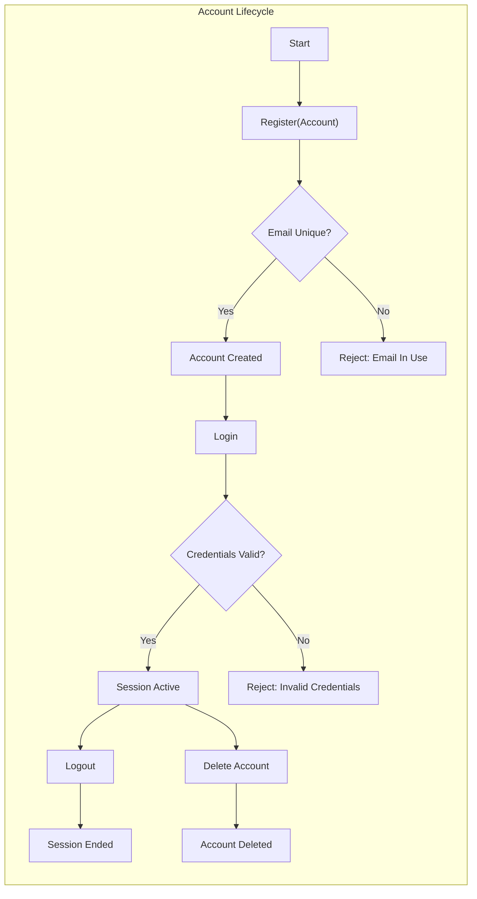
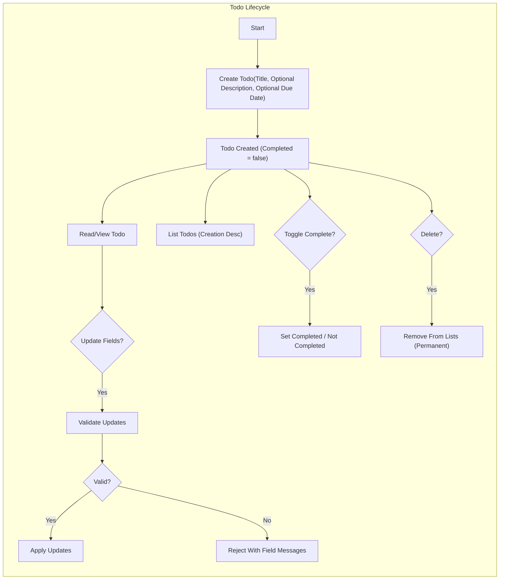

# Minimal Todo Service – Functional Requirements (MVP)

Functional requirements for the minimal Todo service are expressed in precise, testable business language using EARS syntax. Content states WHAT must happen from a user and business perspective without prescribing HOW to implement it. Technical decisions (architecture, APIs, data storage, transport) remain at the development team’s discretion.

Related references: Service scope and value are set in the [Service Overview](./01-service-overview.md). Actor definition and ownership boundaries are detailed in [User Actors and Permissions](./02-user-actors-and-permissions.md). Field rules and validations complement this specification in [Business Rules and Validation](./06-business-rules-and-validation.md).

## Guiding Principles and System Identity

- Minimalism: include only the features essential for a personal Todo list MVP.
- Single actor: one authenticated user manages only their own items; no shared lists or collaboration in MVP.
- Privacy by default: strict ownership and data isolation; no cross-user visibility or inference.
- Deterministic behavior: every operation defines inputs, validations, outcomes, and errors in business terms.
- EARS-first: use WHEN/IF/WHILE/WHERE + THE + SHALL for testable requirements.

Core identity (business perspective):
- THE minimal todo service SHALL require authentication for any action on user-owned todo data.
- THE minimal todo service SHALL allow a user to register, authenticate, and manage personal todo items only within their ownership.
- THE minimal todo service SHALL prevent a user from accessing or inferring another user’s items.

## Performance Expectations (user-perceived targets)

- WHEN a user performs core actions (register, login, create, list, update, toggle, delete), THE minimal todo service SHALL present results within 2 seconds under normal conditions for typical personal volumes (≤ 1,000 items per user).
- WHERE a list response exceeds 20 items by request, THE minimal todo service SHALL present results in pages and complete each page within 2 seconds under normal conditions.
- WHERE concurrent changes occur across a user’s devices, THE minimal todo service SHALL reflect accepted changes in other signed-in sessions within 2 seconds in typical conditions.

## Account Lifecycle (business-level)

### Registration
- WHEN a new person submits required registration information, THE minimal todo service SHALL create a personal account eligible for immediate authentication.
- THE required registration information SHALL include a unique email and a password that meets stated business rules.
- IF a registration email is already associated with an existing account, THEN THE minimal todo service SHALL reject registration with a business message indicating the email is in use.
- IF a password fails minimum strength requirements, THEN THE minimal todo service SHALL reject registration with a business message indicating the requirement(s) not met.

Password rules (business-level):
- THE password SHALL be at least 8 characters.
- THE password SHALL contain at least one letter and at least one number.
- WHERE stronger passwords are provided (e.g., symbols), THE minimal todo service SHALL accept them.

### Login and Session
- WHEN an existing user submits valid credentials, THE minimal todo service SHALL authenticate the user and establish an active session.
- IF credentials are invalid, THEN THE minimal todo service SHALL deny login with a business message indicating invalid credentials.
- WHILE a session remains active, THE minimal todo service SHALL allow all permitted actions on the user’s own items without re-authentication.

### Logout
- WHEN a user initiates logout, THE minimal todo service SHALL terminate the session and prevent further access to protected actions until the next login.

### Account Deletion (user-initiated)
- WHEN a user confirms account deletion, THE minimal todo service SHALL delete the account and make all associated items inaccessible immediately after success.
- IF an account has been deleted, THEN THE minimal todo service SHALL prevent subsequent logins using prior credentials.

## Todo Item Model (business fields and semantics)

Each todo item is owned by exactly one authenticated user and includes:
- Title (required): short, single-line text naming the task.
- Description (optional): free-text details elaborating the task.
- Due date (optional): date-only value indicating intended completion date; time-of-day is not part of MVP semantics.
- Completion status (required, default false): whether the task is done.

Field rules (summaries; full details in the validation reference):
- THE title SHALL be required and between 1 and 120 characters inclusive after trimming, single line, no control characters.
- WHERE a description is provided, THE description SHALL be allowed up to 1,000 characters after trimming.
- WHERE a due date is provided, THE due date SHALL be a valid calendar date (date-only) recognizable in the user’s locale; time-of-day is ignored.
- THE completion status SHALL default to not completed at creation and may be toggled at any time by the owner.

## Ownership and Access (authorization and isolation)

- THE minimal todo service SHALL assign ownership of each todo to exactly one user at creation and SHALL not allow ownership transfer in MVP.
- THE minimal todo service SHALL return only the authenticated user’s items in listing or retrieval.
- IF a user attempts to access, update, toggle, or delete a non-owned item, THEN THE minimal todo service SHALL deny the action without disclosing whether the item exists.

## Todo Lifecycle

### Create Todo
- WHEN a user submits a new todo with a valid title and optional fields, THE minimal todo service SHALL create the todo with completion status set to not completed.
- WHERE a description is provided up to 1,000 characters, THE minimal todo service SHALL store it with the todo.
- WHERE a valid date-only due date is provided, THE minimal todo service SHALL set it on the todo.

Validation failures on create:
- IF the title is missing or trims to empty, THEN THE minimal todo service SHALL reject creation with a business message indicating that a title is required.
- IF the title exceeds 120 characters, THEN THE minimal todo service SHALL reject creation with a business message indicating the maximum length.
- IF the description exceeds 1,000 characters, THEN THE minimal todo service SHALL reject creation with a business message indicating the maximum length.
- IF the due date is not a valid calendar date, THEN THE minimal todo service SHALL reject creation with a business message indicating an invalid date.

### Read Todo (single)
- WHEN a user requests a specific todo they own, THE minimal todo service SHALL return the item’s current business fields and values.
- IF the item does not exist or has been deleted, THEN THE minimal todo service SHALL indicate that the resource is not available.

### List Todos (overview)
- WHEN a user requests their list, THE minimal todo service SHALL return only that user’s items using deterministic ordering and optional filters.
- THE default page size SHALL be 20 items.
- WHERE a page size up to 100 is requested, THE minimal todo service SHALL honor it; WHERE more than 100 is requested, THE minimal todo service SHALL cap at 100 and indicate a cap was applied in business terms.

Default ordering and supported sorting:
- THE default ordering for list results SHALL be creation time descending (newest to oldest by creation time).
- WHERE multiple items share the same creation time to a coarse granularity, THE minimal todo service SHALL apply a deterministic secondary key of last-modified time descending.
- WHERE a user requests alternate ordering, THE minimal todo service SHALL support ordering by:
  - Creation time (newest first or oldest first)
  - Due date (earliest first or latest first), placing no-due-date items last when sorting by due date

Basic filtering:
- THE minimal todo service SHALL support a completion status filter with values:
  - "all": all items regardless of completion
  - "active": only not-completed items
  - "completed": only completed items

### Update Todo (fields)
- WHEN a user updates fields of a todo they own, THE minimal todo service SHALL apply valid changes and return the updated values.
- WHERE the title is updated, THE title SHALL remain between 1 and 120 characters inclusive after trimming and remain single-line.
- WHERE the description is updated, THE description SHALL not exceed 1,000 characters after trimming.
- WHERE a due date is added or updated, THE due date SHALL be a valid calendar date.
- WHERE a due date is cleared, THE minimal todo service SHALL remove the due date.

Validation failures on update:
- IF the updated title is missing or trims to empty, THEN THE minimal todo service SHALL reject the update with a title-required message.
- IF the updated title exceeds 120 characters or contains line breaks, THEN THE minimal todo service SHALL reject the update with a limit/single-line message.
- IF the updated description exceeds 1,000 characters, THEN THE minimal todo service SHALL reject the update with a length message.
- IF the updated due date is not a valid calendar date, THEN THE minimal todo service SHALL reject the update with an invalid-date message.

### Toggle Completion Status
- WHEN a user marks their own item complete, THE minimal todo service SHALL set completion to completed and preserve other fields.
- WHEN a user reopens their own completed item, THE minimal todo service SHALL set completion to not completed and preserve other fields.
- WHERE the item is already in the requested state, THE minimal todo service SHALL acknowledge success without changing other fields (idempotent behavior).

### Delete Todo
- WHEN a user deletes their own item, THE minimal todo service SHALL remove it from listings immediately.
- THE deletion behavior SHALL be permanent in MVP (no recycle bin, no restore).
- IF a user attempts to delete a non-existent item, THEN THE minimal todo service SHALL indicate that the resource is not available.

## Due Date Semantics (date-only)

- THE due date SHALL be optional on create and update; absence means no due semantics apply.
- WHERE a due date is set, THE due date SHALL be a date-only value with no time-of-day semantics in MVP.
- THE minimal todo service SHALL consider a todo overdue if today’s date is strictly after the due date and the item is not completed.
- THE minimal todo service SHALL consider a todo due today if today’s date equals the due date and the item is not completed.
- WHERE time zone considerations apply, THE minimal todo service SHALL apply a consistent interpretation for all users per product policy and SHALL avoid ambiguous behavior in MVP.
- WHERE a due date in the past is provided, THE minimal todo service SHALL accept it and reflect the item as overdue if not completed.

## Error Handling (business-level outcomes)

- IF an unauthenticated person attempts a protected action on todos, THEN THE minimal todo service SHALL deny the action and indicate that sign-in is required.
- IF a user attempts to access a non-owned or non-existent item, THEN THE minimal todo service SHALL deny access or indicate unavailability without disclosing ownership or existence details.
- IF input validation fails (e.g., title length, invalid date), THEN THE minimal todo service SHALL reject the action and provide field-specific business messages.
- IF simultaneous updates cause conflicts or an item is deleted during an attempted change, THEN THE minimal todo service SHALL indicate that the item is no longer available and preserve user data from unintended changes.
- WHERE transient conditions occur, THE minimal todo service SHALL support safe retries and avoid duplicate creations or partial updates.

## Non-Functional Reinforcements (business-level)

- THE minimal todo service SHALL meet user-perceived response targets stated above for typical volumes.
- THE minimal todo service SHALL protect privacy by ensuring data isolation across users.
- THE minimal todo service SHALL provide consistent, human-readable messages for errors without exposing internal details.

## Acceptance Criteria (testable EARS)

Registration and Login
- WHEN a unique email and compliant password are submitted, THE minimal todo service SHALL create an account and allow subsequent login.
- IF a duplicate email is used at registration, THEN THE minimal todo service SHALL reject the request with a message indicating the email is in use.
- WHEN valid credentials are used at login, THE minimal todo service SHALL establish a session; IF invalid, THEN access SHALL be denied with a generic invalid-credentials message.

Logout
- WHEN a user logs out, THE minimal todo service SHALL terminate the session and require login for further actions.

Create Todo
- WHEN a valid title is provided (1–120 chars, single line), THE minimal todo service SHALL create the item with completion=false.
- WHERE a description up to 1,000 chars is provided, THE minimal todo service SHALL store it; IF longer, THEN the request SHALL be rejected with a length message.
- WHERE a valid date-only due date is provided, THE minimal todo service SHALL set it; IF invalid, THEN the request SHALL be rejected with an invalid-date message.
- IF title is empty or exceeds 120 chars, THEN THE minimal todo service SHALL reject creation with a title rule message.

Read Todo
- WHEN the owner requests an existing item, THE minimal todo service SHALL return all business fields; IF the item does not exist, THEN indicate unavailability.

List Todos
- WHEN the owner requests the list without filters, THE minimal todo service SHALL return up to 20 items ordered by creation time descending.
- WHERE a page size up to 100 is requested, THE minimal todo service SHALL return that many items; WHERE more than 100 is requested, cap at 100 and indicate a cap applied.
- WHERE a status filter is set to active, THE minimal todo service SHALL return only not-completed items; where completed, only completed items; where all, both.
- WHERE sorting by due date ascending is chosen, THE minimal todo service SHALL place items without a due date last.

Update Todo
- WHEN the owner updates title, description, or due date within constraints, THE minimal todo service SHALL persist the changes and reflect them on subsequent reads.
- IF an updated field violates constraints (title empty/too long/multiline; description > 1,000; invalid date), THEN THE minimal todo service SHALL reject the update and preserve existing values.

Toggle Completion
- WHEN the owner marks complete, THE minimal todo service SHALL set completed; WHEN reopened, set not completed; WHERE state is already the requested state, acknowledge success with no change.

Delete Todo
- WHEN the owner deletes the item, THE minimal todo service SHALL remove it from listings immediately and exclude it from subsequent operations.
- IF deletion is requested for a non-existent item, THEN THE minimal todo service SHALL indicate that the resource is not available.

Ownership and Isolation
- IF a user attempts to access or modify another user’s item, THEN THE minimal todo service SHALL deny the action and provide a permission message without revealing existence.

Performance
- WHEN any core action is performed under normal conditions and typical data volumes, THE minimal todo service SHALL complete within 2 seconds perceived response time per action.

## Visual References (Mermaid diagrams)

### Account Lifecycle (conceptual)

```mermaid
graph LR
  subgraph "Account Lifecycle"
    A["Start"] --> B["Register(Account)"]
    B --> C{"Email Unique?"}
    C -->|"Yes"| D["Account Created"]
    C -->|"No"| E["Reject: Email In Use"]
    D --> F["Login"]
    F --> G{"Credentials Valid?"}
    G -->|"Yes"| H["Session Active"]
    G -->|"No"| I["Reject: Invalid Credentials"]
    H --> J["Logout"]
    H --> K["Delete Account"]
    J --> L["Session Ended"]
    K --> M["Account Deleted"]
  end
```

### Todo Lifecycle (conceptual)

```mermaid
graph LR
  subgraph "Todo Lifecycle"
    A["Start"] --> B["Create Todo(Title, Optional Description, Optional Due Date)"]
    B --> C["Todo Created (Completed = false)"]
    C --> D["Read/View Todo"]
    C --> E["List Todos (Creation Desc)"]
    D --> F{"Update Fields?"}
    F -->|"Yes"| G["Validate Updates"]
    G --> H{"Valid?"}
    H -->|"Yes"| I["Apply Updates"]
    H -->|"No"| J["Reject With Field Messages"]
    C --> K{"Toggle Complete?"}
    K -->|"Yes"| L["Set Completed / Not Completed"]
    C --> M{"Delete?"}
    M -->|"Yes"| N["Remove From Lists (Permanent)"]
  end
```

## Related References
- [Service Overview](./01-service-overview.md) — vision, scope, and KPIs for the minimal Todo service.
- [User Actors and Permissions](./02-user-actors-and-permissions.md) — actor definition, access boundaries, and audit expectations.
- [Business Rules and Validation](./06-business-rules-and-validation.md) — field constraints, ownership rules, ordering, and error messages.
