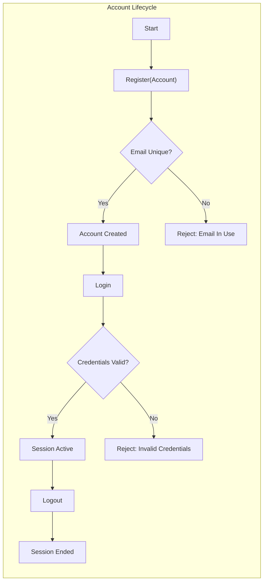
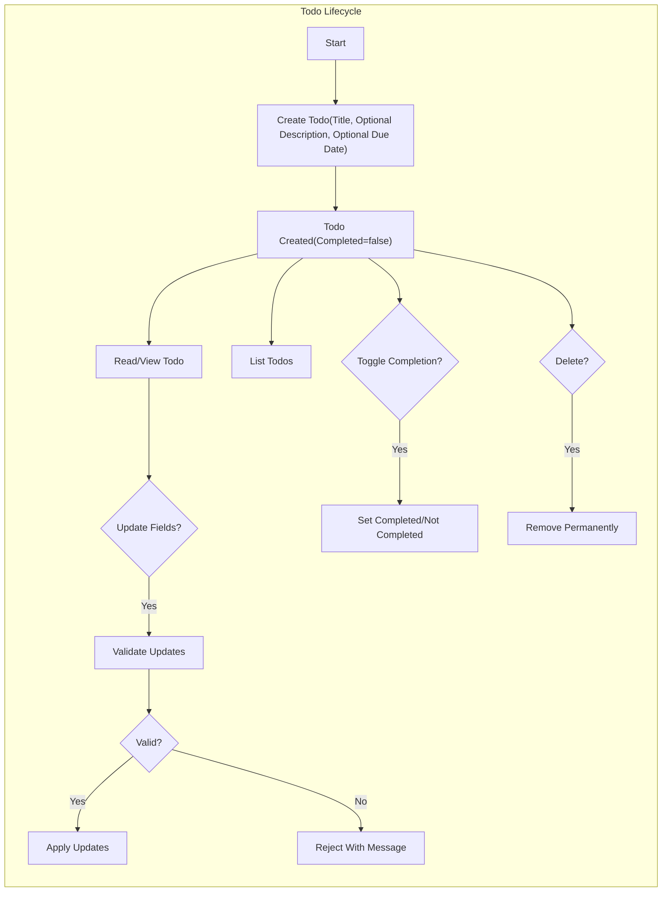
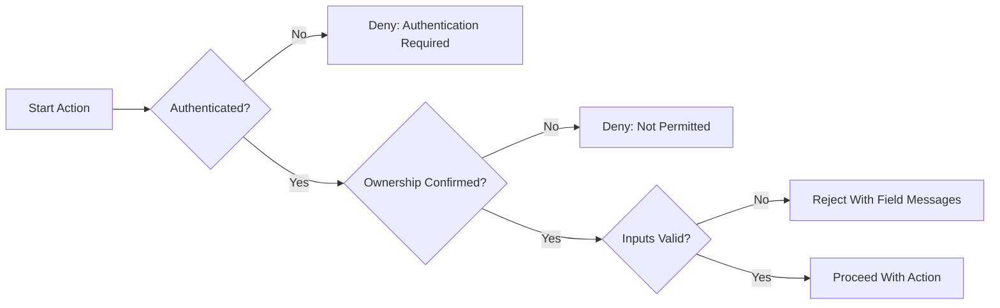

# Minimal Todo Service — Functional Requirements (MVP)

The todo service delivers the minimum capabilities required for an individual to capture and manage personal tasks. Requirements are expressed in business terms and EARS format where applicable. No technical implementation details (APIs, database schemas, protocols) are prescribed. The scope is intentionally minimal and excludes collaboration, notifications, tags, search, and recurrence.

## 1) Guiding Principles and Scope Guards

Principles
- THE todo service SHALL prioritize simplicity and predictability, limiting features to essential personal task management.
- THE todo service SHALL require authentication before any action on todo data.
- THE todo service SHALL isolate all user data so that no user can view or infer another user’s items.

Scope Guards (EARS)
- IF a feature requires multi-user collaboration or shared access, THEN THE todo service SHALL consider it out of scope for MVP.
- IF a feature requires notifications, reminders, or scheduled background tasks, THEN THE todo service SHALL consider it out of scope for MVP.
- IF a feature introduces tags, labels, priorities, attachments, subtasks, or projects, THEN THE todo service SHALL consider it out of scope for MVP.
- IF a feature requires full-text search or complex filtering beyond status, THEN THE todo service SHALL consider it out of scope for MVP.

## 2) Actors and Authentication (Business-Level)

Actors
- User: An authenticated individual who can manage only their own todo items.
- Unauthenticated State: A non-actor condition in which no access to personal todo data is permitted.

Authentication and Session Behavior (Business Expectations)
- WHEN an individual provides valid registration information, THE todo service SHALL create a personal account.
- WHEN a User submits valid credentials, THE todo service SHALL establish an authenticated state for subsequent permitted actions.
- WHEN a User requests logout, THE todo service SHALL end authenticated access for subsequent requests.
- IF a User’s authenticated state expires due to inactivity, THEN THE todo service SHALL require re-authentication before any User-only action proceeds.
- IF credentials are invalid, THEN THE todo service SHALL deny authentication without revealing whether a specific account exists.

## 3) Domain Glossary and Field Semantics

Definitions (Business Terms)
- Todo Item: A personal task owned by exactly one User.
- Title (required): Short, single-line text naming the task.
- Description (optional): Free-text detail supporting task execution.
- Due Date (optional): Date-only value indicating intended completion date; no time-of-day in MVP.
- Completion Status: Boolean state indicating completed or not completed; defaults to not completed at creation.
- Created At / Updated At: System-maintained timestamps used for ordering and audit expectations; not user-editable.

Normalization Rules (Business-Level)
- WHEN text fields are received, THE todo service SHALL trim leading and trailing whitespace.
- WHEN a required text field trims to empty, THE todo service SHALL treat it as invalid.
- WHEN an optional text field trims to empty, THE todo service SHALL store it as absent.

## 4) Functional Requirements by Lifecycle

### 4.1) Create Todo
Inputs (Business-Level)
- Title (required, 1–120 characters after trimming, single line)
- Description (optional, up to 1,000 characters after trimming)
- Due Date (optional, date-only; valid calendar date)

Behavior and Validations (EARS)
- WHEN a User submits a new todo with a non-empty title within allowed length, THE todo service SHALL create the todo with completion set to not completed.
- WHERE a description is provided within the allowed length, THE todo service SHALL store the description with the todo.
- WHERE a due date is provided and is a valid calendar date, THE todo service SHALL store the due date.
- IF the title is missing, trims to empty, includes line breaks, or exceeds 120 characters, THEN THE todo service SHALL reject creation with a clear business message.
- IF the description exceeds 1,000 characters after trimming, THEN THE todo service SHALL reject creation with a clear business message.
- IF the due date is not a valid calendar date, THEN THE todo service SHALL reject creation with a clear business message.

Outcomes
- THE todo service SHALL assign ownership of the created item to the authenticated User.
- THE todo service SHALL make the created item immediately visible in the User’s listings according to ordering rules.

### 4.2) Read Single Todo
- WHEN a User requests a specific todo they own, THE todo service SHALL return the business fields and current values.
- IF the referenced todo does not exist or was previously deleted, THEN THE todo service SHALL respond that the resource is not available.
- IF the referenced todo is not owned by the User, THEN THE todo service SHALL deny access without disclosing whether the todo exists.

### 4.3) List Todos
Scope and Paging
- THE todo service SHALL list only the authenticated User’s non-deleted items.
- THE todo service SHALL return 20 items per page by default and accept page sizes up to 100 items.
- WHERE a requested page size exceeds 100, THE todo service SHALL cap at 100 and indicate that a cap was applied in a business-appropriate manner.

Ordering and Filters
- THE todo service SHALL order list results by most recently created first (creation time descending) by default.
- WHERE a User selects an alternate order, THE todo service SHALL support ordering by:
  - Creation time ascending (oldest first)
  - Due date ascending (earliest first), placing items without a due date last
- THE todo service SHALL support a status filter with values "all", "active", and "completed".
  - WHERE status is "active", THE todo service SHALL include only items not completed.
  - WHERE status is "completed", THE todo service SHALL include only items marked completed.
  - WHERE status is "all", THE todo service SHALL include both completed and not completed items.

Access Control
- IF a request is made from the Unauthenticated State, THEN THE todo service SHALL deny listing and indicate that authentication is required.

### 4.4) Update Todo
Allowed Field Updates
- Title (1–120 characters, single line)
- Description (0–1,000 characters after trimming)
- Due Date (valid calendar date) or removal of due date

Behavior and Validations (EARS)
- WHEN a User updates fields on their own todo with valid values, THE todo service SHALL apply the changes and return the updated values.
- IF an updated title is missing, trims to empty, includes line breaks, or exceeds 120 characters, THEN THE todo service SHALL reject the update and preserve existing values.
- IF an updated description exceeds 1,000 characters, THEN THE todo service SHALL reject the update and preserve existing values.
- IF an updated due date is not a valid calendar date, THEN THE todo service SHALL reject the update and preserve existing values.
- WHERE a User clears the due date, THE todo service SHALL remove the due date and reflect no due date for the item.
- IF the todo is not owned by the User, THEN THE todo service SHALL deny the update and avoid revealing cross-user information.

### 4.5) Toggle Completion
- WHEN a User marks an incomplete todo they own as complete, THE todo service SHALL set completion to completed and keep other fields unchanged.
- WHEN a User reopens a completed todo they own, THE todo service SHALL set completion to not completed and keep other fields unchanged.
- WHERE a todo is already in the requested state, THE todo service SHALL accept the request and confirm the unchanged state (idempotent outcome).
- IF the todo is not owned by the User, THEN THE todo service SHALL deny the action without disclosing cross-user details.

### 4.6) Delete Todo (Hard Delete)
- WHEN a User deletes their own todo, THE todo service SHALL remove it from the User’s active listings immediately after success.
- THE todo service SHALL perform deletion as irreversible in MVP; there is no recycle bin or restore operation.
- IF a deletion is requested for a todo that does not exist or is no longer owned by the requester, THEN THE todo service SHALL communicate that the item is not available without implying cross-user existence.

## 5) Ownership, Permissions, and Isolation

Ownership
- THE todo service SHALL associate each todo with exactly one owning User upon creation.
- THE todo service SHALL forbid ownership transfer in MVP.

Permissions (Business View)
- WHILE a User is authenticated, THE todo service SHALL allow creating, reading, updating, deleting, listing, filtering, sorting, and toggling completion on that User’s own items only.
- IF an Unauthenticated State attempts any todo operation, THEN THE todo service SHALL deny access and indicate authentication is required.
- IF a User attempts to access any item not owned by that User, THEN THE todo service SHALL deny the action and avoid disclosing whether the item exists.

Isolation
- THE todo service SHALL ensure listings and reads only ever return the authenticated User’s items.
- THE todo service SHALL prevent enumeration or inference of other Users’ items through errors, counts, or ordering.

## 6) Due Date and Time Interpretation

Semantics
- THE todo service SHALL treat due date as a calendar date (no time-of-day). 
- THE todo service SHALL accept due dates in the past, present, or future; overdue is determined by comparison, not validation.
- THE todo service SHALL consider a todo "overdue" when the current date is strictly after the due date and the todo is not completed.
- THE todo service SHALL consider a todo "due today" when the current date equals the due date and the todo is not completed.

Timezone Interpretation
- WHILE no user-specific timezone is configured, THE todo service SHALL interpret due dates using a consistent default aligned to business policy (default: Asia/Seoul) to avoid ambiguous comparisons.
- WHERE a user-specific timezone is introduced in future scope, THE todo service SHALL interpret due/overdue comparisons consistently using that timezone.

## 7) Error Handling (Business Outcomes)

Validation Failures
- WHEN validation fails (e.g., title empty, title too long, description too long, invalid date), THE todo service SHALL reject the action and provide field-specific business messages within a perceived 2-second window under normal conditions.

Authentication and Authorization
- WHEN a request lacks authenticated access, THE todo service SHALL deny the action and indicate that login is required.
- WHEN a request targets an item not owned by the requester, THE todo service SHALL deny the action and avoid disclosing cross-user existence.

Not Found and State Conflicts
- WHEN a request references a todo that does not exist or has already been deleted, THE todo service SHALL communicate that the resource is not available.
- WHERE a request would repeat a state (e.g., complete an already completed item), THE todo service SHALL produce an idempotent confirmation rather than an error.

Resilience and Retry (Business Expectations)
- WHERE transient issues occur, THE todo service SHALL allow safe retries without creating duplicate todos or partial updates.

## 8) Performance and Responsiveness Targets (User-Perceived)

- WHEN a User performs core actions (register, login, create, list, update, toggle, delete) under normal conditions, THE todo service SHALL deliver perceived responses within 2 seconds.
- WHERE more than 100 list items are requested at once, THE todo service SHALL cap the result to 100 items per page to maintain responsiveness.
- WHERE the same user is active on multiple devices, THE todo service SHALL reflect accepted changes in other active sessions within a short window consistent with user expectations (target within 2 seconds, business-level).

## 9) Acceptance Criteria (Black-Box, EARS)

Registration and Login
- WHEN a unique email and compliant password are submitted, THE todo service SHALL create an account and allow immediate login.
- IF a duplicate email is submitted at registration, THEN THE todo service SHALL reject registration and indicate the email is already in use.
- WHEN valid credentials are submitted, THE todo service SHALL establish an authenticated state.
- IF invalid credentials are submitted, THEN THE todo service SHALL deny authentication with a generic invalid-credentials message.
- WHEN logout is requested, THE todo service SHALL end the authenticated state.

Create
- WHEN a valid title (1–120 chars, single line) is provided, THE todo service SHALL create the item with completion set to not completed and assign ownership to the requester.
- WHERE a valid description (<=1,000 chars) is provided, THE todo service SHALL store it with the item.
- WHERE a valid date-only due date is provided, THE todo service SHALL store it with the item.
- IF title is empty, includes line breaks, or exceeds 120 chars, THEN THE todo service SHALL reject creation.
- IF description exceeds 1,000 chars, THEN THE todo service SHALL reject creation.
- IF due date is not a valid calendar date, THEN THE todo service SHALL reject creation.

Read and List
- WHEN the owner requests an existing item, THE todo service SHALL return all business fields.
- WHEN the owner requests a list without filters, THE todo service SHALL return up to 20 items in creation-time descending order.
- WHERE a page size up to 100 is requested, THE todo service SHALL return that many items; otherwise, it SHALL cap at 100 and indicate the cap.
- WHERE status filter is active, completed, or all, THE todo service SHALL return only items matching the selected status.
- WHERE sorting by due date ascending is selected, THE todo service SHALL place items without a due date last.
- IF an unauthenticated request is made to list, THEN THE todo service SHALL deny the request and indicate authentication is required.

Update
- WHEN the owner updates the title within 1–120 chars single line, THE todo service SHALL accept and reflect the change.
- WHEN the owner updates the description within 0–1,000 chars, THE todo service SHALL accept and reflect the change.
- WHEN the owner sets a valid date-only due date or clears the due date, THE todo service SHALL accept and reflect the change.
- IF any updated field violates constraints, THEN THE todo service SHALL reject the update and preserve existing values.
- IF the requester is not the owner, THEN THE todo service SHALL deny the update without disclosing whether the item exists.

Toggle Completion
- WHEN the owner marks an incomplete item complete, THE todo service SHALL set completion to completed and confirm success.
- WHEN the owner reopens a completed item, THE todo service SHALL set completion to not completed and confirm success.
- WHERE the requested state equals current state, THE todo service SHALL return an idempotent confirmation.

Delete
- WHEN the owner deletes an item, THE todo service SHALL remove it from listings immediately after success.
- IF deletion is attempted for a non-existent or previously deleted item, THEN THE todo service SHALL communicate that the item is not available.
- IF the requester is not the owner, THEN THE todo service SHALL deny deletion and avoid disclosing existence.

Ownership and Isolation
- THE todo service SHALL ensure list and retrieval functions return only the authenticated User’s items.
- IF any request references an item not owned by the requester, THEN THE todo service SHALL deny access without revealing cross-user information.

Performance
- WHEN core actions are performed under normal conditions and typical data sizes (<= 1,000 items per user), THE todo service SHALL complete within a perceived 2 seconds.

## 10) Visual References (Mermaid)

### 10.1) Account Lifecycle (Conceptual)

### 10.2) Todo Lifecycle (Conceptual)

### 10.3) Authorization and Validation Guard (Conceptual)

## 11) Out-of-Scope Confirmation

- THE todo service SHALL exclude collaboration, sharing, role-based access, or administrative features in MVP.
- THE todo service SHALL exclude reminders, notifications, scheduled tasks, and recurring items in MVP.
- THE todo service SHALL exclude tags, priorities, custom fields, attachments, and subtasks in MVP.
- THE todo service SHALL exclude full-text search and advanced filters in MVP.

## 12) Traceability to Related Documents

- Business context and scope foundation appear in the Service Overview.
- Actor definition, permissions, and isolation expectations appear in the User Actors and Permissions guide.
- Field-level rules and validation messages align with the Business Rules and Validation reference.
- Performance, security, and reliability targets align with the Non-Functional Requirements.
