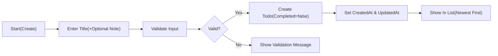
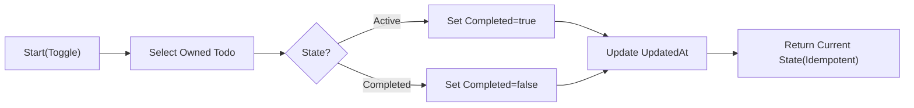
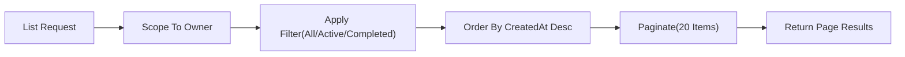
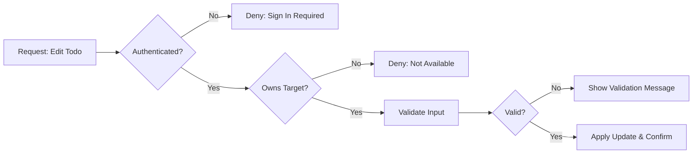

# Minimal Todo List – Requirements Analysis (todoList)

## Vision and Goals
Provide the smallest set of capabilities for a personal Todo list that enables users to capture, manage, complete, and remove simple tasks with minimal friction. Priorities are simplicity, predictability, privacy, and dependable responsiveness. Collaboration, reminders, and other advanced features are intentionally excluded to maintain focus on core value.

## Scope Boundaries

- In-Scope (Minimal Feature Set)
  - Create a Todo with a required title and optional note.
  - List a member’s own Todos with minimal filters by state (All, Active, Completed).
  - Update a Todo’s title and optional note.
  - Toggle completion: mark complete and mark active (uncomplete).
  - Delete a Todo (permanent in minimal scope).
  - Default ordering by most recent creation time; page-based list presentation with a small, fixed page size.
  - Authentication and session management in business terms; role-based access (guestVisitor, todoMember, systemAdmin).

- Out-of-Scope (Initial Release)
  - Sharing, collaboration, or assigning Todos to others.
  - Subtasks, projects, labels/tags, priorities, due dates, reminders, recurring tasks, calendar integrations.
  - Attachments or file uploads.
  - Advanced search, saved filters, complex reporting.
  - API specifications, database schemas/ERDs, infrastructure or deployment details, UI layouts.

## User Roles and Permission Overview

- Role Principles
  - THE todoList service SHALL implement least-privilege access for all roles.
  - THE todoList service SHALL restrict personal Todo visibility to the owner by default.

- Roles
  - guestVisitor: Unauthenticated user; cannot view or manage any personal Todo data.
  - todoMember: Authenticated user; may create, list, read, update, complete/uncomplete, and delete only their own Todos.
  - systemAdmin: Administrative user; manages service-level settings and policy enforcement. No routine access to members’ private Todos. Any exceptional oversight requires policy gates and audit.

## Core Business Processes

- Account Access
  - Register (optional for deployments not using single-user local mode).
  - Sign in to become todoMember; sign out to return to guestVisitor.
- Todo Management
  - Create → Read/List → Update → Complete/Uncomplete → Delete.
- Ownership Boundaries
  - All Todo operations occur strictly within the owner’s scope.

## Functional Requirements (EARS)

- Creation
  - THE todoList service SHALL require a non-empty title after trimming leading/trailing whitespace.
  - WHEN a todoMember submits a valid title (1–100 characters after trim) with an optional note (0–500 characters), THE todoList service SHALL create a new Todo owned by that member with Completed=false and record CreatedAt and UpdatedAt.
  - IF the title is missing or exceeds the limit, THEN THE todoList service SHALL reject creation and present a clear validation message.
  - WHERE the actor is guestVisitor, THE todoList service SHALL deny creation and guide the user to sign in.

- Read/List
  - THE todoList service SHALL return only the requesting member’s Todos when listing.
  - THE todoList service SHALL support filters by state: All, Active (Completed=false), Completed (Completed=true).
  - THE todoList service SHALL order results by CreatedAt descending by default.
  - THE todoList service SHALL present lists in fixed-size pages of 20 items by default.
  - WHEN a requested page has no items, THE todoList service SHALL return an empty result with page context indicating no items on that page.

- Read Single
  - WHEN a member requests their own Todo by Identifier, THE todoList service SHALL return Identifier, Title, Note (if any), Completed, CreatedAt, and UpdatedAt.
  - IF the Todo is not accessible within the member’s scope, THEN THE todoList service SHALL respond with a privacy-safe not-available message.

- Update
  - WHEN a todoMember submits a new valid title and/or note for an owned Todo, THE todoList service SHALL apply the change and update UpdatedAt, preserving CreatedAt and ownership.
  - IF the new title or note violates validation rules, THEN THE todoList service SHALL reject the update and present a clear validation message.
  - WHERE the actor is guestVisitor or a non-owner, THE todoList service SHALL deny the update and avoid confirming the item’s existence.

- Completion Toggle
  - WHEN a todoMember marks an owned Todo as completed, THE todoList service SHALL set Completed=true and update UpdatedAt.
  - WHEN a todoMember marks an owned Todo as active (uncomplete), THE todoList service SHALL set Completed=false and update UpdatedAt.
  - IF the Todo is already in the requested state, THEN THE todoList service SHALL perform no state change and return the current state without error (idempotent behavior).

- Deletion
  - WHEN a todoMember requests deletion of an owned Todo, THE todoList service SHALL permanently remove it from subsequent reads and listings.
  - IF the Todo does not exist in the member’s accessible scope, THEN THE todoList service SHALL respond with a privacy-safe not-available message.

- Ownership and Permissions
  - THE todoList service SHALL bind each Todo to exactly one owner (the creating member).
  - IF a user attempts to access a Todo not owned by them, THEN THE todoList service SHALL deny the action without revealing whether the Todo exists.
  - WHILE a user is unauthenticated, THE todoList service SHALL not disclose any Todo content.

- Authentication and Session
  - WHEN a user provides valid credentials, THE todoList service SHALL establish an authenticated session and authorize actions appropriate to todoMember.
  - WHEN a signed-in user requests sign out, THE todoList service SHALL end the current session and return the user to guestVisitor state.
  - IF a session expires or becomes invalid, THEN THE todoList service SHALL require re-authentication before allowing member-only operations.

- Performance Targets (User-Centric)
  - THE todoList service SHALL complete create, update, toggle, delete, and single-item read within 1 second for at least 95% of attempts under normal conditions.
  - THE todoList service SHALL present the first page of a list (up to 20 items) within 1 second for at least 95% of attempts under normal conditions.

## Business Rules and Validation

- Title
  - THE todoList service SHALL trim leading/trailing whitespace before validation.
  - THE todoList service SHALL require title length between 1 and 100 characters after trimming.
  - IF the title exceeds the maximum or is empty after trim, THEN THE todoList service SHALL reject with a clear message.

- Note (optional)
  - THE todoList service SHALL allow an optional note up to 500 characters.
  - THE todoList service SHALL preserve user-provided casing and internal whitespace.
  - IF the note exceeds 500 characters, THEN THE todoList service SHALL reject with a clear message.

- Timestamps and Identity
  - THE todoList service SHALL set CreatedAt at creation and SHALL not modify it afterward.
  - WHEN a Todo is modified (text change or completion toggle), THE todoList service SHALL update UpdatedAt.
  - THE todoList service SHALL assign each Todo a unique Identifier for business reference.

- Idempotency and Duplicates
  - THE todoList service SHALL treat completion/uncompletion as idempotent operations.
  - THE todoList service SHALL allow duplicate titles across a member’s Todos; preventing duplicates is a user choice in minimal scope.

- Pagination
  - THE todoList service SHALL use a default page size of 20 items.
  - WHERE a custom page size is supported, THE todoList service SHALL accept values between 10 and 50 inclusive; out-of-range values SHALL be adjusted or rejected with a clear message according to a consistent policy.

## Error Handling and Recovery (Business-Level)

- Error Taxonomy
  - Validation Errors: invalid or missing fields.
  - Authentication Errors: unauthenticated access or expired sessions.
  - Authorization Errors: attempts to access or modify another member’s Todo.
  - Missing Resource: item no longer exists or is outside the user’s accessible scope.
  - Conflict-Like Conditions: actions based on stale views or rapid repeated toggles.
  - Temporary Conditions: transient unavailability or maintenance.

- Recovery Guidance (EARS)
  - WHEN a validation error occurs, THE todoList service SHALL keep user input where feasible and highlight which rule failed with actionable guidance.
  - WHEN authentication is required, THE todoList service SHALL guide the user to sign in and resume the intended action where feasible.
  - WHEN permission is lacking, THE todoList service SHALL use neutral, privacy-safe messaging and provide a path back to the user’s list.
  - WHEN a resource is missing, THE todoList service SHALL inform the user and offer to refresh the list.
  - WHEN a conflict is detected, THE todoList service SHALL prevent silent overwrite and request a refresh before re-applying the change.
  - WHEN a temporary condition occurs, THE todoList service SHALL advise retry shortly and avoid data loss.

## Non-Functional Requirements

- Performance (User Perception)
  - THE todoList service SHALL meet the performance targets stated in Functional Requirements for core operations.
  - IF an operation is expected to exceed 2 seconds, THEN THE todoList service SHALL present in-progress feedback until completion or failure.

- Reliability and Availability
  - THE todoList service SHALL be available for core actions at least 99.5% of the time per month, excluding planned maintenance with advance notice.
  - WHEN a user returns after a disruption, THE todoList service SHALL present accurate, up-to-date Todo states reflecting only confirmed operations.

- Usability and Accessibility
  - THE todoList service SHALL present concise confirmations after create, update, toggle, and delete actions.
  - THE todoList service SHALL support keyboard-only operation for core actions and provide non-color cues for state.

- Observability (Business Outcomes)
  - THE todoList service SHALL measure user-perceived latencies for core actions and track success/failure counts for reliability.
  - WHEN P95 latency exceeds targets for a sustained period, THE todoList service SHALL trigger internal investigation.

## Security and Privacy Expectations

- Confidentiality and Ownership
  - THE todoList service SHALL ensure that only the owner can access a Todo under normal operations.
  - IF a user attempts cross-user access, THEN THE todoList service SHALL deny the action without revealing item existence.

- Authentication and Session
  - WHEN a user signs in successfully, THE todoList service SHALL authorize actions permitted to todoMember.
  - WHEN a user signs out, THE todoList service SHALL end the session and return the user to guestVisitor.

- Administrative Oversight
  - WHERE policy triggers require administrative action, THE todoList service SHALL minimize any exceptional access, require justification, and record audit events (actor, time, reason) without storing Todo content in audit logs.

- Privacy and Minimization
  - THE todoList service SHALL collect and retain only data necessary for minimal Todo operations.

## Data Lifecycle and Retention

- Creation and Update
  - THE todoList service SHALL create Todos in Active state with CreatedAt and UpdatedAt set.
  - WHEN a Todo is edited or toggled, THE todoList service SHALL update UpdatedAt accordingly.

- Completion State
  - WHEN marked complete, THE todoList service SHALL set Completed=true; WHEN uncompleted, THE todoList service SHALL set Completed=false.

- Deletion and Purge
  - WHEN a Todo is deleted, THE todoList service SHALL permanently remove it from listings and future access in the minimal scope.

- Export (Optional Minimal)
  - WHEN a member requests a personal export, THE todoList service SHALL provide a privacy-preserving export of that member’s own Todos in a widely supported format, excluding other users’ data.

## User Flows (Mermaid)

## Success Metrics and Acceptance

- Success Metrics (User-Centric)
  - Time-to-First-Todo: A new member creates the first Todo within 30 seconds of initial access on median.
  - P95 Latency: Create/update/toggle/delete/list-first-page complete within 1 second for at least 95% of attempts under normal conditions.
  - Data Integrity: Zero observed incidents of cross-user data exposure.
  - Daily Completion Rate: Typical active users complete at least one Todo per active day (non-binding target for product health).

- Acceptance Checks
  - WHEN a valid Todo is created, THE todoList service SHALL show it at the top of the member’s list.
  - WHEN an owned Todo is edited with valid data, THE todoList service SHALL persist the change and update UpdatedAt.
  - WHEN completion is toggled, THE todoList service SHALL reflect the new state consistently across list and detail views.
  - IF a non-owner attempts access, THEN THE todoList service SHALL deny with a privacy-safe message and avoid leaking existence.
  - IF an unauthenticated user attempts member-only actions, THEN THE todoList service SHALL guide sign-in and perform no data changes.

## Glossary

- Active: A Todo not yet completed.
- Completed: A Todo marked as done.
- Identifier: Unique business identity for a Todo, used to reference a single item.
- List: A user’s view of their Todos, ordered by CreatedAt descending by default.
- Note: Optional user-provided text associated with a Todo, up to 500 characters in minimal scope.
- Owner: The member who created the Todo and is permitted to manage it.
- Page: A group of Todos presented together (default 20 items) for readability.
- Scope: The set of Todos a user is permitted to access, limited to their own.
- Session: The authenticated context under which a user performs actions.
- todoMember: An authenticated user allowed to manage only their own Todos.
- guestVisitor: An unauthenticated user restricted from accessing personal Todos.
- systemAdmin: An administrative user permitted to manage service-level settings without routine access to private Todos.
