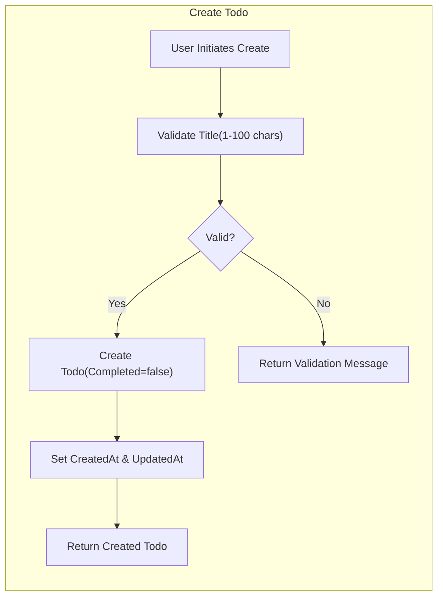
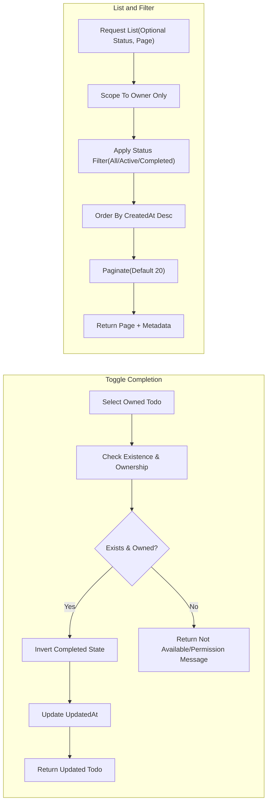

# Minimal Todo Functional Requirements (todoList)

## 1. Purpose and Scope
Minimal business-functional requirements defining the smallest viable capabilities to manage personal Todos end-to-end: create, read, update (title), complete/uncomplete, delete, list with basic state filtering, ordering, and pagination. Content is written in natural language for developers; WHAT is required is defined, while technical implementation details (APIs, schemas, transports, libraries) remain at the team’s discretion. Requirements use EARS syntax where applicable and are testable.

## 2. Assumptions and Constraints
- Roles and access model (business level):
  - guestVisitor: no access to any personal Todo content or actions.
  - todoMember: full control of only their own Todos.
  - systemAdmin: system oversight; no routine visibility of members’ private Todos; exceptional, policy-gated oversight is outside minimal flows.
- Ownership: Each Todo is bound to exactly one owner (the creating todoMember); cross-user access is denied without revealing existence of others’ items.
- Out of scope (minimal release): sharing/collaboration, tags/labels, projects, priorities, due dates/recurrence/reminders, attachments, comments, bulk operations, import/export tooling, offline mode, advanced search or filtering beyond state, UI/UX layouts.
- Deletion policy: Immediate and permanent (hard delete) in minimal scope.
- Timezones/localization: Human-visible timestamps are understood to be shown in the user’s local timezone; internal storage format is implementation-defined.

## 3. Todo Item Definition (Business Terms)
A Todo represents a short personal task reminder with minimal essential information.

### 3.1 Fields
- Identifier: System-assigned unique identity for action targeting.
- Title: Required short text provided by the owner.
- Completed: Boolean state indicating done vs. not done.
- CreatedAt: System-managed creation timestamp.
- UpdatedAt: System-managed last modification timestamp.

### 3.2 Field Rules
- Title validation:
  - THE todoList service SHALL require Title to be non-empty after trimming leading/trailing whitespace.
  - THE todoList service SHALL validate Title length between 1 and 100 characters after trimming.
  - IF Title exceeds 100 characters or is empty after trimming, THEN THE todoList service SHALL reject the operation and preserve prior state.
  - THE todoList service SHALL preserve internal whitespace and casing.
- Completed state defaults:
  - THE todoList service SHALL set Completed=false on creation.
- Identifier uniqueness:
  - THE todoList service SHALL ensure each Todo has a unique Identifier.
- Timestamp management:
  - THE todoList service SHALL set CreatedAt on creation and SHALL not change it afterward.
  - WHEN a Todo changes (title edit or completion toggle), THE todoList service SHALL set UpdatedAt.
- Ownership enforcement:
  - THE todoList service SHALL associate each Todo to exactly one owner (the creating member) and SHALL deny any non-owner access without revealing existence.
- Duplicate titles (business stance):
  - THE todoList service SHALL allow duplicate Titles across a user’s Todos; de-duplication is user choice in minimal scope.

## 4. Create/Read/Update/Delete Requirements

### 4.1 Create a Todo
- WHEN a todoMember submits a valid Title, THE todoList service SHALL create a new Todo with Completed=false, set CreatedAt and UpdatedAt, and associate ownership to the submitting member.
- IF Title is missing or invalid per validation rules, THEN THE todoList service SHALL reject creation and present a clear, field-specific validation message.
- WHERE the actor is guestVisitor, THE todoList service SHALL deny creation and guide the actor to authenticate.

### 4.2 Read a Single Todo
- WHEN a todoMember requests a Todo by Identifier that they own, THE todoList service SHALL return Identifier, Title, Completed, CreatedAt, UpdatedAt.
- IF the requested Todo is not found in the requester’s accessible scope, THEN THE todoList service SHALL respond with a neutral not-available message that does not reveal other users’ items.
- WHERE the actor is guestVisitor, THE todoList service SHALL deny access and guide the actor to authenticate.

### 4.3 Update a Todo’s Title
- WHEN a todoMember submits a new valid Title for an owned Todo, THE todoList service SHALL update the Title and UpdatedAt, preserving CreatedAt.
- IF Title fails validation, THEN THE todoList service SHALL reject the update with a clear validation message and preserve prior state.
- IF the target Todo is not found or not owned by the requester, THEN THE todoList service SHALL return a neutral not-available or permission denial message without leaking existence.
- WHERE the actor is guestVisitor, THE todoList service SHALL deny the update and guide to authenticate.

### 4.4 Delete a Todo
- WHEN a todoMember requests deletion of an owned Todo, THE todoList service SHALL permanently remove the Todo and exclude it from subsequent reads and listings.
- IF the target Todo is not found or not owned by the requester, THEN THE todoList service SHALL present a neutral not-available or permission denial message without leaking existence.
- WHERE the actor is guestVisitor, THE todoList service SHALL deny deletion and guide to authenticate.

## 5. Complete/Uncomplete Requirements
- WHEN a todoMember marks an owned Todo as completed, THE todoList service SHALL set Completed=true and update UpdatedAt.
- WHEN a todoMember marks an owned Todo as not completed, THE todoList service SHALL set Completed=false and update UpdatedAt.
- IF the target Todo is not found or is not owned by the requester, THEN THE todoList service SHALL deny with a neutral not-available or permission message.
- WHERE the actor is guestVisitor, THE todoList service SHALL deny completion state changes and guide to authenticate.

## 6. List and Basic Filtering Requirements
- WHEN a todoMember requests their Todo list without filters, THE todoList service SHALL return only that user’s Todos.
- THE todoList service SHALL support status filtering by All, Active (Completed=false), and Completed (Completed=true).
- WHEN a status filter is specified, THE todoList service SHALL apply it before ordering and pagination.
- WHERE the actor is guestVisitor, THE todoList service SHALL deny listing and guide to authenticate.
- THE todoList service SHALL not include other users’ Todos in any member’s listing.

## 7. Ordering and Pagination (Business Terms)
- Ordering:
  - THE todoList service SHALL order list results by CreatedAt descending (newest first) by default.
  - WHERE an alternative default is established by business policy, THE todoList service SHALL apply a single consistent default ordering across all list retrievals.
- Pagination:
  - THE todoList service SHALL provide page-based retrieval with a default page size of 20 items.
  - WHERE a custom page size is requested, THE todoList service SHALL allow a page size between 10 and 50 inclusive; out-of-range requests SHALL be coerced to the nearest bound or rejected with a validation message, according to a consistent policy.
  - WHEN the requested page has no items (beyond end of results), THE todoList service SHALL return an empty list with page metadata indicating no items are present.
  - THE todoList service SHALL include page metadata sufficient for clients to understand next/previous availability, without prescribing a specific format.

## 8. Error Handling and Messaging (Business Outcomes)
- Validation errors:
  - IF create or update requests violate Title rules, THEN THE todoList service SHALL reject and provide a human-readable, field-specific message stating the violated rule.
- Permission and authentication errors:
  - IF guestVisitor attempts any Todo operation, THEN THE todoList service SHALL deny and guide to authenticate.
  - IF a member attempts to access or modify a Todo they do not own, THEN THE todoList service SHALL deny with a neutral message that avoids revealing existence.
- Not-found/neutral responses:
  - IF a requested Identifier is not available within the user’s scope, THEN THE todoList service SHALL respond with a neutral not-available message.
- Idempotency (business stance):
  - WHEN duplicate create submissions occur, THE todoList service SHALL treat each valid submission as a distinct Todo.
  - WHEN completion or uncompletion is requested for a Todo already in the requested state, THE todoList service SHALL return success with the current state and perform no change.
- Messaging consistency:
  - THE todoList service SHALL maintain stable wording patterns across similar scenarios.

## 9. Performance Expectations (User-Centric)
- Core interactions should feel immediate under normal conditions.
  - THE todoList service SHALL complete single-item create/read/update/delete/toggle operations within 1 second under normal load for accounts with up to 100 Todos.
  - THE todoList service SHALL return a default page of up to 20 Todos within 1 second under normal load.
- List stability during retrieval:
  - WHILE processing a list request, THE todoList service SHALL apply a consistent ordering basis so that items do not reorder mid-fetch.

## 10. Business Flow Diagrams

## 11. Acceptance Criteria (EARS)

### 11.1 Create
- THE todoList service SHALL require Title length between 1 and 100 characters after trimming.
- WHEN Title is valid, THE todoList service SHALL create a Todo with Completed=false and set CreatedAt and UpdatedAt.
- IF Title is invalid, THEN THE todoList service SHALL reject creation with a clear validation message referencing the Title rule.
- WHERE the actor is guestVisitor, THE todoList service SHALL deny creation and provide authentication guidance.

### 11.2 Read Single
- WHEN a member requests their own Todo by Identifier, THE todoList service SHALL return Identifier, Title, Completed, CreatedAt, UpdatedAt.
- IF the Todo is not available within the requester’s scope, THEN THE todoList service SHALL respond with a neutral not-available message.
- WHERE the actor is guestVisitor, THE todoList service SHALL deny and provide authentication guidance.

### 11.3 Update Title
- WHEN a member submits a valid new Title for an owned Todo, THE todoList service SHALL update Title and UpdatedAt, preserving CreatedAt.
- IF the new Title is invalid, THEN THE todoList service SHALL reject with a clear validation message referencing the Title rule.
- IF the Todo is not available within scope or ownership, THEN THE todoList service SHALL deny with a neutral message.
- WHERE the actor is guestVisitor, THE todoList service SHALL deny and provide authentication guidance.

### 11.4 Delete
- WHEN a member deletes their Todo, THE todoList service SHALL permanently remove it so it is not returned by subsequent reads or listings.
- IF the Todo is not available within scope or ownership, THEN THE todoList service SHALL deny with a neutral message.
- WHERE the actor is guestVisitor, THE todoList service SHALL deny and provide authentication guidance.

### 11.5 Complete/Uncomplete
- WHEN a member marks a Todo complete, THE todoList service SHALL set Completed=true and update UpdatedAt.
- WHEN a member marks a Todo not complete, THE todoList service SHALL set Completed=false and update UpdatedAt.
- IF the Todo is not available within scope or ownership, THEN THE todoList service SHALL deny with a neutral message.
- WHERE the actor is guestVisitor, THE todoList service SHALL deny and provide authentication guidance.

### 11.6 List and Filter
- WHEN a member requests a list without filters, THE todoList service SHALL return only that user’s Todos.
- WHEN a member requests a list with status filter All, THE todoList service SHALL return all their Todos.
- WHEN a member requests a list with status filter Active, THE todoList service SHALL return only Todos with Completed=false.
- WHEN a member requests a list with status filter Completed, THE todoList service SHALL return only Todos with Completed=true.
- WHERE the actor is guestVisitor, THE todoList service SHALL deny listing and provide authentication guidance.

### 11.7 Ordering and Pagination
- THE todoList service SHALL order list results by CreatedAt descending by default.
- THE todoList service SHALL provide page-based retrieval with default page size 20 and allow page size between 10 and 50 inclusive; out-of-range values are consistently handled by coercion or validation failure.
- WHEN a page beyond available results is requested, THE todoList service SHALL return an empty list with page metadata indicating no items are present in that page.

### 11.8 Performance
- THE todoList service SHALL complete single-item create/read/update/delete/toggle operations within 1 second under normal load for accounts with up to 100 Todos.
- THE todoList service SHALL return a page of up to 20 Todos within 1 second under normal load.

## 12. References
- Service context and scope: [Service Overview](./01-service-overview.md)
- Role boundaries: [User Roles and Permissions](./02-user-roles-and-permissions.md)
- Stories and journeys: [User Stories and Scenarios](./04-user-stories-and-scenarios.md)
- Flow narratives: [User Flows](./05-user-flows.md)
- Validation details: [Business Rules and Validation](./06-business-rules-and-validation.md)
- Error outcomes and recovery: [Error Handling and Recovery](./07-error-handling-and-recovery.md)
- Non-functional targets: [Non-Functional Requirements](./08-non-functional-requirements.md)
