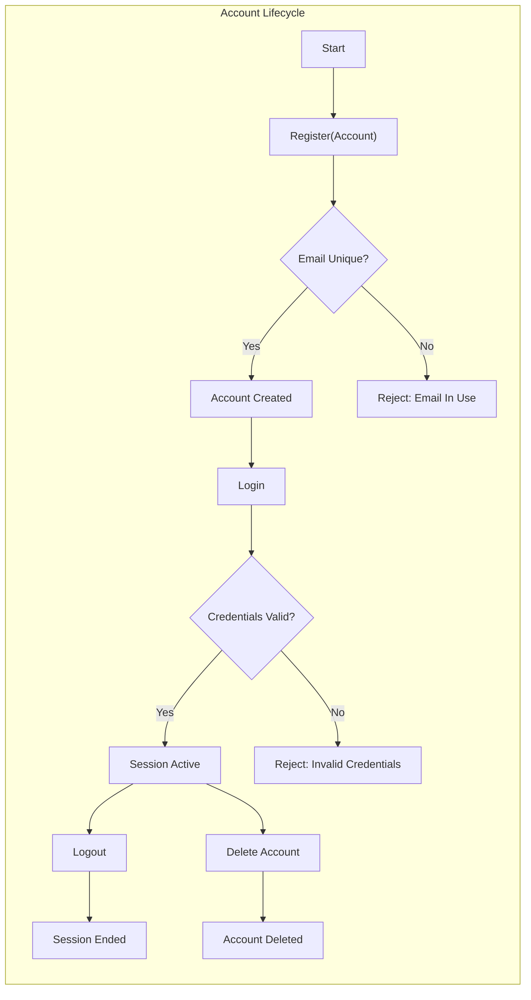
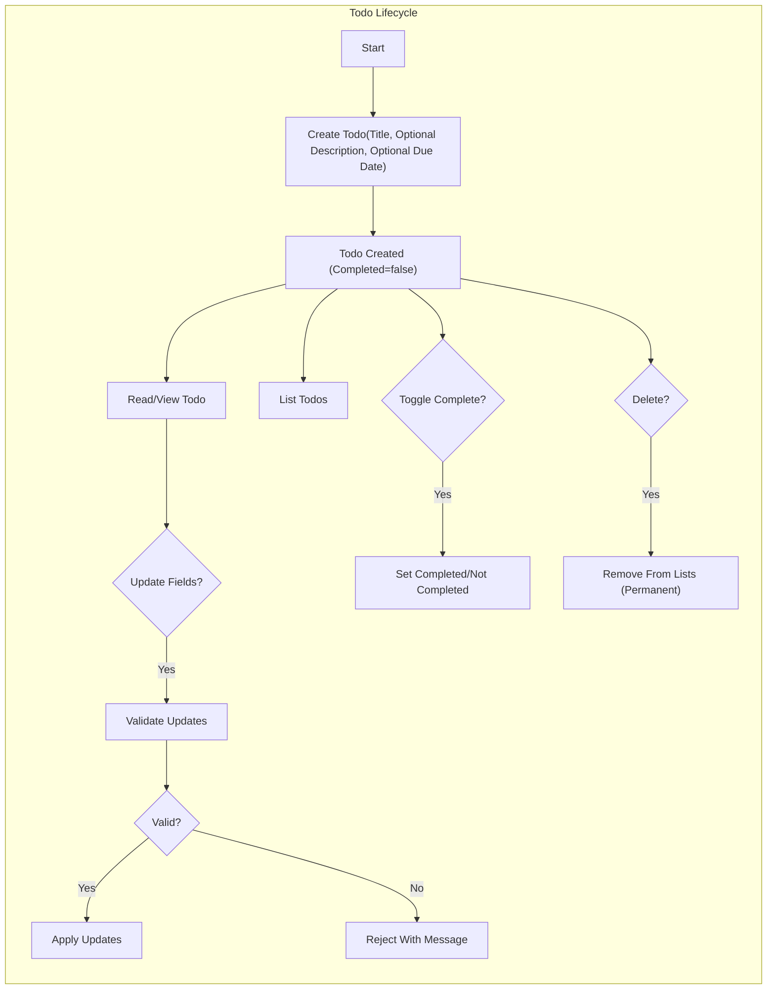

# Minimal Todo Service – Functional Requirements (MVP)

Defines WHAT the minimal Todo service must do using precise, testable business language. Avoids all technical implementation details (no APIs, schemas, tokens, or storage specifics). Links reference related business documents for context.

For business context and scope framing, see the [Service Overview for the Minimal Todo Service](./01-service-overview.md). For actor definition and ownership boundaries, see the [User Actors and Permissions Specification](./02-user-actors-and-permissions.md).

## Overview and Guiding Principles

- Minimalism: Only the smallest set of features necessary to manage personal todos is included in MVP.
- Single actor: A single authenticated user manages their own todos; there are no shared lists in MVP.
- Personal data isolation: Users can access only their own data; cross-user access is never allowed.
- Business-first requirements: Requirements below are expressed in natural language and EARS format where applicable; no endpoints, schemas, or technical flows are prescribed.
- Deterministic behavior: Every operation has clear inputs, validations, outcomes, and errors in business terms.
- Responsiveness: User-perceived response times are specified to guide implementation targets without constraining design.

EARS style (English keywords): WHEN, WHILE/WHERE, IF, THEN, THE, SHALL.

### Core System Identity (Business Perspective)
- THE minimal todo service SHALL allow users to register, authenticate, and manage their personal todo items.
- THE minimal todo service SHALL require authentication for any action on todo data.
- THE minimal todo service SHALL not expose any user’s data to other users.

### Performance Expectations (User-Perceived)
- WHEN a user performs core actions (register, login, create todo, list todos, update todo, toggle completion, delete todo), THE system SHALL respond within 2 seconds under normal conditions for typical data sizes (<= 1,000 todos per user).
- WHERE large lists are requested (more than 100 items at once), THE system SHALL provide results in pages of 20 items by default to maintain responsiveness within 2 seconds per page request.

## Account Lifecycle (business-level)

This section defines business behavior for registration, login, session continuity, logout, and account deletion. No technical mechanisms are prescribed.

### Registration
- WHEN a new user submits required registration information, THE system SHALL create a personal account.
- THE required information for registration SHALL include a unique email and a password compliant with business rules defined below.
- IF the provided email already belongs to an existing account, THEN THE system SHALL reject registration with a business message indicating the email is already in use.
- IF the provided password does not meet minimum strength requirements, THEN THE system SHALL reject registration with a business message indicating password requirements were not met.

Password Requirements (business rules):
- THE password SHALL be at least 8 characters in length.
- THE password SHALL contain at least one letter and at least one number.
- WHERE users choose stronger passwords (e.g., adding symbols), THE system SHALL accept them.

### Login and Session
- WHEN an existing user submits valid credentials, THE system SHALL authenticate the user and establish a session.
- IF credentials are invalid, THEN THE system SHALL reject the login attempt with a business message indicating the credentials are invalid.
- WHILE the user session is active, THE system SHALL allow the user to perform all permitted actions on their own todos without re-entering credentials.
- IF a session expires due to inactivity, THEN THE system SHALL require re-authentication before protected actions continue and SHOULD preserve in-progress inputs locally where feasible.

### Logout
- WHEN a user initiates logout, THE system SHALL end the session and prevent further authenticated actions until the user logs in again.

### Account Deletion (User-Initiated)
- WHEN a user confirms account deletion, THE system SHALL delete the account and all associated todos from the user’s view immediately.
- IF the user’s account is deleted, THEN THE system SHALL prevent any further login using the deleted account credentials.
- WHERE legal or compliance requirements necessitate retention (not applicable by default in MVP), THE system SHALL follow the applicable policy as defined in business governance documents outside the MVP scope.

## Todo Item Model (business-level fields and semantics)

Each todo item is personal to the authenticated user and comprises the following business-level fields:
- Title (required): short, single-line text describing the task.
- Description (optional): longer free text elaborating the task.
- Due date (optional): date-only value representing the intended completion date; no time-of-day.
- Completion status (required, default false): indicates whether the task is complete.

### Ownership and Access
- THE system SHALL ensure users can create, view, update, toggle completion, and delete only their own todo items.
- IF a user attempts to access or modify a todo that does not belong to them, THEN THE system SHALL deny the action and provide a business message indicating lack of permission without confirming existence.

## Todo Item Lifecycle: Create, Read, Update, Delete

### Create Todo
- WHEN a user submits a new todo with a valid title and optional fields, THE system SHALL create the todo with completion status defaulting to not completed.
- THE title SHALL be required, single-line, and between 1 and 120 characters inclusive after trimming whitespace.
- WHERE a description is provided, THE description SHALL be allowed up to 1,000 characters after trimming.
- WHERE a due date is provided, THE due date SHALL be a valid calendar date (date-only, no time-of-day) interpreted using the user’s local day. WHILE no timezone is selected, THE system SHALL use "Asia/Seoul" as the default interpretation for date comparisons.
- WHERE a due date is omitted, THE system SHALL treat the todo as having no due date.

Validation Failures on Create
- IF the title is missing or empty after trimming whitespace, THEN THE system SHALL reject creation with a business message indicating title is required.
- IF the title exceeds 120 characters or contains line breaks, THEN THE system SHALL reject creation with a business message indicating the maximum length and single-line requirement.
- IF the description exceeds 1,000 characters, THEN THE system SHALL reject creation with a business message indicating the maximum length.
- IF the due date is not a recognizable calendar date, THEN THE system SHALL reject creation with a business message indicating the due date format is invalid.

### Read Todo (Single)
- WHEN a user requests a specific todo that they own, THE system SHALL return the todo’s current business fields and values.
- IF the todo does not exist or has been deleted, THEN THE system SHALL respond with a business message indicating the resource is not available.

### List Todos (Overview)
- WHEN a user requests their todo list, THE system SHALL return only the user’s todos subject to listing, sorting, filtering, and pagination rules defined below.

### Update Todo (Fields)
- WHEN a user updates fields of a todo they own, THE system SHALL apply the changes if all validations pass and return the updated values.
- WHERE a user updates the title, THE title SHALL remain between 1 and 120 characters inclusive after trimming whitespace and SHALL remain single-line (no line breaks).
- WHERE a user updates the description, THE description SHALL be allowed up to 1,000 characters after trimming.
- WHERE a user adds or updates the due date, THE due date SHALL be a valid calendar date interpreted as date-only.
- WHERE a user clears the due date, THE system SHALL remove the due date and treat the todo as having no due date.

Validation Failures on Update
- IF the updated title is missing, empty after trim, exceeds 120 characters, or contains line breaks, THEN THE system SHALL reject the update with a business message indicating the applicable rule.
- IF the updated description exceeds 1,000 characters, THEN THE system SHALL reject the update with a business message indicating the maximum length.
- IF the updated due date is not a recognizable calendar date, THEN THE system SHALL reject the update with a business message indicating the due date format is invalid.

### Toggle Completion Status
- WHEN a user marks a todo as complete, THE system SHALL set the completion status to completed and preserve other fields unchanged.
- WHEN a user reopens a completed todo, THE system SHALL set the completion status to not completed and preserve other fields unchanged.
- WHERE a todo is already in the requested state, THE system SHALL accept the request and confirm the current state (idempotent behavior).

### Delete Todo
- WHEN a user deletes a todo they own, THE system SHALL remove it from all standard lists immediately.
- THE deletion behavior SHALL be permanent in MVP (no recycle bin, no restore).
- IF a user attempts to delete a todo that does not exist, THEN THE system SHALL respond with a business message indicating the resource is not available.

## Completion Status and Due Date Rules (optional due date)

### Completion Status Semantics
- THE completion status SHALL be a boolean with two business states: completed or not completed.
- WHEN a todo is created, THE completion status SHALL default to not completed.
- WHERE completion status is toggled, THE system SHALL record the new status immediately and reflect it in subsequent listings and reads.

### Due Date Semantics (Date-Only)
- THE due date SHALL be optional on create and update.
- WHERE a due date is set, THE due date SHALL be interpreted as a calendar date without time-of-day.
- THE system SHALL consider a todo "overdue" for business logic if the current date is strictly later than the due date and the todo is not completed.
- THE system SHALL consider a todo "due today" if the current date equals the due date and the todo is not completed.
- WHILE no timezone is selected by the user, THE system SHALL interpret due date comparisons in the "Asia/Seoul" timezone to avoid ambiguity.
- WHERE a due date in the past is provided, THE system SHALL accept it and reflect the item as overdue if not completed.

## Listing, Sorting, Pagination, and Basic Filtering (business-level)

### Listing Scope and Pagination
- THE listing scope SHALL include only the authenticated user’s non-deleted todos.
- THE default page size SHALL be 20 items; users MAY request different page sizes up to a maximum of 100 items per request in MVP.
- WHERE the requested page size exceeds 100, THE system SHALL cap the result at 100 items and indicate that a cap was applied in a business-appropriate manner.

### Default Ordering
- THE default ordering for list results SHALL be most recently created first (newest to oldest by creation time). WHERE creation time ties occur, THE system SHOULD apply a consistent secondary key (e.g., last-modified time) to maintain deterministic ordering.

### Supported Sorting Options (MVP)
- WHERE a user requests alternate ordering, THE system SHALL support ordering by:
  - Creation time (newest first or oldest first)
  - Due date (earliest first or latest first); todos without a due date SHALL appear last when sorting by due date

### Basic Filtering
- THE system SHALL support a status filter with the following values:
  - "all": includes all non-deleted todos regardless of completion status
  - "active": includes only todos where completion status is not completed
  - "completed": includes only todos where completion status is completed

### Search (Deferred)
- THE MVP SHALL exclude full-text search by keyword. Users can locate items using sorting and paging only in MVP.

## Error Handling (Business-Level Outcomes) and Idempotency

- IF an unauthenticated user attempts to perform an authenticated action on todos, THEN THE system SHALL deny the action and indicate that login is required.
- IF a user attempts to access a todo that does not exist or has been deleted, THEN THE system SHALL respond that the resource is not available.
- IF input validation fails (e.g., title length, invalid date), THEN THE system SHALL reject the action and provide a business message indicating which input failed and why in business terms.
- IF simultaneous updates cause conflicts (e.g., a todo is deleted while being updated), THEN THE system SHALL inform the user that the item is no longer available and no changes were applied.
- WHERE a state-changing action repeats with no effective change (e.g., completing an already completed item), THE system SHALL treat it as idempotent and confirm current state rather than return an error.

## Non-Functional Expectations Referenced by Functionality (Business-Level)

- THE system SHALL maintain user-perceived response time targets stated above.
- THE system SHALL protect user privacy by ensuring data isolation at all times.
- THE system SHALL be reliable enough to allow uninterrupted CRUD operations in normal conditions; operational targets and metrics are defined separately in non-functional requirements.

## Acceptance Criteria (EARS)

### Registration and Login
- WHEN a unique email and compliant password are submitted, THE system SHALL create an account and allow login thereafter.
- IF a duplicate email is used at registration, THEN THE system SHALL reject the request with a message indicating the email is in use.
- WHEN valid credentials are used at login, THE system SHALL establish a session.
- IF invalid credentials are used at login, THEN THE system SHALL deny access with a message indicating invalid credentials.

### Logout
- WHEN a user logs out, THE system SHALL terminate the session and require login for further actions.

### Create Todo
- WHEN a valid title is provided (1–120 chars, single-line), THE system SHALL create the todo with completion status set to not completed.
- WHERE a description up to 1,000 chars is provided, THE system SHALL store it with the todo.
- WHERE a valid date-only due date is provided, THE system SHALL set it and reflect due semantics.
- IF title is empty, multiline, or exceeds 120 chars, THEN THE system SHALL reject creation with a field-specific message.
- IF description exceeds 1,000 chars or due date is invalid, THEN THE system SHALL reject creation with a field-specific message.

### Read Todo
- WHEN the owner requests an existing todo, THE system SHALL return all business fields.
- IF the todo does not exist or is deleted, THEN THE system SHALL return a business message that the resource is not available.

### List Todos
- WHEN the owner requests the list without filters, THE system SHALL return up to 20 items ordered by newest first.
- WHERE a page size is requested up to 100, THE system SHALL return that many items, else cap at 100.
- WHERE status filter is set to active, THE system SHALL return only not-completed todos; where set to completed, only completed todos; where set to all, both.
- WHERE sorting by due date ascending is chosen, THE system SHALL order by earliest due date first and place no-due-date items last.

### Update Todo
- WHEN the owner updates title, description, or due date within constraints, THE system SHALL persist the changes and reflect them on subsequent reads.
- IF an updated field violates constraints (title empty, >120 chars, multiline; description >1,000; invalid date), THEN THE system SHALL reject the update and preserve existing values.

### Toggle Completion
- WHEN the owner marks complete, THE system SHALL set completed; WHEN reopened, set not completed.
- WHERE the requested state equals current state, THE system SHALL succeed with no change to other fields and confirm the current state.

### Delete Todo
- WHEN the owner deletes the todo, THE system SHALL remove it from all standard lists immediately and not show it again.
- IF deletion is requested for a non-existent item, THEN THE system SHALL respond that the resource is not available.

### Ownership and Isolation
- IF a user attempts to access or modify another user’s todo, THEN THE system SHALL deny the action and provide a permission message without leaking existence.

### Performance
- WHEN any core action is performed under normal conditions and typical data volumes, THE system SHALL complete within 2 seconds perceived response time.

## Visual References (Mermaid diagrams)

### Account Lifecycle (Conceptual)

### Todo Lifecycle (Conceptual)

## Out-of-Scope Confirmation

- THE MVP SHALL exclude multi-user collaboration, shared lists, tags, categories, priorities, file attachments, subtasks, complex recurrence, reminders/notifications, and search. These may be considered in future scope documents.

## Traceability to Related Documents

- Scope boundaries are introduced in the [Service Overview for the Minimal Todo Service](./01-service-overview.md).
- Actor capabilities and ownership rules are detailed in the [User Actors and Permissions Specification](./02-user-actors-and-permissions.md).
