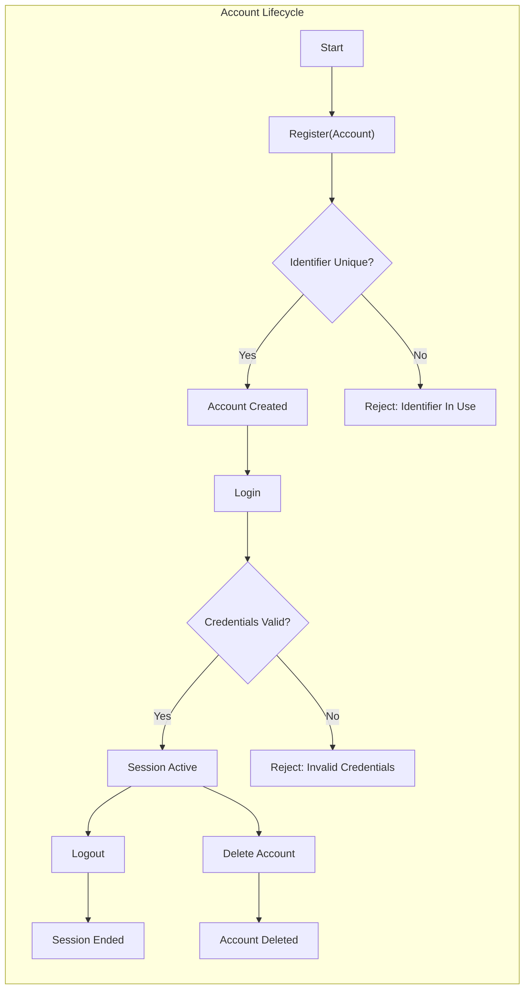
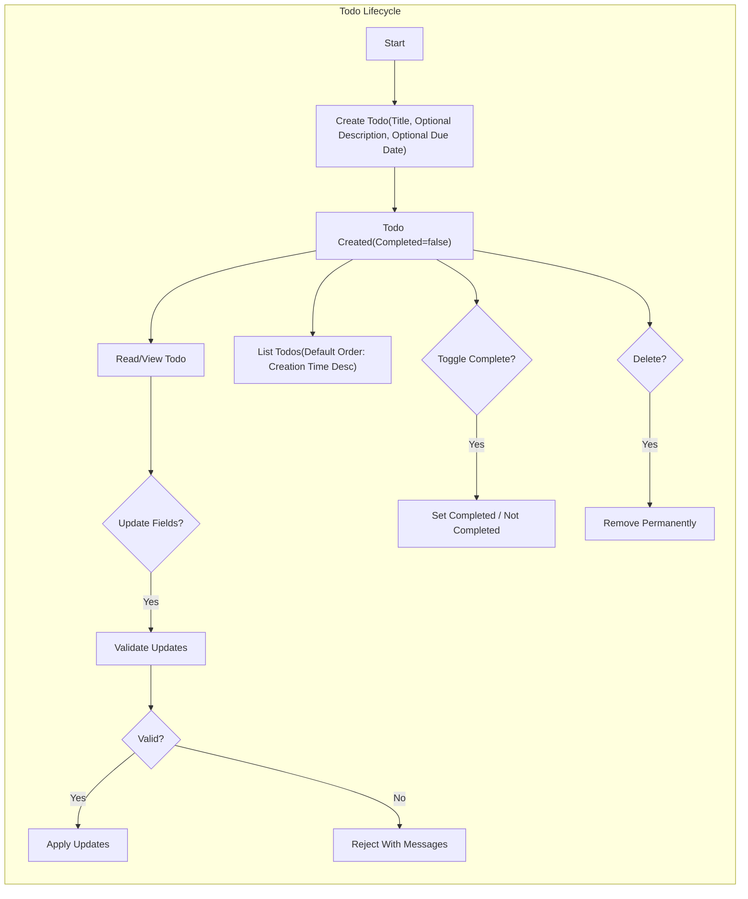

# Minimal Todo Service — Functional Requirements (MVP)

Service prefix: "todo"

A minimal, single-actor Todo application enabling an authenticated individual to create, view, update, toggle completion of, and delete personal todo items. Requirements are business-only and expressed in clear, testable language using EARS style where applicable. No APIs, database schemas, or infrastructure designs are specified.

## Guiding Principles
- Minimal scope: only essential todo capabilities for a single authenticated user.
- Ownership and isolation: each todo belongs to its creator; no cross-user access.
- Deterministic behavior: clear validations, predictable ordering, and unambiguous outcomes.
- Responsiveness targets: user-perceived performance goals guide implementation without prescribing technology.

EARS anchors:
- THE minimal todo service SHALL require authentication for any access to personal todo data.
- THE minimal todo service SHALL allow only the owning user to access and modify a todo item.
- THE minimal todo service SHALL present lists with a predictable default order.

## Actors and Authentication (Business-Level)
- Actor: Authenticated User ("User"). No administrative roles in MVP.
- The Unauthenticated State is not an actor and has no access to todo data.

EARS requirements:
- WHEN an individual completes valid registration, THE system SHALL establish a user account.
- WHEN a user submits valid credentials, THE system SHALL grant authenticated access until the user logs out or the session expires.
- IF credentials are invalid, THEN THE system SHALL deny access without revealing whether a specific account exists.
- WHEN a user logs out, THE system SHALL terminate authenticated access for subsequent actions.
- WHILE a user is authenticated, THE system SHALL allow permitted actions on only that user’s own data.

## User-Perceived Performance Targets
- WHEN a user logs in, THE system SHALL complete login within 2 seconds under normal conditions for typical loads.
- WHEN a user lists todos (per page up to 20 by default, up to 100 if requested), THE system SHALL render results within 1 second for accounts up to 200 items and within 1.5 seconds for accounts up to 1,000 items.
- WHEN a user creates, updates, or deletes a single todo, THE system SHALL complete within 0.7 seconds; typical target 0.4 seconds.
- WHEN a user toggles completion, THE system SHALL reflect the new state within 0.5 seconds; typical target 0.25 seconds.

Notes:
- Targets are business guidance; technical SLOs may refine them in non-functional documents.

## Todo Item Model (Business Fields)
- Title (required): short, single-line text that names the task.
- Description (optional): multi-line free text for details.
- Due date (optional): date-only planning aid; no time-of-day.
- Completion status (required): boolean; defaults to not completed on creation.
- Created/Updated (system timestamps): for ordering and audit expectations; not user-editable.

Field constraints (business-level):
- THE title SHALL be required and 1–120 characters after trimming; no line breaks.
- THE description SHALL be optional up to 1,000 characters after trimming.
- THE due date SHALL be an optional valid calendar date; time-of-day is ignored.

## Account Lifecycle (Business-Level)
### Registration
- WHEN a new user submits required registration information (e.g., unique email and compliant password), THE system SHALL create a personal account.
- IF the provided identifier is already in use, THEN THE system SHALL reject registration with a business message indicating it is already taken.
- IF the provided password does not meet minimum strength (>= 8 characters, includes letters and numbers), THEN THE system SHALL reject registration with a business message indicating requirements.

### Login and Session
- WHEN an existing user submits valid credentials, THE system SHALL authenticate the user and establish a session.
- IF credentials are invalid, THEN THE system SHALL reject the login attempt with a business message indicating authentication failed.
- WHILE the session is active, THE system SHALL allow permitted actions without re-authenticating.

### Logout
- WHEN a user initiates logout, THE system SHALL end the session and prevent protected actions until login.

### Account Deletion (User-Initiated)
- WHEN a user confirms account deletion, THE system SHALL delete the account and all associated todos from the user’s view immediately.
- IF the account is deleted, THEN THE system SHALL prevent further login using the deleted account credentials.

## Todo Lifecycle Requirements

### Ownership and Access
- THE system SHALL ensure users can act only on their own todos.
- IF a user references a todo not owned by that user, THEN THE system SHALL deny the action and avoid disclosing whether the item exists.

### Create Todo
- WHEN a user submits a new todo with a valid title, THE system SHALL create the todo with completion=false by default.
- WHERE a description is provided up to 1,000 characters, THE system SHALL store it.
- WHERE a due date is provided as a valid calendar date, THE system SHALL store it (date-only semantics).

Validation failures on create:
- IF the title is missing or trims to empty, THEN THE system SHALL reject creation with message "Title is required".
- IF the title exceeds 120 characters or includes line breaks, THEN THE system SHALL reject creation with a message indicating the constraint.
- IF the description exceeds 1,000 characters after trimming, THEN THE system SHALL reject creation with message indicating the limit.
- IF the due date is not a valid calendar date, THEN THE system SHALL reject creation with message "Due date must be a valid date".

### Read Todo (Single)
- WHEN a user requests a specific todo they own, THE system SHALL return the todo’s business fields.
- IF the todo does not exist or has been deleted, THEN THE system SHALL inform the user that it is not available.

### List Todos
- WHEN a user requests their list, THE system SHALL return only the user’s todos subject to listing, sorting, and filtering rules.

Listing rules (business-level):
- THE default page size SHALL be 20 items; users may request up to 100 per page.
- WHERE a request exceeds 100 items per page, THE system SHALL cap at 100 and indicate a cap was applied in a business-appropriate manner.

### Update Todo (Fields)
- WHEN a user updates fields of a todo they own, THE system SHALL apply changes if validations pass and return updated values.
- WHERE a user updates the title, THE title SHALL remain 1–120 characters after trimming and contain no line breaks.
- WHERE a user updates the description, THE description SHALL be up to 1,000 characters after trimming.
- WHERE a user sets/updates the due date, THE due date SHALL be a valid calendar date; WHERE a user clears the due date, THE system SHALL treat the todo as having no due date.

Validation failures on update:
- IF the updated title is empty, too long, or contains line breaks, THEN THE system SHALL reject the update and preserve existing values.
- IF the updated description exceeds 1,000 characters, THEN THE system SHALL reject the update and preserve existing values.
- IF the updated due date is not a valid calendar date, THEN THE system SHALL reject the update and preserve existing values.

### Toggle Completion
- WHEN a user marks a todo complete, THE system SHALL set completion=true and preserve other fields.
- WHEN a user reopens a todo, THE system SHALL set completion=false and preserve other fields.
- WHERE the todo is already in the requested state, THE system SHALL accept the request and maintain the state without error.

### Delete Todo
- WHEN a user deletes a todo they own, THE system SHALL remove it from all standard lists immediately.
- THE deletion behavior SHALL be permanent in MVP (no recycle bin or restore).
- IF a user attempts to delete a todo that does not exist, THEN THE system SHALL inform the user that the resource is not available.

## Due Date and Status Semantics (Business)
- THE due date SHALL be optional; date-only; accepted in past, present, or future as a planning aid.
- THE system SHALL consider a todo overdue if the current date is later than the due date and the todo is not completed.
- THE system SHALL consider a todo due today if the current date equals the due date and the todo is not completed.
- WHEN a user removes a due date, THE system SHALL cease overdue/due-today consideration for that item.

## Listing, Sorting, and Filtering

### Default Ordering
- THE default ordering for list results SHALL be most recently created first (creation time descending).

### Supported Sorting Options (MVP)
- WHERE a user requests alternate ordering, THE system SHALL support:
  - Creation time: newest first or oldest first
  - Due date: earliest first or latest first; todos without a due date SHALL appear last when sorting by due date

### Basic Filtering (MVP)
- THE system SHALL support status filters:
  - "all": includes all non-deleted todos
  - "active": includes only not-completed todos
  - "completed": includes only completed todos

### Pagination
- THE system SHALL return up to 20 items by default; up to 100 if requested; cap requests exceeding 100 at 100.

## Error Handling (Business Outcomes)
- IF an unauthenticated individual attempts a protected action, THEN THE system SHALL deny the action and require login.
- IF a user references an item not owned by them, THEN THE system SHALL deny the action and avoid disclosing existence.
- IF input validation fails, THEN THE system SHALL reject the action, preserve existing data, and present field-specific guidance.
- IF simultaneous updates cause conflicts, THEN THE system SHALL inform the user that the item is no longer available or was changed and advise refreshing.
- WHERE a repeated action makes no change (e.g., toggle to the same state), THE system SHALL confirm the current state without error.

## Out of Scope (MVP)
- Collaboration and sharing, delegated access, or multi-user lists
- Notifications, reminders, or recurring tasks
- Projects/tags/priorities/custom fields
- Attachments, subtasks, or bulk operations
- Full-text search or advanced filtering beyond status and simple sorting
- Administrative roles or dashboards

## Acceptance Criteria (Testable EARS)

Registration and Login
- WHEN a unique identifier and compliant password are submitted, THE system SHALL create an account and allow login thereafter.
- IF a duplicate identifier is used, THEN THE system SHALL reject registration with a message indicating the identifier is in use.
- WHEN valid credentials are submitted, THE system SHALL establish a session; IF invalid, THEN THE system SHALL deny access.

Logout
- WHEN a user logs out, THE system SHALL terminate the session and require login for protected actions.

Create Todo
- WHEN a valid title (1–120 chars, single-line) is provided, THE system SHALL create the todo with completion=false.
- WHERE a description up to 1,000 chars is provided, THE system SHALL store it with the todo.
- WHERE a valid date-only due date is provided, THE system SHALL set it.
- IF title is empty, too long, or multiline, THEN THE system SHALL reject creation and create nothing.
- IF description exceeds 1,000 chars or the due date is invalid, THEN THE system SHALL reject creation.

Read Todo
- WHEN the owner requests an existing todo, THE system SHALL return all business fields.
- IF the todo is not available, THEN THE system SHALL inform the user it is not available.

List Todos
- WHEN the owner requests the list with no filters, THE system SHALL return up to 20 items ordered by newest first (creation time descending).
- WHERE a page size up to 100 is requested, THE system SHALL return that many; otherwise cap at 100 with communication of the cap.
- WHERE status filter=active, THE system SHALL return only not-completed items; status=completed returns only completed items; status=all returns both.
- WHERE sorting by due date ascending is chosen, THE system SHALL order earliest due first and place no-due-date items last.

Update Todo
- WHEN the owner updates valid fields, THE system SHALL persist changes and reflect them on subsequent reads.
- IF an updated field violates constraints, THEN THE system SHALL reject the update and preserve current values.

Toggle Completion
- WHEN the owner marks complete, THE system SHALL set completion=true; WHEN reopened, set completion=false.
- WHERE the requested state equals the current state, THE system SHALL succeed with no additional changes.

Delete Todo
- WHEN the owner deletes a todo, THE system SHALL remove it and exclude it from subsequent listings.
- IF deletion is requested for a non-existent item, THEN THE system SHALL inform that it is not available.

Ownership and Isolation
- IF a user attempts to access or modify another user’s todo, THEN THE system SHALL deny the action and avoid disclosing existence.

Performance (Perceived)
- WHEN core actions are performed under normal conditions and typical volumes, THE system SHALL meet the targets specified above.

## Visual References (Mermaid)

### Account Lifecycle (Conceptual)

### Todo Lifecycle (Conceptual)

## Cross-References
- Business scope: see Service Overview (vision, scope, KPIs)
- Actor and permissions: see User Actors and Permissions (ownership boundaries)
- Detailed rules: see Business Rules and Validation (field constraints and messages)
- Non-functional targets: see Non-Functional Requirements (performance, reliability, privacy)
