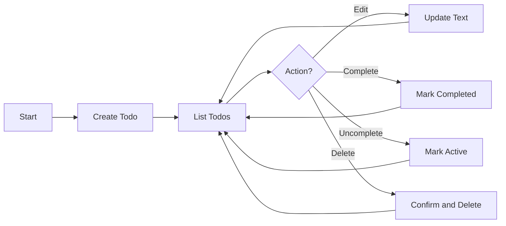
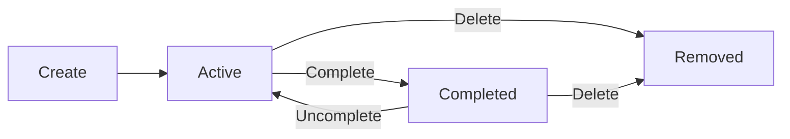
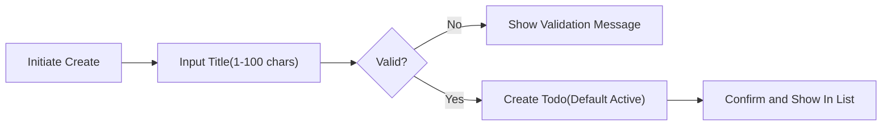
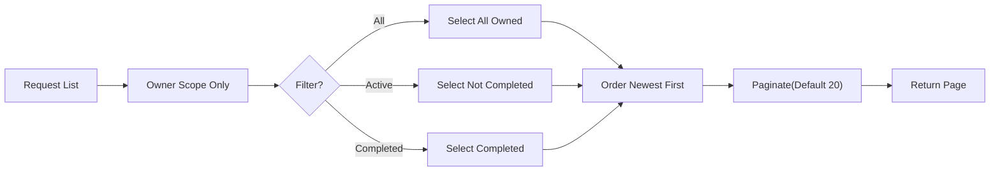
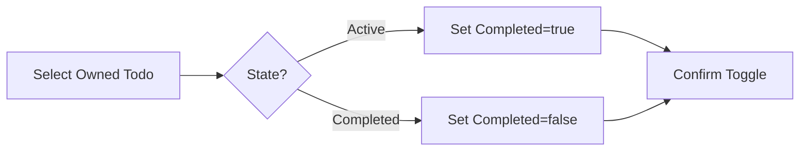
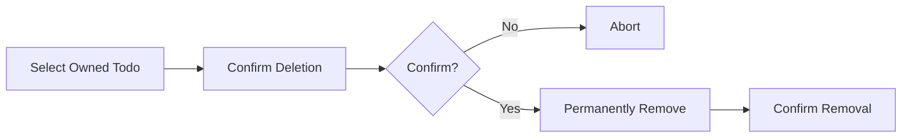
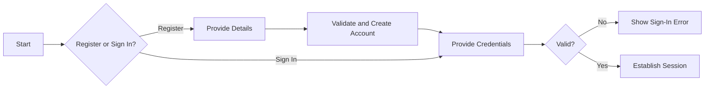

# Minimal Todo App – Requirements Analysis Report (Business-Level)

Version: v1.0.0 (2025-10-08 KST)
Service prefix: todoList
Primary audience: product owners and backend developers
Language/Locale: en-US; default timezone Asia/Seoul unless user preference is set

## 1) Vision and Minimal Scope
A fast, distraction-free Todo list that provides the smallest complete set of capabilities for personal task management. Priorities: simplicity, predictability, and privacy. The product minimizes cognitive load by supporting only essential actions: create, read/list, update text, toggle complete/uncomplete, delete, and view with minimal filtering and ordering.

Goals:
- Shorten time from intention to captured task and from captured task to completion.
- Keep the interface and behaviors predictable and free of optional complexity.
- Protect each user’s privacy with strict ownership boundaries.

## 2) Stakeholders and Roles
- guestVisitor: unauthenticated visitor with access only to entry points (e.g., registration or sign-in) and public information. No access to Todo content.
- todoMember: authenticated member who manages only their own Todos.
- systemAdmin: administrative oversight to manage policies and system health; no routine access to private Todos; exceptional access is policy-gated and auditable.

Role principles (EARS):
- THE todoList service SHALL implement least-privilege access for all roles.
- IF a user is unauthenticated, THEN THE todoList service SHALL deny access to any Todo content.
- WHEN a member is authenticated, THE todoList service SHALL authorize actions only on that member’s own Todos.

## 3) Assumptions and Constraints
- Single-owner Todos; no sharing or collaboration.
- Minimal feature set; no tags, due dates, reminders, attachments, or projects in MVP.
- Business-only documentation; no APIs, schemas, or UI design specified here.
- Timestamps are system-managed and shown in user’s locale/timezone; default Asia/Seoul when unspecified.

## 4) In-Scope vs Out-of-Scope
In-Scope (MVP):
- Create, read, update text, toggle complete/uncomplete, delete.
- List member’s Todos with basic filters: All, Active, Completed.
- Default ordering: newest first by creation time.
- Pagination in business terms (e.g., pages of up to 20 by default).

Out-of-Scope (MVP):
- Collaboration, sharing, subtasks, tags, priorities, due dates, reminders.
- Attachments, imports/exports beyond conceptual mention, advanced search.
- API specifications, database schemas, infrastructure, UI layouts.

## 5) Business Processes and Workflows (High Level)
- Capture task: user provides minimal text and confirms creation.
- Review tasks: user views list, filters by state, and pages through items.
- Update task: user edits text.
- Complete/Uncomplete: user toggles state to reflect progress.
- Delete task: user confirms permanent deletion.
- Authenticate: visitor registers or signs in to become a member; sign out ends session.

Mermaid overview:

## 6) Functional Requirements (EARS)
Creation:
- THE todoList service SHALL require a non-empty Title trimmed to at least 1 and at most 100 characters.
- WHEN a todoMember submits a valid Title, THE todoList service SHALL create a Todo owned by that member with Completed=false and set CreatedAt and UpdatedAt.
- IF Title is invalid after trimming, THEN THE todoList service SHALL reject creation and explain the rule violated.

Read/List:
- WHEN a todoMember requests a list without filters, THE todoList service SHALL return only that member’s Todos ordered newest-first.
- WHERE a status filter of "Active" is provided, THE todoList service SHALL return only Todos with Completed=false; where "Completed", only Completed=true.
- WHERE pagination is required, THE todoList service SHALL return pages with a default size of 20 and allow sizes between 10 and 50 inclusive.

Update:
- WHEN a member submits a valid new Title for an owned Todo, THE todoList service SHALL update Title and UpdatedAt without altering CreatedAt.
- IF the new Title is invalid, THEN THE todoList service SHALL reject the update and state the limit or rule breached.

Complete/Uncomplete:
- WHEN a member marks an owned Todo complete, THE todoList service SHALL set Completed=true and update UpdatedAt.
- WHEN a member marks an owned Todo uncomplete, THE todoList service SHALL set Completed=false and update UpdatedAt.
- IF the Todo is already in the requested state, THEN THE todoList service SHALL return the current state without error.

Delete:
- WHEN a member deletes an owned Todo, THE todoList service SHALL permanently remove it from subsequent reads and listings.
- IF the Todo does not exist or is not owned by the requester, THEN THE todoList service SHALL deny the deletion without leaking existence to non-owners.

## 7) Authentication and Authorization (Business Terms)
- WHEN a visitor registers with valid details, THE todoList service SHALL create a member account.
- WHEN a member signs in with valid credentials, THE todoList service SHALL establish a session authorizing member actions.
- WHEN a member signs out, THE todoList service SHALL end the session and revert to guestVisitor permissions.
- IF a guestVisitor attempts any Todo action, THEN THE todoList service SHALL deny the action and guide the user to sign in.
- IF a member attempts to access another member’s Todo, THEN THE todoList service SHALL deny access and not reveal item existence.
- WHERE administrative policy triggers exist, THE todoList service SHALL allow systemAdmin only policy-gated, minimal, auditable oversight actions.

## 8) Data and Information Model (Business-Level)
Conceptual fields for a Todo (no schema implied):
- Identifier: system-assigned unique id (business identity for actions).
- Title: required, single line, 1–100 chars after trimming.
- Completed: boolean state; defaults to false on creation.
- CreatedAt: timestamp set on creation.
- UpdatedAt: timestamp set on successful change.
- Owner: the creating member; used solely for access control semantics.

## 9) Validation and Business Rules (Summary, EARS)
- THE todoList service SHALL trim Title before validation and storage.
- IF Title is empty after trimming or exceeds 100 chars, THEN THE todoList service SHALL reject with a clear message.
- THE todoList service SHALL allow duplicate Titles per owner; deduplication is out of scope for MVP.
- THE todoList service SHALL update UpdatedAt on successful edit or state toggle; CreatedAt is immutable.

## 10) Error Handling and Recovery (User-Centric)
Taxonomy: validation, authentication/session, permission, missing resource, conflict-like, temporary condition.

Requirements (EARS):
- WHEN validation fails, THE todoList service SHALL keep user input where feasible and present field-specific guidance within about 1 second in typical conditions.
- WHEN authentication is required, THE todoList service SHALL invite sign-in and resume the intended action where feasible after success.
- WHEN permission is insufficient, THE todoList service SHALL present a neutral message without revealing item existence.
- WHEN a referenced Todo is missing or already deleted, THE todoList service SHALL inform that the item is unavailable and offer a refresh.
- WHEN conflict-like situations are detected, THE todoList service SHALL prevent silent overwrites and ask the user to refresh to apply changes.

## 11) Non-Functional Requirements (User Terms)
Performance targets (typical device, stable network):
- THE todoList service SHALL confirm creation, update, delete, and toggle operations within 800 ms for at least 95% of attempts and within 2 seconds worst-case.
- THE todoList service SHALL present the first page of up to 20 Todos within 1 second for at least 95% of attempts and within 2.5 seconds worst-case.
Reliability:
- THE todoList service SHALL meet 99.5% monthly availability excluding scheduled maintenance with notice.
Usability/Accessibility:
- THE todoList service SHALL confirm outcomes concisely after actions and remain fully operable via keyboard; confirmations and errors must be perceivable by assistive tech.
Scalability/Observability:
- THE todoList service SHALL maintain performance targets for up to 1,000 active Todos per user and track user-perceived latency and error rates for alerts.

## 12) Security and Privacy (Business Outcomes)
- THE todoList service SHALL protect confidentiality by restricting Todo access to the owner.
- THE todoList service SHALL collect only minimal personal data necessary for account operation.
- WHEN administrative oversight is required, THE todoList service SHALL enforce policy-gated, auditable, minimal access without broad visibility into private Todos.
- IF a security incident risks user harm, THEN THE todoList service SHALL notify affected users after reasonable assessment.

## 13) Data Lifecycle and Retention (Conceptual)
- Creation: Active by default.
- Update: owner can edit Title; timestamps maintained.
- Completion: Completed=true; Uncomplete returns to Active.
- Deletion: permanent in MVP; no built-in recovery.
- Export: optional future; out of scope in MVP beyond conceptual mention.

Lifecycle diagram:

## 14) Success Metrics and Acceptance Criteria (EARS)
Adoption and speed:
- THE todoList service SHALL enable a new member to create the first Todo within 30 seconds of initial access (median).
Performance:
- THE todoList service SHALL complete core actions within the thresholds specified in Section 11.
Privacy:
- THE todoList service SHALL exhibit zero cross-user data exposure incidents in production.
Functional acceptance highlights:
- WHEN a valid Title is submitted, THE todoList service SHALL create a Todo with Completed=false and set timestamps.
- WHEN listing without filters, THE todoList service SHALL return only the owner’s Todos in newest-first order.
- IF Title length after trim exceeds 100, THEN THE todoList service SHALL reject with a clear message.

## 15) User Flows (Mermaid)
Create and Manage:

List and Filter:

Toggle Completion:

Delete:

Auth (Conceptual):

## 16) Risks and Mitigations
- Scope creep toward advanced features: maintain strict in/out-of-scope lists; revisit only after MVP adoption.
- Privacy leakage through messages: enforce neutral wording that avoids confirming item existence for non-owners.
- Performance regressions at higher personal data volumes: enforce pagination and measure user-perceived latency.
- Concurrency-like conflicts: prefer safe, idempotent operations and refresh guidance.

## 17) Glossary
- Active: not completed.
- Completed: marked done by the owner.
- Owner: authenticated member who created the Todo.
- Page: business-sized group of results, default 20 items.
- Validation: rules about acceptable input content and length.

## 18) Change Log
- 2025-10-08 (KST) – v1.0.0 – Initial requirements analysis report for the minimal Todo app (todoList).
