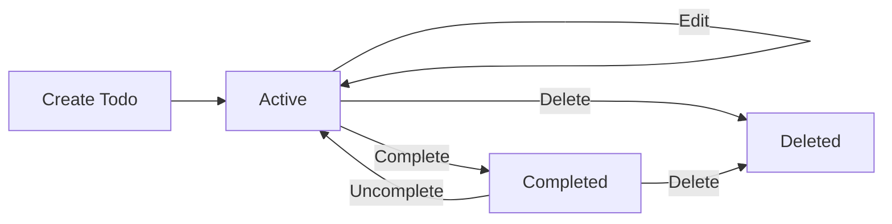
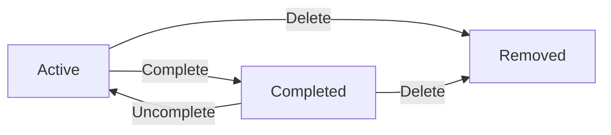
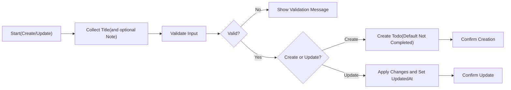
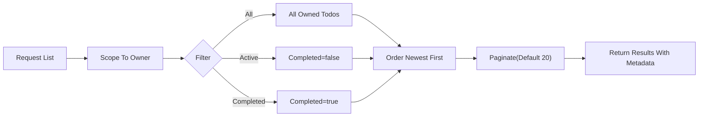
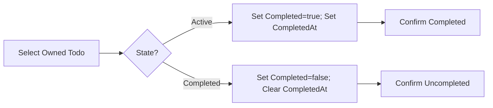
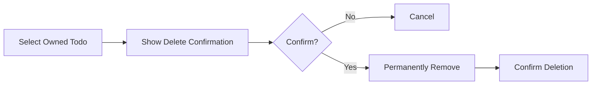
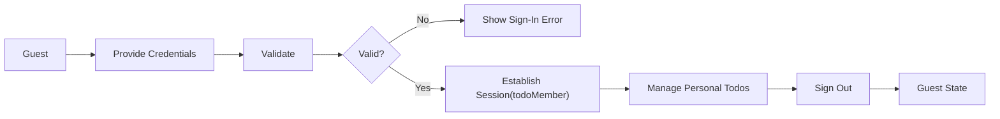

# Minimal Todo List – Requirements Analysis (Business Terms)

## Vision and Goals
Provide the smallest complete set of capabilities for a person to capture, review, update, complete, and delete personal tasks with minimal friction. Emphasize clarity, predictability, and speed over feature breadth. Maintain strict boundaries to avoid scope creep and keep the experience simple and dependable.

Value goals
- Simplicity: Single-field task entry with clear Active/Completed states.
- Predictability: Consistent outcomes for creation, edits, completion toggles, deletion, and listings.
- Focus: No collaboration, tags, reminders, or other advanced features in the minimal product.

## Scope

In-Scope (Minimal Feature Set)
- Create a Todo with a required title; optional note is allowed.
- Read and list personal Todos only.
- Update title and optional note.
- Mark complete/uncomplete.
- Delete.
- Basic filtering by state (All, Active, Completed).
- Default ordering (newest first); page-based listing sized for readability.
- Basic business-level timestamps (created and last updated; completion time when completed).

Out-of-Scope (Initial Release)
- Sharing or collaboration; assigning tasks to others.
- Subtasks/checklists; tags/labels; priorities; due dates; reminders; recurring tasks.
- Attachments/images; import/export automation.
- Advanced filters/search; analytics; reports.
- UI/visual design and layout specifications.
- Technical specifications (APIs, database schemas, infrastructure, libraries).

## Users and Roles (Business Terms)
- guestVisitor: Unauthenticated visitor; cannot view or manage Todo content.
- todoMember: Authenticated user; manages only their own Todos.
- systemAdmin: Administrative oversight for policies and settings; no routine access to private Todos.

Role principles (EARS)
- THE service SHALL implement least-privilege access across all roles.
- THE service SHALL restrict personal Todo visibility to the owner by default.
- IF a user is unauthenticated, THEN THE service SHALL deny all Todo actions.

## Business Processes and Lifecycle Overview
Tasks move through the smallest useful lifecycle: create (Active) → optionally complete (Completed) → optionally uncomplete (Active) → optionally delete (removed from user view). Listing returns only personal items according to filter and ordering rules. Timestamps are system-managed for user clarity.

Lifecycle (Mermaid)

## Functional Requirements (EARS)

Item definition (business-level)
- Fields: Identifier (unique), Title (required), Note (optional), Completed (boolean), CreatedAt, UpdatedAt, CompletedAt (when applicable), Owner (system-managed).

Create
- THE service SHALL require Title to be non-empty after trimming.
- THE service SHALL accept Title length from 1 to 100 characters after trimming.
- WHEN a todoMember submits a valid Title, THE service SHALL create a Todo owned by that member with Completed=false, set CreatedAt and UpdatedAt, and return it in newest-first ordering.
- IF Title is missing or invalid, THEN THE service SHALL reject creation with a clear validation message.
- IF actor is guestVisitor, THEN THE service SHALL deny creation and guide to sign in.

Read (single)
- WHEN a todoMember requests a Todo they own, THE service SHALL return Identifier, Title, Note (if any), Completed, CreatedAt, UpdatedAt, and CompletedAt (if any).
- IF the Todo is not found in the requester’s scope, THEN THE service SHALL return a not-available message without leaking existence.
- IF actor is guestVisitor, THEN THE service SHALL deny access and guide to sign in.

List and filter
- WHEN a todoMember requests a list without a filter, THE service SHALL return only the member’s Todos.
- THE service SHALL support status filters: All, Active (Completed=false), and Completed (Completed=true).
- THE service SHALL order results by CreatedAt descending by default.
- THE service SHALL provide page-based listing with a default page size of 20 items and allow 10–50 inclusive when a custom size is requested.
- IF actor is guestVisitor, THEN THE service SHALL deny listing and guide to sign in.

Update
- WHEN a todoMember submits a valid new Title and/or Note for an owned Todo, THE service SHALL update the fields and set UpdatedAt, preserving CreatedAt and ownership.
- IF the new Title is invalid, THEN THE service SHALL reject the update with a clear validation message.
- IF the Todo does not exist or is not owned by the requester, THEN THE service SHALL deny with a privacy-safe message.

Complete/Uncomplete
- WHEN a todoMember marks an owned Todo complete, THE service SHALL set Completed=true, set CompletedAt, and set UpdatedAt.
- WHEN a todoMember marks an owned Todo uncomplete, THE service SHALL set Completed=false, clear CompletedAt, and set UpdatedAt.
- IF the Todo is already in the requested state, THEN THE service SHALL return the current state without error (idempotent).

Delete
- WHEN a todoMember confirms deletion of an owned Todo, THE service SHALL permanently remove it from subsequent listings in the minimal release.
- IF the Todo does not exist or is not owned by the requester, THEN THE service SHALL deny with a privacy-safe message.

Authentication and sessions (business terms)
- WHEN a visitor registers and signs in successfully, THE service SHALL treat them as a todoMember and bind created Todos to that user.
- WHEN a signed-in user requests sign-out, THE service SHALL end the session and restrict access to guestVisitor capabilities only.
- WHERE Single-User Local Mode is enabled, THE service SHALL operate with an implicit member and disable registration/sign-in flows.

Ownership and permissions
- THE service SHALL bind each Todo to exactly one owner.
- WHEN listing or reading, THE service SHALL return only Todos owned by the requester.
- IF a non-owner attempts to act on a Todo, THEN THE service SHALL deny without revealing whether the item exists.

Ordering and pagination
- THE service SHALL default to newest-first ordering by CreatedAt.
- THE service SHALL include page metadata sufficient to understand result boundaries without prescribing a specific format.

Performance (user-centric)
- THE service SHALL complete create, read, update, complete/uncomplete, delete, and list operations within about 1 second for at least 95% of attempts under normal conditions for up to 100 personal Todos.

## Non-Functional Requirements (EARS)

Performance
- THE service SHALL complete typical Todo creation within 800 ms for at least 95% of attempts and within 2 seconds at worst under normal conditions.
- THE service SHALL return the first page of the list (up to 20 items by default) within 1 second for at least 95% of attempts and within 2.5 seconds at worst.
- THE service SHALL toggle completion with a user-visible confirmation within 600 ms for at least 95% of attempts and within 1.5 seconds at worst.

Availability and reliability
- THE service SHALL provide at least 99.5% availability monthly for core actions, excluding scheduled maintenance with prior notice.
- WHEN an operation is confirmed to the user as successful, THE service SHALL ensure the result is durable and visible afterward.
- IF a partially processed operation cannot be completed, THEN THE service SHALL revert to the last known good state and inform the user succinctly.

Usability and accessibility
- THE service SHALL present concise confirmations after create, update, toggle, and delete actions.
- THE service SHALL be fully operable using keyboard-only for core actions.
- WHERE color indicates state, THE service SHALL provide an additional non-color cue.

Security and privacy
- THE service SHALL protect Todo confidentiality so only the owner can access content during normal operations.
- THE service SHALL enforce least-privilege permissions on every action.
- THE service SHALL collect only minimal personal data necessary to operate accounts and Todos.

Localization and timezone
- THE service SHALL present user-facing timestamps in the user’s local timezone and, where no preference exists, default to Asia/Seoul for display of date-only values.

## Error Handling and Recovery

Taxonomy
- Validation errors (input rules), authentication errors (not signed in), authorization errors (not owner), missing resource (not found or already deleted), conflict-like situations (stale updates or rapid duplicate actions), temporary system conditions.

EARS rules
- WHEN validation fails, THE service SHALL present clear, field-specific messages and preserve user input for correction.
- WHEN unauthenticated access is attempted, THE service SHALL invite sign-in and avoid exposing content.
- WHEN a non-owner acts on an item, THE service SHALL deny and avoid revealing existence.
- WHEN a referenced item no longer exists, THE service SHALL inform the user and offer to refresh the list.
- WHEN rapid repeated actions are detected, THE service SHALL serialize outcomes and present the final state clearly.

Example messages (business-level)
- Validation: "Title is required." / "Title is too long. Use 100 characters or fewer."
- Authentication: "Please sign in to manage your Todos."
- Permission: "This item is not available."
- Missing: "This item is no longer available. Refresh your list."

## Data Lifecycle and Retention

- Creation: Todo enters Active state owned by the creator.
- Update: Owner may edit allowed fields; UpdatedAt changes.
- Completion/Uncompletion: Owner toggles Completed and CompletedAt accordingly.
- Deletion: Permanent removal in minimal scope; no recovery window.
- Export: Optional future enhancement; out of scope for the minimal product.

Lifecycle diagram (Mermaid)

## Permissions and Guardrails

Ownership boundaries
- THE service SHALL ensure only the owner can view or modify a Todo.
- THE service SHALL prevent cross-user visibility by default and avoid confirming item existence across users.

Optional single-user local mode
- WHERE enabled, THE service SHALL function with an implicit member on the local device and disable multi-user features.

Administrative guardrails (business terms)
- THE service SHALL treat access to private member content by administrators as exceptional and policy-gated; routine access is not allowed in the minimal product.

## User Flows (Mermaid)

Create and update

List and filter

Toggle completion

Delete

Sign in/out (business-level)

## Acceptance Criteria Summary (EARS)

Create
- THE service SHALL require Title length 1–100 after trimming.
- WHEN Title is valid, THE service SHALL create a Todo with Completed=false, set CreatedAt/UpdatedAt, and return it.
- IF Title is invalid or missing, THEN THE service SHALL reject with a clear validation message.

Read/List
- WHEN a member requests their list, THE service SHALL return only their Todos, ordered newest-first, with optional filters All/Active/Completed.
- THE service SHALL paginate with default size 20 and allow 10–50 inclusive on request.
- IF unauthenticated, THEN THE service SHALL deny and guide to sign in.

Update
- WHEN a member submits a valid new Title/Note, THE service SHALL apply updates and set UpdatedAt.
- IF validation fails or ownership is missing, THEN THE service SHALL deny or reject with a clear message.

Complete/Uncomplete
- WHEN completion is requested, THE service SHALL set Completed=true and set CompletedAt.
- WHEN uncompletion is requested, THE service SHALL set Completed=false and clear CompletedAt.
- IF already in the requested state, THEN THE service SHALL return the current state without error.

Delete
- WHEN deletion is confirmed by the owner, THE service SHALL permanently remove the Todo from subsequent listings.
- IF not owned or not found, THEN THE service SHALL deny without leaking existence.

Non-Functional
- THE service SHALL meet responsiveness targets for core actions (generally within ~1 second P95 under normal conditions for small lists).
- THE service SHALL maintain at least 99.5% monthly availability for core actions excluding scheduled maintenance with notice.

## Assumptions and Constraints
- Single personal list per member; no collaboration features.
- Default display timezone when unspecified: Asia/Seoul.
- Language and messages in en-US.
- No technical implementation details mandated; developers choose architecture and storage.

## Glossary
- Todo: A task entry with a required Title and optional Note.
- Active: Todo not marked as completed.
- Completed: Todo marked as done by its owner.
- Owner: The member to whom the Todo belongs; only the owner may act on it.
- List: A presentation of the owner’s Todos using newest-first ordering and optional filters.
- Pagination: Presenting results in fixed-size groups (default 20; allowed 10–50).
- Validation: Business rules that input must satisfy to be accepted.
- Idempotent: Repeating the same action yields the same outcome without unintended duplication.
