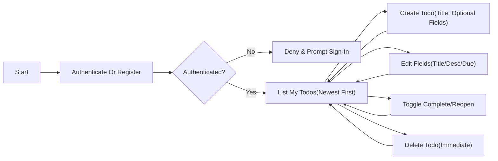
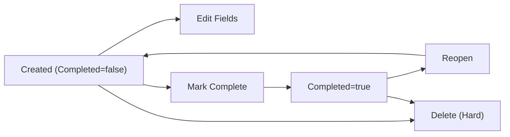

# Minimal Todo Service (prefix: "todo") — Requirements Analysis

## Vision and Goals
Provide the smallest set of capabilities for an individual to capture, review, complete, and remove personal tasks with minimal friction.

Business goals:
- THE "todo" service SHALL enable a single authenticated user to manage only personal todo items.
- THE "todo" service SHALL require a non-empty title for every todo item.
- THE "todo" service SHALL keep todos private to their owner at all times.
- THE "todo" service SHALL avoid complexity beyond create, list, read, update, complete/reopen, and delete for MVP.

Success indicators (business-level):
- WHEN a new user signs up, THE service SHALL allow creation of the first todo within 1 minute under normal conditions.
- WHEN core actions are performed, THE service SHALL provide responses that feel immediate for typical personal lists.

## Actors and Permissions

Actors:
- User: An authenticated individual who owns and manages personal todos.
- Unauthenticated State: A non-actor state where no access to user-owned todos is permitted.

Permissions (business terms):
- THE service SHALL allow only the User to create, list, read, update, delete, and toggle completion of that User’s own todos.
- IF a request targets a todo not owned by the requesting User, THEN THE service SHALL deny access without revealing whether the item exists.
- IF an Unauthenticated State attempts any todo action, THEN THE service SHALL deny access and indicate that sign-in is required.

## Scope Definition

### In-Scope (MVP)
- Registration, login, and logout in business terms (no technical details).
- Personal todo lifecycle: create, list, read, update, toggle completion, delete.
- Fields per todo: title (required), description (optional), due date (optional date-only), completion status (boolean).
- Default list ordering by newest first; basic status filter (All, Active, Completed).

### Out-of-Scope (MVP)
- Collaboration, shared lists, assignments, or roles beyond the single User.
- Notifications, reminders, recurring tasks, or scheduling automation.
- Tags, projects, priorities, attachments, subtasks, or custom fields.
- Search or advanced filtering beyond status.
- Administrative actors or dashboards.
- API designs, database schemas, storage details, or infrastructure prescriptions.

## User Scenarios (Narratives)

Scenario A: First-Time Use
- WHEN a person completes valid registration, THE service SHALL consider the person a User and allow immediate creation of a first todo with a required title.
- IF the first title is missing or whitespace-only, THEN THE service SHALL reject creation and explain that a title is required.

Scenario B: Daily Management
- WHEN a User returns, THE service SHALL show only that User’s todo list in a predictable default order.
- WHEN a User edits fields within limits, THE service SHALL save and reflect changes immediately in subsequent views.
- WHEN a User completes or reopens an item, THE service SHALL reflect the new completion state immediately.
- WHEN a User deletes an item, THE service SHALL remove it from lists immediately.

Scenario C: Optional Due Dates
- WHERE a User sets a due date, THE service SHALL treat it as date-only and compute simple status such as overdue (past date and not completed) and due today (current date and not completed) for conceptual presentation.
- WHEN a User clears a due date, THE service SHALL remove the due date and cease any due-based status for that item.

## Functional Requirements (EARS)

### Account Lifecycle (business-level)
- WHEN a person submits valid registration details, THE service SHALL create a User account.
- WHEN a User submits valid credentials, THE service SHALL establish authenticated access.
- IF credentials are invalid, THEN THE service SHALL deny access without revealing whether an account exists.
- WHEN a User requests logout, THE service SHALL end authenticated access for subsequent requests.
- WHILE a User remains authenticated, THE service SHALL allow permitted actions described in this report.

### Todo Lifecycle
Fields:
- Title: required, single-line, 1–120 characters after trimming.
- Description: optional, up to 1,000 characters after trimming.
- Due date: optional, date-only value; may be past, present, or future; interpreted consistently.
- Completion status: boolean; defaults to not completed on creation.

Create
- WHEN a User submits a todo with a non-empty title within 1–120 characters, THE service SHALL create the item with completion set to not completed.
- WHERE a description is provided within 0–1,000 characters, THE service SHALL store it.
- WHERE a due date is provided and is a valid calendar date, THE service SHALL store it as date-only.
- IF the title is empty, exceeds 120 characters, contains line breaks, or the due date is invalid, THEN THE service SHALL reject creation with clear field messages.

Read (Single)
- WHEN a User requests a todo owned by that User, THE service SHALL return the item’s business fields.
- IF the todo does not exist or is deleted, THEN THE service SHALL indicate that the item is not available.

List (Overview)
- WHEN a User requests a list, THE service SHALL return only that User’s items.
- THE service SHALL present a default ordering of newest first by creation time.
- WHERE a status filter is requested (All, Active, Completed), THE service SHALL include only items matching the selected status.

Update (Fields)
- WHEN a User updates title, description, or due date on an owned item within constraints, THE service SHALL persist and reflect the changes.
- IF an updated field violates constraints, THEN THE service SHALL reject the update and preserve existing values.

Toggle Completion
- WHEN a User marks an item complete, THE service SHALL set completion to completed and preserve other fields.
- WHEN a User reopens a completed item, THE service SHALL set completion to not completed and preserve other fields.
- WHERE the requested completion state matches the current state, THE service SHALL succeed without error.

Delete
- WHEN a User deletes an owned item, THE service SHALL remove it from subsequent listings immediately.
- THE deletion behavior SHALL be irreversible for MVP (no recycle bin).
- IF deletion targets a non-existent item, THEN THE service SHALL indicate that the item is not available.

## Business Rules and Validations

Normalization
- WHEN text fields are received, THE service SHALL trim leading and trailing whitespace.
- WHEN a title trims to empty or includes line breaks, THE service SHALL treat it as invalid.

Title
- THE title SHALL be single-line and 1–120 characters after trimming.
- IF title is missing/empty/too long/contains line breaks, THEN THE service SHALL reject the change with a specific message.

Description
- THE description SHALL be optional and up to 1,000 characters after trimming.
- IF description exceeds 1,000 characters, THEN THE service SHALL reject the change with a specific message.

Due Date (date-only)
- THE due date SHALL be optional and a valid calendar date.
- WHERE time-of-day is included, THE service SHALL ignore time-of-day and use only the date.
- THE service SHALL compute “overdue” when the current date is after the due date and the item is not completed, and “due today” when equal.

Ownership and Isolation
- THE service SHALL associate each todo with exactly one owner (the creating User) in MVP.
- THE service SHALL restrict all todo actions to the owner only.
- IF a request references another User’s item, THEN THE service SHALL deny access without revealing existence.

Deletion
- THE service SHALL perform immediate, irreversible deletion in MVP.
- IF an item is already deleted, THEN THE service SHALL acknowledge unavailability and advise refreshing the list.

## Authentication and Authorization (Business-Level)
- WHEN a User attempts a protected action without an active authenticated state, THE service SHALL deny the action and request sign-in.
- WHEN a User attempts to access or modify another User’s item, THE service SHALL deny access and avoid disclosing existence.
- WHILE a session remains active, THE service SHALL allow only owner-scoped operations.

## Error Handling and Recovery (Business-Level)
Categories and outcomes:
- Authentication: WHEN not signed in, THE service SHALL prompt sign-in and allow retry.
- Authorization: IF acting on non-owned items, THEN THE service SHALL deny with a non-disclosing message.
- Validation: WHEN input fails rules, THE service SHALL return field-specific guidance and perform no partial writes.
- Not Found: WHEN an item is unavailable, THE service SHALL inform and suggest refreshing the list.
- Idempotency: WHERE a completion toggle repeats the current state, THE service SHALL confirm the state without error.
- Transient/System: WHEN temporary issues occur, THE service SHALL advise retrying shortly and preserve user-entered data where feasible.

## Non-Functional Requirements (User-Perceived)
Performance (targets under normal conditions):
- THE service SHALL complete registration/login within 2 seconds (typical cases).
- THE service SHALL list a page of todos within 1 second for typical personal lists.
- THE service SHALL complete single-item create/update/delete within 0.7 seconds.
- THE service SHALL toggle completion within 0.5 seconds.

Availability and Reliability:
- THE service SHALL target 99.9% monthly availability.
- WHERE partial outages occur, THE service SHALL provide clear messages and safe retries without duplicating items.

Privacy and Security:
- THE service SHALL isolate user data such that no cross-user visibility is possible.
- THE service SHALL minimize personal data collection to what is necessary for core functionality.

Timezone Note (business interpretation):
- WHILE no user-specific timezone is selected, THE service SHALL interpret date-only due dates consistently; default assumption may align with "Asia/Seoul" for evaluation consistency.

## Data Lifecycle and Privacy
Creation → Access → Update → Delete (hard delete for MVP). Backups exist for disaster recovery only; users cannot access backup copies.

Retention (business targets):
- THE service SHALL retain backup copies for disaster recovery for up to 30 calendar days.
- THE service SHALL retain operational logs/audit events in minimal form for up to 90 calendar days.

User Control:
- WHEN a User deletes an item, THE service SHALL remove it from active views immediately.
- WHEN a User requests account deletion, THE service SHALL remove all active items from the User’s access immediately after success.
- WHEN a User requests a data export, THE service SHALL provide a machine-readable export to the authenticated requester within a reasonable window (e.g., within 24 hours) under normal conditions.

## Conceptual User Flows (Mermaid)

High-Level Access and Operations

```mermaid
graph LR
  A["Start"] --> B["Authenticate Or Register"]
  B --> C{"Authenticated?"}
  C -->|"No"| D["Deny & Prompt Sign-In"]
  C -->|"Yes"| E["List My Todos(Newest First)"]
  E --> F["Create Todo(Title, Optional Fields)"]
  E --> G["Edit Fields(Title/Desc/Due)"]
  E --> H["Toggle Complete/Reopen"]
  E --> I["Delete Todo(Immediate)"]
  F --> E
  G --> E
  H --> E
  I --> E
```

Todo Lifecycle (State Transitions)

```mermaid
graph LR
  A["Created (Completed=false)"] --> B["Edit Fields"]
  A --> C["Mark Complete"]
  C --> D["Completed=true"]
  D --> E["Reopen"]
  E --> A
  A --> F["Delete (Hard)"]
  D --> F
```

## Acceptance Criteria (Testable EARS)
Registration and Login
- WHEN valid registration details are submitted, THE service SHALL create a User account and allow login.
- WHEN valid credentials are submitted, THE service SHALL establish authenticated access.
- IF credentials are invalid, THEN THE service SHALL deny access with a non-disclosing message.

Create
- WHEN a title of 1–120 single-line characters is provided, THE service SHALL create the todo with completion=false.
- IF title is empty/too long/contains line breaks, THEN THE service SHALL reject creation with a clear field message.
- WHERE a valid date-only due date is provided, THE service SHALL store it; IF invalid, THEN THE service SHALL reject it.

List and Read
- WHEN a User lists todos with no filter, THE service SHALL return only that User’s items ordered newest-first.
- WHERE a status filter is selected (All/Active/Completed), THE service SHALL return only matching items.
- WHEN a User requests a todo they own, THE service SHALL return its fields; IF not available, THEN THE service SHALL report unavailability.

Update
- WHEN a User updates owned fields within limits, THE service SHALL persist and reflect changes; IF invalid, THEN THE service SHALL reject and preserve prior values.

Toggle
- WHEN a User marks complete or reopens, THE service SHALL set the requested state and confirm it; WHERE no state change applies, THE service SHALL confirm the current state.

Delete
- WHEN a User deletes an owned item, THE service SHALL remove it from subsequent listings immediately; IF already absent, THEN THE service SHALL report unavailability.

Isolation and Privacy
- IF a request references another User’s item, THEN THE service SHALL deny access without revealing existence.
- THE service SHALL keep user data private and inaccessible to other users.

Performance (user-perceived)
- WHEN core actions occur under normal conditions, THE service SHALL meet response targets listed in Non-Functional Requirements.

## Glossary
- Todo: A personal task item owned by a User.
- User: An authenticated individual managing personal todos.
- Unauthenticated State: A non-actor state without access to user-owned data.
- Date-Only Due Date: A calendar date without time-of-day component.
- Default Ordering: Newest first by creation time in listings.
- MVP: Minimal Viable Product, restricted to essential behaviors only.
