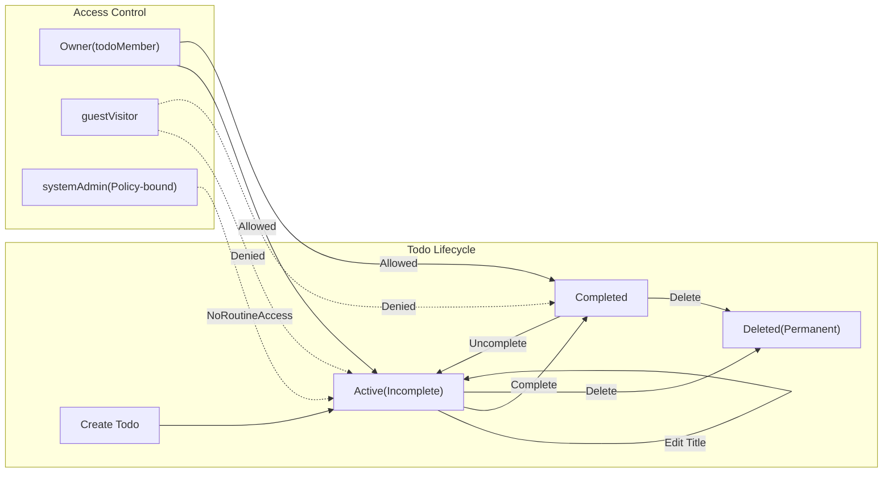

# Minimal Todo Service – Business Rules and Validation (todoList)

This specification defines WHAT the minimal Todo service must do in business terms so developers can implement it without ambiguity. It deliberately excludes technical designs (APIs, schemas, storage, infrastructure) and UI specifications. Language: en-US. Timezone defaults: Asia/Seoul unless a user preference is set.

## 1) Purpose and Scope
- Purpose: Provide clear, testable business rules and validations for a minimal personal Todo list so a single authenticated member can reliably create, review, update, complete/uncomplete, delete, and list items.
- Scope (Minimal): Only the fields and actions strictly necessary to operate a basic Todo list.
  - In scope: Title (required), Completed (boolean), CreatedAt, UpdatedAt, optional CompletedAt (set only when completed), ownership, listing, basic status filters, default ordering by creation time, pagination.
  - Out of scope (Initial Minimal): Description/notes, due dates, tags/labels, priorities, reminders/notifications, attachments, subtasks, comments, sharing/collaboration, advanced filters/search, bulk operations, import/export tooling (beyond references in other docs), API/database/infrastructure details.

## 2) References and Relationships
- Roles and permissions: see ./02-user-roles-and-permissions.md (business terms only).
- Functional requirements: see ./03-functional-requirements-minimal-todo.md.
- Error handling and recovery: see ./07-error-handling-and-recovery.md.
- Non-functional expectations: see ./08-non-functional-requirements.md.
- Security and privacy: see ./09-security-and-privacy.md.
- Data lifecycle: see ./10-data-lifecycle-and-retention.md.

## 3) Terminology and Entity Overview (Minimal Fields)
- Todo: A personal task entry owned by exactly one member.
- Fields (business-level):
  - Title (required): Short text describing the task.
  - Completed (system-managed): Boolean state; defaults to false on creation.
  - CreatedAt (system-managed): Creation timestamp.
  - UpdatedAt (system-managed): Last modification timestamp (any change including completion toggle).
  - CompletedAt (system-managed, optional): Timestamp set when transitioning to Completed; cleared when uncompleted.
- Ownership: The authenticated member who created the Todo; only the owner may act on the Todo under normal operation.

## 4) Field-Level Rules (Business Terms)

### 4.1 Title
- THE todoList service SHALL treat Title as mandatory.
- THE todoList service SHALL trim leading and trailing whitespace from Title before validation and storage.
- THE todoList service SHALL validate Title length between 1 and 100 characters inclusive after trimming.
- THE todoList service SHALL accept any Unicode characters in Title except non-printable control characters; newline characters are not allowed.
- THE todoList service SHALL preserve internal spaces and casing within Title after trimming.

EARS examples:
- WHEN a user submits a Title containing only whitespace, THE todoList service SHALL reject the input with a clear validation message stating that a non-empty Title is required.
- IF Title length after trimming exceeds 100 characters, THEN THE todoList service SHALL reject the request and state the maximum allowed length is 100 characters.
- IF Title contains newline characters, THEN THE todoList service SHALL reject the request and state that Title must be a single line.

### 4.2 Completed and CompletedAt
- THE todoList service SHALL default Completed to false on creation.
- THE todoList service SHALL set Completed=true only via explicit user action to complete a Todo.
- THE todoList service SHALL set CompletedAt when a Todo transitions to Completed and SHALL clear CompletedAt when uncompleted.
- THE todoList service SHALL not infer completion from Title patterns or text content.

EARS examples:
- WHEN a Todo is marked complete, THE todoList service SHALL set Completed=true and set CompletedAt to the current time in the user’s timezone context.
- WHEN a Todo is marked uncomplete, THE todoList service SHALL set Completed=false and clear CompletedAt.

### 4.3 CreatedAt and UpdatedAt
- THE todoList service SHALL set CreatedAt when the Todo is created and SHALL never change it afterwards.
- THE todoList service SHALL set UpdatedAt whenever a mutable field changes (Title or Completed state).

EARS examples:
- WHEN a Todo is created, THE todoList service SHALL set CreatedAt and UpdatedAt to the current time in the user’s timezone context.
- WHEN a Todo is edited or completion state toggled, THE todoList service SHALL update UpdatedAt to the current time in the user’s timezone context.

### 4.4 Ownership
- THE todoList service SHALL associate each Todo with exactly one owner at creation.
- THE todoList service SHALL prevent non-owners from reading or modifying a Todo under normal operations.

EARS examples:
- WHEN the owner performs an allowed action, THE todoList service SHALL allow the action subject to other validations.
- IF a non-owner attempts to access a Todo, THEN THE todoList service SHALL deny access and SHALL not reveal whether the Todo exists.

## 5) Action-Level Rules (Preconditions and Postconditions)

Role constraints:
- guestVisitor: no access to any Todo data or actions.
- todoMember: full control over own Todos only.
- systemAdmin: oversight for system policies and abuse processes; no routine access to private Todos.

### 5.1 Create a Todo
Preconditions:
- Actor is todoMember.
- Input includes a valid Title per section 4.1.

Postconditions:
- A new Todo exists with Completed=false; CreatedAt and UpdatedAt are set; owner is assigned.

EARS:
- WHEN a todoMember submits a valid Title, THE todoList service SHALL create a Todo owned by that member with Completed=false and timestamps set.
- IF Title fails validation, THEN THE todoList service SHALL not create a Todo and SHALL return a field-specific validation message.
- WHERE the actor is guestVisitor, THE todoList service SHALL deny creation and provide authentication guidance.

### 5.2 Read a Todo (Detail)
Preconditions:
- Actor is todoMember requesting own Todo by identifier.

Postconditions:
- The Todo’s fields (Title, Completed, CreatedAt, UpdatedAt, CompletedAt where applicable) are returned.

EARS:
- WHEN a member requests their own Todo by identifier, THE todoList service SHALL return the Todo’s fields.
- IF the Todo does not exist in the member’s accessible scope, THEN THE todoList service SHALL respond with a not-available message without revealing existence to non-owners.

### 5.3 Update a Todo’s Title
Preconditions:
- Actor is the owner (todoMember).
- Input Title passes validation.

Postconditions:
- Title is changed; UpdatedAt is set to current time.

EARS:
- WHEN the owner submits a valid new Title, THE todoList service SHALL apply the change and set UpdatedAt.
- IF the new Title is invalid, THEN THE todoList service SHALL reject the update with a field-specific message.
- IF the Todo is not owned by the requester or not found, THEN THE todoList service SHALL deny the update and SHALL not leak existence.

### 5.4 Complete a Todo
Preconditions:
- Actor is the owner.

Postconditions:
- Completed=true; CompletedAt set; UpdatedAt set.

EARS:
- WHEN the owner marks a Todo complete, THE todoList service SHALL set Completed=true, set CompletedAt, and set UpdatedAt.
- WHERE the Todo is already Completed, THE todoList service SHALL return the current state without duplicating effects.

### 5.5 Uncomplete a Todo
Preconditions:
- Actor is the owner.

Postconditions:
- Completed=false; CompletedAt cleared; UpdatedAt set.

EARS:
- WHEN the owner marks a Todo uncomplete, THE todoList service SHALL set Completed=false, clear CompletedAt, and set UpdatedAt.
- WHERE the Todo is already Active (not completed), THE todoList service SHALL return the current state without error.

### 5.6 Delete a Todo
Preconditions:
- Actor is the owner.

Postconditions:
- The Todo is permanently removed in the minimal scope and is no longer available in subsequent operations.

EARS:
- WHEN the owner deletes a Todo, THE todoList service SHALL permanently remove it from subsequent reads and listings.
- WHERE the Todo is already deleted or not found, THE todoList service SHALL return a safe outcome indicating that no item is available to delete.

## 6) Idempotency and Duplication Handling
- Status actions are idempotent; repeating the same state set does not change state further.
- Creation retries are treated as distinct Creates if each submission passes validation; deduplication is out of scope for minimal.

EARS:
- WHEN a Todo is repeatedly marked complete without intervening uncomplete, THE todoList service SHALL keep Completed=true and SHALL not create multiple completion effects.
- WHEN a Todo is repeatedly marked uncomplete, THE todoList service SHALL keep Completed=false and SHALL not create multiple effects.
- WHEN a delete request is repeated for the same Todo, THE todoList service SHALL respond safely that the item is no longer available.
- IF the same create is submitted multiple times, THEN THE todoList service SHALL create distinct Todos if all submissions pass validation.

## 7) Ordering and Pagination (Business Terms)
- Default ordering: CreatedAt descending (newest first) for all list views in the minimal scope.
- Pagination: Default page size is 20 items; allowed page size range is 10 to 50 inclusive.
- Empty pages: Requests beyond the end of results return an empty list with page metadata sufficient to understand navigation (format is implementation-defined).

EARS:
- THE todoList service SHALL order list results by CreatedAt descending by default.
- THE todoList service SHALL provide page-based retrieval with default page size 20 and allow 10–50 inclusive upon request; out-of-range values SHALL be coerced to the nearest bound or rejected with a validation message, consistently.
- WHEN a page has no items, THE todoList service SHALL return an empty list with page metadata indicating no items for that page.

## 8) Localization and Timezone
- Presentation timezone: Use the user’s configured timezone if available; otherwise default to Asia/Seoul.
- Date-only vs. date-time inputs are not in scope for minimal, since due dates are out of scope. Timestamps referenced in this document are system-managed and shown in user-local time for human contexts.

EARS:
- WHERE a user timezone preference exists, THE todoList service SHALL present timestamps in that timezone.
- WHERE no preference exists, THE todoList service SHALL present timestamps in Asia/Seoul.

## 9) Business Lifecycle and Access Control (Mermaid)

## 10) Traceability to Roles and Permissions
- Boundaries: Only the owner may act on a Todo; guests have no access; admins do not access private content in routine operations.

EARS:
- THE todoList service SHALL restrict access to personal Todos to the owner by default.
- IF an actor’s role does not permit the action, THEN THE todoList service SHALL deny the action and provide next-step guidance in business terms.

## 11) Acceptance and Testability Notes
- Field validation is testable by providing Title edge cases (empty/whitespace-only, 1 char, 100 chars, >100 chars, newline present).
- Action rules are testable by verifying state transitions and timestamps (CreatedAt/UpdatedAt/CompletedAt behavior).
- Idempotency is testable by repeating the same state-setting action and confirming stable results.
- Ordering is testable by creating Todos with known CreatedAt values and confirming newest-first ordering with pagination boundaries at 20, 10, and 50.
- Permission denial is testable by attempting cross-user access and confirming neutral, non-leaky messaging.

## 12) EARS Requirement Index (Extract)
- THE todoList service SHALL require a non-empty Title trimmed to 1–100 characters.
- WHEN a valid Title is submitted, THE todoList service SHALL create a Todo with Completed=false and set CreatedAt and UpdatedAt.
- WHEN a Todo is marked complete, THE todoList service SHALL set Completed=true, set CompletedAt, and set UpdatedAt.
- WHEN a Todo is marked uncomplete, THE todoList service SHALL set Completed=false, clear CompletedAt, and set UpdatedAt.
- WHEN the owner updates Title, THE todoList service SHALL set UpdatedAt.
- IF Title is invalid, THEN THE todoList service SHALL reject create or update with field-specific guidance.
- THE todoList service SHALL order listings by CreatedAt descending and paginate with a default size of 20 and allowed range of 10–50.
- IF an actor is unauthenticated or not the owner, THEN THE todoList service SHALL deny access without revealing existence.
- WHERE no timezone preference exists, THE todoList service SHALL present timestamps in Asia/Seoul.

---
This specification expresses business requirements only and intentionally avoids technical implementation details. Developers retain full autonomy over architecture, APIs, data models, and infrastructure while meeting these business outcomes.