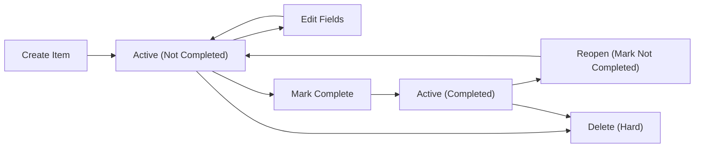

# Business Rules and Validation for Minimal Todo Service (todo)

Scope: Minimal Todo functionality for a single authenticated user who manages only personal items. Content is expressed in business language and does not prescribe technical implementations (no APIs, schemas, or storage details). Requirements use EARS syntax where applicable and are testable from a black-box perspective.

- Out of scope: sharing/collaboration, tags/labels/priorities, attachments/subtasks, reminders/notifications, recurring tasks, complex search/filters, multi-actor roles, bulk operations, or administrative consoles.

## Terminology and Domain Definitions
- Todo Item: A personal task owned by exactly one authenticated user. Contains a required title, optional description, optional due date (calendar date), completion status, and system-maintained business timestamps.
- Title: Short, single-line text naming the Todo Item. Required at creation and update.
- Description: Optional, multi-line free text providing additional detail.
- Due Date: Optional calendar date indicating when the item is intended to be completed. Interpreted as a date-only value (no time-of-day); comparisons are based on the user’s local calendar context.
- Completion Status: Boolean state: completed or not completed. Defaults to not completed at creation.
- Created At / Updated At: Business-visible timestamps indicating when the item was created and last modified for ordering and audit expectations (not user-editable fields).
- Ownership: Association of a Todo Item with the single authenticated user who created it. Ownership is immutable in MVP.
- Deletion: Removal by the owner. MVP behavior is immediate and irreversible (hard delete); deleted items are not accessible to users.
- Listing: Retrieval of a user’s own items with default ordering and optional basic filtering by completion status.

## Guiding Principles and Non-Goals (MVP Minimalism)
- Minimal Feature Set: Only essential capabilities for create, read, update, complete/reopen, delete.
- Data Isolation: Users access only their own items; cross-user leakage is prohibited.
- Predictability: Deterministic validations, ordering, and messages.
- No Background Automations: No reminders, scheduled jobs, or notifications in MVP.
- No Collaboration: No shared lists, assignments, or delegated access.

EARS principles:
- THE "todo system" SHALL implement only the rules stated in this business document for MVP.
- WHERE "unspecified behaviors" arise, THE "todo system" SHALL follow the principle of least surprise and deny unsupported actions with clear, consistent business messages.

## Todo Field Rules (title, description, due date, completion)

### General Input Normalization
- WHEN "text fields (title, description) are received", THE "todo system" SHALL trim leading and trailing whitespace.
- WHEN "an empty string trims to empty", THE "todo system" SHALL treat it as missing for optional fields and as invalid for required fields.

### Title (Required)
- THE "todo system" SHALL require a non-empty title after trimming.
- THE "todo system" SHALL constrain title length to 1–120 characters after trimming.
- THE "todo system" SHALL restrict the title to a single line (no line breaks). Any line break is invalid.
- THE "todo system" SHALL allow any visible Unicode characters except control characters.

EARS: Title validation and messages
- WHEN "creating a todo without a title or with a title that trims to empty", THE "todo system" SHALL reject with the message "Title is required".
- WHEN "updating a todo with a title exceeding 120 characters after trimming", THE "todo system" SHALL reject with the message "Title must be 1 to 120 characters".
- WHEN "a title contains line breaks", THE "todo system" SHALL reject with the message "Title must be a single line".

### Description (Optional)
- THE "todo system" SHALL accept description as optional.
- THE "todo system" SHALL allow multi-line content for description.
- THE "todo system" SHALL limit description length to a maximum of 2,000 characters after trimming.
- WHEN "description is omitted or trims to empty", THE "todo system" SHALL store it as absent (no description).

EARS: Description validation and messages
- WHEN "description exceeds 2,000 characters after trimming", THE "todo system" SHALL reject with the message "Description must be 0 to 2000 characters".

### Due Date (Optional, Date-Only)
- THE "todo system" SHALL treat due date as a calendar date (no time-of-day component).
- THE "todo system" SHALL accept due date as optional.
- THE "todo system" SHALL allow due dates in the past, present, or future (overdue detection occurs by comparison rules, not by validation).
- THE "todo system" SHALL interpret due date comparisons in the user’s local calendar context.
- THE "todo system" SHALL allow removal of an existing due date by explicitly setting it to absent.

EARS: Due date validation and messages
- WHEN "due date value is not a valid calendar date", THE "todo system" SHALL reject with the message "Due date must be a valid date".
- WHEN "a due date is provided with a time-of-day component", THE "todo system" SHALL ignore the time-of-day and use only the date for business behavior.

### Completion Status
- THE "todo system" SHALL default completion to not completed for newly created items.
- WHEN "a user marks an item complete", THE "todo system" SHALL set completion to completed and maintain a non-editable completion timestamp internally for audit expectations.
- WHEN "a user reopens a completed item", THE "todo system" SHALL set completion to not completed and may maintain prior completion timestamps internally for audit expectations.
- THE "todo system" SHALL allow toggling completion regardless of due date presence.

EARS: Completion semantics
- WHEN "marking complete an item already complete", THE "todo system" SHALL confirm the item remains complete without error.
- WHEN "reopening an item already not completed", THE "todo system" SHALL confirm the item remains not completed without error.

## Ownership and Authorization Rules (business-level)

Ownership establishment and boundaries
- WHEN "a user creates a todo", THE "todo system" SHALL assign ownership to that user and persist ownership until deletion.
- THE "todo system" SHALL forbid any ownership transfer in MVP.

Access boundaries and messaging
- WHEN "a user attempts to read a todo they do not own", THE "todo system" SHALL deny access with the message "You do not have access to this item".
- WHEN "a user attempts to update a todo they do not own", THE "todo system" SHALL deny access with the message "You do not have access to this item".
- WHEN "a user attempts to delete a todo they do not own", THE "todo system" SHALL deny access with the message "You do not have access to this item".
- THE "todo system" SHALL ensure listings return only the authenticated user’s items.

Permission matrix (business view)

| Action | User |
|--------|------|
| Create own todo | ✅ |
| Read own todo | ✅ |
| Update own todo | ✅ |
| Delete own todo | ✅ |
| Read others’ todo | ❌ |
| Update others’ todo | ❌ |
| Delete others’ todo | ❌ |

EARS: Ownership and isolation summary
- THE "todo system" SHALL restrict all todo access and modifications to the owner only.
- IF "the requester is not the owner", THEN THE "todo system" SHALL deny the action with a clear business message and without revealing whether the item exists.

## Editing and Deletion Constraints

Editing rules
- THE "todo system" SHALL allow editing of title, description, due date, and completion status for the owner.
- WHEN "editing title", THE "todo system" SHALL enforce all title rules.
- WHEN "editing description", THE "todo system" SHALL enforce description length rules.
- WHEN "editing due date", THE "todo system" SHALL enforce valid date semantics.
- WHEN "toggling completion", THE "todo system" SHALL update completion and maintain audit expectations internally.

Deletion rules and edge cases
- THE "todo system" SHALL allow only the owner to delete their items.
- THE "todo system" SHALL perform immediate and irreversible deletion in MVP.
- WHEN "the owner requests deletion of an item", THE "todo system" SHALL remove it so it is no longer visible in listings or retrievable.
- WHEN "an operation targets a deleted or non-existent item", THE "todo system" SHALL respond with the message "Item not found" without exposing whether it ever existed.
- WHEN "deleting a completed item or an item with a due date", THE "todo system" SHALL delete it with the same behavior as any other item.

## Ordering, Listing Visibility, and Basic Filtering

Default ordering and determinism
- THE "todo system" SHALL list a user’s items by default with the newest items first based on creation time (descending).
- WHERE "multiple items share the same creation time to the minute", THE "todo system" SHALL order such items deterministically by most recent update time as a secondary key (descending), and by title lexicographic order (ascending) as a tertiary key if still tied.

Visibility and scope
- THE "todo system" SHALL include only items owned by the requesting user in any listing.
- THE "todo system" SHALL include both completed and not completed items by default when no status filter is applied.

Basic status filters
- THE "todo system" SHALL support the status filter values: "all", "active", and "completed".
- WHERE "all" is selected, THE "todo system" SHALL include both completed and not completed items.
- WHERE "active" is selected, THE "todo system" SHALL include only items whose completion status is not completed.
- WHERE "completed" is selected, THE "todo system" SHALL include only items whose completion status is completed.

Pagination expectations (business-level)
- THE "todo system" SHALL return listings in pages with a default page size of 20 items and a maximum of 100 items per page for MVP.
- WHERE "a requested page size exceeds 100", THE "todo system" SHALL cap results at 100 items and indicate that a cap was applied in business terms.

Due date semantics
- THE "todo system" SHALL consider an item overdue if its due date is before the user’s current local calendar date and the item is not completed (computed, not stored).
- THE "todo system" SHALL consider an item due today if its due date equals the user’s current local calendar date.
- THE "todo system" SHALL not exclude overdue or completed items from default listings in MVP.

## Validation Error Conditions and Standard Messages (business terms)

Title errors
- IF "title is missing or trims to empty", THEN THE "todo system" SHALL present the message "Title is required".
- IF "title exceeds 120 characters after trimming", THEN THE "todo system" SHALL present the message "Title must be 1 to 120 characters".
- IF "title contains line breaks", THEN THE "todo system" SHALL present the message "Title must be a single line".

Description errors
- IF "description exceeds 2000 characters after trimming", THEN THE "todo system" SHALL present the message "Description must be 0 to 2000 characters".

Due date errors
- IF "due date is not a valid calendar date", THEN THE "todo system" SHALL present the message "Due date must be a valid date".

Authorization and ownership errors
- IF "the requester is not the owner of the item", THEN THE "todo system" SHALL present the message "You do not have access to this item" and shall not reveal whether the item exists.

Not found and state errors
- IF "the item does not exist (never existed or already deleted)", THEN THE "todo system" SHALL present the message "Item not found".

General validation behavior
- THE "todo system" SHALL return user-understandable business messages only and avoid internal technical details.
- WHERE "multiple validation errors occur in a single request", THE "todo system" SHALL present messages for all fields that failed validation in a concise, readable way.

## Lifecycle Diagram (business-level)

```mermaid
graph LR
  A["Create Item"] --> B["Active (Not Completed)"]
  B --> C["Edit Fields"]
  B --> D["Mark Complete"]
  D --> E["Active (Completed)"]
  E --> F["Reopen (Mark Not Completed)"]
  F --> B
  B --> G["Delete (Hard)"]
  E --> G
  C --> B
```

Diagram notes: “Active” represents items that exist and are owned by the user; completion is a property. “Delete (Hard)” removes the item permanently; no recovery in MVP.

## Acceptance Criteria (testable, business-focused)

Creation
1. WHEN "creating with valid title (1–120 chars), optional description (<=2000), and optional valid due date", THE "todo system" SHALL create the item as not completed and assign ownership to the requester.
2. WHEN "creating without a title or with a title that trims to empty", THE "todo system" SHALL reject with "Title is required" and create nothing.
3. WHEN "creating with a title containing line breaks", THE "todo system" SHALL reject with "Title must be a single line".
4. WHEN "creating with title longer than 120 characters", THE "todo system" SHALL reject with "Title must be 1 to 120 characters".
5. WHEN "creating with description longer than 2000 characters", THE "todo system" SHALL reject with "Description must be 0 to 2000 characters".
6. WHEN "creating with invalid due date", THE "todo system" SHALL reject with "Due date must be a valid date".

Reading
7. WHEN "reading an item owned by the requester", THE "todo system" SHALL return the item details.
8. WHEN "reading an item not owned by the requester", THE "todo system" SHALL deny with "You do not have access to this item" without confirming existence.
9. WHEN "reading a non-existent or previously deleted item", THE "todo system" SHALL respond with "Item not found".

Updating
10. WHEN "updating title within 1–120 chars single-line", THE "todo system" SHALL accept and reflect the change.
11. WHEN "updating title to empty or whitespace-only", THE "todo system" SHALL reject with "Title is required".
12. WHEN "updating title to include line breaks", THE "todo system" SHALL reject with "Title must be a single line".
13. WHEN "updating description to >2000 chars", THE "todo system" SHALL reject with "Description must be 0 to 2000 characters".
14. WHEN "setting due date to a valid date (past, today, future)", THE "todo system" SHALL accept and reflect the change.
15. WHEN "setting due date to an invalid date", THE "todo system" SHALL reject with "Due date must be a valid date".
16. WHEN "removing due date explicitly", THE "todo system" SHALL store it as absent.
17. WHEN "toggling completion to completed", THE "todo system" SHALL mark the item as completed and maintain internal audit expectations.
18. WHEN "toggling completion to not completed", THE "todo system" SHALL mark the item as not completed.
19. WHEN "attempting to update an item not owned by requester", THE "todo system" SHALL deny with "You do not have access to this item".
20. WHEN "attempting to update a non-existent or previously deleted item", THE "todo system" SHALL respond with "Item not found".

Deletion
21. WHEN "the owner requests deletion", THE "todo system" SHALL delete the item immediately so it is no longer visible or retrievable.
22. WHEN "a non-owner attempts deletion", THE "todo system" SHALL deny with "You do not have access to this item".
23. WHEN "deleting an item that does not exist or is already deleted", THE "todo system" SHALL respond with "Item not found".

Listing and Visibility
24. WHEN "listing without filters", THE "todo system" SHALL return only the requester’s items ordered by creation time descending with deterministic secondary (updated time desc) and tertiary (title asc) keys.
25. WHEN "listing with filter for active items only", THE "todo system" SHALL include only items whose completion status is not completed.
26. WHEN "listing with filter for completed items only", THE "todo system" SHALL include only items whose completion status is completed.
27. WHEN "listing after deleting an item", THE "todo system" SHALL not include the deleted item in results.
28. WHEN "listing with an explicit page size up to 100", THE "todo system" SHALL return that many items; IF request exceeds 100, THEN cap at 100 and indicate a cap was applied.

Due Date Semantics
29. WHEN "today is after an item’s due date and the item is not completed", THE "todo system" SHALL consider the item overdue (computed, not stored).
30. WHEN "today equals an item’s due date", THE "todo system" SHALL consider the item due today (computed, not stored).

Security and Isolation (Business-Level)
31. THE "todo system" SHALL never expose another user’s item identifiers, titles, or any data through any business function.
32. IF "any operation references an item not owned by the requester", THEN THE "todo system" SHALL deny access with "You do not have access to this item".

Messaging Consistency
33. THE "todo system" SHALL ensure that identical validation failures always produce the same business message text as specified in this document.

## Related Documents
- Functional scope: [Functional Requirements](./03-functional-requirements.md)
- Actor boundaries: [User Actors and Permissions](./02-user-actors-and-permissions.md)

Notes: Business requirements only. Technical implementation details (architecture, APIs, storage) are explicitly deferred to the development team.