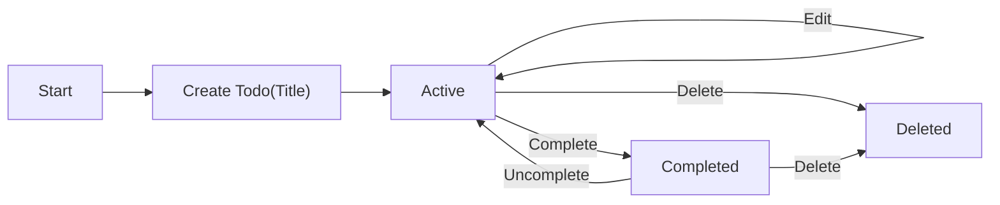
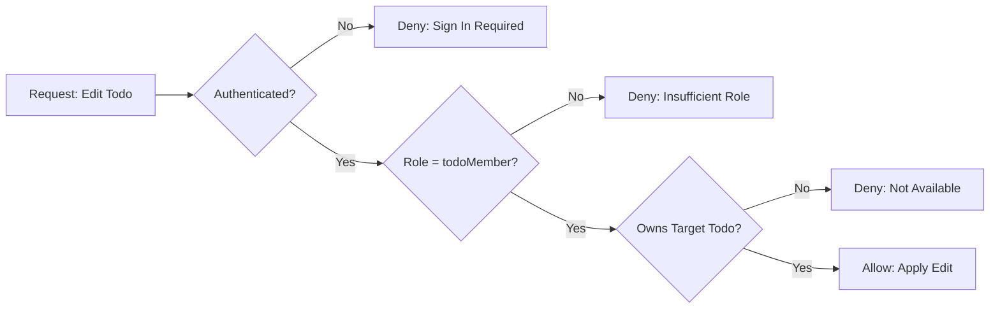

# Minimal Todo List – Business Requirements (prefix: todoList)

## 1. Vision and Scope
The goal is to provide the smallest useful set of capabilities for a personal Todo list, prioritizing speed, clarity, and predictability over feature breadth. The experience must enable individuals to capture tasks quickly, review what remains, mark items complete, make small corrections, and remove tasks that are no longer needed.

### 1.1 In Scope (Minimal)
- Create a Todo with a required title (single line) and optional description.
- List personal Todos with basic status filtering: All, Active, Completed.
- Update a Todo’s title and optional description.
- Toggle completion: mark complete and uncomplete.
- Delete a Todo owned by the member.
- Default ordering: newest first; pagination in business terms (e.g., 20 per page default).
- Business timestamps: created, last updated, and completion time (when completed).

### 1.2 Out of Scope (Initial Release)
- Collaboration or sharing; viewing others’ Todos.
- Tags, priorities, projects, subtasks, or checklists.
- Due reminders, recurring tasks, calendar integrations.
- Attachments or file uploads.
- Advanced filtering, saved searches, full-text search.
- Import/export beyond business-level expectations described later (technical formats not prescribed).
- API definitions, database schemas, infrastructure, or UI design specifications.

## 2. Roles and Access Boundaries
- guestVisitor: Unauthenticated visitor with no access to Todo content.
- todoMember: Authenticated user managing only their own Todos.
- systemAdmin: Administrative oversight without routine access to members’ private Todos; exceptional access only via policy gates.

Ownership principle:
- THE todoList service SHALL bind each Todo to exactly one owner. Only the owner may view or change their Todos under normal operation.

## 3. Definitions and Core Concepts (Business Terms)
- Todo: A personal task with a required title and optional description; has a completion state and timestamps.
- Active: A Todo that is not completed.
- Completed: A Todo marked as done by the owner; records completion time.
- Deleted: Removed from the owner’s accessible set; in the minimal scope, deletion is permanent.
- Pagination: Presenting results in manageable groups for readability (default 20 items per page).

Fields (business language):
- title (required, single line)
- description (optional, free text)
- isCompleted (boolean, system-managed)
- createdAt (system-managed)
- updatedAt (system-managed)
- completedAt (system-managed, when completed)

## 4. End-to-End Scenarios (Brief)
- Capture: A member provides a valid title to create a Todo; it appears at the top of their list.
- Review: The member lists Todos, filters to Active or Completed, and scans newest-first.
- Edit: The member corrects the title or adds details; the change is saved and visible.
- Finish: The member marks a Todo complete; it appears as completed and reflects in filtered views.
- Reopen: The member uncompletes a Todo to continue work.
- Remove: The member deletes a Todo; it disappears from all views.

## 5. Functional Requirements (EARS)

### 5.1 Create
- THE todoList service SHALL require a non-empty title trimmed to 1–120 characters.
- WHEN a todoMember submits a valid title (and optional description), THE todoList service SHALL create a new Todo owned by that member with isCompleted=false and set createdAt and updatedAt.
- IF title is missing after trimming or exceeds the limit, THEN THE todoList service SHALL reject creation and present a clear validation message.
- WHERE the actor is guestVisitor, THE todoList service SHALL deny creation and guide the actor to sign in.

### 5.2 Read (List and Detail)
- WHEN a todoMember requests a specific Todo they own, THE todoList service SHALL return title, description, isCompleted, createdAt, updatedAt, and completedAt (if set).
- WHEN a todoMember requests their list without filters, THE todoList service SHALL return only that member’s Todos.
- THE todoList service SHALL support filters: All, Active (isCompleted=false), and Completed (isCompleted=true).
- WHERE the actor is guestVisitor, THE todoList service SHALL deny any access to Todo content.

### 5.3 Update
- WHEN a todoMember submits valid changes to title and/or description for their Todo, THE todoList service SHALL apply the changes and set updatedAt.
- IF the new title is invalid, THEN THE todoList service SHALL reject the update and keep prior content unchanged.
- IF the target Todo does not exist in the member’s scope, THEN THE todoList service SHALL return a not-available message without revealing other users’ data.

### 5.4 Complete / Uncomplete
- WHEN a todoMember requests completion for an owned Todo, THE todoList service SHALL set isCompleted=true, set completedAt, and set updatedAt.
- WHEN a todoMember requests uncompletion for an owned Todo, THE todoList service SHALL set isCompleted=false, clear completedAt, and set updatedAt.
- IF the Todo is already in the requested state, THEN THE todoList service SHALL return success with the current state and make no further changes.

### 5.5 Delete
- WHEN a todoMember deletes an owned Todo, THE todoList service SHALL permanently remove it from subsequent reads and listings for that member.
- IF the Todo is not owned by the requester or is not found, THEN THE todoList service SHALL return a not-available message without confirming existence across users.

### 5.6 Ordering and Pagination
- THE todoList service SHALL order list results by createdAt descending (newest first) by default.
- THE todoList service SHALL provide pagination with a default page size of 20 items and allow a page size between 10 and 50 inclusive as a business policy.
- WHEN a page beyond available results is requested, THE todoList service SHALL return an empty list with page context indicating no items are present.

### 5.7 Performance (User-Centric)
- THE todoList service SHALL complete create, update, toggle, and delete operations with user-visible confirmation within 1 second for at least 95% of attempts under normal conditions.
- THE todoList service SHALL present a page of up to 20 items within 1 second for at least 95% of attempts under normal conditions.

### 5.8 Ownership and Privacy
- THE todoList service SHALL restrict access to each Todo to its owner by default.
- IF a user attempts to access a Todo they do not own, THEN THE todoList service SHALL deny the action and avoid revealing whether the item exists.

### 5.9 Idempotency
- THE todoList service SHALL treat completion and uncompletion as idempotent: repeating the same action without an intervening opposite action SHALL not change state further.
- THE todoList service SHALL treat deletion as idempotent: repeating a delete on an already removed Todo SHALL result in a safe, non-destructive outcome.

## 6. Authentication and Authorization (Business-Level)
- WHEN a visitor registers successfully, THE todoList service SHALL create a member account ready for sign-in per policy.
- WHEN a member signs in with valid credentials, THE todoList service SHALL establish an authenticated session that authorizes todoMember actions for that user only.
- WHEN a signed-in user signs out, THE todoList service SHALL end the session and return the user to guestVisitor state.
- WHERE Single-User Local Mode is enabled (deployment choice), THE todoList service SHALL operate with an implicit member, disabling registration and sign-in and attributing all Todos to the implicit owner.
- THE todoList service SHALL implement least-privilege access across roles and deny actions not explicitly permitted.

## 7. Error Handling (Business-Level)
- Validation: IF title is empty after trimming or exceeds 120 characters, THEN THE todoList service SHALL reject creation or update with a message such as “Title is required” or “Title is too long. Use 120 characters or fewer.”
- Authentication: WHEN a guestVisitor attempts a Todo action, THE todoList service SHALL deny and present guidance to sign in.
- Authorization: WHEN an authenticated user attempts to act on another user’s Todo, THE todoList service SHALL deny with “This item is not available.”
- Missing resource: IF a referenced Todo is not available in the member’s scope, THEN THE todoList service SHALL present a not-available message and offer to refresh the list.
- Conflict-like: WHEN an update conflicts with a newer state, THE todoList service SHALL preserve the confirmed latest state and guide the user to refresh and re-apply.

## 8. Non-Functional Summary (Business Targets)
- Availability: THE todoList service SHALL provide at least 99.5% monthly availability excluding scheduled maintenance with prior notice.
- Usability and accessibility: THE todoList service SHALL confirm outcomes concisely and be operable via keyboard; messages SHALL be perceivable by assistive technologies.
- Observability: THE todoList service SHALL measure user-perceived completion times for core actions and track failure counts by action type to enable improvement.

## 9. Business Rules and Validation
- Title trimming and limits:
  - THE todoList service SHALL trim leading and trailing whitespace from title before validation and storage.
  - THE todoList service SHALL validate title length between 1 and 120 characters after trimming.
  - THE todoList service SHALL reject titles containing newline characters; single-line only.
- Description:
  - THE todoList service SHALL treat description as optional and allow up to 1000 characters; preserve line breaks.
- Timestamps:
  - THE todoList service SHALL set createdAt at creation and never change it.
  - WHEN a Todo changes (text or completion state), THE todoList service SHALL set updatedAt.
  - WHEN a Todo is completed, THE todoList service SHALL set completedAt; WHEN uncompleted, THE todoList service SHALL clear completedAt.
- Ordering stability:
  - THE todoList service SHALL return a stable, deterministic order when timestamps are equal.

## 10. Visual Flows (Mermaid)

### 10.1 Todo Lifecycle (Business-Level)

### 10.2 Authorization Decision for Edit

## 11. Acceptance Criteria (Consolidated EARS)

Create
- THE todoList service SHALL require title length 1–120 characters after trimming.
- WHEN title is valid, THE todoList service SHALL create a Todo owned by the member with isCompleted=false and set createdAt and updatedAt.
- IF title is invalid, THEN THE todoList service SHALL reject creation with a clear message.

List and Detail
- WHEN a member requests their list, THE todoList service SHALL return only that member’s Todos ordered newest first.
- WHEN a member requests a Todo they own, THE todoList service SHALL return all business fields including completion and timestamps.

Update
- WHEN a member submits valid changes to their Todo, THE todoList service SHALL apply changes and set updatedAt.
- IF the new title violates rules, THEN THE todoList service SHALL reject the update and preserve the prior state.

Complete / Uncomplete
- WHEN a member completes a Todo, THE todoList service SHALL set isCompleted=true and set completedAt.
- WHEN a member uncompletes a Todo, THE todoList service SHALL set isCompleted=false and clear completedAt.
- IF the Todo is already in the requested state, THEN THE todoList service SHALL return success with no changes.

Delete
- WHEN a member deletes a Todo, THE todoList service SHALL permanently remove it from subsequent lists and reads.
- IF the Todo is not available in the member’s scope, THEN THE todoList service SHALL present a not-available message.

Ordering and Pagination
- THE todoList service SHALL default to createdAt descending ordering and provide pages of 20 items by default (allowing 10–50 as policy).
- WHEN a page beyond available results is requested, THE todoList service SHALL return an empty list with page context.

Performance
- THE todoList service SHALL complete core actions with visible confirmation within 1 second for at least 95% of attempts under normal conditions.

Privacy and Ownership
- THE todoList service SHALL restrict access to each Todo to its owner; cross-user access is denied without existence disclosure.

## 12. Out-of-Scope and Future Considerations
- Out-of-scope: shared lists, assignments, tags, priorities, due reminders, attachments, integrations, advanced search, UI design specs, API/DB/infrastructure details.
- Future considerations (not committed): soft-delete “trash” recovery window; export/portability for personal backups; optional due dates.

## 13. Glossary
- guestVisitor: Unauthenticated visitor; cannot view or manage Todos.
- todoMember: Authenticated user managing only their own Todos.
- systemAdmin: Administrative role for system policy and settings, without default access to private Todos.
- Active: A Todo that is not completed.
- Completed: A Todo that has been marked done and records a completion time.
- Pagination: Business-level grouping of results for readability; default 20 items.
- Idempotency: Repeating the same action results in the same state without additional side effects.
