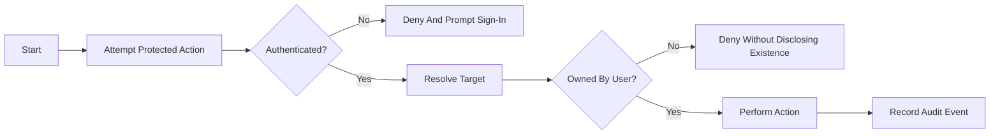
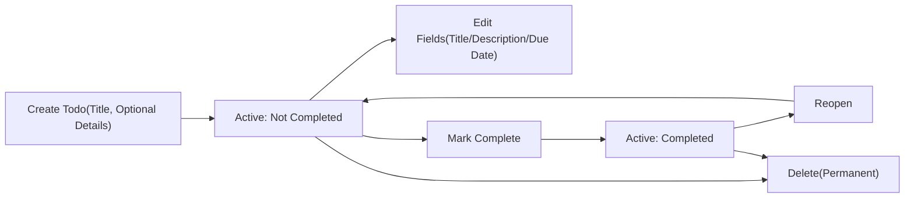

# Minimal Todo Service — Requirements Analysis (MVP)

Service prefix: "todo"

## Vision and Scope
A lightweight personal task manager that provides only the minimum capabilities required for an individual to reliably capture, review, complete, and remove tasks. The MVP supports a single authenticated actor managing strictly personal items. Collaboration, notifications, advanced organization, and integrations are intentionally excluded to ensure rapid delivery, clarity, and ease of use.

Goals
- Enable a first-time user to register, sign in, and create the first todo within minutes.
- Provide predictable, low-friction daily workflow: add, review, edit, complete/reopen, and delete tasks.
- Guarantee strict data isolation so users can never access others’ items.
- Establish measurable performance targets perceived by users as immediate.

Success Signals (business-level)
- High rate of “sign-up to first todo” in the same session.
- Frequent return usage for daily list review and completion.
- Consistent user trust due to data isolation and clear, actionable feedback.

## Actors and Access Model
Actors
- User: An authenticated individual account holder who manages personal todo items.
- Unauthenticated State: A non-actor condition; an individual has not successfully signed in.

Access Boundaries (business)
- THE service SHALL recognize only the "User" as an actor capable of managing todo items.
- WHERE an individual is not authenticated, THE service SHALL deny access to any user-owned todo data and require sign-in.
- THE service SHALL restrict all todo operations to items owned by the authenticated User.

## User Scenarios
Scenario 1: First-Time Setup and First Todo
- A new individual registers, signs in, and creates a first todo with a short, meaningful title. The todo appears immediately in the personal list.

Scenario 2: Daily Management
- A returning User reviews the list, creates new items, edits details, toggles completion for finished items, reopens if needed, and deletes items that are no longer relevant.

Scenario 3: Due Date Awareness (Optional)
- A User assigns a date-only due date to certain items. The list view conceptually indicates urgency such as overdue or due today without notifications.

## Functional Requirements (EARS)
Account Lifecycle
- WHEN a new individual submits valid registration details, THE service SHALL create a User account and make it eligible for immediate sign-in.
- IF registration details are invalid or the identifier is already in use, THEN THE service SHALL reject registration with clear, field-specific guidance in en-US.
- WHEN a User submits valid credentials, THE service SHALL establish an authenticated session for subsequent actions.
- IF credentials are invalid, THEN THE service SHALL deny access and communicate that authentication failed without revealing sensitive details.
- WHEN a User requests to end access, THE service SHALL terminate the authenticated session and require sign-in for protected actions thereafter.
- WHILE a session remains active, THE service SHALL allow permitted actions on the User’s own items without re-authentication.

Ownership and Isolation
- THE service SHALL associate every todo item with exactly one owning User.
- THE service SHALL restrict all reads, writes, toggles, and deletions to the owning User only.
- IF a User references an item not owned by that User, THEN THE service SHALL deny the action without disclosing whether the item exists.

Todo Creation
- WHEN a User submits a new todo with a non-empty title, THE service SHALL create the todo with completion set to not completed.
- WHERE a description is provided, THE service SHALL accept it as optional free text within reasonable length.
- WHERE a due date is provided, THE service SHALL store a date-only value and treat it as optional.
- IF the title is missing or whitespace-only, THEN THE service SHALL reject creation and indicate that a title is required.

Todo Reading and Listing
- WHEN a User requests their todo list, THE service SHALL return only that User’s items.
- THE service SHALL present a deterministic default ordering oriented toward quick scanning (e.g., newest first).
- WHERE basic filters are requested, THE service SHALL support all, active (not completed), and completed views.

Todo Updating
- WHEN a User updates title, description, or due date with valid values, THE service SHALL persist the changes and reflect them on subsequent listing and reads.
- WHERE a User clears the due date, THE service SHALL store the todo without a due date.
- IF an update would violate field rules (e.g., empty title), THEN THE service SHALL reject the update and preserve existing values.

Completion Toggling
- WHEN a User marks an item complete, THE service SHALL set completion to completed without altering other fields.
- WHEN a User reopens a completed item, THE service SHALL set completion to not completed without altering other fields.
- WHERE the requested state equals the current state, THE service SHALL confirm the current state (idempotent behavior).

Deletion
- WHEN a User deletes an item they own, THE service SHALL remove it from the User’s active view immediately after success.
- IF deletion targets an item that does not exist or is not owned by the User, THEN THE service SHALL inform that the item is not available without disclosing ownership details.

Due Date Semantics (Date-Only)
- THE service SHALL treat due date as optional and date-only; time-of-day is not required.
- THE service SHALL consider items overdue when the current local date is strictly later than the due date and the item is not completed.
- THE service SHALL consider items due today when the current local date equals the due date and the item is not completed.
- WHILE a User has not selected a timezone, THE service SHALL evaluate due/overdue status in the "Asia/Seoul" timezone by default.

Auditability (business-level)
- THE service SHALL record business-level audit information for account registration, authentication success, logout, todo create, todo update (including completion toggles and due date changes), and todo deletion.
- THE service SHALL record who performed the action, when it occurred, and a brief description of what changed in business terms.
- THE service SHALL ensure Users can access audit information only for their own account and items.

## Business Rules and Validations (User-Facing)
Field Constraints (business intent)
- Title: required; must be non-empty after trimming; concise single line.
- Description: optional; multi-line; reasonable maximum length to preserve readability.
- Due date: optional; calendar date; accepts past, today, or future; used for overdue/due-today determination.

Validation Outcomes
- IF the title is missing or empty after trimming, THEN THE service SHALL reject the action with message "Title is required".
- IF the title violates single-line intent (e.g., line breaks), THEN THE service SHALL reject with message "Title must be a single line".
- IF description exceeds a reasonable maximum, THEN THE service SHALL reject and indicate the limit clearly.
- IF due date is not a recognizable calendar date, THEN THE service SHALL reject with message "Due date must be a valid date".

## Error Handling and Recovery (Business Outcomes)
- IF a User is not authenticated when performing a protected action, THEN THE service SHALL deny the action and prompt sign-in without losing user-entered input locally.
- IF a User attempts to access or modify another User’s item, THEN THE service SHALL deny the action and avoid disclosing whether the item exists.
- IF input validation fails, THEN THE service SHALL present field-specific messages and perform no partial writes.
- IF an item no longer exists at the time of action, THEN THE service SHALL inform that the item is not available and advise refreshing the list.
- WHERE transient conditions occur (timeouts or temporary unavailability), THE service SHALL allow safe retries and avoid duplicates.

## Non-Functional Expectations (Business-Level)
Performance (user-perceived)
- THE service SHALL present a completed login state within approximately 2 seconds under normal conditions.
- THE service SHALL list a page of a User’s todos within approximately 1 second for typical personal lists.
- THE service SHALL complete single-item create/update/delete within approximately 0.7 seconds under normal conditions.
- THE service SHALL toggle completion with perceived immediacy (well under 1 second) under normal conditions.

Availability and Reliability
- THE service SHALL target 99.9% monthly availability.
- THE service SHALL make accepted changes visible immediately in the current session and within a short interval across other active sessions for the same User.

Security and Privacy
- THE service SHALL restrict access so that Users can view and manage only their own items.
- THE service SHALL collect only data necessary to provide personal task management and SHALL not sell todo content.

## Data Lifecycle and Privacy
- Creation: Users create items that belong to them exclusively.
- Access: Users can view only their own items.
- Update: Users can modify their own items; history is reflected conceptually through updated time.
- Deletion: Deletions remove items from active view immediately after success; user-facing recovery is not provided in MVP.
- Backups: Disaster recovery backups may retain deleted data for a limited window and are never user-accessible.

## Out-of-Scope (MVP Guardrails)
- Collaboration, sharing, or multi-user access to a single item or list.
- Notifications, reminders, or recurring tasks.
- Projects, tags, priorities, attachments, subtasks, or custom fields.
- Full-text search or advanced filtering beyond status filters.
- External integrations (e.g., calendars, messaging platforms).
- Offline mode and conflict resolution.
- Administrative roles and complex dashboards.

## Conceptual Flows (Mermaid)
Authentication and Access Gate

```mermaid
graph LR
  A["Start"] --> B["Attempt Protected Action"]
  B --> C{"Authenticated?"}
  C -->|"No"| D["Deny And Prompt Sign-In"]
  C -->|"Yes"| E["Resolve Target"]
  E --> F{"Owned By User?"}
  F -->|"No"| G["Deny Without Disclosing Existence"]
  F -->|"Yes"| H["Perform Action"]
  H --> I["Record Audit Event"]
```

Todo Lifecycle (Minimal)

```mermaid
graph LR
  A["Create Todo(Title, Optional Details)"] --> B["Active: Not Completed"]
  B --> C["Edit Fields(Title/Description/Due Date)"]
  B --> D["Mark Complete"]
  D --> E["Active: Completed"]
  E --> F["Reopen"]
  F --> B
  B --> G["Delete(Permanent)"]
  E --> G
```

## Acceptance Criteria (EARS Summary)
Account and Session
- WHEN valid registration data is submitted, THE service SHALL create an account and enable immediate sign-in.
- WHEN valid credentials are submitted, THE service SHALL establish a session; WHEN logout is requested, THE service SHALL end the session.
- IF credentials are invalid or no active session exists, THEN THE service SHALL deny access and prompt sign-in.

Ownership and Isolation
- THE service SHALL ensure all listing and retrieval return only the authenticated User’s items.
- IF a User references an item not owned by that User, THEN THE service SHALL deny the action without revealing existence.

Todo Lifecycle
- WHEN a valid title is submitted, THE service SHALL create the todo with completion=false and include it in the User’s list.
- WHEN fields are updated within constraints, THE service SHALL persist and reflect changes; IF constraints are violated, THEN THE service SHALL reject the update and preserve existing values.
- WHEN completion is toggled, THE service SHALL update completion status and reflect the new state; repeated requests with no state change SHALL be treated as idempotent confirmations.
- WHEN deletion is requested by the owner, THE service SHALL remove the item from active view; IF the item does not exist, THEN THE service SHALL indicate unavailability.

Due Date Semantics
- WHERE a due date is set, THE service SHALL evaluate overdue/due-today based on the User’s local date, defaulting to "Asia/Seoul" when unspecified.

Performance
- WHEN listing, creating, updating, toggling, or deleting under normal conditions, THE service SHALL complete within user-perceived immediate timeframes stated above.

## Glossary
- Title: Required single-line short text naming the task.
- Description: Optional multi-line details supporting the task.
- Due Date: Optional date-only value used for urgency context, not scheduling.
- Completion: Boolean state (completed or not completed) indicating task status.
- Ownership: Association of each item with exactly one User; no transfer in MVP.
- Active View: Standard user-visible lists and retrievals excluding deleted items.
