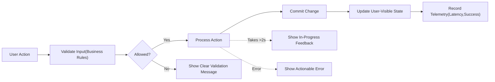
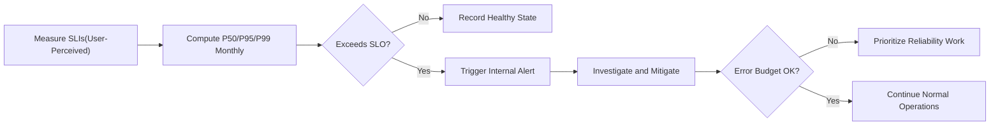

# Non-Functional Requirements for Minimal Todo List Service (todoList)

## 1) Introduction and Scope

Purpose: Establish business-level quality expectations for the minimal Todo list service identified by the prefix “todoList.” These requirements describe WHAT quality the service must deliver to users, not HOW to implement it.

Scope: Core minimal operations only—authenticate where applicable, create, read, update, complete/uncomplete, delete, and list/filter/paginate personal Todos. This document sets user-centric targets for performance, reliability/availability, usability/accessibility, maintainability/operability, scalability, and observability.

Audience: Product owners and developers who will implement and verify business outcomes without being constrained to specific technical solutions.

Constraints:
- No API specifications, database schemas, infrastructure choices, algorithms, or library mandates.
- Business requirements stated with EARS syntax where applicable.
- Locale: en-US for language; timestamps presented in the user’s locale; default timezone assumption is Asia/Seoul when no preference is available.

Definitions (Business Terms):
- Service Level Indicator (SLI): A measurable characteristic of user experience (e.g., time to display the first page of a Todo list).
- Service Level Objective (SLO): A target range for an SLI over a timeframe (e.g., P95 list-display < 1 second during a calendar month).
- Normal Conditions: Typical modern device and everyday network; no ongoing incident; personal collection within scale envelope; no bulk or stress testing.
- Typical Result Size: Up to 50 items for a single list page in the minimal product; users navigate pages for larger collections.

## 2) Quality Model Overview

The minimal Todo experience emphasizes speed, predictability, clarity, and dependability over advanced features. Non-functional goals align with the functional scope and related documents:
- Service vision and scope: Service Overview
- Roles and access boundaries: User Roles and Permissions
- Functional behaviors: Minimal Todo Functional Requirements
- Error behavior and recovery: Error Handling and Recovery
- Security and privacy: Security and Privacy
- Data lifecycle and retention: Data Lifecycle and Retention

EARS anchoring:
- THE todoList service SHALL meet user-centric targets for performance, availability, and usability so that core actions feel immediate and predictable.
- WHILE the user operates within normal conditions, THE todoList service SHALL preserve responsiveness and clarity across all minimal operations.

## 3) Performance Expectations

### 3.1 Principles (User-Centric)
- THE todoList service SHALL make core actions feel immediate through low latency and prompt feedback.
- THE todoList service SHALL provide consistent response times under normal conditions so users can rely on predictable behavior.
- IF an operation exceeds typical duration, THEN THE todoList service SHALL show in-progress feedback and conclude with a clear success or failure message.

### 3.2 Operation Targets and Feedback

Targets apply under normal conditions and reflect user-perceived completion (updated state or clear confirmation visible to the user).

| Operation | Typical Result Size | Target P50 | Target P95 | Target P99 | Max Acceptable (Single Action) | Feedback Expectation |
|---|---|---|---|---|---|---|
| Create a Todo | N/A | 300 ms | 800 ms | 1.5 s | 2 s | Immediate confirmation |
| Read one Todo | N/A | 200 ms | 600 ms | 1 s | 1.5 s | Content appears promptly |
| Update Todo fields | N/A | 300 ms | 800 ms | 1.5 s | 2 s | Clear saved confirmation |
| Complete/Uncomplete Todo | N/A | 200 ms | 600 ms | 1 s | 1.5 s | Immediate state change |
| Delete a Todo | N/A | 300 ms | 800 ms | 1.5 s | 2 s | Clear deletion confirmation |
| List Todos (first page) | Up to 50 items | 400 ms | 1 s | 2 s | 2.5 s | Newest-first list appears |
| List Todos (subsequent pages) | Up to 50 items | 300 ms | 800 ms | 1.5 s | 2 s | Smooth transitions |
| Basic filter (status or simple text) | Up to 50 items | 400 ms | 1 s | 2 s | 2.5 s | Results update promptly |

EARS requirements:
- THE todoList service SHALL meet the tabled P95 targets for each operation during a monthly window under normal conditions.
- IF an operation is expected to exceed 2 seconds, THEN THE todoList service SHALL provide immediate in-progress feedback until completion or failure.
- WHEN any core action completes, THE todoList service SHALL present the updated state without requiring manual refresh.
- IF a user repeats the same action rapidly, THEN THE todoList service SHALL prevent unintended duplication and present the final consistent state.

### 3.3 Performance-Feedback Flow (Mermaid)

## 4) Reliability and Availability

### 4.1 Availability Objectives
- THE todoList service SHALL be available for core operations at least 99.5% of the time per calendar month, excluding scheduled maintenance announced in advance.
- WHEN scheduled maintenance is required, THE todoList service SHALL announce at least 48 hours in advance and SHALL show a concise message during the window with expected return time.

### 4.2 Durability, Integrity, and Consistency
- THE todoList service SHALL ensure that any operation confirmed as successful remains durable and visible afterward.
- IF partially processed actions cannot be completed, THEN THE todoList service SHALL revert to the last known good user-visible state and inform the user succinctly.
- WHEN multiple sessions for the same account act concurrently, THE todoList service SHALL present the latest confirmed state and avoid duplicate Todos.

### 4.3 Recovery Time and Point (Business-Level)
- THE todoList service SHALL resume normal operation quickly after transient disruptions so that members can continue their tasks with minimal interruption.
- WHERE business-level recovery objectives are referenced, THE todoList service SHALL uphold: user-confirmed operations are not lost (effective RPO for confirmed actions is zero from the user’s perspective), and resumption of basic actions occurs within a short period appropriate to the incident (business-level RTO target within minutes for minor disruptions).

EARS requirements:
- WHEN maintenance begins, THE todoList service SHALL present a friendly unavailability message with expected return time.
- WHEN service resumes, THE todoList service SHALL reflect only successful, durable operations in all views.
- IF a disruption occurs mid-action, THEN THE todoList service SHALL either complete the action safely or roll back and instruct the user to retry.

## 5) Usability and Accessibility

### 5.1 Confirmation and Clarity
- THE todoList service SHALL provide concise confirmations after create, update, complete/uncomplete, and delete so users understand outcomes without ambiguity.
- THE todoList service SHALL use plain, non-technical language in messages and avoid exposing internal details.

### 5.2 Keyboard, Perceivability, and Robustness
- THE todoList service SHALL be fully operable via keyboard-only for all core actions.
- THE todoList service SHALL provide non-color cues (e.g., icons or text labels) to distinguish Active vs. Completed states.
- THE todoList service SHALL ensure that changes in state (e.g., completion toggled, item created/deleted) are announced in a manner perceivable to assistive technologies.

### 5.3 Language, Locale, and Timezone
- THE todoList service SHALL present dates and times in the user’s locale and timezone preferences.
- WHERE no preference is set, THE todoList service SHALL default to Asia/Seoul for interpreting date-only values and for user-facing timestamp presentation.

EARS requirements:
- WHEN a long-running process is underway, THE todoList service SHALL provide immediate and continuous feedback.
- IF an error is shown, THEN THE todoList service SHALL keep user input available for correction where feasible and provide actionable guidance.

## 6) Maintainability and Operability

### 6.1 Change Management and Rollback
- THE todoList service SHALL allow routine changes that do not materially disrupt core actions.
- WHERE a change risks availability or data correctness, THE todoList service SHALL provide a reversible path so normal service can be restored rapidly.
- THE todoList service SHALL communicate significant behavior changes to users in plain language before they take effect.

### 6.2 Incident Handling and Communication
- WHEN a user-impacting incident is detected (e.g., create or list unavailable), THE todoList service SHALL publish a clear status update within 30 minutes.
- WHILE an incident is ongoing, THE todoList service SHALL provide brief progress updates at reasonable intervals.
- WHEN resolved, THE todoList service SHALL publish a concise summary and any recovery guidance if user action is needed.

### 6.3 Configuration and Policy Changes
- THE todoList service SHALL ensure administrative configuration changes do not degrade member responsiveness.
- WHERE a configuration affects user-visible behavior (e.g., default page size), THE todoList service SHALL document the current setting in user-facing help or notices.

## 7) Scalability Expectations

### 7.1 Per-User Scale Envelope
- THE todoList service SHALL support up to 10,000 Todos stored per member over time with up to 1,000 considered “active” for everyday use.
- THE todoList service SHALL keep list pagination responsive by limiting pages to reasonable sizes (up to 50 items per page in minimal scope).

### 7.2 Growth Behavior and Prioritization
- THE todoList service SHALL maintain performance targets for members operating within the scale envelope defined above.
- IF aggregate usage grows so that typical latency approaches the Max Acceptable thresholds, THEN THE todoList service SHALL prioritize core actions to preserve member experience within target ranges.
- WHERE administrative tasks occur, THE todoList service SHALL ensure they do not materially degrade member operations.

## 8) Observability Needs

### 8.1 SLIs, SLOs, and Error Budget (Business-Level)
- THE todoList service SHALL measure user-perceived completion time for create, read, update, completion toggle, delete, list first page, list subsequent pages, and basic filter operations.
- THE todoList service SHALL compute P50/P95 (and P99 where defined) for the measured actions per calendar month.
- THE todoList service SHALL set SLOs as stated in the performance table for P95 targets, and SHALL track error budgets as the allowance for misses beyond the SLO.
- IF the error budget is depleted before the end of the period, THEN THE todoList service SHALL prioritize reliability and performance work over new changes until SLOs are back on track.

### 8.2 Alerting and Thresholds
- WHEN P95 user-perceived latency for any core action exceeds its SLO for a sustained period, THE todoList service SHALL trigger an internal alert for timely investigation.
- WHEN availability threatens to fall below 99.5% in the current month, THE todoList service SHALL trigger an internal alert and prioritize recovery.
- THE todoList service SHALL track success and failure counts for core actions and categorize high-level failure reasons in business terms (validation, permission, missing resource, conflict, temporary condition).

### 8.3 Status Communication and Transparency
- WHEN user-visible incidents occur, THE todoList service SHALL provide a publicly accessible status message in clear language and maintain it until normal service is restored.

### 8.4 Alerting Flow (Mermaid)

## 9) Verification Approach (Business-Level)

- THE todoList service SHALL verify performance targets using representative scenarios for each core operation under normal conditions.
- THE todoList service SHALL simulate brief unavailability to confirm clear maintenance/incident messaging and resumption behavior.
- THE todoList service SHALL verify keyboard-only operation and assistive technology perceivability of confirmations and errors for core actions.
- THE todoList service SHALL run pagination and filtering tests on accounts with large collections (e.g., 10,000 total Todos, 1,000 active) and confirm targets are met.
- THE todoList service SHALL confirm that telemetry exists to compute SLIs and trigger alerts as defined.

## Appendix: EARS Requirement Index (Consolidated)

Performance (selected):
- THE todoList service SHALL meet P95 latency targets per operation under normal conditions.
- IF an operation is expected to exceed 2 seconds, THEN THE todoList service SHALL provide immediate in-progress feedback.
- WHEN any core action completes, THE todoList service SHALL present the updated state without manual refresh.

Reliability and Availability (selected):
- THE todoList service SHALL meet at least 99.5% monthly availability excluding scheduled maintenance with notice.
- THE todoList service SHALL ensure durability for operations once confirmed to the user.
- IF a disruption occurs mid-action, THEN THE todoList service SHALL complete safely or roll back and guide the user to retry.

Usability and Accessibility (selected):
- THE todoList service SHALL provide concise confirmations after core actions.
- THE todoList service SHALL be fully operable via keyboard and perceivable via assistive technologies.
- THE todoList service SHALL present dates and times in the user’s locale and timezone, defaulting to Asia/Seoul when unspecified.

Maintainability and Operability (selected):
- THE todoList service SHALL allow routine updates with minimal disruption and ensure a reversible path for risky changes.
- WHEN an incident occurs, THE todoList service SHALL publish a status update within 30 minutes and provide periodic updates until resolved.

Scalability (selected):
- THE todoList service SHALL maintain targets up to 1,000 active Todos and 10,000 total per user, with responsive pagination.

Observability (selected):
- THE todoList service SHALL track user-perceived latency and error rates and alert when SLOs are at risk.
- IF the error budget is depleted, THEN THE todoList service SHALL prioritize reliability over new changes until objectives recover.
