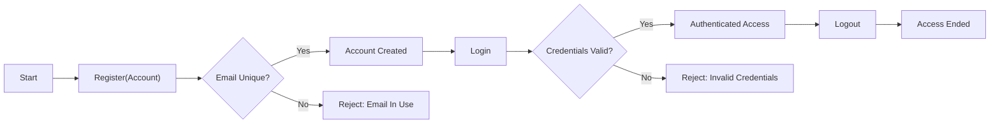
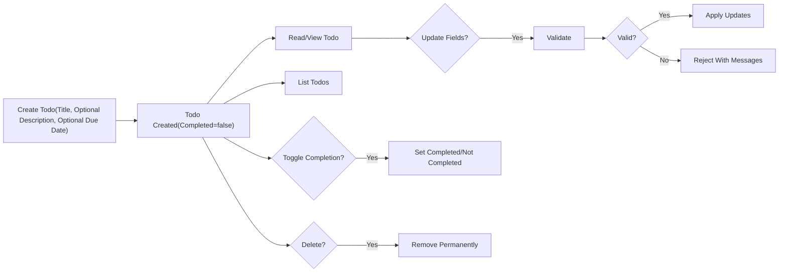

# Minimal Todo Service — Functional Requirements (MVP)

A minimal, single‑actor Todo service that enables an authenticated user to manage only their own tasks. The MVP includes account access, creation and management of personal todo items, completion toggling, optional date‑only due dates, predictable listing, and permanent deletion. No collaboration, notifications, tags, attachments, search, or advanced workflows are included.

## 1) Guiding Principles and Scope Guardrails

- THE service SHALL prioritize minimal functionality required for personal task capture and completion.
- THE service SHALL support exactly one actor type (“user”) who manages only their own items.
- THE service SHALL isolate user data so no cross‑user access or inference is possible.
- THE service SHALL express behaviors in business terms without prescribing technical designs.
- THE service SHALL enforce deterministic outcomes: each action’s validations, state changes, and messages are consistent.
- THE service SHALL avoid scope creep by excluding collaboration, reminders, tags, attachments, subtasks, advanced filters, and search in MVP.

Scope boundaries (EARS guardrails):
- IF a feature requires notifying a user at a specific time, THEN THE service SHALL consider it out of scope for MVP.
- IF a feature introduces multi‑user access to a single item, THEN THE service SHALL consider it out of scope for MVP.
- IF a feature requires taxonomies such as tags, priorities, or projects, THEN THE service SHALL consider it out of scope for MVP.

## 2) Actors, Authentication, and Authorization (business‑level)

### 2.1 Actor definition
- THE service SHALL recognize “user” as the single authenticating actor.
- WHERE an individual is not authenticated, THE service SHALL treat them as unauthenticated and deny access to user‑owned todo data.

### 2.2 Account access behaviors
- WHEN an individual completes valid registration steps, THE service SHALL establish a user account.
- WHEN a user submits valid credentials, THE service SHALL grant authenticated access until logout or session expiry.
- WHEN a user initiates logout, THE service SHALL terminate authenticated access immediately.
- IF credentials are invalid, THEN THE service SHALL deny authentication and avoid indicating whether a specific account exists.
- IF authenticated access expires due to inactivity, THEN THE service SHALL require re‑authentication before any user‑only action proceeds.

Registration inputs (business rules):
- THE service SHALL require a unique email and a password that is at least 8 characters, containing at least one letter and one number.

### 2.3 Authorization and ownership
- THE service SHALL associate each todo item with exactly one owning user at creation.
- THE service SHALL restrict create, read, update, toggle completion, and delete actions to the owning user only.
- IF a user references an item they do not own, THEN THE service SHALL deny access without confirming whether the item exists for another user.

## 3) Todo Item Model (business fields)

- Title (required): short, single‑line text naming the task.
- Description (optional): free‑text detail up to a reasonable limit.
- Due date (optional): calendar date only; no time‑of‑day semantics in MVP.
- Completion (boolean): completed or not completed; defaults to not completed.
- Created/Updated moments (system‑maintained concepts): used for default ordering and user understanding; not directly editable.

EARS constraints:
- THE service SHALL require a title of 1–120 characters after trimming, without line breaks.
- WHERE a description is provided, THE service SHALL allow up to 1,000 characters after trimming.
- WHERE a due date is provided, THE service SHALL treat it as a valid calendar date (date‑only) that may be in the past, present, or future.

## 4) Functional Requirements by Lifecycle

### 4.1 Create Todo
- WHEN a user submits a new todo with a non‑empty title within 1–120 characters, THE service SHALL create the todo with completion set to not completed.
- WHERE a description up to 1,000 characters is provided, THE service SHALL store it.
- WHERE a valid date‑only due date is provided, THE service SHALL store it; otherwise THE service SHALL treat the todo as having no due date.

Validation failures on create:
- IF the title is missing, whitespace‑only, exceeds 120 characters, or contains line breaks, THEN THE service SHALL reject creation with field‑specific messages in en‑US.
- IF the description exceeds 1,000 characters, THEN THE service SHALL reject creation with a field‑specific message.
- IF the due date is not a recognizable calendar date, THEN THE service SHALL reject creation with a field‑specific message.

### 4.2 Read Single Todo
- WHEN the owner requests a specific todo that exists, THE service SHALL return the current business fields and values.
- IF the todo does not exist or was deleted, THEN THE service SHALL indicate the resource is not available.

### 4.3 List Todos
- WHEN the owner requests their list, THE service SHALL return only that user’s todos.
- THE service SHALL apply a default order of newest first by creation moment; WHERE multiple items share the same creation moment, THE service SHALL apply a deterministic secondary order by last‑updated descending.
- THE service SHALL support pagination with a default page size of 20 and a maximum requested page size of 100; IF a higher page size is requested, THEN THE service SHALL cap at 100 and indicate the cap was applied in business terms.

Supported sorting options (MVP):
- WHERE requested, THE service SHALL support sorting by creation time (newest first or oldest first).
- WHERE requested, THE service SHALL support sorting by due date (earliest first or latest first); todos without due date SHALL appear last when sorting by due date.

Supported basic filters (MVP):
- THE service SHALL support a status filter with values: "all", "active", "completed".

### 4.4 Update Fields
- WHEN the owner updates title, description, or due date within constraints, THE service SHALL apply the changes and reflect them on subsequent reads and lists.
- WHERE a user clears the due date, THE service SHALL store the item without a due date.

Validation failures on update:
- IF an updated title is empty, exceeds 120 characters, or contains line breaks, THEN THE service SHALL reject the update with a field‑specific message and preserve existing values.
- IF an updated description exceeds 1,000 characters, THEN THE service SHALL reject the update and preserve existing values.
- IF an updated due date is not a recognizable calendar date, THEN THE service SHALL reject the update and preserve existing values.

### 4.5 Toggle Completion
- WHEN the owner marks an incomplete todo complete, THE service SHALL set completion to completed and preserve other fields unchanged.
- WHEN the owner reopens a completed todo, THE service SHALL set completion to not completed and preserve other fields unchanged.
- WHERE the requested completion state equals the current state, THE service SHALL succeed without error and confirm the current state (idempotent behavior).

### 4.6 Delete Todo
- WHEN the owner deletes a todo, THE service SHALL remove it from standard lists immediately and treat deletion as permanent in MVP.
- IF deletion is requested for an item that does not exist, THEN THE service SHALL indicate that the resource is not available.

## 5) Due Date Semantics and Time Awareness

- THE service SHALL treat due date as date‑only with no time‑of‑day.
- THE service SHALL consider a todo overdue if the user’s current local calendar date is strictly later than the due date and the todo is not completed.
- THE service SHALL consider a todo due today if the current local calendar date equals the due date and the todo is not completed.
- WHERE a due date in the past is provided, THE service SHALL accept it and apply overdue semantics if the item is not completed.
- WHERE timezone interpretation is required, THE service SHALL apply a consistent evaluation policy for all users and reflect overdue vs. due‑today status accordingly in business terms.

## 6) Performance Expectations (user‑perceived targets)

- WHEN a user performs core actions (register, login, list, create, update, toggle, delete) under normal conditions and personal data volumes (≤ 1,000 items), THE service SHALL respond within 2 seconds.
- WHERE list requests return more than 20 items, THE service SHALL support paging and aim to render each page within approximately 1 second under normal conditions.
- WHEN completion is toggled, THE service SHALL reflect the change in the user’s view immediately after the operation succeeds.

## 7) Error Handling and Recovery (business outcomes)

- IF an unauthenticated individual attempts a protected action, THEN THE service SHALL deny the action and indicate that sign‑in is required.
- IF a user attempts to access, modify, or delete an item they do not own, THEN THE service SHALL deny the action and avoid disclosing whether the item exists for another user.
- IF validation fails, THEN THE service SHALL present field‑specific messages and perform no partial writes.
- IF an item does not exist or was deleted, THEN THE service SHALL indicate that the resource is not available and recommend refreshing the list if applicable.
- WHERE the requested state equals the current state (e.g., repeat completion toggle), THE service SHALL return an idempotent confirmation rather than an error.
- WHERE excessive rapid actions occur, THE service SHALL communicate a temporary limit and a safe retry window in business terms.
- WHERE an action cannot complete within a reasonable time window (e.g., 10 seconds), THE service SHALL communicate a timeout and advise retrying; accepted changes SHALL not produce duplicates upon safe retry.

## 8) Acceptance Criteria (EARS, comprehensive)

Registration and Login
- WHEN a unique email and compliant password are submitted, THE service SHALL create an account available for immediate login.
- IF a duplicate email is used, THEN THE service SHALL reject registration with a clear business message.
- WHEN valid credentials are submitted, THE service SHALL establish authenticated access until logout or expiry.
- IF invalid credentials are submitted, THEN THE service SHALL deny access with a generic invalid‑credentials message.

Logout and Session
- WHEN logout is initiated, THE service SHALL terminate authenticated access for subsequent requests.
- IF authenticated access expires, THEN THE service SHALL require re‑authentication prior to user‑only actions.

Create Todo
- WHEN a title within 1–120 characters is provided, THE service SHALL create the todo with completion set to not completed.
- IF title is missing, whitespace‑only, too long, or contains line breaks, THEN THE service SHALL reject creation with a field‑specific message.
- WHERE a valid date‑only due date is provided, THE service SHALL store it; WHERE invalid, THE service SHALL reject with a field‑specific message.

Read and List
- WHEN the owner requests an existing todo, THE service SHALL return its fields.
- WHEN the owner lists todos without filters, THE service SHALL return up to 20 items sorted by newest first with deterministic ties.
- WHERE a page size up to 100 is requested, THE service SHALL return that many items, else cap at 100 and indicate the cap.
- WHERE status filter is "active", "completed", or "all", THE service SHALL include only items matching the filter.

Update
- WHEN the owner updates fields within constraints, THE service SHALL persist changes and reflect them in subsequent views.
- IF any updated field violates constraints, THEN THE service SHALL reject the update and preserve existing values.

Toggle Completion
- WHEN the owner marks complete, THE service SHALL set completion to completed; WHEN reopened, THE service SHALL set completion to not completed.
- WHERE the requested state equals the current, THE service SHALL succeed and confirm no change.

Delete
- WHEN the owner deletes a todo, THE service SHALL remove it from lists immediately and not show it again.
- IF deletion targets a non‑existent item, THEN THE service SHALL indicate the resource is not available.

Ownership and Isolation
- IF a user attempts any action on another user’s item, THEN THE service SHALL deny the action without exposing cross‑user information.

Performance and Recovery
- WHEN core actions occur under normal conditions and personal data volumes, THE service SHALL complete within approximately 2 seconds perceived time.
- WHERE transient issues occur, THE service SHALL present a friendly message and allow a safe retry.

## 9) Conceptual Mermaid Diagrams

### 9.1 Account lifecycle (conceptual)

### 9.2 Todo lifecycle (conceptual)

## 10) Glossary and Consistency Notes

- "Business message": a user‑facing explanation in en‑US, free of technical jargon and internal details.
- "Date‑only": a calendar date without a time‑of‑day; comparisons use the user’s local date semantics.
- "Idempotent": repeating the same request produces the same end state without error.
- "Owner": the authenticated user who created the todo item; ownership never transfers in MVP.

Consistency requirements (EARS):
- THE service SHALL use consistent business message text for identical validation failures across features.
- THE service SHALL avoid exposing identifiers or hints about other users’ items in any response.

## 11) Out‑of‑Scope Confirmation

- THE service SHALL exclude collaboration, reminders/notifications, tags/labels, priorities, attachments, subtasks, recurrence, search, and advanced filters in MVP.
- THE service SHALL exclude administrative roles beyond the single end‑user actor.
- THE service SHALL exclude offline mode and conflict resolution semantics.

## 12) EARS Requirement Index (consolidated)

Identity and Access
- THE service SHALL support a single actor (“user”) and deny unauthenticated access to user‑owned data.
- WHEN valid credentials are submitted, THE service SHALL grant authenticated access until logout or expiry.

Ownership and Isolation
- THE service SHALL associate each todo item with exactly one owner at creation.
- IF a user targets an item they do not own, THEN THE service SHALL deny the action without confirming existence.

Todo Lifecycle
- WHEN a valid title (1–120 chars single‑line) is provided, THE service SHALL create the todo as not completed.
- WHEN fields are updated within constraints, THE service SHALL persist and reflect changes.
- WHEN completion is toggled, THE service SHALL set the requested state and preserve other fields.
- WHEN deletion is requested by the owner, THE service SHALL remove the item permanently and exclude it from listings.

Listing and Filters
- THE service SHALL default list order to newest‑first by creation, with deterministic ties by last‑updated.
- THE service SHALL support pagination (default 20; max 100 per request) and status filters: "all", "active", "completed".

Due Date Semantics
- WHERE a due date is set, THE service SHALL treat it as date‑only and compute overdue/due‑today in user terms.

Error Handling and Performance
- IF validation fails, THEN THE service SHALL present field‑specific messages and perform no partial writes.
- IF an action cannot complete promptly, THEN THE service SHALL present timeout guidance and support safe retries.
- WHEN core actions occur under normal conditions, THE service SHALL complete within approximately 2 seconds perceived time.

— End of functional requirements.