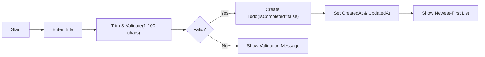
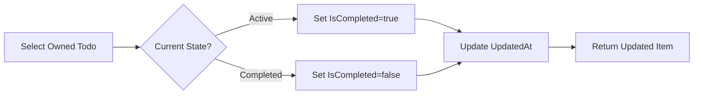
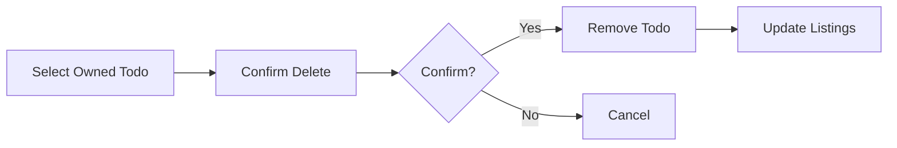
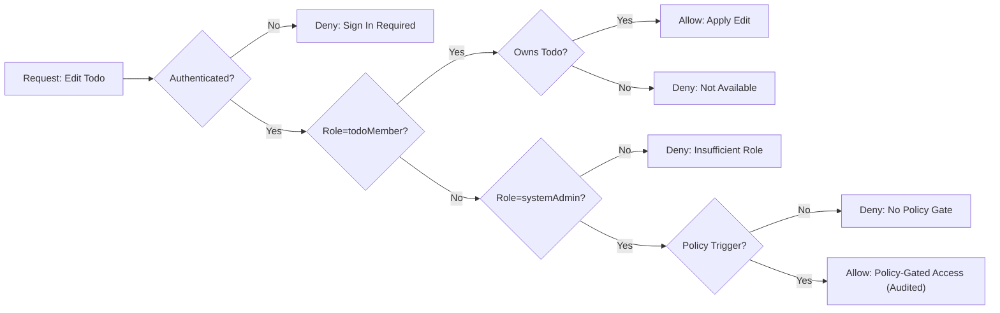

# Minimal Todo List – Requirements Analysis (Service Prefix: todoList)

## Vision
Enable individuals to capture, review, complete, and remove simple personal tasks with the least possible friction. Prioritize predictability and clarity over feature breadth. Deliver only essential capabilities so first use and daily use feel immediate and reliable.

## Scope
- In scope (minimal):
  - Create a Todo with a required Title.
  - Read a single Todo owned by the user.
  - Update a Todo’s Title owned by the user.
  - Complete and Uncomplete a Todo.
  - Delete a Todo.
  - List Todos with a basic filter by completion status (All, Active, Completed).
  - Default ordering by newest created first; simple pagination sized for readability.
  - Ownership and privacy boundaries for a personal list.
- Out of scope (initial minimal release):
  - Sharing/collaboration, assignments, comments.
  - Labels/tags, priorities, due dates, reminders, recurring tasks, attachments.
  - Advanced search, complex filters, bulk operations, import/export tooling.
  - UI design specifications, API specifications, database schemas, infrastructure.

## Roles and Access Model (Business Terms)
- guestVisitor: Unauthenticated visitor; cannot view, create, or manage any Todo items.
- todoMember: Authenticated user; can manage only their own Todos.
- systemAdmin: Administrative user; manages policy and system settings; no routine access to private member Todos; any exceptional access is policy-gated and audited.

EARS role guardrails:
- THE todoList service SHALL restrict personal Todo access to the owner by default.
- IF the actor is guestVisitor, THEN THE todoList service SHALL deny all Todo operations.
- WHEN the actor is todoMember, THE todoList service SHALL allow actions only on Todos owned by that member.
- WHEN the actor is systemAdmin, THE todoList service SHALL allow administrative actions only; access to member Todo content SHALL require a documented policy trigger with audit.

## Personas and Goals (Brief)
- Guest (guestVisitor): Learn the purpose; register or sign in to begin.
- Member (todoMember): Capture tasks quickly; manage and complete tasks with minimal steps.
- Admin (systemAdmin): Maintain basic service settings and policy without reading private Todos.

## Glossary
- Todo: A personal task with a required Title and a completion state.
- Active: A Todo that is not completed.
- Completed: A Todo marked done by its owner.
- List: A view of a member’s Todos with optional status filter.
- Pagination: Presenting results in manageable pages (default 20 items).
- Owner: The member who created the Todo and is permitted to manage it.

## Functional Requirements (EARS)

### Item Definition (Business-Level)
- Fields: Identifier (system-assigned), Title (required), IsCompleted (boolean), CreatedAt, UpdatedAt.
- THE todoList service SHALL require Title to be present and non-empty after trimming whitespace.
- THE todoList service SHALL set IsCompleted=false on creation.
- THE todoList service SHALL set CreatedAt at creation and UpdatedAt on any change (title or completion state).

### Create
- WHEN a todoMember submits a Title that passes validation, THE todoList service SHALL create a Todo owned by that member with IsCompleted=false and set CreatedAt and UpdatedAt.
- IF the Title is missing or invalid, THEN THE todoList service SHALL reject creation and present a clear validation message.
- IF the actor is guestVisitor, THEN THE todoList service SHALL deny creation and invite authentication.

### Read (Single)
- WHEN a todoMember requests a Todo by Identifier they own, THE todoList service SHALL return Identifier, Title, IsCompleted, CreatedAt, and UpdatedAt.
- IF the Todo does not exist in the requester’s accessible scope, THEN THE todoList service SHALL return a not-available response without revealing ownership.
- IF the actor is guestVisitor, THEN THE todoList service SHALL deny access and invite authentication.

### Update (Title)
- WHEN a todoMember submits a valid new Title for an owned Todo, THE todoList service SHALL update Title, set UpdatedAt, and preserve CreatedAt.
- IF the Title is invalid, THEN THE todoList service SHALL reject the update and keep prior content unchanged.
- IF the Todo is not owned by the requester or not found, THEN THE todoList service SHALL deny the update with a neutral, privacy-safe message.

### Complete / Uncomplete
- WHEN a todoMember marks an owned Todo complete, THE todoList service SHALL set IsCompleted=true and set UpdatedAt.
- WHEN a todoMember marks an owned Todo uncomplete, THE todoList service SHALL set IsCompleted=false and set UpdatedAt.
- IF the Todo is not owned by the requester or not found, THEN THE todoList service SHALL deny the change without revealing existence.

### Delete
- WHEN a todoMember deletes an owned Todo, THE todoList service SHALL remove it so that it no longer appears in reads or listings for that member.
- IF the Todo is not owned by the requester or not found, THEN THE todoList service SHALL deny deletion with a privacy-safe message.

### List, Filter, Order, Paginate
- WHEN a todoMember requests a list without filters, THE todoList service SHALL return only that member’s Todos.
- THE todoList service SHALL support status filters: "All", "Active" (IsCompleted=false), and "Completed" (IsCompleted=true).
- THE todoList service SHALL order results by CreatedAt descending (newest first) by default.
- THE todoList service SHALL provide pagination with a default page size of 20 items; allowable page size range is 10–50.
- IF a requested page has no items, THEN THE todoList service SHALL return an empty page with page metadata indicating no items.

## Business Rules and Validation
- Title trimming and length:
  - THE todoList service SHALL trim leading/trailing whitespace from Title before validation.
  - THE todoList service SHALL validate Title length between 1 and 100 characters after trimming.
  - IF Title after trimming is empty or exceeds 100 characters, THEN THE todoList service SHALL reject the action with a clear message.
  - THE todoList service SHALL disallow newline characters in Title.
- Ownership and visibility:
  - THE todoList service SHALL bind each Todo to exactly one owner (creating member).
  - WHEN any listing or read occurs, THE todoList service SHALL return only Todos owned by the requester.
- Duplicates and idempotency:
  - THE todoList service SHALL allow duplicate Titles within a member’s list.
  - THE todoList service SHALL treat repeated Complete or Uncomplete on an already-in-state Todo as a no-op with stable outcome.
- Timestamps:
  - THE todoList service SHALL not modify CreatedAt after creation.
  - WHEN Title or completion state changes, THE todoList service SHALL update UpdatedAt.
- Pagination policy:
  - THE todoList service SHALL coerce requested page sizes outside 10–50 to the nearest bound or reject with a validation message, using a consistent policy.

## User Flows (Mermaid)

### Create Todo

### Toggle Completion

### Delete Todo

### Authorization Decision (Edit)

## Error Handling and Recovery
- Taxonomy: Validation errors; Authentication errors; Permission errors; Missing resource; Conflict-like situations; Temporary system conditions.
- Validation:
  - WHEN input violates a field rule, THE todoList service SHALL reject the action, keep user input available, and indicate how to fix it.
- Authentication:
  - WHEN an unauthenticated actor attempts a Todo action, THE todoList service SHALL deny and guide to sign in.
- Permission:
  - WHEN an authenticated actor targets a non-owned Todo, THE todoList service SHALL deny with a privacy-safe message (“This item is not available.”).
- Missing resource:
  - WHEN an action targets a Todo that no longer exists, THE todoList service SHALL report that it is not available and offer to refresh the list.
- Conflict-like:
  - WHEN a change conflicts with a newer state, THE todoList service SHALL avoid silent overwrites and guide the user to refresh and re-apply.
- Temporary condition:
  - WHEN a transient problem prevents completion, THE todoList service SHALL advise a brief retry and avoid creating duplicates.

## Security and Privacy (Business-Level)
- Confidentiality and least privilege:
  - THE todoList service SHALL ensure only the owner can access their Todos in normal operation.
  - THE todoList service SHALL default to deny actions not explicitly permitted.
- Authentication and session (natural language):
  - WHEN a user signs in successfully, THE todoList service SHALL establish an authenticated state and authorize member actions for that session.
  - WHEN a user signs out, THE todoList service SHALL end the session and prevent access to member-only actions.
  - IF a session becomes invalid, THEN THE todoList service SHALL require sign-in again before allowing member actions.
- Administrative guardrails:
  - WHEN administrative oversight is required by policy, THE todoList service SHALL expose only the minimum necessary data and SHALL record who accessed what and why.
- Data minimization and messaging:
  - THE todoList service SHALL avoid revealing whether non-owned items exist and SHALL keep messages privacy-safe and neutral.

## Non-Functional Requirements
- Performance (user-perceived):
  - THE todoList service SHALL complete create, update, delete, and toggle operations within 1 second for at least 95% of attempts under normal conditions.
  - THE todoList service SHALL return a first page of up to 20 items within 1 second for at least 95% of attempts under normal conditions.
- Availability and reliability:
  - THE todoList service SHALL be available for core actions at least 99.5% of the time in a monthly window, excluding planned maintenance with notice.
  - THE todoList service SHALL ensure that once success is shown to the user, the result is durable.
- Accessibility and usability:
  - THE todoList service SHALL be fully usable via keyboard-only navigation for core actions.
  - THE todoList service SHALL provide text alternatives for non-text indicators and avoid reliance on color alone to convey state.
- Observability (business outcomes):
  - THE todoList service SHALL track user-perceived latency and error rates for core actions to detect regressions.

## Data Lifecycle and Retention
- Creation to deletion:
  - THE todoList service SHALL create Todos in Active state, allow completion/uncompletion, and allow permanent deletion by the owner.
- Timestamps and timezone:
  - THE todoList service SHALL record CreatedAt and UpdatedAt and present human-facing times in the user’s timezone; WHERE the timezone is unknown, THE todoList service SHALL default to Asia/Seoul.
- Optional trash (explicitly out of minimal scope):
  - WHERE a trash window is introduced in future, THE todoList service SHALL allow recovery within a configured window before purge; the minimal release does not include this feature.

## Acceptance Criteria Checklist (EARS)
- THE todoList service SHALL require Title length 1–100 after trimming and disallow newlines.
- WHEN a valid Title is submitted, THE todoList service SHALL create a Todo owned by the member with IsCompleted=false and set timestamps.
- WHEN a member requests a list, THE todoList service SHALL return only their Todos, ordered newest-first, filtered by status if specified, and paginated (default 20; 10–50 allowed).
- WHEN a member updates Title with valid content, THE todoList service SHALL save it and update UpdatedAt.
- WHEN a member toggles completion, THE todoList service SHALL set IsCompleted accordingly and update UpdatedAt.
- WHEN a member deletes an owned Todo, THE todoList service SHALL remove it so it is not returned by reads or listings.
- IF the actor is guestVisitor, THEN THE todoList service SHALL deny all Todo operations and invite sign-in.
- IF a member targets a non-owned Todo, THEN THE todoList service SHALL deny with a privacy-safe message.
- THE todoList service SHALL meet the stated performance and availability targets under normal conditions.

## Out-of-Scope Confirmation
- No API specifications, database schemas/ERDs, infrastructure details, or UI design specifications are included in this requirements analysis.
