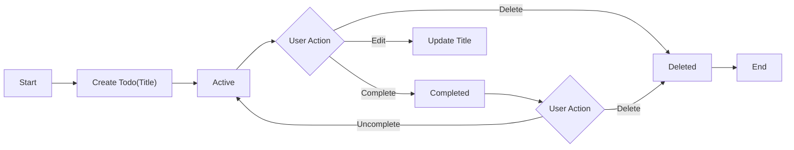
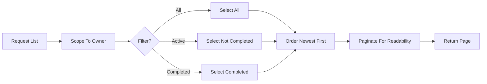

# Minimal Todo List – Requirements Analysis

## Vision
Enable individuals to capture, review, and complete tasks with minimal friction. Prioritize simplicity, clarity, and predictability over breadth of features. Deliver only the essential capabilities required for a functional personal Todo list.

## Scope

### In-Scope (Minimal Feature Set)
- Create a Todo with a required title.
- Read and list personal Todos.
- Update a Todo’s title.
- Mark a Todo complete and uncomplete.
- Delete a Todo.
- Basic filtering by status (All, Active, Completed).
- Default ordering by newest first; basic pagination sized for readability.

### Out-of-Scope (Initial Release)
- Collaboration, sharing, or assigning tasks to others.
- Subtasks, projects, labels/tags, priorities, reminders, recurring tasks, due dates, or attachments.
- Advanced search, complex filtering, or reporting.
- UI design details, wireframes, or visual specifications.
- Technical specifications (APIs, database schemas, infrastructure).

## Stakeholders and Roles
- guestVisitor: Unauthenticated visitor; cannot view or manage Todos.
- todoMember: Authenticated user; manages only their own Todos.
- systemAdmin: Administrative user; manages system-level policies and health without routine access to private Todos; exceptional access only through policy gates.

## Assumptions and Constraints
- Single-owner personal list; no shared visibility.
- Minimal fields; title is required, single line.
- Deletion is permanent in the minimal release.
- Times shown to users reflect their locale/timezone; default to Asia/Seoul when unspecified.
- Business requirements only; no implementation prescriptions.

## User Scenarios
- New member creates the first Todo and sees it listed at the top.
- Member filters to Active to focus on unfinished tasks, completes an item, then switches to Completed.
- Member corrects a typo in a Todo title and deletes an obsolete item.
- Guest attempts to create a Todo and is guided to sign in.

## Business Processes and Workflows

### Core Lifecycle

### List and Filter

## Functional Requirements (EARS)

### Create
- THE service SHALL require a non-empty title trimmed of leading/trailing whitespace.
- WHEN a member submits a valid title, THE service SHALL create a Todo with ownership bound to that member.
- WHEN a Todo is created, THE service SHALL set creation and last-update times.
- IF the title is empty after trimming or exceeds the maximum length (100 characters), THEN THE service SHALL reject creation and present a clear validation message.
- WHERE the actor is a guestVisitor, THE service SHALL deny creation and guide the actor to sign in.

### Read (Single)
- WHEN a member requests a Todo they own, THE service SHALL present its title, completion state, and timestamps.
- IF the Todo is not found within the member’s accessible scope, THEN THE service SHALL respond with a not-available message without revealing other users’ content.
- WHERE the actor is a guestVisitor, THE service SHALL deny access and guide to sign in.

### Update Title
- WHEN a member submits a valid new title for an owned Todo, THE service SHALL update the title and last-update time.
- IF the new title is invalid (empty after trim or > 100 chars), THEN THE service SHALL reject the update and keep prior content unchanged.
- IF the Todo is not owned by the requester, THEN THE service SHALL deny the update without confirming item existence.

### Delete
- WHEN a member requests deletion of an owned Todo, THE service SHALL permanently delete it and remove it from subsequent listings.
- IF the Todo is not found or not owned by the requester, THEN THE service SHALL deny deletion without revealing ownership.

### Complete and Uncomplete
- WHEN a member marks an owned Todo complete, THE service SHALL set completion state to true and update last-update time.
- WHEN a member marks an owned Todo uncomplete, THE service SHALL set completion state to false and update last-update time.
- IF the Todo is already in the requested state, THEN THE service SHALL return the current state without error (idempotent behavior).

### List, Filter, Ordering, Pagination
- WHEN a member requests a list, THE service SHALL return only that member’s Todos.
- THE service SHALL support filters: All, Active (not completed), Completed.
- THE service SHALL order results by creation time descending by default.
- THE service SHALL provide page-based results with a default page size of 20 and allow 10–50 when a custom size is requested; values outside range SHALL be coerced to the nearest bound or rejected with a clear message according to policy.
- WHEN a page beyond available results is requested, THE service SHALL return an empty result with page metadata indicating no items on that page.

## Authentication and Authorization (Business-Level)
- THE service SHALL enforce least-privilege access for guestVisitor, todoMember, and systemAdmin.
- WHEN a user signs in successfully, THE service SHALL authorize actions permitted to todoMember for their own Todos only.
- WHEN a user is unauthenticated, THE service SHALL deny all Todo operations and guide to sign in.
- IF a member attempts to access another member’s Todo, THEN THE service SHALL deny the action without confirming item existence.
- WHERE administrative oversight is needed, THE service SHALL require a policy trigger and SHALL limit visibility to the minimum necessary scope, with audit.

## Business Rules and Validation
- Title length: 1–100 characters after trimming; single line; preserve internal spaces and casing.
- Identifier: unique per Todo.
- Ownership: bind each Todo to exactly one owner.
- Timestamps: set created-at on creation; update last-updated at each modification including completion toggles.
- Duplicates: allow duplicate titles per user; de-duplication is out of scope.

EARS rules:
- THE service SHALL trim leading and trailing whitespace from title before validation.
- IF title contains newline characters, THEN THE service SHALL reject the input with a message indicating single-line titles only.
- WHEN an owned Todo is modified, THE service SHALL update last-update time and preserve created-at.

## Error Handling and Recovery
- Validation errors: concise, field-specific guidance; preserve user input for correction.
- Permission errors: neutral, privacy-safe messages; no leakage of other users’ data.
- Not found: neutral guidance to refresh or return to list.
- Conflict-like cases: stale update attempts prompt refresh-and-retry; toggles are idempotent.

EARS rules:
- WHEN validation fails, THE service SHALL not change any data and SHALL present clear, actionable feedback.
- WHEN permission is insufficient, THE service SHALL deny the action and guide the user to an allowed path (e.g., own list).
- WHEN a targeted Todo no longer exists, THE service SHALL inform that the item is unavailable and offer to refresh.

## Non-Functional Requirements

### Performance (User-Centric Targets)
- THE service SHALL complete creation, update, delete, and toggle within 1 second for at least 95% of attempts under normal conditions.
- THE service SHALL return a first page of up to 20 Todos within 1 second for at least 95% of attempts under normal conditions.
- IF an operation exceeds 2 seconds, THEN THE service SHALL provide immediate in-progress feedback until completion or failure.

### Availability and Reliability
- THE service SHALL achieve at least 99.5% monthly availability excluding scheduled maintenance with prior notice.
- THE service SHALL ensure operations confirmed to the user remain durable and visible on return.

### Usability and Accessibility
- THE service SHALL present confirmations after create, update, toggle, and delete.
- THE service SHALL be fully usable via keyboard for core actions and SHALL not rely on color alone to indicate state.

### Observability (Business Outcomes)
- THE service SHALL measure user-perceived completion times and track successful and failed actions to detect degradation and error patterns in business terms.

## Security and Privacy Expectations
- THE service SHALL protect the confidentiality of member Todos; only owners can access their Todos under normal operations.
- THE service SHALL adopt least-privilege and default-deny for unauthorized actions.
- WHEN abnormal request patterns suggest abuse, THE service SHALL throttle or temporarily block to preserve availability.
- WHEN policy or legal access is required, THE service SHALL minimize exposure and record audit entries.

## Data Lifecycle and Retention
- Creation: new Todo enters Active state; ownership assigned; timestamps set.
- Update: title edits allowed in Active or Completed; last-update timestamp maintained.
- Completion: state toggles between Active and Completed without creating a new item.
- Deletion: permanent in minimal scope; no recovery window.
- Export: out of scope in the minimal release; may be considered later under privacy requirements.

EARS rules:
- WHEN a Todo is deleted, THE service SHALL remove it from all subsequent listings and make it unrecoverable through normal flows.
- WHEN completion or uncompletion occurs, THE service SHALL reflect the new state consistently in all listings.

## Success Metrics and Acceptance Criteria

### Metrics
- Time-to-first-Todo: median new member creates first Todo within 30 seconds of initial use.
- P95 latency: core actions and first-page listing complete within 1 second for at least 95% of attempts under normal conditions.
- Data isolation: zero incidents of cross-user data exposure.

### Acceptance (EARS)
- THE service SHALL require title length 1–100 characters after trimming for create and update.
- WHEN a member creates a valid Todo, THE service SHALL assign ownership, set timestamps, and return it in newest-first order.
- WHEN a member lists Todos with filter Active, THE service SHALL include only not-completed Todos.
- WHEN a member marks a Todo complete, THE service SHALL set completion state to true and update last-update time.
- WHEN a member deletes an owned Todo, THE service SHALL permanently remove it from future listings.
- IF a guest attempts any Todo operation, THEN THE service SHALL deny the action and guide to sign in.

## Glossary
- Active: Todo not yet completed.
- Completed: Todo marked as done.
- Default ordering: Newest first by creation time.
- Filter: All, Active, or Completed list views.
- Idempotent: Repeated identical action results in the same state without error.
- Owner: The member who created the Todo; the only person permitted to manage it.
- Pagination: Presenting items in manageable pages (default 20 per page).
- Title: Required single-line text that names the task.
- Asia/Seoul: Default timezone when user preference is unavailable for presenting times to users.
