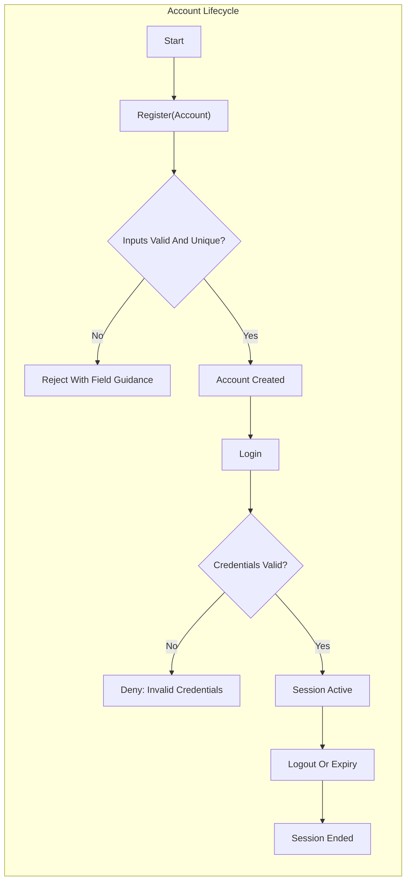
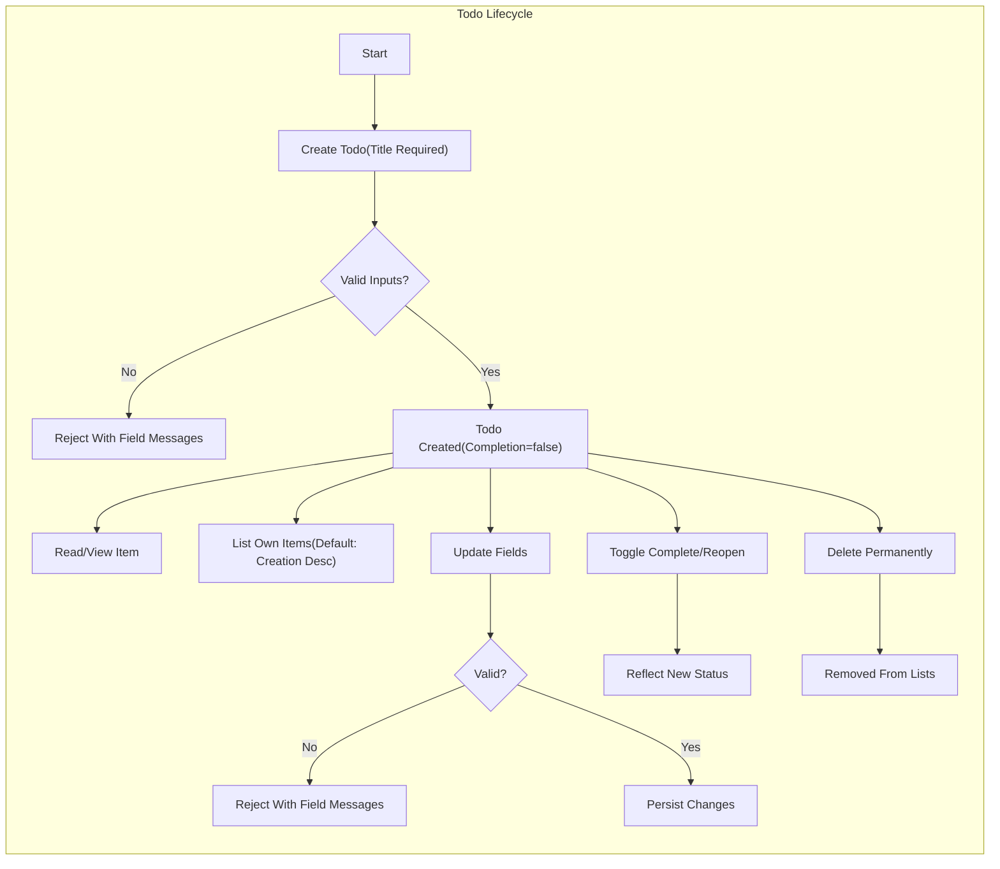

# Minimal Todo Service — Functional Requirements (MVP)

Minimal, production-intent business requirements for a personal Todo application identified by the service prefix "todo". The goal is the smallest set of capabilities that let an authenticated individual capture tasks, review them, mark them complete, and prune what is no longer needed. All requirements are expressed in business language using EARS-style statements where applicable. No technical designs, APIs, or storage schemas are prescribed.

## Guiding Principles and Scope

- Minimalism: only capabilities essential to personal task management are included.
- Single actor: one authenticated user role manages only their own items; no administrators in MVP.
- Privacy by default: strict ownership and isolation prevent cross-user visibility or inference.
- Determinism: clear validations, predictable ordering, and unambiguous outcomes.
- Responsiveness: perceived immediacy for common actions under normal conditions.
- Explicit exclusions: collaboration/sharing, notifications/reminders, tags/priorities/projects, attachments/subtasks, recurrence, search/advanced filtering, integrations, administrative roles.

EARS scope statements:
- THE "todo" service SHALL support a single authenticating actor who manages only personal todo items.
- THE "todo" service SHALL require successful authentication for any operation on todo data.
- THE "todo" service SHALL exclude collaboration, reminders, tags, search, recurrence, attachments, and administrative roles in MVP.

## Actors and Access Preconditions (Business-Level)

- Actor: Authenticated User ("User") — personal account holder who accesses only owned data.
- Unauthenticated state: not an actor; may attempt registration or login only; no access to user-owned todos.

EARS actor requirements:
- WHERE an individual is not authenticated, THE "todo" service SHALL deny access to any user-owned todo operations.
- THE "todo" service SHALL enforce that Users access only their own items and cannot infer others’ data.

## Performance Expectations (User-Perceived Targets)

- WHEN a User performs core actions (login, list per page, create, update, toggle, delete), THE "todo" service SHALL complete within 2 seconds under normal conditions for typical personal volumes (≤ 1,000 items owned).
- WHERE a list contains more than 100 items, THE "todo" service SHALL present results in pages of 20 items by default and SHALL respond within 2 seconds per page request under normal conditions.
- WHEN toggling completion, THE "todo" service SHALL reflect the new state with perceived immediacy (target ≤ 0.5 seconds typical).

## Business Fields and Ownership Model

Business-visible fields for a todo item:
- Title (required): concise, single-line description of the task.
- Description (optional): multi-line details supporting execution.
- Due Date (optional): date-only; used to understand urgency (overdue, due today) without reminders.
- Completion Status (boolean): completed vs. not completed; defaults to not completed.
- Created/Updated moments (system-maintained): used for predictable ordering and user understanding.

Ownership and isolation statements:
- THE "todo" service SHALL assign each item to exactly one owning User at creation and SHALL not permit ownership transfer in MVP.
- THE "todo" service SHALL restrict all operations (create, read, list, update, toggle, delete) to the owning User.

## Account Lifecycle (Business-Level)

Registration
- WHEN a person submits the required registration information, THE "todo" service SHALL create a personal account if inputs are valid and identifiers are unique.
- IF the identifier is already in use or inputs are invalid, THEN THE "todo" service SHALL reject registration with clear business guidance.

Login and Session
- WHEN a User submits valid credentials, THE "todo" service SHALL establish an authenticated session enabling permitted actions.
- IF credentials are invalid, THEN THE "todo" service SHALL deny access and avoid revealing whether a specific account exists.
- WHILE a session remains active, THE "todo" service SHALL allow permitted actions without re-authentication.

Logout and Expiry
- WHEN a User logs out, THE "todo" service SHALL end the session and require login for further actions.
- IF a session expires due to inactivity, THEN THE "todo" service SHALL require re-authentication for protected actions.

## Create Todo (Business Behavior)

Validations and behavior
- THE title SHALL be required and 1–120 characters after trimming; single line only; visible characters (no control characters).
- WHERE a description is provided, THE description SHALL be accepted up to 1,000 characters after trimming.
- WHERE a due date is provided, THE due date SHALL be a valid calendar date interpreted as date-only.

EARS create requirements:
- WHEN a User submits a new todo with a non-empty title within limits, THE "todo" service SHALL create the item owned by that User with completion set to not completed by default.
- IF the title is missing, whitespace-only, contains line breaks, or exceeds 120 characters, THEN THE "todo" service SHALL reject creation with a clear message about the rule violated.
- IF the description exceeds 1,000 characters, THEN THE "todo" service SHALL reject creation with a clear message about the length limit.
- IF the due date is not a valid calendar date, THEN THE "todo" service SHALL reject creation with a clear message indicating an invalid date.

## Read Single Todo (Business Behavior)

- WHEN the owning User requests a specific item, THE "todo" service SHALL return the item’s business fields and values.
- IF the item does not exist or is not owned by the User, THEN THE "todo" service SHALL respond with a business message indicating the item is unavailable without disclosing cross-user existence.

## List Todos (Scope, Pagination, Ordering, Filters)

Scope and pagination
- THE listing scope SHALL include only the authenticated User’s non-deleted items.
- THE default page size SHALL be 20 items; a requested page size up to 100 SHALL be honored, otherwise capped at 100 with business indication.

Default ordering (consistent across all sections)
- THE default ordering for list results SHALL be newest first by creation time (descending) for MVP.
- WHERE two items share the same creation time to the resolution used, THE order SHALL be deterministic using a secondary key (updated time descending).

Sorting options (MVP)
- WHERE the User requests alternate ordering, THE "todo" service SHALL support ordering by:
  - Creation time (newest→oldest or oldest→newest)
  - Due date (earliest→latest or latest→earliest); items without due dates SHALL appear last when sorting by due date ascending and first when sorting by due date descending only if explicitly chosen; otherwise appear last.

Basic status filters (MVP)
- THE "todo" service SHALL support a status filter: "all" (default), "active" (not completed), "completed" (completed only).

EARS list requirements:
- WHILE authenticated, THE "todo" service SHALL list only the requesting User’s items.
- WHEN no explicit sort is selected, THE "todo" service SHALL order by creation time descending.
- WHERE a status filter is applied, THE "todo" service SHALL include only items matching the selected status.
- IF the requested page size exceeds the maximum, THEN THE "todo" service SHALL cap results at 100 and communicate that a cap was applied.

## Update Todo (Fields and Validations)

- WHEN the owning User updates title, description, or due date within rules, THE "todo" service SHALL persist the changes and reflect them on subsequent reads and lists.
- WHERE the title is updated, THE title SHALL remain a single line, 1–120 characters after trimming.
- WHERE the description is updated, THE description SHALL be accepted up to 1,000 characters after trimming; a trimmed empty description SHALL be stored as absent.
- WHERE a due date is set or changed, THE due date SHALL be a valid calendar date; where cleared, the due date SHALL be removed.

EARS update requirements:
- IF an updated field violates constraints, THEN THE "todo" service SHALL reject the update and preserve existing values with field-specific guidance.
- IF the item is not owned by the User or no longer exists, THEN THE "todo" service SHALL deny or indicate unavailability without leaking cross-user details.

## Toggle Completion (Semantics and Idempotency)

- WHEN a User marks an incomplete item complete, THE "todo" service SHALL set completion to true and preserve other fields unchanged.
- WHEN a User reopens a completed item, THE "todo" service SHALL set completion to false and preserve other fields unchanged.
- WHERE the requested state equals the current state, THE "todo" service SHALL confirm the current state without error (idempotent no-op).

## Delete Todo (Permanent in MVP)

- WHEN the owning User deletes an item, THE "todo" service SHALL remove it from the User’s active view and standard listings immediately after success.
- THE deletion behavior SHALL be permanent in MVP; there is no recycle bin or restore.
- IF deletion targets a non-existent or non-owned item, THEN THE "todo" service SHALL indicate unavailability or lack of permission without disclosing cross-user details.

## Due Date Semantics and Time Awareness (Date-Only)

- THE due date SHALL be interpreted as a calendar date without time-of-day.
- THE "todo" service SHALL compute urgency states in business terms:
  - Overdue: current date is later than the due date and the item is not completed.
  - Due today: current date equals the due date and the item is not completed.
- WHERE a due date is removed, THE "todo" service SHALL cease urgency indications for that item.
- WHEN an item is marked completed, THE "todo" service SHALL stop urgency indications regardless of any due date.

## Validation and Error Handling (Business-Facing)

- IF a User is not authenticated when attempting a protected action, THEN THE "todo" service SHALL deny the action and direct the User to sign in.
- IF a User attempts to access or modify an item they do not own, THEN THE "todo" service SHALL deny the action and avoid revealing resource existence.
- IF input validation fails, THEN THE "todo" service SHALL reject the action and provide field-specific guidance in clear language.
- IF a requested item does not exist (never existed or already deleted), THEN THE "todo" service SHALL communicate unavailability and advise refresh where applicable.
- WHERE repeated actions cause no change (e.g., completing an already completed item), THE "todo" service SHALL treat them as idempotent confirmations rather than errors.
- WHERE rapid actions exceed safe usage expectations, THE "todo" service MAY apply business-level rate limiting with clear wait-time guidance.

## Non-Functional References (Business-Level Pointers)

- THE "todo" service SHALL meet user-perceived response time targets stated in Performance Expectations.
- THE "todo" service SHALL protect user privacy and ensure data isolation at all times.
- THE "todo" service SHALL provide reliable CRUD operations under normal conditions; incident handling and availability targets are described in non-functional expectations.

## Acceptance Criteria (EARS, Testable)

Registration and Login
- WHEN a person submits valid, unique registration data, THE "todo" service SHALL create an account ready for login.
- IF registration inputs are invalid or the identifier is already in use, THEN THE "todo" service SHALL reject the attempt with specific corrections.
- WHEN valid credentials are submitted, THE "todo" service SHALL establish a session that enables protected actions until logout or expiry.
- IF invalid credentials are submitted, THEN THE "todo" service SHALL deny access with a generic invalid-credentials message.

Logout and Session Expiry
- WHEN a User logs out, THE "todo" service SHALL terminate the session immediately and require login for protected actions.
- IF a session expires due to inactivity, THEN THE "todo" service SHALL require re-authentication before protected actions proceed.

Create Todo
- WHEN title is 1–120 characters (single line) and optional fields meet rules, THE "todo" service SHALL create the item with completion=false and assign ownership to the requester.
- IF title is missing, whitespace-only, multiline, or >120 characters, THEN THE "todo" service SHALL reject creation with a field-specific message.
- IF description exceeds 1,000 characters or due date is invalid, THEN THE "todo" service SHALL reject creation with a field-specific message.

Read Single Todo
- WHEN the owner requests an existing item, THE "todo" service SHALL return business fields and values for that item.
- IF the item is non-existent or not owned by the requester, THEN THE "todo" service SHALL indicate unavailability without confirming cross-user existence.

List Todos
- WHEN the owner lists items without filters, THE "todo" service SHALL return only owned items with default ordering of creation time descending, page size 20.
- WHERE a page size ≤ 100 is requested, THE "todo" service SHALL honor it; otherwise, cap at 100 and indicate the cap.
- WHERE a status filter of active or completed is used, THE "todo" service SHALL include only items matching the selection.
- WHERE sorting by due date ascending is chosen, THE "todo" service SHALL place items without a due date last.

Update Todo
- WHEN the owner updates title, description, or due date within constraints, THE "todo" service SHALL persist changes and reflect them in subsequent reads and lists.
- IF any updated field violates constraints, THEN THE "todo" service SHALL reject the update and preserve existing values.
- IF the item is non-existent or not owned by the requester, THEN THE "todo" service SHALL indicate unavailability or deny access without disclosing existence.

Toggle Completion
- WHEN the owner marks complete, THE "todo" service SHALL set completion=true; WHEN reopened, set completion=false.
- WHERE the requested state equals current state, THE "todo" service SHALL confirm current state without error.

Delete Todo
- WHEN the owner deletes an item, THE "todo" service SHALL remove it from standard lists immediately and make it unavailable.
- IF deletion targets a non-existent or non-owned item, THEN THE "todo" service SHALL indicate unavailability or deny access without disclosing existence.

Performance
- WHEN a core action is performed under normal conditions and typical volumes, THE "todo" service SHALL respond within 2 seconds perceived time; toggles SHALL feel immediate (≈0.5s typical).

Privacy and Isolation
- THE "todo" service SHALL never expose another User’s todo data or leak existence via messages, counts, or timings.

Messaging Consistency
- THE "todo" service SHALL provide consistent, clear, and field-specific messages in en-US for all denials and validation outcomes.

## Visual References (Mermaid)

Account lifecycle (conceptual)

Todo lifecycle and listing (conceptual)

## Traceability and Related References

- Business context and vision: Service overview for the minimal Todo service.
- Actor definition and ownership boundaries: User actors and permissions guide.
- Field-level rules and validations: Business rules and validation reference.
- Non-functional expectations: Performance, security, reliability, and monitoring targets.
