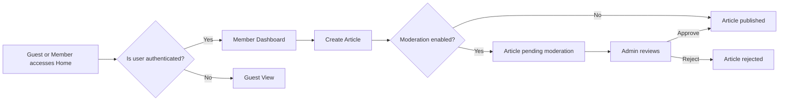
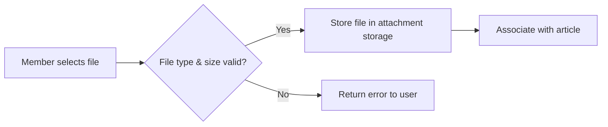

# Functional Requirements for Discussion Board Service

*Version: 1.0*

---

## Introduction

This document captures all **business‑level functional requirements** for the **Discussion Board** service (service prefix: `discussionBoard`). The requirements are expressed using the **EARS (Easy Approach to Requirements Syntax)** format to ensure clarity, testability, and consistency. Backend developers should use this document as the authoritative source for what the system must do, without any prescriptive technical implementation details.

---

## 1. Article Management

### 1.1 Create Article

- **WHEN** a **member** submits a new article with a title and body, **THE** system **SHALL** create the article and assign it a unique identifier.
- **WHEN** a **guest** attempts to submit an article, **IF** the user is unauthenticated, **THEN** THE system **SHALL** reject the request and display a permission‑denied message.
- **WHERE** the service configuration enables "article moderation", **THE** system **SHALL** flag the newly created article as **pending moderation**; otherwise it **SHALL** make the article immediately visible.

### 1.2 Edit Article

- **WHEN** a **member** requests to edit their own article within **15 minutes** of creation, **THE** system **SHALL** allow the edit and update the article content.
- **WHEN** a **member** requests to edit their own article after **15 minutes**, **THEN** THE system **SHALL** deny the edit and present a message indicating the edit window has expired.
- **IF** an **admin** edits any article, **THE** system **SHALL** apply the change regardless of the edit window.

### 1.3 Delete Article

- **WHEN** an **admin** selects an article for deletion, **THE** system **SHALL** permanently remove the article and all its associated attachments.
- **WHEN** a **member** requests to delete their own article, **IF** the article is not yet approved (still pending moderation), **THEN** THE system **SHALL** delete it; otherwise **THE** system **SHALL** deny the request and advise the member to contact an admin.

### 1.4 View Article

- **THE** system **SHALL** deliver the full article content, including any approved attachments, to any requesting **guest** or **member**.
- **THE** system **SHALL** render the article body in plain text format with markdown support (no UI specifics required).

---

## 2. Comment Management

### 2.1 Add Comment

- **WHEN** a **member** submits a comment on a published article, **THE** system **SHALL** attach the comment to the article and record the author, timestamp, and comment text.
- **WHEN** a **guest** attempts to comment, **IF** the user is unauthenticated, **THEN** THE system **SHALL** deny the action and display a permission‑denied message.

### 2.2 Edit Comment

- **WHEN** a **member** edits their own comment within **10 minutes** of posting, **THE** system **SHALL** update the comment text.
- **WHEN** a **member** attempts to edit a comment after **10 minutes**, **THEN** THE system **SHALL** reject the edit and inform the user that the edit window has closed.
- **IF** an **admin** edits any comment, **THE** system **SHALL** apply the change without time restriction.

### 2.3 Delete Comment

- **WHEN** an **admin** deletes a comment, **THE** system **SHALL** remove it permanently.
- **WHEN** a **member** deletes their own comment, **IF** the comment is less than **30 minutes** old, **THEN** THE system **SHALL** remove it; otherwise **THE** system **SHALL** deny the request.

---

## 3. Attachment Handling

### 3.1 Upload Attachment

- **WHEN** a **member** attaches an image or file while creating or editing an article, **THE** system **SHALL** accept the upload if the file type is among the allowed types (**JPEG, PNG, GIF, PDF, DOCX**) and the size does not exceed **10 MB**.
- **IF** the uploaded file exceeds the size limit or is of an unsupported type, **THEN** THE system **SHALL** reject the upload and present a clear error message.

### 3.2 Download/View Attachment

- **WHEN** any user (guest or member) requests to view or download an attachment that belongs to a **published** article, **THE** system **SHALL** deliver the file.
- **IF** the attachment is linked to an article that is **pending moderation** or **deleted**, **THEN** THE system **SHALL** deny access and show an appropriate message.

### 3.3 Delete Attachment

- **WHEN** an **admin** deletes an article, **THE** system **SHALL** also delete all its attachments.
- **WHEN** a **member** removes an attachment during the article edit window (before publishing), **THE** system **SHALL** delete the file from storage.

---

## 4. User Registration & Login

### 4.1 Register Member

- **WHEN** a visitor provides a valid email address, a password meeting the policy (minimum 8 characters, at least one number and one special character), and accepts the terms of service, **THE** system **SHALL** create a new **member** account and send a verification email.
- **IF** the email is already associated with an existing account, **THEN** THE system **SHALL** reject the registration and inform the user.

### 4.2 Email Verification

- **WHEN** a user clicks the verification link sent to their email, **THE** system **SHALL** mark the email as verified and enable full member privileges.
- **IF** the verification link is expired or invalid, **THEN** THE system **SHALL** present an error and allow the user to request a new verification email.

### 4.3 Login

- **WHEN** a **member** provides correct email and password, **THE** system **SHALL** authenticate the user and start a session lasting **30 minutes** of inactivity.
- **IF** the credentials are incorrect, **THEN** THE system **SHALL** return a permission‑denied message stating "Invalid email or password."
- **WHEN** a **member** fails to login **5 consecutive times**, **THE** system **SHALL** temporarily lock the account for **15 minutes** and notify the user.

### 4.4 Password Reset

- **WHEN** a user requests a password reset, **THE** system **SHALL** send a secure, time‑limited reset link to the registered email.
- **WHEN** the user follows the reset link and provides a new password meeting the policy, **THE** system **SHALL** update the password and invalidate all existing sessions.

---

## 5. Search & Browsing

### 5.1 Browse Articles (Guest)

- **THE** system **SHALL** allow **guests** to view a paginated list of published articles, sorted by most recent first, with **20 articles per page**.
- **THE** system **SHALL** support keyword search across article titles and bodies, returning results instantly for common queries (response time ≤ 2 seconds).

### 5.2 Browse Articles (Member)

- **THE** system **SHALL** present the same browsing experience to **members**, with an additional filter to show their own drafts and pending moderation items.

### 5.3 Search Limits

- **IF** a search query exceeds **100 characters** or includes prohibited characters (e.g., script tags), **THEN** THE system **SHALL** reject the query and inform the user of the limitation.

---

## 6. Diagrams

### 6.1 Article Lifecycle Flow

### 6.2 Attachment Processing Flow

---

## 7. References

- **User Actors Definition:** See [User Actors Document](./03-user-actors.md) for detailed permission matrix.
- **Non‑Functional Requirements:** See [Non‑Functional Requirements Document](./06-non-functional-requirements.md) for performance, security, and scalability constraints that influence these functional requirements.

---

*End of Document*