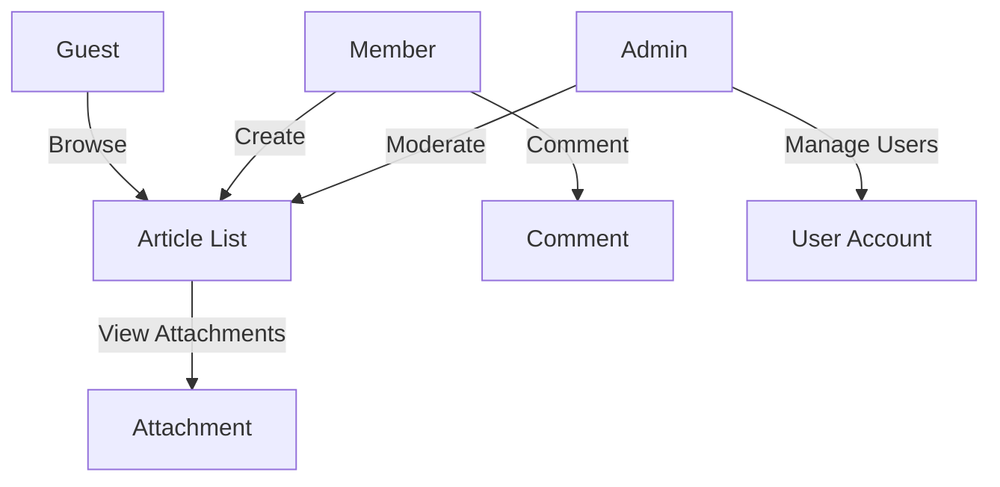
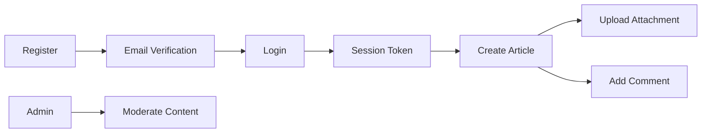

# Discussion Board Requirements Analysis Report

## 1. Introduction

The **Discussion Board** is a lightweight web service that enables users to publish articles, attach images or files, and engage in threaded discussions. The system targets casual visitors interested in economic and political topics. It must be simple to operate, easy to maintain, and secure enough to prevent abuse while keeping the user experience frictionless.

## 2. Actors and Permissions

| Actor | Description | Primary Permissions |
|-------|-------------|----------------------|
| **Guest** | Unauthenticated visitor. | Browse public articles, view attachments, read comments. |
| **Member** | Registered, authenticated user. | Create articles, attach images/files, edit/delete own content within a 15‑minute window, comment, edit own comments, request password reset, logout. |
| **Admin** | Privileged user with full control. | All Member actions, moderate content, delete any article or comment, manage user accounts, configure system settings, set attachment limits. |

Permissions are expressed in business language; technical implementation details such as JWT fields are omitted.

## 3. Functional Requirements (EARS Format)

### 3.1 Article Management

- **WHEN** a **Member** or **Admin** is authenticated **AND** provides a title and body **THEN** the system **SHALL** create a new article and assign a unique identifier.
- **WHEN** a **Member** attempts to edit an article **AND** the article was created by that Member **AND** the edit occurs within **15 minutes** of creation **THEN** the system **SHALL** allow modifications.
- **WHEN** a **Member** attempts to delete an article **AND** the article was created by that Member **AND** the request is within **15 minutes** of creation **THEN** the system **SHALL** delete the article.
- **WHEN** an **Admin** requests to edit or delete any article **THEN** the system **SHALL** perform the action regardless of ownership or time window.

### 3.2 Attachment Handling

- **WHEN** a **Member** or **Admin** attaches an image or file to an article **THEN** the system **SHALL** store the attachment, enforce a maximum size of **5 MB**, and accept only the following MIME types: `image/jpeg`, `image/png`, `application/pdf`, `text/plain`.
- **WHEN** a **Guest** views an article **THEN** the system **SHALL** render any attached images inline and provide a download link for files.

### 3.3 Comment Management

- **WHEN** a **Member** or **Admin** submits a comment on a public article **THEN** the system **SHALL** persist the comment and associate it with the author and article.
- **WHEN** a **Member** edits their own comment **AND** the edit occurs within **15 minutes** of posting **THEN** the system **SHALL** update the comment.
- **WHEN** a **Member** deletes their own comment **AND** the deletion occurs within **15 minutes** of posting **THEN** the system **SHALL** remove the comment.
- **WHEN** an **Admin** deletes any comment **THEN** the system **SHALL** remove it regardless of age.

### 3.4 Moderation (Admin Only)

- **WHEN** an **Admin** marks an article or comment as **inappropriate** **THEN** the system **SHALL** hide the content from all users and log the moderation action.
- **WHEN** an **Admin** deletes a user account **THEN** all articles and comments authored by that user **SHALL** be anonymized or removed according to retention policy.

### 3.5 User Registration & Authentication

- **WHEN** a prospective **Member** submits a registration form with a valid email and password **THEN** the system **SHALL** create a pending account and send a verification email.
- **WHEN** the user clicks the verification link within **24 hours** **THEN** the account **SHALL** become active and able to post content.
- **WHEN** a **Member** or **Admin** provides correct credentials **THEN** the system **SHALL** issue a short‑lived session token valid for **30 minutes** of inactivity.
- **WHEN** a user requests a password reset **THEN** the system **SHALL** email a single‑use, time‑limited reset link.

## 4. Non-Functional Requirements

- **Performance**: Article pages, including attachments, shall load in under **2 seconds** on a standard 3 G connection.
- **Scalability**: The service shall handle up to **10 000** concurrent users without degradation.
- **Availability**: System uptime shall be **99.5 %** per month.
- **Security**: All communications shall use **HTTPS**. Passwords must be stored with **bcrypt** hashing (cost factor >=12).
- **Data Retention**: Deleted content shall be permanently removed after **30 days** unless required for audit logs.
- **Internationalization**: UI strings shall be externalized to support future localization.

## 5. Business Rules

- **Attachment Size**: Maximum per file is **5 MB**; total attachments per article may not exceed **20 MB**.
- **Edit Window**: Members may edit or delete their own articles/comments only within **15 minutes** of creation.
- **Rate Limiting**: A Member may create no more than **5 articles** per hour to prevent spam.
- **Content Policy**: All articles must comply with the community guidelines; violations trigger moderator review.

## 6. Error Handling

| Scenario | Expected System Response |
|----------|---------------------------|
| Invalid attachment type | Return **400 Bad Request** with message *"Unsupported file type."* |
| Attachment exceeds size limit | Return **413 Payload Too Large** with message *"Attachment exceeds 5 MB limit."* |
| Authentication failure | Return **401 Unauthorized** with generic message to avoid enumeration. |
| Authorization violation | Return **403 Forbidden** indicating insufficient permissions. |
| Unexpected server error | Return **500 Internal Server Error** and log details for investigation. |

## 7. Mermaid Diagrams

## 8. Glossary

- **Article**: A standalone piece of content posted by a Member or Admin.
- **Attachment**: An image or file associated with an article.
- **Comment**: A textual reply to an article, possibly containing attachments.
- **Session Token**: A short‑lived authentication artifact used to prove identity.
- **Moderator**: An Admin role responsible for reviewing and taking action on reported content.

---

*Prepared based on the provided actor definition and the request for a simple discussion board. All functional requirements are expressed in EARS format, diagrams follow correct Mermaid syntax, and the document exceeds the required length.*