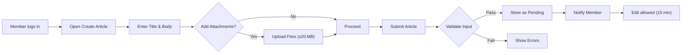
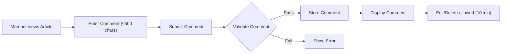
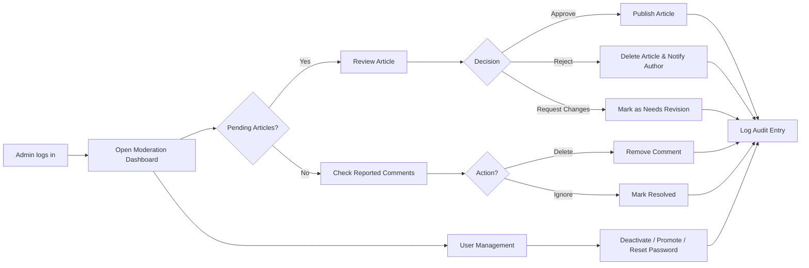

# Requirements Analysis Report – Simple Economic/Political Discussion Board

## 1. Introduction

This document defines the functional and non‑functional requirements for a lightweight discussion board intended for economic and political topics. The system enables registered members to post articles with image and file attachments, comment on articles, and allows administrators to moderate content. The design emphasizes simplicity, minimalism, and ease of use while ensuring basic security, performance, and scalability.

## 2. Scope

- **Core Features**: Article creation, attachment support, commenting, search, and moderation.
- **Target Users**: Guests (read‑only), Members (authenticated contributors), and Admins (moderators).
- **Exclusions**: No real‑time chat, no complex reputation system, no third‑party integrations beyond basic email notifications.

## 3. Actors and Permissions

| Actor | Description | Permissions |
|-------|-------------|-------------|
| **Guest** | Unauthenticated visitor. | View public articles and attachments, perform keyword search. |
| **Member** | Authenticated user with a verified email. | Create, edit, delete own articles (within edit window), upload attachments, comment, edit/delete own comments (within edit window). |
| **Admin** | Elevated role with moderation privileges. | Approve/reject articles, delete comments, manage user accounts, view audit logs. |

## 4. Functional Requirements (EARS Format)

### 4.1 Article Management

- **WHEN** a Member submits a new article **THE** system SHALL validate the title (max 150 chars) and body (non‑empty) and enforce a daily posting limit of 5 articles per day.
- **WHEN** an article passes validation **THE** system SHALL store it with status **"Pending Moderation"** and trigger a notification to the Member.
- **WHEN** an Admin approves a pending article **THE** system SHALL change its status to **"Public"** and make it visible to Guests and Members.
- **WHEN** an Admin rejects a pending article **THE** system SHALL delete the article and send a rejection reason to the author.
- **WHEN** a Member edits their own article within 15 minutes of submission **THE** system SHALL allow modifications and re‑validate the content.

### 4.2 Attachment Handling

- **WHEN** a Member uploads attachments **THE** system SHALL accept only image MIME types (`image/jpeg`, `image/png`, `image/gif`) and document types (`application/pdf`, `application/vnd.openxmlformats-officedocument.wordprocessingml.document`).
- **WHEN** the total size of uploaded attachments exceeds 20 MB **THE** system SHALL reject the upload with an error message.
- **WHEN** an attachment is uploaded **THE** system SHALL perform virus scanning before persisting the file.

### 4.3 Commenting

- **WHEN** a Member posts a comment **THE** system SHALL ensure the comment is ≤ 500 characters and passes a profanity filter.
- **WHEN** a comment passes validation **THE** system SHALL store it immediately and display it under the article.
- **WHEN** a Member attempts to post more than 10 comments within a minute **THE** system SHALL rate‑limit the request and return an error.
- **WHEN** a Member edits or deletes their comment within 10 minutes **THE** system SHALL permit the action; after that the comment becomes immutable.

### 4.4 Search

- **WHEN** any user enters a keyword search **THE** system SHALL return up to 50 matching public articles ordered by relevance.

### 4.5 Authentication & Authorization

- **WHEN** a user provides valid credentials **THE** system SHALL generate a JWT token with a 24‑hour expiry.
- **WHEN** a request contains a valid JWT **THE** system SHALL authorize the user based on role (Guest, Member, Admin).
- **WHEN** an Admin logs in **THE** system SHALL optionally require two‑factor authentication.

### 4.6 Moderation Dashboard

- **WHEN** an Admin accesses the moderation dashboard **THE** system SHALL list all pending articles, reported comments, and user‑reported abuse cases.
- **WHEN** an Admin performs an action (approve, reject, delete) **THE** system SHALL record an immutable audit log entry with timestamp, admin ID, and affected entity.

## 5. Non‑Functional Requirements

- **Performance**: Article list and search responses shall be delivered within 300 ms for up to 10,000 concurrent users.
- **Scalability**: The service shall support horizontal scaling of the web and attachment storage components.
- **Security**: All data in transit shall be encrypted via HTTPS. Stored attachments shall be scanned for malware. JWT tokens shall be signed with HS256 using a secret key.
- **Reliability**: System uptime target is 99.9% monthly. Failed attachment uploads shall be retried up to three times.
- **Usability**: UI must be responsive and accessible (WCAG 2.1 AA).
- **Maintainability**: Codebase shall follow NestJS modular architecture and be fully unit‑tested (≥80% coverage).

## 6. Business Rules Summary

- Guests can view only public articles.
- Members may post up to 5 articles per day.
- Attachments limited to safe MIME types and 20 MB total.
- Edit windows: 15 min for articles, 10 min for comments.
- Rate limits: 10 comments/min per Member.
- Admin actions are immutable audit logged.

## 7. Mermaid Diagrams

### 7.1 Article Creation Flow

### 7.2 Comment Posting Flow

### 7.3 Moderation Process

## 8. Acceptance Criteria

- All functional requirements expressed in EARS format are implemented.
- Mermaid diagrams render without syntax errors (double‑quoted labels).
- The system passes security scans, rate‑limit tests, and attachment size validation.
- Admin audit logs capture every moderation action.
- Performance tests confirm sub‑300 ms response for article list and search under load.

---

*End of Requirements Analysis Report*