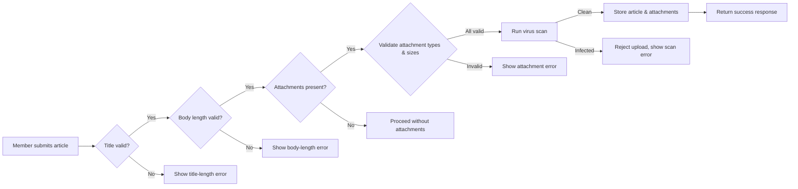
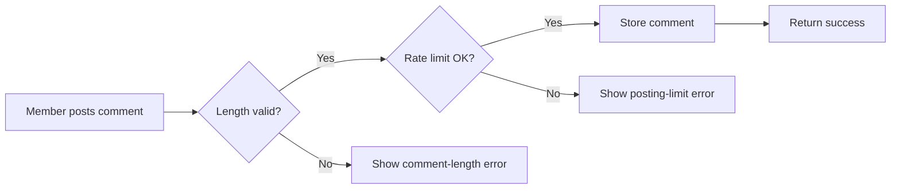

# Economic & Political Discussion Board – Requirements Analysis

## 1. Introduction

The **Economic & Political Discussion Board** is a lightweight web service that enables registered members to publish articles, attach images or files, and engage in community discussion through comments. The platform targets users interested in sharing insights on economic policies, political events, and related analysis, while maintaining a simple, performant, and secure experience.

## 2. Scope

- **In‑scope**: Article creation, editing, deletion, commenting, image/file attachments, basic moderation, and user authentication/authorization.
- **Out‑of‑scope**: Advanced analytics, real‑time chat, external API integrations, and multi‑language localization.

## 3. User Actors & Permissions

| Actor   | Description                                   | Capabilities |
|--------|-----------------------------------------------|--------------|
| Guest  | Unauthenticated visitor.                     | View articles and comments (read‑only). |
| Member | Registered user with verified email address. | Create/edit/delete own articles, upload attachments, post comments, edit own comments within 15 min, report abusive content. |
| Admin  | System administrator.                        | Moderate any content, delete any article/comment, override rate limits, manage user bans. |

## 4. Functional Requirements

### 4.1 Article Management (EARS)
- **WHEN** a *Member* submits a new article, **THE** system **SHALL** validate the title length (5‑100 characters) and body length (20‑10,000 characters). **IF** validation passes, **THE** article **SHALL** be persisted and become visible to all users.
- **WHEN** a *Member* attempts to edit an article within **15 minutes** of publishing **AND** no other member has commented, **THE** system **SHALL** allow the edit. **ELSE** an error message **SHALL** be returned.
- **WHEN** a *Member* deletes an article, **THE** system **SHALL** remove the article and all its attachments permanently.

### 4.2 Comment Management (EARS)
- **WHEN** a *Member* posts a comment, **THE** system **SHALL** enforce a minimum length of 5 characters and a maximum of 2,000 characters.
- **WHEN** a *Member* edits a comment within **15 minutes**, **THE** system **SHALL** allow the edit; otherwise, edits are prohibited.

### 4.3 Attachment Handling (EARS)
- **WHEN** a *Member* uploads an attachment, **THE** system **SHALL** accept only MIME types `image/jpeg`, `image/png`, `image/gif`, `application/pdf`, `text/plain`, `application/zip`.
- **WHEN** a file size exceeds **5 MiB**, **THE** system **SHALL** reject the upload with a clear error message.
- **WHEN** total attachment size for a single article exceeds **20 MiB**, **THE** system **SHALL** reject the operation.
- **WHEN** an attachment is uploaded, **THE** system **SHALL** run a virus scan. If the scan fails, the upload is rejected.

### 4.4 Rate Limiting (EARS)
- **WHEN** a *Member* attempts to create more than **10 articles per day** or **30 comments per day**, **THE** system **SHALL** reject the request and inform the user of the daily limit.
- **WHEN** a *New Member* (account age < 7 days) exceeds **2 articles** or **5 comments** within 24 hours, **THE** system **SHALL** enforce the burst limit and reject further posts for the remainder of the 24‑hour window.
- **WHEN** a rate‑limit violation occurs, **THE** system **SHALL** block further posting attempts for **30 minutes**.

### 4.5 Moderation & Abuse Prevention (EARS)
- **WHEN** an article contains prohibited content (PII, hate speech, malicious links), **THE** system **SHALL** flag it for immediate admin review.
- **WHEN** a *Member* receives **3 or more** content‑removal flags within 24 hours, **THE** system **SHALL** suspend posting privileges for **24 hours**.
- **WHEN** an admin marks an article as "spam" or "violates policy", **THE** system **SHALL** hide the article from public view and notify the author.

## 5. Non‑Functional Requirements

- **Performance**: Article retrieval and list pagination shall respond within **200 ms** for up to **10 KB** payloads under normal load (≤ 500 concurrent users).
- **Scalability**: System must support up to **10,000 concurrent users** with horizontal scaling of the API tier.
- **Security**: All communication over HTTPS; passwords stored with bcrypt (cost factor ≥ 12). JWT tokens with a 1‑hour expiry for authentication.
- **Reliability**: 99.9 % uptime SLA; automated backups for the database performed daily.
- **Compliance**: Store no personally identifiable information (PII) beyond what is necessary for authentication, complying with GDPR‑like regulations.

## 6. Business Rules Summary

The core business rules defined in **07‑business‑rules.md** are incorporated directly:
- Title and body length constraints.
- Attachment type and size limits.
- 15‑minute edit window with early termination conditions.
- Posting caps and burst limits for new members.
- Automated flagging and suspension thresholds.
- Clear, user‑friendly error messages for each violation.

## 7. Workflow Diagrams

### 7.1 Article Submission Flow

### 7.2 Comment Posting Flow

## 8. Error Messaging Guidelines

All validation failures shall return concise, user‑friendly messages without technical jargon:
- *"Your article title exceeds 100 characters. Please shorten it.*"
- *"Attachments larger than 5 MiB are not allowed. Reduce the file size or split into multiple uploads.*"
- *"You have reached the daily posting limit. Try again tomorrow.*"
- *"This content violates our community guidelines and has been flagged for review.*"

## 9. Acceptance Criteria

1. **Functional**: All described actions (create/edit/delete articles, comment, attach files) work according to the EARS rules.
2. **Validation**: Title, body, attachment types, sizes, and rate limits are enforced with appropriate error messages.
3. **Security**: HTTPS enforced, JWT authentication, password hashing, and virus scanning of uploads.
4. **Performance**: API response times meet the 200 ms target under simulated load of 500 concurrent users.
5. **Documentation**: The markdown document meets the minimum length requirement (>2000 characters) and includes the diagrams above.

## 10. Glossary

- **Member** – Registered user with full posting privileges.
- **Admin** – System administrator with moderation rights.
- **Attachment** – Image or file uploaded alongside an article.
- **EARS** – "Event‑Action‑Result‑Specification" format for clear, testable requirements.
- **Rate limit** – Caps on the number of posts a user can create within a defined time frame.
- **Virus scan** – Automated security check performed on each uploaded file before storage.

---

*Prepared for backend development teams to implement the Economic & Political Discussion Board service.*