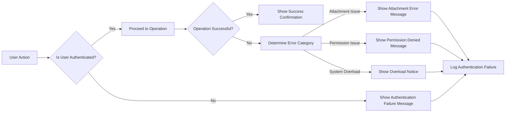

# Error Handling Requirements Analysis Report

## Overview

This report captures every user‑visible error scenario that may arise while interacting with the **Discussion Board** service and defines the corresponding recovery actions. The focus is on business‑level wording that can be presented directly to end‑users and support staff. Technical implementation details such as HTTP status codes, exception types, or stack traces are intentionally omitted.

The error handling covered here aligns with the functional requirements described in **[Functional Requirements](./04-functional-requirements.md)** and respects the performance, security, and reliability expectations set out in **[Non‑Functional Requirements](./06-non-functional-requirements.md)**.

---

## 1. Authentication Failures

### 1.1. Invalid Credentials

- **Trigger:** WHEN a user submits a login form with an email address or password that does not match the stored credentials, THE system SHALL display the message:
  > "The email or password you entered is incorrect. Please try again."
- **Recovery Action:** THE system SHALL log the failed attempt, increment a counter for possible brute‑force detection, and allow the user to retry.

### 1.2. Unverified Email

- **Trigger:** WHEN a member attempts to perform any authenticated action while their email address remains unverified, THE system SHALL display the message:
  > "Your email address has not been verified. Please check your inbox for the verification link before proceeding."
- **Recovery Action:** THE system SHALL resend a verification email (if requested) and block the attempted action until verification is completed.

### 1.3. Session Expiration

- **Trigger:** WHEN a user’s authentication token expires during an active session, THE system SHALL display the message:
  > "Your session has expired. Please log in again to continue."
- **Recovery Action:** THE system SHALL redirect the user to the login page and preserve the original request context, allowing a seamless continuation after re‑authentication.

---

## 2. Attachment Upload Errors

### 2.1. Unsupported File Type

- **Trigger:** WHEN a member attempts to attach a file whose MIME type is not in the allowed list (images: JPEG, PNG; documents: PDF, DOCX), THE system SHALL display the message:
  > "The attached file type is not supported. Please upload images (JPEG/PNG) or documents (PDF/DOCX) only."
- **Recovery Action:** THE system SHALL reject the upload, keep any previously entered article content, and allow the user to replace the attachment.

### 2.2. File Size Exceeds Limit

- **Trigger:** WHEN a member uploads a file larger than the maximum allowed size of **5 MB**, THE system SHALL display the message:
  > "The file you are trying to upload exceeds the 5 MB size limit. Please reduce the file size and try again."
- **Recovery Action:** THE system SHALL abort the upload, retain the article draft, and permit the user to select a smaller file.

### 2.3. Network Interruption During Upload

- **Trigger:** WHEN the network connection is lost while a file is being uploaded, THE system SHALL display the message:
  > "The upload was interrupted due to a network issue. Please check your connection and retry."
- **Recovery Action:** THE system SHALL automatically pause the upload, allow the user to resume once the connection is restored, and ensure the file is not partially stored.

---

## 3. Permission Denied Messages

### 3.1. Guest Attempting Restricted Action

- **Trigger:** WHEN a **guest** user tries to create an article, post a comment, or upload an attachment, THE system SHALL display the message:
  > "You must be logged in to perform this action. Please sign in or register an account."
- **Recovery Action:** THE system SHALL provide a link to the login/registration page.

### 3.2. Member Editing Outside Allowed Window

- **Trigger:** WHEN a **member** attempts to edit their own article or comment after the 15‑minute edit window has elapsed, THE system SHALL display the message:
  > "Editing is no longer allowed for this content. You can only edit within 15 minutes of posting."
- **Recovery Action:** THE system shall lock the edit interface and suggest creating a new article or comment if further changes are necessary.

### 3.3. Admin‑Level Action Without Proper Role

- **Trigger:** WHEN a user lacking the **admin** role attempts to delete another user’s article or modify system settings, THE system SHALL display the message:
  > "You do not have sufficient permissions to perform this action. Please contact an administrator if you believe this is an error."
- **Recovery Action:** THE system shall log the unauthorized attempt for audit purposes.

---

## 4. System Overload Responses

### 4.1. High Load During Peak Traffic

- **Trigger:** WHEN the platform detects that request latency exceeds the acceptable threshold defined in the non‑functional requirements (e.g., response time > 2 seconds), THE system SHALL display a friendly notice:
  > "The service is experiencing high traffic. Your request may take a moment longer than usual. Please try again if it does not complete shortly."
- **Recovery Action:** THE system shall queue the request, prioritize critical operations, and gradually release capacity as load diminishes.

### 4.2. Storage Capacity Reached for Attachments

- **Trigger:** WHEN the total storage used for attachments reaches the configured limit (e.g., 10 GB), THE system SHALL display the message:
  > "The system is temporarily unable to accept new attachments due to storage constraints. Please try again later or contact support."
- **Recovery Action:** THE system shall refuse new uploads, alert the operations team, and automatically rotate or archive older attachments based on the retention policy.

---

## 5. Error Handling Flow Diagram

*All node labels are enclosed in double quotes as required by the Mermaid syntax rules.*

---

## 6. Summary of Recovery Actions

| Error Category | Primary Recovery Action |
|----------------|--------------------------|
| Invalid Credentials / Unverified Email / Session Expiration | Prompt re‑authentication, optionally resend verification email |
| Unsupported File Type / File Size Exceeds Limit | Reject upload, retain draft, allow replacement |
| Network Interruption | Pause upload, enable resume once connection restored |
| Permission Denied (Guest, Member edit window, Admin role) | Show guidance, provide login/registration link, log attempt |
| High Load / Storage Full | Queue request, display friendly notice, alert operations |

Developers should implement these behaviours consistently across all endpoints, ensuring that every user‑facing message aligns with the business wording defined above. Support staff can use the summary table to quickly identify the root cause of a reported problem and to verify that the system performed the correct recovery step.

---

## 7. References

- **[Functional Requirements](./04-functional-requirements.md)** – Details the actions that may trigger the errors described herein.
- **[Non‑Functional Requirements](./06-non-functional-requirements.md)** – Provides performance and reliability thresholds that shape the overload handling logic.

---

*End of Document*