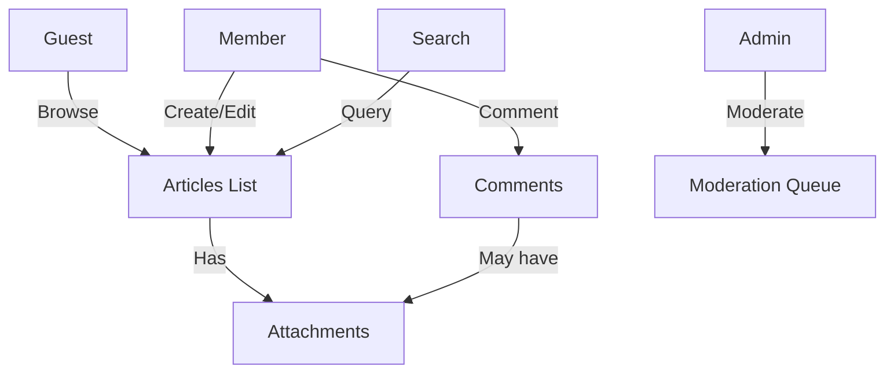

# Simple Economic/Political Discussion Board – Requirements Analysis

## 1. Introduction
The **Discussion Board** is a lightweight web‑based platform that enables users to publish and discuss articles on economic and political topics. It focuses on core functionality: article creation, image/file attachments, commenting, and basic moderation. The system is intentionally minimal to reduce development effort while providing a solid user experience.

## 2. Scope
- Public browsing of articles for all visitors (guests).
- Registered members can create articles, upload images/files, and comment.
- Administrators have full moderation rights.
- No complex features such as real‑time chat, voting, or advanced analytics are included.

## 3. Functional Requirements
### 3.1 Article Management
| ID | Requirement (EARS) |
|----|---------------------|
| FR‑A1 | **WHEN** a **Member** submits an article with a title and body **THE** system **SHALL** store the article and make it visible to all users. |
| FR‑A2 | **WHEN** a **Guest** or **Member** reads the article list **THE** system **SHALL** display article titles, authors, and timestamps in descending order of creation. |
| FR‑A3 | **WHEN** a **Member** edits their own article within **15 minutes** of creation **THE** system **SHALL** allow the edit; after that period the article becomes read‑only. |

### 3.2 Attachment Handling
| ID | Requirement (EARS) |
|----|---------------------|
| FR‑B1 | **WHEN** a **Member** attaches an image (JPEG, PNG, GIF) or file (PDF, DOCX) to an article **THE** system **SHALL** validate the MIME type and enforce a maximum size of **5 MB** per attachment. |
| FR‑B2 | **WHEN** a **Guest** views an article with attachments **THE** system **SHALL** provide a downloadable link for each attachment. |
| FR‑B3 | **WHEN** a **Member** attempts to upload a prohibited file type **THE** system **SHALL** reject the upload and return an error message within **2 seconds**. |

### 3.3 Commenting
| ID | Requirement (EARS) |
|----|---------------------|
| FR‑C1 | **WHEN** a **Member** posts a comment on an article **THE** system **SHALL** store the comment and display it immediately under the article. |
| FR‑C2 | **WHEN** a **Member** attaches an image/file to a comment **THE** system **SHALL** apply the same validation rules as for article attachments. |
| FR‑C3 | **WHEN** a **Guest** attempts to post a comment **THE** system **SHALL** reject the request with an authentication error. |

### 3.4 User Roles & Permissions
| Role | Permissions |
|------|-------------|
| **Guest** | View articles, view attachments, search, no create/edit actions. |
| **Member** | Create/edit own articles (within edit window), upload attachments, comment, edit own comments (within 10 minutes). |
| **Admin** | Delete any article or comment, manage user accounts, configure system settings, bypass rate‑limits. |

#### Permission Rules (EARS)
| ID | Requirement |
|----|------------|
| FR‑D1 | **WHEN** an **Admin** selects a deletion action on any article **THE** system **SHALL** permanently remove the article and all its attachments. |
| FR‑D2 | **WHEN** a **Member** attempts to delete another user’s article **THE** system **SHALL** deny the request with a "Permission denied" error. |

### 3.5 Moderation
| ID | Requirement |
|----|------------|
| FR‑E1 | **WHEN** a **Member** posts content that violates community guidelines **THE** system **SHALL** flag the content for admin review. |
| FR‑E2 | **WHEN** an **Admin** reviews a flagged item **THE** system **SHALL** provide options to **Approve**, **Reject**, or **Delete** the content. |
| FR‑E3 | **WHEN** an **Admin** deletes content **THE** system **SHALL** log the action for audit purposes. |

### 3.6 Search
| ID | Requirement |
|----|------------|
| FR‑F1 | **WHEN** a user enters a keyword **THE** system **SHALL** return a list of articles whose title or body contains the keyword, ordered by relevance. |
| FR‑F2 | **WHEN** the search query returns more than **100 results** **THE** system **SHALL** paginate results, 20 per page. |

## 4. Non‑Functional Requirements
### 4.1 Performance
- **NFR‑P1**: Article list page **SHALL** load within **1.5 seconds** for up to **10 k** concurrent users.
- **NFR‑P2**: File upload **SHALL** complete within **3 seconds** for a 5 MB attachment on average broadband.
### 4.2 Security
- **NFR‑S1**: All endpoints **SHALL** require TLS 1.2+.
- **NFR‑S2**: Passwords **SHALL** be stored using bcrypt with a cost factor of at least 12.
- **NFR‑S3**: Input validation against OWASP Top 10 risks.
### 4.3 Scalability
- **NFR‑SC1**: System **SHALL** support up to **10,000** concurrent users with horizontal scaling via stateless application servers.
### 4.4 Accessibility
- **NFR‑A1**: UI components **SHALL** conform to WCAG 2.1 AA criteria.

## 5. Business Rules
- **BR‑1**: Maximum of **5 attachments** per article.
- **BR‑2**: Rate‑limit posting to **5 articles per hour** per Member.
- **BR‑3**: Comments are limited to **500 characters**; attachments follow the same size limits as articles.
- **BR‑4**: All personal data **SHALL** be handled in accordance with GDPR; user can request data deletion.

## 6. Use Cases (User Scenarios)
### 6.1 Guest Browses Articles
1. Guest accesses the home page.
2. System displays the 20 most recent articles.
3. Guest clicks an article title.
4. System shows full article content and any attachment download links.
### 6.2 Member Creates an Article with Attachments
1. Member logs in and selects "New Article".
2. Enters title, body, and uploads up to 5 images/files.
3. System validates MIME types and size, then stores the article.
4. Article appears in the public list.
### 6.3 Member Comments on an Article
1. Member views an article.
2. Enters a comment text and optionally attaches an image.
3. System validates and stores the comment; comment appears beneath the article.
### 6.4 Admin Moderates Content
1. Admin logs in and accesses the moderation dashboard.
2. Dashboard lists flagged items.
3. Admin selects an item, reviews, and chooses "Approve" or "Delete".
4. System updates status and logs the action.

## 7. Mermaid Diagram (System Overview)

*All node labels are double‑quoted as required.*

---
*End of Requirements Analysis*