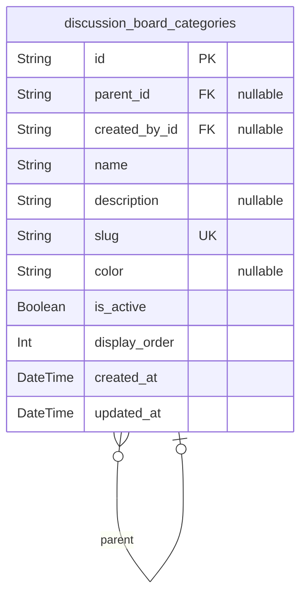
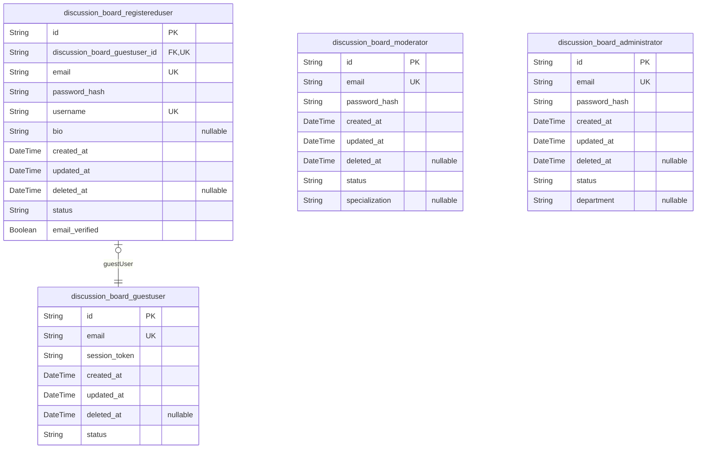
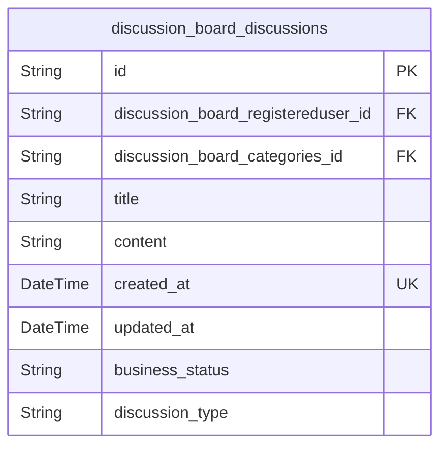
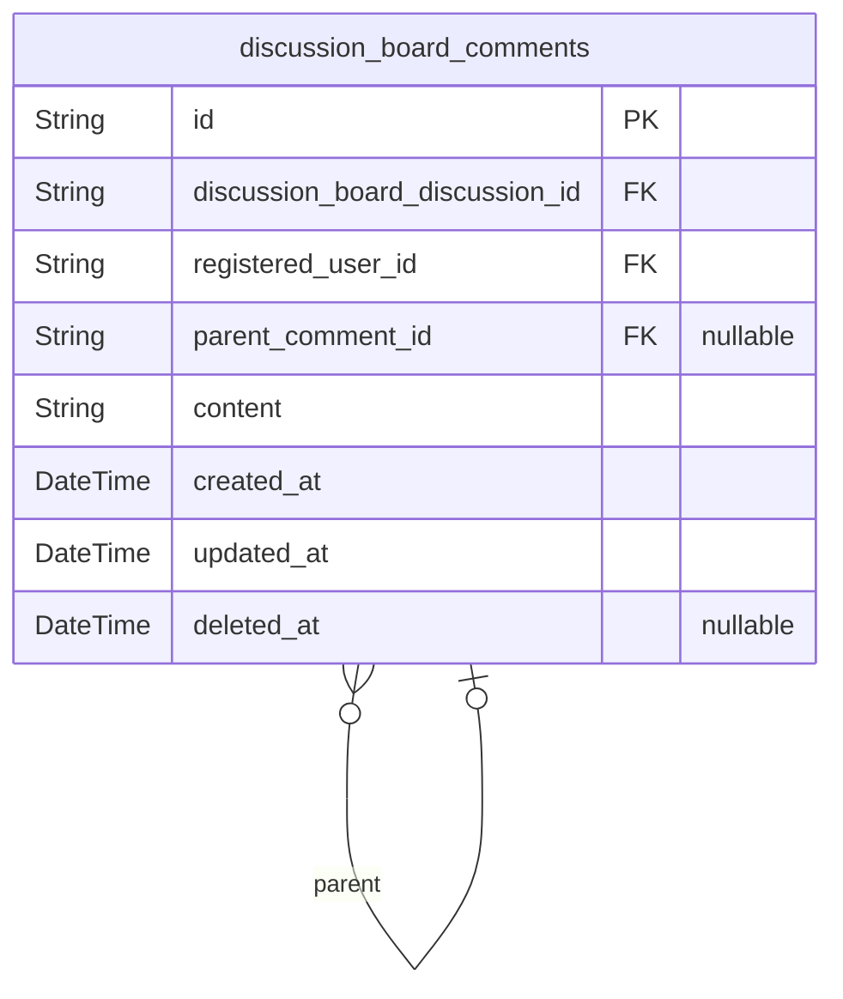
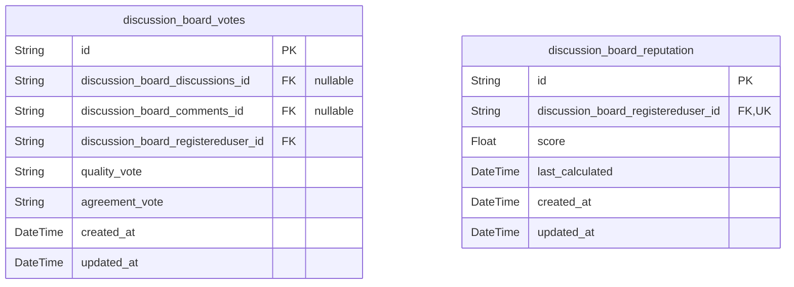
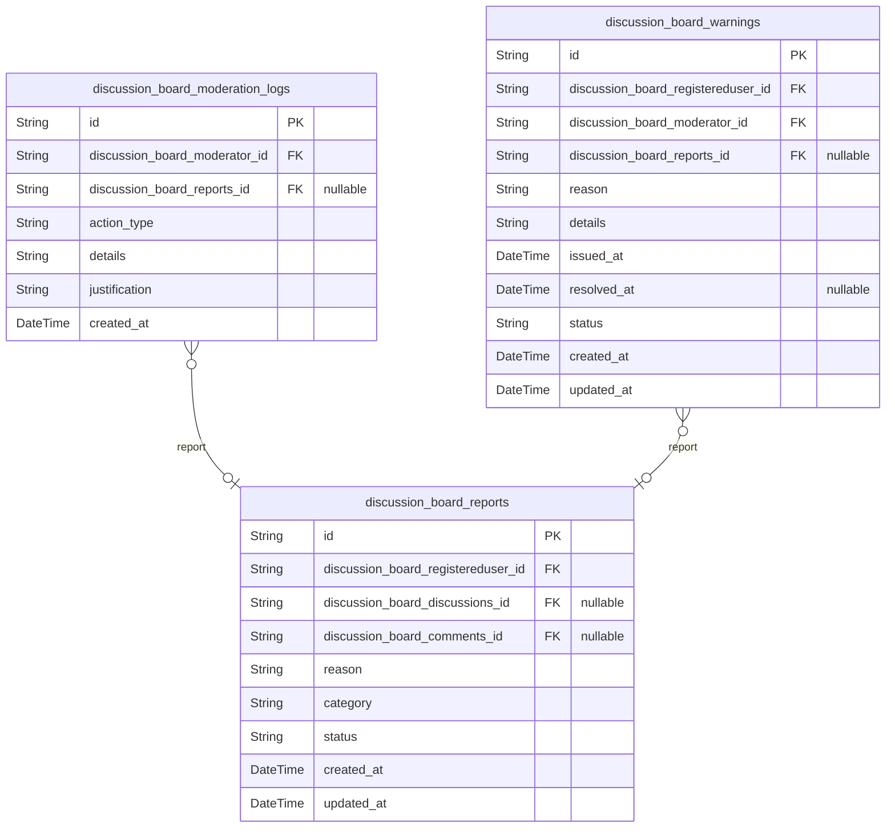

# Prisma Markdown

> Generated by [`prisma-markdown`](https://github.com/samchon/prisma-markdown)

- [Systematic](#systematic)
- [Actors](#actors)
- [Discussions](#discussions)
- [Comments](#comments)
- [Voting](#voting)
- [Moderation](#moderation)

## Systematic

### `discussion_board_categories`

Business purpose and context: Stores category information for organizing
discussions with proper metadata and lifecycle management. Supports
platform's organization of content by topics like economic policy,
foreign relations, and domestic issues as specified in requirements.

Properties as follows:

- `id`: Primary Key.
- `parent_id`: Category hierarchy parent. [discussion_board_categories.id](#discussion_board_categories).
- `created_by_id`: Creator user reference. [discussion_board_registereduser.id](#discussion_board_registereduser).
- `name`
  > Category name for organizing discussions (e.g., Fiscal Policy, Monetary
  > Policy, International Relations). Used for content categorization across
  > the platform.
- `description`
  > Category description providing context and guidelines for appropriate
  > discussion topics within this category.
- `slug`
  > URL-friendly identifier for the category used in routing and SEO.
  > Generated from the category name.
- `color`
  > Visual identification color code for the category in the UI (e.g.,
  > #FF5733) to help users distinguish categories.
- `is_active`
  > Category enabled status indicator. When false, new discussions cannot be
  > created in this category.
- `display_order`
  > Sorting priority for category display in UI. Lower numbers appear first
  > in category listings.
- `created_at`: Category creation timestamp for audit and display purposes.
- `updated_at`: Category modification timestamp for tracking changes.

## Actors

### `discussion_board_guestuser`

Represents unauthenticated visitors who can browse public content on the
discussion board. Guest users have view-only permissions and must
register to participate in discussions.

Properties as follows:

- `id`: Primary Key.
- `email`: User's verified email address used for authentication and notifications.
- `session_token`
  > Temporary session identifier for guest users to maintain state during
  > browsing.
- `created_at`: Timestamp of guest user creation or first session.
- `updated_at`: Timestamp of last guest user activity or update.
- `deleted_at`: Soft delete timestamp if guest session is marked for removal.
- `status`: Account status (active, suspended, disabled).

### `discussion_board_registereduser`

Authenticated users who can actively participate in discussions on the
economic/political discussion board. Registered users can create
discussions, post comments, vote on content, and report inappropriate
content.

Properties as follows:

- `id`: Primary Key.
- `discussion_board_guestuser_id`
  > References originating guest session. {@link
  > discussion_board_guestuser.id}.
- `email`: User's verified email address used for authentication and notifications.
- `password_hash`: BCrypt hash of user's password for secure authentication.
- `username`: User's display name for public identification in discussions.
- `bio`: User's self-description or professional affiliation.
- `created_at`: Timestamp of user registration.
- `updated_at`: Timestamp of last profile update.
- `deleted_at`: Soft delete timestamp for account deletion.
- `status`: Account status (active, suspended, banned, pending_verification).
- `email_verified`: Indicates whether user's email address has been verified.

### `discussion_board_moderator`

Trusted community members with responsibility for maintaining civil
discourse on the discussion board. Moderators can review reported
content, remove inappropriate content, issue warnings to users, and
temporarily suspend accounts.

Properties as follows:

- `id`: Primary Key.
- `email`: Moderator's email address for official communications.
- `password_hash`: BCrypt hash of moderator's password for secure authentication.
- `created_at`: Timestamp of moderator appointment.
- `updated_at`: Timestamp of last moderator privilege update.
- `deleted_at`: Soft delete timestamp if moderator privileges are removed.
- `status`: Moderator status (active, suspended, revoked).
- `specialization`
  > Moderator's area of expertise (economics, politics, foreign_policy,
  > domestic_policy).

### `discussion_board_administrator`

Platform managers with complete control over system operation.
Administrators can manage user accounts, configure platform settings,
assign moderator roles, access complete audit logs, and perform system
maintenance.

Properties as follows:

- `id`: Primary Key.
- `email`: Administrator's email address for official communications.
- `password_hash`: BCrypt hash of administrator's password for secure authentication.
- `created_at`: Timestamp of administrator appointment.
- `updated_at`: Timestamp of last administrator privilege update.
- `deleted_at`: Soft delete timestamp if administrator privileges are removed.
- `status`: Administrator status (active, suspended, revoked).
- `department`
  > Administrator's organizational department (operations, security,
  > compliance).

## Discussions

### `discussion_board_discussions`

Stores discussion posts created by users on economic and political
topics. This is the primary content entity on the platform, allowing
registered users to initiate structured discussions on various topics.
Discussions can be edited within 24 hours of posting and can be moved
through various lifecycle states (active, locked, archived) based on
community engagement and moderation decisions.

Properties as follows:

- `id`: Primary Key.
- `discussion_board_registereduser_id`: Author of the discussion. [discussion_board_registereduser.id](#discussion_board_registereduser).
- `discussion_board_categories_id`: Category for the discussion. [discussion_board_categories.id](#discussion_board_categories).
- `title`
  > Title of the discussion post. Must be between 10-150 characters to ensure
  > clarity and focus.
- `content`
  > Main content of the discussion post. Must be between 50-10,000 characters
  > to encourage substantive contributions while preventing abuse.
- `created_at`
  > Timestamp when the discussion was created. Used for displaying
  > chronological order and calculating recency in ranking algorithms.
- `updated_at`
  > Timestamp when the discussion was last updated. Updated when the
  > discussion is edited within the 24-hour window. Automatically set by
- `business_status`: Lifecycle status of the discussion (active, locked, archived, deleted).
- `discussion_type`
  > Type of discussion (policy_debate, ideological_comparison,
  > event_analysis) to support structured formats for civil discourse.

## Comments

### `discussion_board_comments`

Represents user comments on discussions within the economic/political
discussion board. This table stores individual comments that create
threaded conversations in response to discussion posts.

Properties as follows:

- `id`: Primary Key.
- `discussion_board_discussion_id`
  > Reference to the parent discussion. {@link
  > discussion_board_discussions.id}.
- `registered_user_id`
  > Reference to the registered user who authored the comment. {@link
  > discussion_board_registereduser.id}.
- `parent_comment_id`
  > Reference to the parent comment in the thread. {@link
  > discussion_board_comments.id}.
- `content`
  > The actual text content of the comment, limited to 2000 characters as
  > specified in requirements.
- `created_at`: Timestamp when the comment was initially created.
- `updated_at`: Timestamp when the comment was last updated.
- `deleted_at`: Timestamp when the comment was soft-deleted, if applicable.

## Voting

### `discussion_board_votes`

Vote record for discussions and comments, supporting the dual-axis voting
system with quality and agreement assessments.

Properties as follows:

- `id`: Primary Key.
- `discussion_board_discussions_id`: Target discussion. [discussion_board_discussions.id](#discussion_board_discussions).
- `discussion_board_comments_id`: Target comment. [discussion_board_comments.id](#discussion_board_comments).
- `discussion_board_registereduser_id`: User who cast the vote. [discussion_board_registereduser.id](#discussion_board_registereduser).
- `quality_vote`: Assessment of argument quality (Excellent, Good, Poor, Uncivil)
- `agreement_vote`
  > Personal agreement with position (Strongly Agree, Agree, Disagree,
  > Strongly Disagree)
- `created_at`: Timestamp of vote creation
- `updated_at`: Timestamp of last vote update

### `discussion_board_reputation`

User reputation score calculated based on community feedback and voting
patterns.

Properties as follows:

- `id`: Primary Key.
- `discussion_board_registereduser_id`
  > User whose reputation is being tracked. {@link
  > discussion_board_registereduser.id}.
- `score`: Current reputation score, ranging from 0.0 to 100.0
- `last_calculated`: Timestamp of when the reputation score was last calculated
- `created_at`: Timestamp of reputation record creation
- `updated_at`: Timestamp of last reputation update

## Moderation

### `discussion_board_reports`

User-submitted reports on inappropriate content. This primary entity
enables users to flag content that violates community guidelines,
ensuring accountability and maintaining civil discourse on the platform.
It supports independent reporting workflows and cross-discussion
monitoring.

Properties as follows:

- `id`: Primary Key.
- `discussion_board_registereduser_id`
  > Reporting user who flagged the content. {@link
  > discussion_board_registereduser.id}.
- `discussion_board_discussions_id`: Target discussion being reported. [discussion_board_discussions.id](#discussion_board_discussions).
- `discussion_board_comments_id`: Target comment being reported. [discussion_board_comments.id](#discussion_board_comments).
- `reason`: User-provided explanation for the report.
- `category`
  > Report classification (harassment, misinformation, spam, rule violation,
  > etc.).
- `status`: Current state of the report (pending, under_review, resolved, dismissed).
- `created_at`: Timestamp when the report was submitted.
- `updated_at`: Timestamp when the report was last updated.

### `discussion_board_moderation_logs`

Immutable audit trails of all moderator actions. This snapshot entity
captures point-in-time decisions made during content moderation,
preserving a complete history of interventions to maintain transparency
and accountability within the governance system.

Properties as follows:

- `id`: Primary Key.
- `discussion_board_moderator_id`: Moderator who took the action. [discussion_board_moderator.id](#discussion_board_moderator).
- `discussion_board_reports_id`
  > Original report that triggered this action. {@link
  > discussion_board_reports.id}.
- `action_type`
  > Type of moderation action taken (warning_issued, content_removed,
  > user_suspended, etc.).
- `details`: Specific information about the moderation action.
- `justification`: Reasoning and explanation for the moderator's decision.
- `created_at`: Timestamp when the moderation action was recorded.

### `discussion_board_warnings`

Formal warnings issued to users for guideline violations. This primary
entity enables the moderation system to track disciplinary actions,
provide educational feedback to users, and support escalation protocols
for repeated offenses.

Properties as follows:

- `id`: Primary Key.
- `discussion_board_registereduser_id`: User who received the warning. [discussion_board_registereduser.id](#discussion_board_registereduser).
- `discussion_board_moderator_id`: Moderator who issued the warning. [discussion_board_moderator.id](#discussion_board_moderator).
- `discussion_board_reports_id`
  > Original report that led to the warning. {@link
  > discussion_board_reports.id}.
- `reason`: Violation category that prompted the warning.
- `details`: Specific explanation of the guideline violation.
- `issued_at`: Timestamp when the warning was issued.
- `resolved_at`: Timestamp when the warning was resolved or expired.
- `status`: Current state of the warning (active, resolved, expired).
- `created_at`: Timestamp when the warning record was created.
- `updated_at`: Timestamp when the warning record was last updated.
