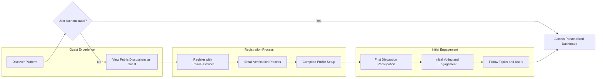
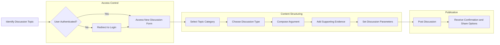
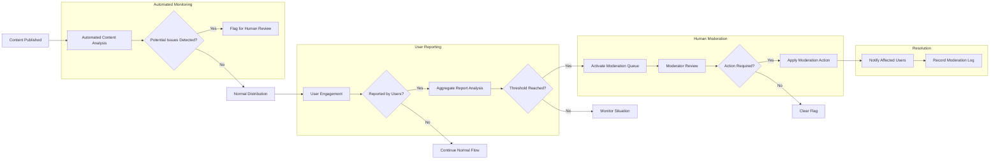
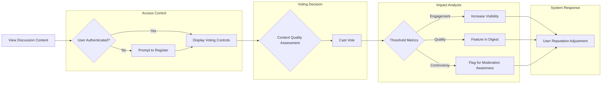

# Requirements Analysis Report: Economic/Political Discussion Board

## 1. Service Overview and Business Model

### Why This Service Exists
THE discussion board platform SHALL create a structured environment for constructive discourse on economic and political topics, addressing the current degradation of online discussion quality. WHEN users engage in political and economic discussions, THE system SHALL facilitate civil dialogue through structured formats, balanced representation, and community moderation. IF unmoderated discussions lead to polarized echo chambers, THEN THE system SHALL intervene through moderation tools and balanced algorithms to maintain constructive dialogue.

THE service fills a market gap for a platform that combines free expression with quality controls, enabling nuanced discussion of complex societal issues without devolving into toxic discourse. WHEN political events generate intense public interest, THE system SHALL provide a space for informed debate rather than emotional reactions. WHERE misinformation spreads rapidly on social media, THEN THE system SHALL implement fact-checking tools and source verification to promote evidence-based discussion.

### Target Users
THE platform SHALL serve multiple user segments with varying expertise and engagement levels:

- **Civically engaged citizens** seeking to deepen their understanding of policy issues
- **Students and academics** studying political science, economics, and public policy
- **Policy professionals and analysts** requiring a forum for professional discourse
- **Journalists and media professionals** researching public opinion on policy issues
- **Educators** using the platform as a teaching tool for political and economic concepts

### Revenue Strategy
THE platform SHALL implement a freemium business model with multiple revenue streams:

- **Basic features** SHALL be free for all registered users
- **Premium subscriptions** SHALL offer enhanced features (advanced analytics, ad-free experience, priority content visibility) for $4.99/month
- **Institutional subscriptions** SHALL be available for educational organizations ($99/month for classroom management tools and research datasets)
- **Non-intrusive advertising** SHALL be displayed to free users (15% of impressions, contextually relevant to civic engagement)
- **Partnerships** SHALL be established with think tanks and research organizations for sponsored content sections

### Growth Plan
THE user acquisition strategy SHALL proceed through three distinct phases:

1. **Seed phase** (Launch - Month 3): Partner with university political science departments and economics blogs to generate initial high-quality content
2. **Growth phase** (Months 4-9): Target users through coverage of major political events and policy debates to increase user base
3. **Maturity phase** (Month 10+): Expand into related policy areas while maintaining core focus on economic and political discourse

### Success Metrics
THE system SHALL track the following key performance indicators to measure platform success:

| Success Metric | Target | Measurement Frequency |
|----------------|--------|---------------------|
| Monthly Active Users | 5,000 | Monthly |
| User Retention (30-day) | 40% | Weekly |
| New Discussions per Day | 100 | Daily |
| Comments per Discussion | 8 | Daily |
| Moderation Response Time | < 24 hours | Daily |
| User Satisfaction Score | 4.0/5.0 | Monthly |
| Content Diversity Index | Minimum 60/40 split across ideological spectrum | Weekly |

## 2. User Role Structure and Authentication Flow

### Authentication Requirements

#### Core Authentication Functions
THE system SHALL provide secure authentication for all users with the following capabilities:

THE discussion board system SHALL require email/password authentication for user registration and login.

WHEN a guest user submits registration information, THE system SHALL validate the email format and password strength before creating an account.

THE system SHALL send a verification email to the provided address with a time-limited verification link.

WHEN a user clicks the verification link, THE system SHALL mark the account as verified and enable full platform access.

THE system SHALL allow users to reset forgotten passwords through a secure email-based recovery process.

THE system SHALL allow users to change their password after successful authentication.

THE system SHALL allow users to log out and terminate their current session.

#### User Role Definitions
THE system SHALL support four distinct user roles with progressively increasing capabilities:

**Guest User**: Unauthenticated visitor who can view public discussions.

**Registered User**: Verified member who can create discussions and participate in conversations.

**Moderator**: Trusted community member with content moderation responsibilities.

**Administrator**: Platform manager with full system control and oversight capabilities.

### JWT Token Requirements
THE authentication system SHALL implement JSON Web Tokens (JWT) with the following specifications:

THE system SHALL generate access tokens with 30-minute expiration for short-term session management.

THE system SHALL issue refresh tokens with 7-day expiration for maintaining user authentication across sessions.

THE JWT payload SHALL include user ID, role, permissions array, issued timestamp, and expiration timestamp.

THE system SHALL store tokens in secure HTTP-only cookies or localStorage with appropriate security measures.

THE system SHALL revoke tokens immediately when users log out or when security incidents are detected.

### Permission Matrix
| Functionality | Guest User | Registered User | Moderator | Administrator |
|---------------|----------|----------------|-----------|---------------|
| View public discussions | ✅ | ✅ | ✅ | ✅ |
| Register for account | ✅ | ❌ | ❌ | ❌ |
| Post new discussions | ❌ | ✅ | ✅ | ✅ |
| Comment on discussions | ❌ | ✅ | ✅ | ✅ |
| Vote on content | ❌ | ✅ | ✅ | ✅ |
| Report inappropriate content | ❌ | ✅ | ✅ | ✅ |
| Edit own content | ❌ | ✅ | ✅ | ✅ |
| Delete own content | ❌ | ✅ | ✅ | ✅ |
| Moderate reported content | ❌ | ❌ | ✅ | ✅ |
| Issue user warnings | ❌ | ❌ | ✅ | ✅ |
| Suspend user accounts | ❌ | ❌ | ❌ | ✅ |
| Access system analytics | ❌ | ❌ | ✅ | ✅ |
| Configure platform settings | ❌ | ❌ | ❌ | ✅ |
| Manage user roles | ❌ | ❌ | ❌ | ✅ |

## 3. Key User Journey Scenarios

### New User Journey
THE new user journey SHALL guide visitors from discovery through registration to first meaningful engagement.

#### Scenario Details

**Discovery Phase**

WHEN a potential user discovers the platform through search or referral, THE system SHALL display public discussions with highlighted diverse perspectives.

THE system SHALL prominently display the value proposition: "Engage in civil economic and political discourse with informed citizens."

THE system SHALL showcase featured discussions that exemplify constructive dialogue and evidence-based argumentation.

**Registration Process**

WHEN a guest user clicks the registration button, THE system SHALL present a streamlined registration form with only email and password fields.

THE system SHALL validate email format according to RFC 5322 standards and password strength according to platform policies.

THE system SHALL send an email verification link to the provided address within 1 minute of registration.

WHEN a user clicks the verification link, THE system SHALL automatically log them in and redirect to profile setup.

**Profile Setup**

THE system SHALL request minimal profile information: preferred name, primary areas of interest, and political perspective spectrum.

THE system SHALL emphasize that political perspective is used only for content personalization and moderation balance, with all user identities otherwise private.

THE system SHALL provide tooltips explaining how profile information enhances the user experience without compromising privacy.

**First Engagement**

After profile setup, THE system SHALL guide new users to three curated discussions matching their interests.

THE system SHALL provide a tutorial overlay highlighting key interaction elements: posting, commenting, voting, and reporting.

THE system SHALL limit the first post to 300 words to encourage concise argumentation.

THE system SHALL offer suggested discussion prompts to help new users overcome initial participation barriers.

### Content Creation Flow
THE content creation flow SHALL enable users to initiate discussions with structured formats that promote civil discourse.

#### Discussion Types
THE system SHALL support three structured discussion formats:

**Policy Debate**: Focused on specific legislative proposals or economic policies with analysis of potential impacts.

**Ideological Comparison**: Examination of different political philosophies or economic theories with historical context.

**Event Analysis**: Discussion of current political events with immediate reactions and longer-term implications.

WHEN a registered user initiates a new discussion, THE system SHALL require selection of one discussion type.

THE system SHALL display appropriate argumentation guidelines based on the selected discussion type.

#### Content Guidelines
THE system SHALL enforce structured content requirements:

THE system SHALL limit discussion titles to 150 characters maximum to ensure clarity and focus.

THE system SHALL require discussion content to be between 200 and 1,500 words to encourage substantive contributions.

THE system SHALL require economic claims to reference relevant indicators (GDP, unemployment, inflation, etc.) when applicable.

THE system SHALL require political claims to reference constitutional principles or relevant precedent.

THE system SHALL prohibit ad hominem attacks and personal insults in all content.

WHEN a user submits a post containing ad hominem language, THE system SHALL flag it for review and notify the user of community guidelines.

THE system SHALL provide real-time feedback on post structure, highlighting missing elements like supporting evidence.

#### Publication Process
WHEN a user submits a discussion post, THE system SHALL perform initial content analysis for policy terminology and argument structure.

THE system SHALL assign relevant tags based on content analysis for discovery and moderation purposes.

THE system SHALL publish the discussion immediately to the relevant category with instant notification to followers.

THE system SHALL record the submission timestamp and author information for content attribution.

### Moderation Process
THE moderation process SHALL ensure civil discourse through automated detection and human oversight.

#### Automated Content Analysis
THE system SHALL analyze all content upon submission for:

- Logical fallacies (ad hominem, straw man, false dilemma, etc.)
- Emotional language intensity
- Factual claims requiring verification
- Political bias indicators
- Economic terminology accuracy

WHEN automated analysis detects potential issues above threshold levels, THE system SHALL flag the content for human moderator review.

THE system SHALL maintain a confidence score for automated flags to help moderators prioritize reviews.

#### User Reporting System
WHEN a user encounters inappropriate content, THE system SHALL provide a reporting interface with specific categories:

- **Personal attacks or harassment**: Content containing ad hominem arguments or abusive language
- **Misinformation or unverified claims**: Content making assertions without evidence or with demonstrably false claims
- **Off-topic content**: Content not relevant to the discussion thread or platform purpose
- **Spam or self-promotion**: Unsolicited commercial content or repetitive posting
- **Other**: Custom reason with text explanation

THE system SHALL aggregate reports and trigger moderator review when three independent users report the same content within 24 hours.

THE system SHALL incorporate reporter reputation into report prioritization to prevent abuse of reporting system.

#### Moderator Review Process
WHEN content enters the moderation queue, THE system SHALL present moderators with:

- The flagged content in context
- Reporting reasons and user information
- Automated analysis results and confidence scores
- Post history of the author
- Relevant community guidelines
- Previous moderation decisions on similar content

THE moderator SHALL have the following action options:

- **Approve**: Clear the flag and allow content to stand without changes
- **Warn**: Send educational notification to the user about guidelines
- **Edit request**: Request specific revisions to problematic elements
- **Hide**: Remove content from public view while preserving for appeal
- **Remove**: Delete content with permanent record and notification

THE system SHALL require justification for all moderator actions to ensure accountability and consistency.

THE system SHALL provide appeal options to users when content is removed or hidden.

#### Escalation Protocol
THE system SHALL implement hierarchical escalation for moderation decisions:

- First-time violations: Educational warning with policy clarification
- Repeat violations: Progressive posting restrictions (24 hours, 7 days, 30 days)
- Severe violations: Immediate suspension with administrator review
- Policy disputes: Escalation to administrator for final decision within 72 hours

### Voting Experience
THE voting system SHALL enable community-driven content evaluation while minimizing polarization effects.

#### Voting Mechanics
THE system SHALL implement a dual-axis voting system:

- **Agreement Scale**: From Strongly Disagree to Strongly Agree, capturing ideological alignment
- **Quality Assessment**: Binary upvote/downvote on argument quality regardless of agreement

WHEN a user votes on content, THE system SHALL record both agreement stance and quality assessment separately.

THE system SHALL prevent users from changing their vote after submission to ensure stability of engagement metrics.

THE system SHALL display only aggregate voting results to prevent bandwagon effects and social pressure.

#### Visibility and Ranking
THE system SHALL rank content based on a composite score considering:

- Number of quality upvotes (weighted more heavily than agreement votes)
- Diversity of agreement (content receiving votes from across the political spectrum ranks higher)
- Engagement depth (length and quality of responses)
- Author reputation and contribution history
- Timeliness of the discussion topic

THE system SHALL promote content with balanced agreement across ideological lines, even with moderate overall engagement.

THE system SHALL include featured sections for "Bridge Building" content that demonstrates finding common ground.

#### Reputation System
THE system SHALL calculate user reputation based on multiple factors:

- Quality votes received on their content
- Number of civil discussions initiated
- Community moderation ratings
- Educational contributions (verified factual claims, useful citations)
- Responsiveness to constructive criticism

WHERE user reputation exceeds community thresholds, THE system SHALL grant additional privileges:

- Ability to moderate low-severity reports
- Influence in content ranking algorithms
- Early access to new features
- Recognition as trusted contributor
- Reduced friction in content submission process

## 4. Functional Requirements in EARS Format

### Core Platform Functions
THE discussion board system SHALL enable users to engage in structured discussions on economic and political topics.

THE system SHALL organize content by topic categories including economics, domestic policy, foreign affairs, and governance.

WHEN a user accesses the platform, THE system SHALL present a personalized content feed based on their interests and engagement history.

THE system SHALL ensure all user interactions support civil discourse and informed debate.

THE system SHALL implement search functionality that allows users to find discussions by keywords, author, date, and topic category.

WHEN a discussion reaches high levels of engagement, THE system SHALL automatically highlight it in relevant category feeds.

IF a discussion violates community guidelines, THEN THE system SHALL remove it after moderator review and notify the author.

### User Management
WHEN a new user registers with a valid email and password, THE system SHALL create a guest account with view-only permissions.

WHEN a user verifies their email address, THE system SHALL upgrade their account to registered user status with full participation rights.

THE system SHALL allow users to update their profile information at any time.

IF a user attempts to register with an email that already exists, THEN THE system SHALL notify them and offer password recovery option.

THE system SHALL prevent users from creating multiple accounts through IP tracking and device fingerprinting.

THE system SHALL allow users to delete their account and request removal of their personal data.

WHEN a user deletes their account, THE system SHALL anonymize their contributions while preserving discussion integrity.

### Discussion Management
WHEN a registered user creates a new discussion, THE system SHALL require selection of topic category and discussion type.

THE system SHALL limit discussion titles to 150 characters to ensure clarity and focus.

THE system SHALL require discussion content to be between 200 and 1,500 words to encourage substantive contributions.

THE system SHALL allow users to edit their own discussions within 24 hours of posting.

THE system SHALL prevent users from editing discussions after 24 hours to maintain conversation integrity.

THE system SHALL allow administrators to close discussions that have served their purpose or become unproductive.

IF a discussion receives reports from three different users within 24 hours, THEN THE system SHALL flag it for moderator review.

WHERE a discussion covers sensitive political topics, THE system SHALL automatically suggest relevant policy documents and historical context.

### Comment System
WHEN a user comments on a discussion, THE system SHALL limit comments to 500 words maximum.

THE system SHALL allow threaded replies up to three levels deep to maintain conversation clarity.

THE system SHALL require users to read the full discussion thread before posting a comment to reduce repetitive arguments.

THE system SHALL highlight comments that introduce new evidence or perspectives not previously discussed.

IF a comment is identified as potentially inflammatory by automated analysis, THEN THE system SHALL prompt the user to revise before posting.

WHERE a user has a history of civil contributions, THE system SHALL reduce friction in their commenting process.

THE system SHALL allow users to collapse comment threads to improve readability of long discussions.

### Voting Mechanism
THE system SHALL allow registered users to vote on discussions and comments.

WHEN a user votes, THE system SHALL require separate assessment of content quality and personal agreement.

THE system SHALL display aggregate voting results while preserving individual vote privacy.

THE system SHALL update content ranking algorithms in real-time based on incoming votes.

IF a user attempts to vote multiple times on the same content, THEN THE system SHALL prevent duplicate voting and notify them of the restriction.

WHERE content receives high quality votes from users across the political spectrum, THE system SHALL feature it in the "Bridge Building" section.

THE system SHALL prevent users from voting on their own content to avoid self-promotion.

### Content Moderation
THE system SHALL provide reporting functionality for inappropriate content.

WHEN a moderator takes action on reported content, THE system SHALL notify the affected user with explanation and appeal process.

THE system SHALL maintain a transparent moderation log accessible to administrators.

THE system SHALL provide educational resources to users who receive warnings about policy violations.

IF automated systems detect coordinated inauthentic behavior, THEN THE system SHALL quarantine affected accounts and notify administrators.

WHERE a discussion repeatedly violates community guidelines, THE system SHALL restrict its visibility and notify participants.

THE system SHALL implement rate limiting on moderation actions to prevent abuse of power.

### User Profiles
THE system SHALL display user contribution metrics including number of discussions, comments, and quality ratings.

WHEN a user views another user's profile, THE system SHALL display their participation history and reputation score.

THE system SHALL allow users to maintain privacy by not revealing real identity.

THE system SHALL distinguish between verified experts (economists, political scientists) and general users in profile displays.

IF a user's reputation falls below community standards due to repeated violations, THEN THE system SHALL limit their posting frequency.

WHERE a user has contributed substantively to policy debates, THE system SHALL highlight this in their profile summary.

THE system SHALL allow users to customize their profile visibility settings.

## 5. Business Rules and Constraints

### Community Guidelines
THE discussion board SHALL enforce the following community principles:

- Focus on ideas, not individuals
- Support claims with evidence
- Acknowledge uncertainty and complexity
- Engage in good faith
- Respect differing perspectives
- Be open to changing opinions based on new evidence
- Avoid hyperbolic language and exaggerated claims

THE system SHALL terminate accounts that repeatedly violate these principles after warnings and temporary restrictions.

THE system SHALL provide educational resources to help users improve their argumentation skills.

### Content Rules
All content SHALL adhere to the following requirements:

- Economic arguments SHALL reference relevant data and avoid oversimplification
- Political arguments SHALL respect constitutional principles and legal frameworks
- Policy proposals SHALL consider implementation feasibility and unintended consequences
- Historical references SHALL be accurate and contextually appropriate
- Statistical claims SHALL be verifiable through reputable sources
- Predictive claims SHALL include uncertainty ranges and confidence levels

THE system SHALL provide factual accuracy warnings when users make claims contradicted by established data sources.

THE system SHALL encourage users to distinguish between normative statements (what should be) and positive statements (what is).

### Moderation Policies
Moderators SHALL follow these principles:

- Protect free expression while preventing harm
- Focus on content, not ideology
- Ensure balanced representation of perspectives
- Prioritize educational responses over punitive actions
- Document all moderation decisions
- Recuse themselves from moderating content where they have conflicts of interest
- Seek consensus with other moderators on controversial decisions

THE moderation team SHALL include representatives from diverse political perspectives to ensure fairness.

THE system SHALL require moderators to complete training on bias recognition and conflict resolution.

### Voting Constraints
THE voting system SHALL implement these safeguards:

- No voting on own content
- Vote weighting based on user reputation
- Time decay on vote influence after 7 days
- Protection against coordinated voting campaigns
- Prevention of vote brigading from external communities
- Rate limiting on voting frequency to prevent automation

THE system SHALL analyze voting patterns daily to detect manipulation attempts.

## 6. Improvement Opportunities

### Short-term Enhancements (0-3 months)

1. **Onboarding Optimization**: Implement A/B testing on registration flow to increase conversion
2. **Mobile Experience**: Develop responsive design for mobile participation in discussions
3. **Notification System**: Create personalized alerts for replies and mentions
4. **Advanced Search**: Implement robust search with filters for topic, date, ideological spectrum, and content quality
5. **User Mentoring**: Connect new users with experienced contributors for guidance

### Medium-term Enhancements (3-6 months)

1. **Expert Verification**: Create system for verifying credentials of economists and political scientists
2. **Fact-Checking Integration**: Partner with non-partisan fact-checking organizations for real-time verification
3. **Discussion Templates**: Develop specialized templates for different policy analysis methods
4. **Educational Content**: Integrate primers on economic theories and political systems
5. **Content Summarization**: Implement AI-assisted summaries of complex discussions

### Long-term Enhancements (6-12 months)

1. **AI-Assisted Moderation**: Implement machine learning to predict content quality and potential conflicts
2. **Deliberative Polling**: Create structured formats for community consensus building
3. **Policy Impact Tracking**: Follow real-world outcomes of discussed policies
4. **Cross-platform Debates**: Enable structured discussions with participants from competing platforms
5. **Regional Forums**: Create localized discussions for country-specific political and economic issues

### Key Pain Points to Address

1. **Barrier to Entry**: New users may feel intimidated by expert participants
   - Solution: Create "new participant" forums with mentoring system and simplified guidelines

2. **Time Commitment**: High-quality policy discussion requires significant time
   - Solution: Implement discussion summaries and highlight reels with key arguments

3. **Emotional Responses**: Political topics can trigger strong emotions
   - Solution: Develop emotion-aware interface that suggests breaks and provides calming resources

4. **Information Overload**: Complex economic discussions may overwhelm users
   - Solution: Create layered information displays with executive summaries and detailed analysis

5. **Polarization**: Users may form echo chambers around specific ideologies
   - Solution: Implement algorithmic promotion of diverse perspectives and cross-ideological engagement

## 7. Success Criteria

THE platform SHALL be considered successful when it achieves these measurable outcomes:

- 70% of users report learning something new about opposing viewpoints
- 60% of heated discussions are successfully de-escalated through community norms
- Average discussion includes references to at least two data sources
- User base represents balanced distribution across political spectrum
- Fewer than 5% of discussions require moderator intervention
- Average user session duration exceeds 8 minutes
- 40% of users return to the platform at least once per week

> *Developer Note: This document defines **business requirements only**. All technical implementations (architecture, APIs, database design, etc.) are at the discretion of the development team.*