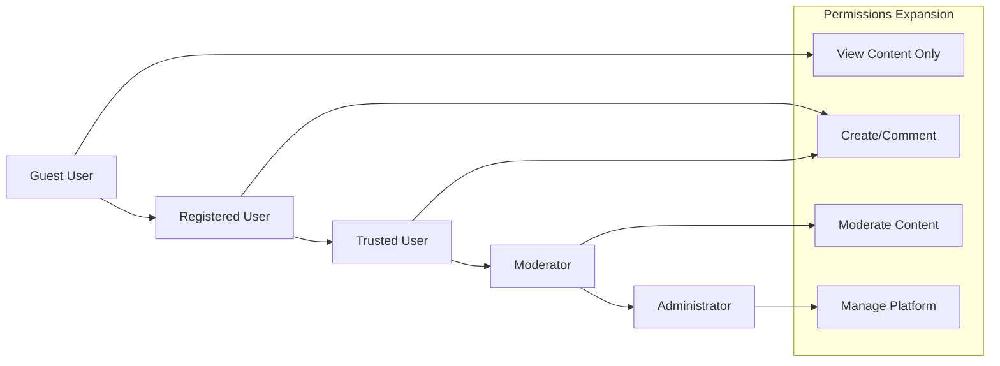
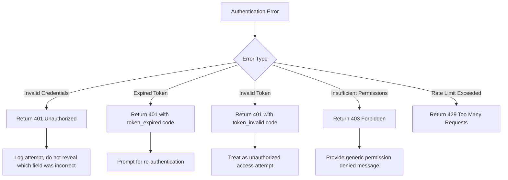

# Economic/Political Discussion Board - Requirements Analysis

## Service Vision

The Economic/Political Discussion Board is a digital platform designed to facilitate meaningful, structured conversations about economic and political topics. The service aims to create a space where users can engage in civil discourse, share diverse perspectives, and deepen their understanding of complex societal issues.

THE system SHALL provide a forum environment where users can create discussions on economic and political topics, participate in ongoing conversations through comments, and engage with content through voting mechanisms. THE system SHALL foster an environment of respectful dialogue by implementing moderation tools and clear community guidelines.

WHEN a user accesses the discussion board, THE system SHALL present trending topics, recent discussions, and category-based navigation to help users find relevant content. THE system SHALL allow users to follow specific topics or discussion threads to receive updates on new contributions.

## Problem Statement

Current online spaces for political and economic discourse often suffer from several critical issues that this platform aims to address:

IF unmoderated discussions lead to toxic environments, THEN THE system SHALL implement tiered user roles and moderation capabilities to maintain civil discourse. IF important discussions become buried in content overload, THEN THE system SHALL implement voting mechanisms and intelligent sorting to highlight valuable contributions.

WHILE misinformation spreads easily in online forums, THE system SHALL encourage evidence-based discussions by providing citation tools and content verification features. WHEN users encounter conflicting viewpoints, THE system SHALL structure conversations to promote understanding rather than confrontation.

The market gap exists for a platform that combines the free exchange of ideas with structured formats that prevent discussion degradation. Existing platforms either over-restrict speech or under-moderate discussions, leading to echo chambers or toxic environments. This service fills that gap by providing balanced tools for free expression and constructive dialogue.

## Target Users

The discussion board serves multiple user segments with varying levels of engagement and responsibility:

### Guest Users

THE system SHALL allow unauthenticated users to browse public discussions, read comments, and view user profiles. WHEN a guest attempts to contribute content, THE system SHALL prompt them to register or log in. THE system SHALL limit guest users from creating discussions, posting comments, or voting on content to maintain accountability.

### Registered Users

THE system SHALL allow authenticated users to create discussion topics, post comments, vote on content, and follow specific discussions. WHEN a user registers successfully, THE system SHALL create a user profile with basic information and track their contribution history. WHILE a user is contributing content, THE system SHALL verify their authentication status and associate their contributions with their account.

### Moderators

THE system SHALL provide trusted community members with moderation capabilities to maintain discussion quality. WHEN a user reports inappropriate content, THE system SHALL notify relevant moderators based on topic categories. IF harmful content is identified, THEN THE system SHALL allow moderators to take actions such as editing, hiding, or deleting content while preserving discussion integrity.

### Administrators

THE system SHALL provide platform administrators with comprehensive management tools. WHEN a moderator requires additional support, THE system SHALL allow administrators to intervene in complex moderation situations. THE system SHALL enable administrators to manage user accounts, configure system settings, and maintain overall platform operation.

## Business Model

### Why This Service Exists

The Economic/Political Discussion Board addresses a critical need in the digital public square. As political and economic discourse increasingly moves online, there is a growing demand for platforms that facilitate constructive dialogue rather than amplifying division and misinformation. The service exists to create a space where nuanced discussion of important societal issues can thrive, counteracting the trend of online discourse degradation seen on many social platforms.

Modern democracies depend on informed citizenry, yet existing platforms often fail to support deep understanding of complex economic and political issues. This service fills that gap by providing structured discussion formats that encourage thoughtful contributions, evidence-based arguments, and genuine exchange of ideas across ideological lines.

Competition analysis reveals three main categories:
- General social media platforms (e.g., Twitter, Facebook) that prioritize engagement over discourse quality
- Niche political forums that tend toward ideological silos and lack moderation
- Academic discussion platforms that are often inaccessible to the general public

Our differentiation lies in balancing accessibility with quality controls, providing intuitive interface design with sophisticated discussion management tools, and fostering cross-ideological dialogue through thoughtful platform architecture.

### Revenue Strategy

WHILE the core discussion functionality SHALL remain free to access, THE system SHALL implement a freemium model with premium features for power users and organizations. WHERE user engagement reaches significant scale, THE system SHALL generate revenue through:

- Premium subscriptions offering advanced features like personalized analytics, deeper topic tracking, and ad-free experience
- Sponsored research partnerships with academic institutions studying public discourse
- Targeted, non-intrusive advertising from organizations aligned with civic engagement
- Grants and donations from foundations supporting democratic discourse

THE system SHALL prioritize user experience and discourse quality over immediate monetization, focusing first on building a vibrant community before scaling revenue initiatives.

### Growth Plan

THE system SHALL pursue user acquisition through:

- Organic growth via user referrals and content sharing
- Partnerships with educational institutions and civic organizations
- Strategic content marketing focusing on the value of civil discourse
- Integration with existing academic and policy research networks

WHERE early adopters demonstrate high engagement, THE system SHALL expand category offerings and introduce specialized discussion formats. WHILE building community trust, THE system SHALL gradually introduce additional user roles and privileges based on contribution quality and length of participation.

### Success Metrics

THE system SHALL measure success through multiple key performance indicators:

| Metric | Target | Measurement Frequency |
|--------|--------|---------------------|
| Daily Active Users | 5,000 within 12 months | Daily |
| Average Session Duration | 12 minutes | Daily |
| Discussions Created per Day | 200 | Daily |
| Comments per Discussion | 8 | Daily |
| User Retention (30-day) | 45% | Weekly |
| Report Resolution Time | < 4 hours | Daily |
| User Satisfaction Score | 4.2/5.0 | Monthly |

THE system SHALL track these metrics to evaluate platform health and identify areas for improvement. WHEN metrics indicate specific challenges, THE system SHALL trigger review processes to consider feature adjustments or policy changes.

## User Role Hierarchy

The following Mermaid diagram illustrates the user role hierarchy and progression pathway:



## Authentication Requirements

### Core Authentication Functions
THE system SHALL implement these authentication capabilities for all user roles:
- Users can register with email and password
- Users can log in to access their account
- Users can log out to end their session
- System maintains user sessions securely
- Users can verify their email address
- Users can reset forgotten passwords
- Users can change their password
- Users can revoke access from all devices
- System detects and handles concurrent sessions
- Authentication attempts are rate-limited to prevent abuse

### JWT Token Structure
THE system SHALL use JWT (JSON Web Tokens) for session management with the following payload structure:

```json
{
  "userId": "string (UUID format)",
  "role": "string (enum: guestUser, registeredUser, moderator, administrator)",
  "permissions": "array of strings representing specific permissions",
  "iat": "number (issued at timestamp)",
  "exp": "number (expiration timestamp)",
  "emailVerified": "boolean"
}
```

Token expiration requirements:
- Access token: 15 minutes
- Refresh token: 7 days
- Refresh token rotation on each use
- Refresh token invalidation after logout
- Blacklist mechanism for compromised tokens

### Role-Based Access Control
THE system SHALL implement role-based access control with the following principles:
- All API endpoints require authentication token verification
- Requested actions are validated against user's role permissions
- Users cannot escalate their own privileges
- Permission checks occur at the service layer, not just API gateway
- Failed permission attempts are logged for security audit
- Temporary permission elevation requires explicit approval
- Permission changes take effect immediately across all services

### Security Requirements
THE system SHALL meet these security standards for user authentication:
- Passwords stored with bcrypt or equivalent strong hashing
- HTTPS enforcement across all authentication endpoints
- Protection against common OAuth threats (CSRF, token leakage)
- Regular security audits of authentication systems
- Monitoring for suspicious login patterns
- Immediate notification of successful logins from new devices
- Account lockout after 5 failed login attempts
- Support for secure password recovery workflows

### Error Handling
THE system SHALL handle authentication errors appropriately:



> *Developer Note: This document defines **business requirements only**. All technical implementations (architecture, APIs, database design, etc.) are at the discretion of the development team.*