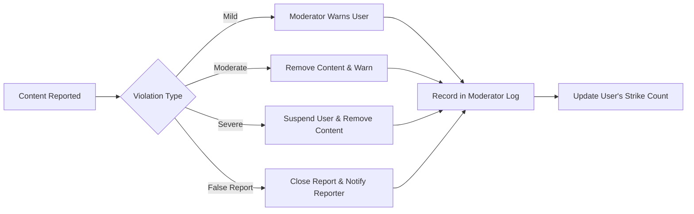
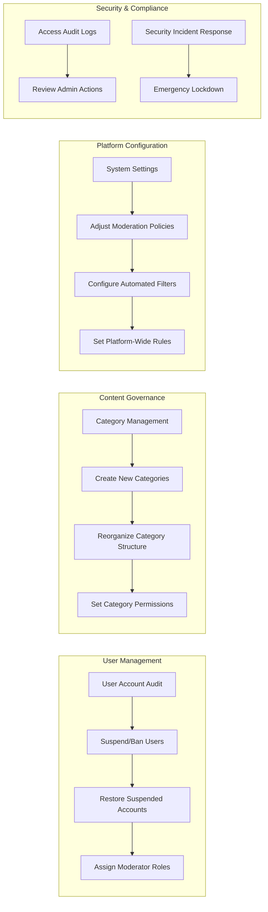
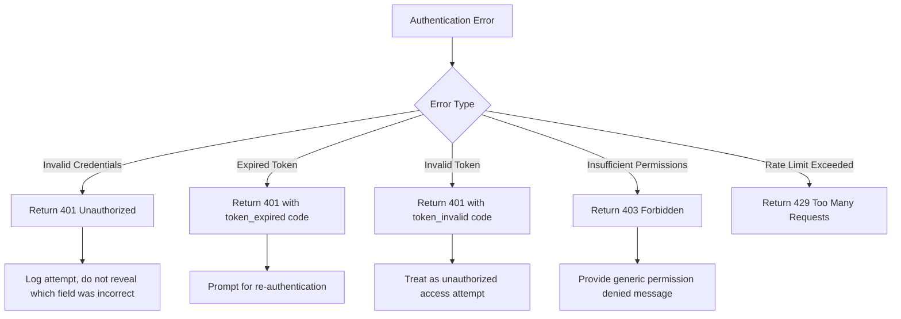

# User Roles and Permissions Specification

This document defines the user roles and their permissions for the economic/political discussion board platform. It provides backend developers with clear requirements for implementing authentication, authorization, and role-based access control systems.

## Guest User

Guest users are unauthenticated visitors who can browse public content and register for an account.

### Authentication Status
- No authentication required
- Access to public content only
- Must authenticate to participate in discussions

### Permissions and Capabilities
WHEN a guest user accesses the platform, THE system SHALL allow the user to:
- View public discussion topics
- Read existing discussion threads and comments
- Search through public content
- View user profiles (limited information)
- Access registration and login pages

WHEN a guest user attempts to create content, THE system SHALL:
- Restrict access to posting functionality
- Redirect to login page or show login prompt
- Preserve intended action to resume after authentication

### Restrictions
IF a guest user attempts to perform authenticated actions, THEN THE system SHALL deny access and prompt for authentication:
- ❌ Cannot create discussions
- ❌ Cannot post comments
- ❌ Cannot vote on content
- ❌ Cannot report content
- ❌ Cannot edit any content
- ❌ Cannot access personalized features

## Registered User

Registered users are authenticated members who can actively participate in discussions.

### Authentication Requirements
- Must complete registration with valid email
- Email verification required before full access
- Secure password storage with encryption
- Session management after successful login

### Permissions and Capabilities
WHEN a registered user is authenticated, THE system SHALL allow the user to:
- Create new discussion topics in appropriate categories
- Post comments in existing threads
- Edit their own content within 24 hours of posting
- Delete their own content
- Vote on discussions and comments (upvote/downvote)
- Report inappropriate content to moderators
- Follow specific topics or users
- Receive notifications for replies to their content
- Update their user profile information
- Change their account password
- Log out of their current session

### Content Management Rules
THE system SHALL enforce these rules for registered user content:
- All created discussions and comments must be associated with the user's verified identity
- Users can edit their content but a "edited" indicator must be displayed
- Deletion of content with significant interaction (5+ comments or 10+ votes) requires confirmation
- Users cannot delete content that is part of an active moderator review
- Users must provide a reason when reporting content

### Restrictions
WHILE in registered user role, THE system SHALL prevent:
- ❌ Access to administrative functions
- ❌ Moderation of other users' content
- ❌ Bypassing content guidelines
- ❌ Creating duplicate content in short succession
- ❌ Excessive posting that may constitute spam
- ❌ Accessing other users' private information

## Moderator

Moderators are trusted users with responsibility for maintaining civil discourse and enforcing community guidelines.

### Authentication Requirements
- Elevated authentication security measures
- Two-factor authentication recommended
- Special moderator authentication flag in user record
- Session tracking for moderator activities

### Permissions and Capabilities
WHEN a moderator accesses the platform, THE system SHALL provide additional capabilities beyond registered users:
- Review and take action on user-reported content
- Edit or remove inappropriate content from any user
- Issue warnings to users who violate guidelines
- Temporarily suspend users for severe violations
- Pin important discussions to the top of categories
- Close discussions that have become unproductive or violate rules
- Access moderator dashboard with reporting analytics
- View user posting history for context during moderation
- Override certain automated restrictions when justified

### Moderation Process
THE moderation system SHALL follow this workflow:



### Decision Guidelines
THE system SHALL support moderator decisions with these guidelines:
- First violations typically receive warnings rather than removals
- Pattern of violations leads to more severe consequences
- Political bias should not influence moderation decisions
- Freedom of speech balanced with need for civil discourse
- Context of discussion considered before taking action
- Repeated minor violations accumulate toward suspension

### Restrictions
WHILE acting as moderator, THE system SHALL prevent:
- ❌ Editing or removing content without proper justification
- ❌ Targeting specific users or viewpoints maliciously
- ❌ Using moderator powers for personal gain
- ❌ Disclosing confidential moderation processes
- ❌ Excessive use of suspension powers without review
- ❌ Modifying their own strike record or warning history
- ❌ Accessing administrative configuration settings

## Administrator

Administrators have complete control over the platform's operation and management.

### Authentication Requirements
- Highest level of authentication security
- Mandatory two-factor authentication
- IP address monitoring for admin access
- Session recording for all administrative actions
- Emergency access recovery procedures

### Permissions and Capabilities
WHEN an administrator accesses the platform, THE system SHALL provide comprehensive management capabilities:
- Create, modify, and delete discussion categories
- Configure platform-wide settings and policies
- Manage user accounts (suspend, ban, restore)
- Assign and remove moderator roles
- Access complete system analytics and reports
- Perform bulk content management operations
- Configure automated content filters
- Manage platform integrations and APIs
- Access complete audit logs of all user and moderator actions
- Initiate platform maintenance or updates
- Manage backup and recovery processes
- Override any system restrictions when necessary

### System Management Functions
THE system administration interface SHALL support these critical functions:



### Emergency Protocols
THE system SHALL provide these emergency capabilities to administrators:
- Instant platform lockdown during security incidents
- Emergency moderator appointment
- Temporary disabling of specific features
- Mass suspension of compromised accounts
- Immediate content purge for illegal material
- Read-only mode for the entire platform
- Data export for legal compliance
- System rollback to previous stable state

### Restrictions
THE system SHALL implement these safeguards for administrator actions:
- ❌ No anonymous administrator activity - all actions are logged with admin ID
- ❌ Administrator powers cannot be used to grant themselves additional privileges
- ❌ No deletion of audit logs or system activity records
- ❌ Sensitive operations require dual administrator approval
- ❌ Access to certain functions restricted to specific IP ranges
- ❌ Emergency powers automatically expire after 24 hours
- ❌ Cannot modify the administrator role definition itself

## Permission Matrix

| Action | Guest User | Registered User | Moderator | Administrator |
|--------|------------|-----------------|----------|---------------|
| View public discussions | ✅ | ✅ | ✅ | ✅ |
| Create discussion topic | ❌ | ✅ | ✅ | ✅ |
| Post comments | ❌ | ✅ | ✅ | ✅ |
| Edit own content | ❌ | ✅ | ✅ | ✅ |
| Delete own content | ❌ | ✅ | ✅ | ✅ |
| Vote on content | ❌ | ✅ | ✅ | ✅ |
| Report content | ❌ | ✅ | ✅ | ✅ |
| Search content | ✅ | ✅ | ✅ | ✅ |
| View user profiles | ❌ | ✅ | ✅ | ✅ |
| Edit profile information | ❌ | ✅ | ✅ | ✅ |
| Review reported content | ❌ | ❌ | ✅ | ✅ |
| Remove inappropriate content | ❌ | ❌ | ✅ | ✅ |
| Issue user warnings | ❌ | ❌ | ✅ | ✅ |
| Suspend users temporarily | ❌ | ❌ | ✅ | ✅ |
| Permanently ban users | ❌ | ❌ | ❌ | ✅ |
| Create discussion categories | ❌ | ❌ | ❌ | ✅ |
| Configure platform settings | ❌ | ❌ | ❌ | ✅ |
| Assign moderator roles | ❌ | ❌ | ❌ | ✅ |
| Access complete audit logs | ❌ | ❌ | ❌ | ✅ |
| Perform system maintenance | ❌ | ❌ | ❌ | ✅ |
| Access emergency protocols | ❌ | ❌ | ❌ | ✅ |

## Authentication Requirements

### Core Authentication Functions
THE system SHALL implement these authentication capabilities for all user roles:
- Users can register with email and password
- Users can log in to access their account
- Users can log out to end their session
- System maintains user sessions securely
- Users can verify their email address
- Users can reset forgotten passwords
- Users can change their password
- Users can revoke access from all devices
- System detects and handles concurrent sessions
- Authentication attempts are rate-limited to prevent abuse

### JWT Token Structure
THE system SHALL use JWT (JSON Web Tokens) for session management with the following payload structure:

```json
{
  "userId": "string (UUID format)",
  "role": "string (enum: guestUser, registeredUser, moderator, administrator)",
  "permissions": "array of strings representing specific permissions",
  "iat": "number (issued at timestamp)",
  "exp": "number (expiration timestamp)",
  "emailVerified": "boolean"
}
```

Token expiration requirements:
- Access token: 15 minutes
- Refresh token: 7 days
- Refresh token rotation on each use
- Refresh token invalidation after logout
- Blacklist mechanism for compromised tokens

### Role-Based Access Control
THE system SHALL implement role-based access control with the following principles:
- All API endpoints require authentication token verification
- Requested actions are validated against user's role permissions
- Users cannot escalate their own privileges
- Permission checks occur at the service layer, not just API gateway
- Failed permission attempts are logged for security audit
- Temporary permission elevation requires explicit approval
- Permission changes take effect immediately across all services

### Security Requirements
THE system SHALL meet these security standards for user authentication:
- Passwords stored with bcrypt or equivalent strong hashing
- HTTPS enforcement across all authentication endpoints
- Protection against common OAuth threats (CSRF, token leakage)
- Regular security audits of authentication systems
- Monitoring for suspicious login patterns
- Immediate notification of successful logins from new devices
- Account lockout after 5 failed login attempts
- Support for secure password recovery workflows

### Error Handling
THE system SHALL handle authentication errors appropriately:



> *Developer Note: This document defines **business requirements only**. All technical implementations (architecture, APIs, database design, etc.) are at the discretion of the development team.*