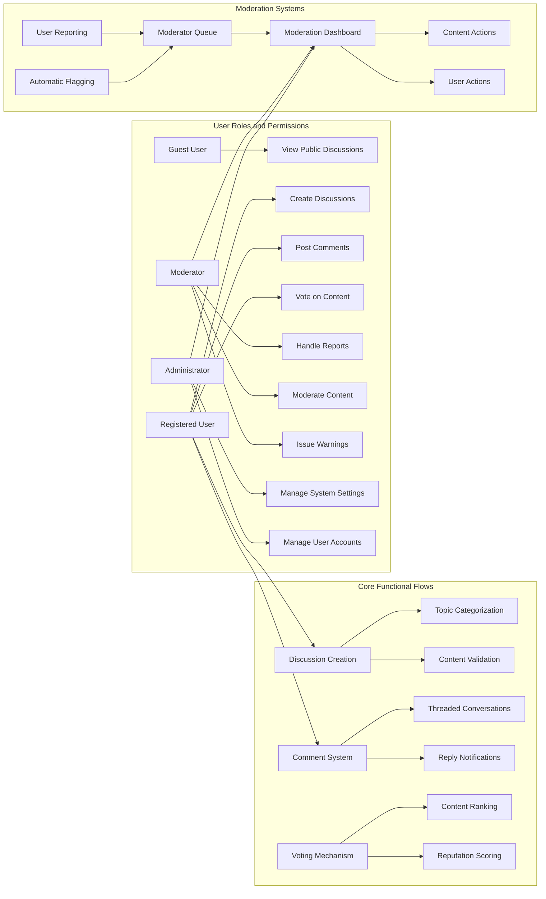

# Functional Requirements for Economic/Political Discussion Board

## 1. Introduction and Scope

The economic/political discussion board is a digital platform designed to facilitate meaningful dialogue on important societal topics. The system enables users to create discussions, contribute to ongoing conversations through comments, and evaluate content through voting. This document outlines the complete functional requirements for the core features of the discussion platform, focusing on business requirements that backend developers need to implement.

The discussion board is designed with specific considerations for economic and political content, which often generates passionate discourse. The functional requirements emphasize structured dialogue, content discoverability, and community moderation to maintain civil discourse while enabling robust debate on complex topics.

## 2. Discussion Management

### 2.1 Discussion Creation

Discussion creation is the primary function that initiates content on the platform. Users can start new discussions on economic or political topics, providing a title and detailed content to frame the conversation.

- THE system SHALL allow registered users to create new discussions with a title and main content
- WHEN a registered user submits a new discussion, THE system SHALL validate the content and publish it immediately
- THE system SHALL require discussion titles to be between 10 and 150 characters
- THE system SHALL require discussion content to be between 50 and 10,000 characters
- IF a user attempts to submit a discussion with insufficient content, THEN THE system SHALL reject the submission and return specific validation errors
- THE system SHALL allow discussions to be categorized by topic (economic policy, foreign relations, domestic issues, elections, etc.)
- THE system SHALL automatically generate a unique URL slug from the discussion title for SEO and sharing purposes

### 2.2 Discussion Viewing

Discussion viewing enables users to access and read discussions on topics of interest. The system presents discussions with key metadata to help users evaluate their relevance and quality.

- THE system SHALL display discussions in chronological order, newest first, on the main listing page
- THE system SHALL paginate discussion listings with 20 discussions per page
- THE system SHALL show a preview of each discussion including title, author, creation date, number of comments, vote count, and topic category
- WHEN a user navigates to a discussion page, THE system SHALL load the complete discussion content and all associated comments
- THE system SHALL display the full discussion title, content, author, creation timestamp, last edited timestamp (if applicable), vote count, and comment count
- THE system SHALL display a "sticky" indicator IF the discussion has been marked as important by moderators or administrators

### 2.3 Discussion Editing

Discussion editing allows authors to refine their content while maintaining integrity of the conversation.

- THE system SHALL allow discussion authors to edit their own discussions
- WHEN a user edits a discussion, THE system SHALL update the content and set the "last edited" timestamp
- THE system SHALL display an "edited" indicator with the timestamp when a discussion has been modified
- THE system SHALL allow discussion editing only within 24 hours of initial posting
- AFTER 24 hours, THE system SHALL prevent further edits to the main discussion content
- THE system SHALL allow administrators to edit any discussion at any time for moderation purposes

### 2.4 Discussion Deletion

Discussion deletion provides mechanisms for removing content that violates community guidelines or is no longer relevant.

- THE system SHALL allow discussion authors to delete their own discussions
- WHEN a user deletes their discussion, THE system SHALL remove it from public view
- THE system SHALL maintain deleted discussions in a soft-delete state for audit purposes
- THE system SHALL prevent deletion of discussions that have received more than 50 comments
- IF a discussion has more than 50 comments, THEN THE system SHALL only allow deletion by moderators or administrators
- WHEN a moderator or administrator deletes a discussion, THE system SHALL provide a deletion reason visible to the author

### 2.5 Discussion Search and Discovery

Discussion search and discovery features help users find relevant conversations on specific topics.

- THE system SHALL provide a search function to find discussions by keywords
- WHEN a user submits a search query, THE system SHALL return results instantly with relevance ranking
- THE system SHALL support filtering discussions by topic category, date range, author, and popularity
- THE system SHALL provide a "trending topics" section highlighting frequently discussed themes
- THE system SHALL recommend related discussions based on content similarity when viewing a discussion
- THE system SHALL allow users to subscribe to topics of interest for notifications of new discussions

## 3. Comment System

### 3.1 Comment Creation

The comment system enables user engagement with discussion content, allowing users to respond to the main discussion or reply to other comments.

- THE system SHALL allow registered users to post comments on discussions
- WHEN a user submits a comment, THE system SHALL validate the content and publish it immediately
- THE system SHALL limit comments to 2,000 characters maximum
- THE system SHALL require comments to be at least 10 characters to prevent spam or frivolous responses
- THE system SHALL allow nested replies to comments up to 5 levels deep
- WHEN a user replies to a comment, THE system SHALL create a threaded conversation structure
- IF a user attempts to post identical content to the same discussion within 5 minutes, THEN THE system SHALL treat it as spam and block the submission

### 3.2 Comment Viewing

Comment viewing presents the discussion dialogue in a structured format that maintains context and conversation flow.

- THE system SHALL display comments in chronological order, oldest first, within each discussion
- THE system SHALL implement infinite scroll for long comment threads instead of pagination
- THE system SHALL visually distinguish direct replies to the main discussion from nested comments
- THE system SHALL highlight comments that have received more than 10 upvotes as "popular"
- THE system SHALL collapse comment threads with more than 20 replies by default, with an option to expand
- THE system SHALL provide a "jump to new comments" feature for users returning to active discussions
- THE system SHALL display comment author, submission timestamp, vote count, and reply count for each comment

### 3.3 Comment Editing

Comment editing allows users to correct mistakes or refine their contributions while preserving conversation integrity.

- THE system SHALL allow comment authors to edit their own comments
- WHEN a user edits a comment, THE system SHALL update the content and set an "edited" indicator
- THE system SHALL allow comment editing only within 2 hours of initial submission
- AFTER 2 hours, THE system SHALL prevent further edits to preserve conversation context
- THE system SHALL allow moderators to edit comments for rule violations or clarity
- WHEN a moderator edits a comment, THE system SHALL preserve the original content for audit purposes

### 3.4 Comment Deletion

Comment deletion provides mechanisms for removing inappropriate or erroneous contributions.

- THE system SHALL allow comment authors to delete their own comments
- WHEN a user deletes their comment, THE system SHALL replace it with a "deleted" placeholder
- THE system SHALL maintain deleted comment content in a soft-delete state for audit purposes
- THE system SHALL allow moderators to delete comments that violate community guidelines
- WHEN a moderator deletes a comment, THE system SHALL record the reason and make it visible to the comment author
- IF a comment has received replies, THEN THE system SHALL prevent deletion by the author to maintain conversation context

### 3.5 Comment Notification

Comment notification keeps users engaged with conversations they've contributed to or subscribed to.

- THE system SHALL notify the discussion author when a new comment is posted
- THE system SHALL notify comment authors when someone replies to their comment
- THE system SHALL provide users with notification preferences for comment activity
- THE system SHALL implement a "mute thread" feature to stop notifications for specific discussions
- THE system SHALL batch notifications during high-activity periods to prevent overwhelming users

## 4. Voting Mechanism

### 4.1 Vote Submission

The voting mechanism enables community evaluation of content, helping surface high-quality contributions.

- THE system SHALL allow registered users to vote on discussions and comments
- WHEN a user votes on content, THE system SHALL record the vote type (upvote or downvote) and timestamp
- THE system SHALL allow only one vote per user per piece of content
- IF a user attempts to vote multiple times on the same content, THEN THE system SHALL update the existing vote instead of creating a new one
- THE system SHALL prevent users from voting on their own content
- THE system SHALL allow users to change their vote (from upvote to downvote or vice versa) at any time
- THE system SHALL display the current net vote count (upvotes minus downvotes) for each discussion and comment

### 4.2 Vote Impact

Vote impact determines how community evaluations affect content visibility and user reputation.

- THE system SHALL use vote counts as a primary factor in discussion ranking on listing pages
- THE system SHALL consider high vote count discussions more likely to be "trending"
- THE system SHALL incorporate vote counts into personalized content recommendations
- WHEN a discussion receives a high volume of downvotes, THE system SHALL flag it for moderator review
- THE system SHALL incorporate voting patterns into user reputation scoring
- THE system SHALL treat rapid downvoting from multiple new accounts as potential vote manipulation

### 4.3 Vote Transparency

Vote transparency balances community evaluation with protection against bandwagon effects and harassment.

- THE system SHALL display only the net vote count to regular users
- THE system SHALL hide the specific breakdown of upvotes and downvotes from regular users
- THE system SHALL allow moderators and administrators to view vote breakdowns for investigation purposes
- THE system SHALL implement vote hiding for content that receives rapid downvotes to prevent bandwagon effects
- THE system SHALL display a "controversial" indicator when content has received more than 20 upvotes and more than 20 downvotes

## 5. Content Moderation

### 5.1 User Reporting

User reporting enables community-driven content moderation by allowing users to flag problematic content.

- THE system SHALL provide a "report" button on each discussion and comment
- WHEN a user reports content, THE system SHALL present reporting categories (harassment, misinformation, spam, rule violation, etc.)
- THE system SHALL require users to provide a brief explanation when reporting content
- THE system SHALL limit users to 5 reports per day to prevent abuse of the reporting system
- WHEN a user submits a report, THE system SHALL add it to a moderator queue and notify the reporting user of receipt
- IF a user's reports are frequently dismissed by moderators, THEN THE system SHALL reduce the priority of their future reports

### 5.2 Moderation Dashboard

The moderation dashboard provides tools for moderators to manage reported content and maintain community standards.

- THE system SHALL provide moderators with a dashboard showing all pending reports
- THE system SHALL prioritize reports based on severity, number of reports for the same content, and reporter reputation
- THE system SHALL display reported content with context (surrounding comments, user history) to moderators
- THE system SHALL allow moderators to take actions on reported content (approve, edit, warn user, suspend user, delete content)
- WHEN a moderator takes action, THE system SHALL notify the content author and the reporting user
- THE system SHALL maintain a complete audit log of all moderation actions with timestamps and reasons
- THE system SHALL allow moderators to issue user warnings for minor violations

### 5.3 Automatic Content Flagging

Automatic content flagging uses business rules to identify potentially problematic content for moderator review.

- THE system SHALL automatically flag discussions or comments containing banned keywords
- THE system SHALL flag content with excessive capitalization (more than 50% of characters in caps) as potentially aggressive
- THE system SHALL flag content with more than 3 consecutive exclamation points or question marks
- THE system SHALL flag posts with identical content across multiple discussions as potential spam
- THE system SHALL flag rapid posting (more than 10 posts in 5 minutes) by a single user
- THE system SHALL flag content containing hyperlinks to known malicious domains
- THE system SHALL flag discussions with high downvote velocity as potentially controversial or problematic

### 5.4 User Moderation Actions

User moderation actions provide a graduated response system for enforcing community guidelines.

- THE system SHALL allow moderators to issue formal warnings to users for rule violations
- WHEN a user receives a warning, THE system SHALL send a notification and record it in their profile
- THE system SHALL allow moderators to temporarily suspend users for severe violations
- THE system SHALL enforce escalating consequences: first warning, then 24-hour suspension, then 7-day suspension, then permanent ban
- THE system SHALL allow administrators to permanently ban users for egregious violations
- THE system SHALL prevent banned users from creating new accounts using previously associated email addresses
- THE system SHALL allow users to appeal moderation decisions through a formal process

## 6. User Profile Features

### 6.1 User Profiles

User profiles provide identity and reputation context for contributions on the platform.

- THE system SHALL create a profile for each registered user
- THE system SHALL display user profiles including username, join date, and post statistics
- THE system SHALL show the number of discussions created, comments posted, and votes cast on user profiles
- THE system SHALL display user reputation score on profiles
- THE system SHALL allow users to add a brief bio (maximum 500 characters) to their profile
- THE system SHALL allow users to link their professional affiliations or credentials
- THE system SHALL prevent users from changing their username more than once per month

### 6.2 User Reputation System

The user reputation system incentivizes quality contributions and responsible participation.

- THE system SHALL calculate a reputation score for each user based on community feedback
- THE system SHALL increase user reputation when their content receives upvotes
- THE system SHALL decrease user reputation when their content receives downvotes
- THE system SHALL increase user reputation for receiving replies to their comments (indicating engagement)
- THE system SHALL decrease user reputation for having content removed by moderators
- THE system SHALL use reputation scores to influence the visibility of user contributions
- THE system SHALL grant increased privileges (such as reduced moderation scrutiny) to users with high reputation

### 6.3 User Activity Tracking

User activity tracking provides a history of contributions and engagement.

- THE system SHALL maintain a public activity feed on each user profile
- THE system SHALL record all user discussions, comments, and votes (except when reversed) in their activity feed
- THE system SHALL allow users to filter their activity feed by content type
- THE system SHALL display recent activity including timestamps and content links
- THE system SHALL allow users to delete their own comments, which will be reflected in the activity feed
- THE system SHALL maintain deleted content references in the activity feed with a "deleted" status

## 7. Cross-Cutting Requirements

### 7.1 Performance Requirements

Performance requirements ensure a responsive and scalable user experience.

- WHEN a user loads the discussion listing page, THE system SHALL display the first 20 discussions within 2 seconds
- WHEN a user navigates to a discussion page, THE system SHALL load the main discussion content within 1.5 seconds
- WHEN a user submits new content (discussion or comment), THE system SHALL confirm receipt and display the content within 3 seconds
- WHEN a user searches for content, THE system SHALL return results instantly (within 1 second) for queries up to 3 keywords
- THE system SHALL support simultaneous active users up to 10,000 without degradation of performance
- THE system SHALL maintain responsiveness during peak political events when traffic may increase by 10x

### 7.2 Error Handling

Error handling requirements ensure graceful recovery from exceptional conditions.

- WHEN a user attempts to access a deleted discussion, THE system SHALL display a meaningful error message explaining the content is no longer available
- WHEN a user experiences a failed submission, THE system SHALL return specific validation errors explaining what needs correction
- IF a user session expires during content composition, THEN THE system SHALL preserve their draft content for recovery
- WHEN a moderator action is taken on content a user is viewing, THE system SHALL update the display to reflect the change without requiring a page refresh
- IF the voting system is temporarily unavailable, THEN THE system SHALL queue votes for processing when service is restored
- WHEN a search query fails, THE system SHALL suggest alternative terms or display the most recent relevant content

> *Developer Note: This document defines **business requirements only**. All technical implementations (architecture, APIs, database design, etc.) are at the discretion of the development team.*