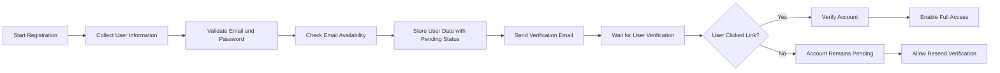
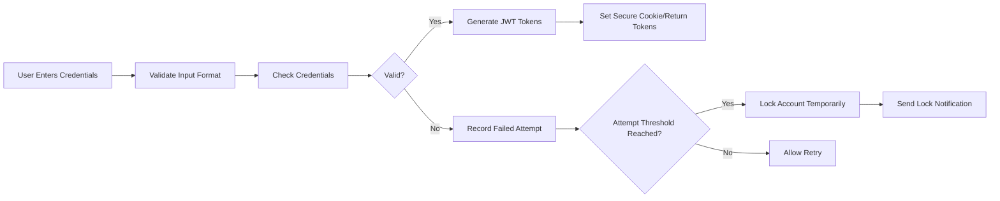
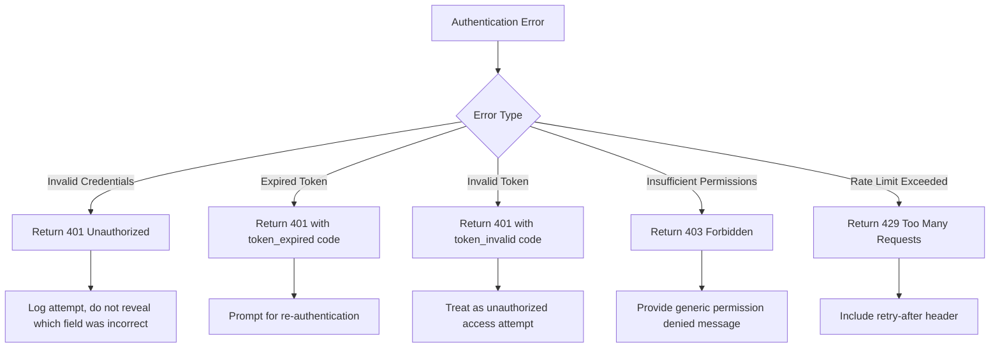

# Authentication Flow Requirements for Economic/Political Discussion Board

## Executive Summary

This document outlines the complete authentication flow for the economic/political discussion board platform. The system requires a robust authentication mechanism to ensure secure user access while maintaining ease of use for participants in political and economic discussions. The authentication system must support four distinct user roles with appropriate permissions and security measures.

## User Roles and Authentication

The discussion board platform supports four user roles, each with specific authentication requirements:

### Guest User

THE system SHALL allow unauthenticated users to browse public content with no authentication requirements.

### Registered User

THE system SHALL require email verification before enabling full participation privileges.

WHEN a user completes registration, THE system SHALL assign registeredUser role with appropriate permissions.

### Moderator

THE system SHALL implement enhanced security measures for moderators:

- Mandatory two-factor authentication
- Elevated session security
- Special authentication flags
- Restricted access patterns

### Administrator

THE system SHALL enforce highest security standards for administrators:

- Mandatory multi-factor authentication
- IP address monitoring
- Session recording
- Emergency access protocols

## Authentication Processes

### Registration Process

WHEN a guest user submits registration information, THE system SHALL validate the provided email address and password according to the following requirements:

1. Email address SHALL be in valid RFC 5322 format
2. Password SHALL be at least 8 characters long
3. Password SHALL contain at least one uppercase letter, one lowercase letter, and one number
4. Email address SHALL not already exist in the system
5. Registration attempts SHALL be rate-limited to prevent abuse

THE system SHALL follow this registration flow:



WHEN the user clicks the verification link, THE system SHALL mark the account as verified and allow full access to registered user features. THE system SHALL automatically authenticate the user and redirect to the dashboard upon successful verification.

### Login Process

WHEN a user submits login credentials, THE system SHALL verify the email address and password combination. IF the credentials are invalid, THEN THE system SHALL return an HTTP 401 Unauthorized response with error code AUTH_INVALID_CREDENTIALS.

WHEN authentication is successful, THE system SHALL generate JWT tokens and return them to the client. THE system SHALL create an access token with 30-minute expiration and a refresh token with 7-day expiration.

THE system SHALL track login attempts and implement rate limiting to prevent brute force attacks. IF a user fails to authenticate 5 times within 15 minutes, THEN THE system SHALL temporarily lock the account for 30 minutes.



### Password Recovery Process

WHEN a user requests password recovery, THE system SHALL verify the email address exists in the system. IF the email does not exist, THEN THE system SHALL return a generic message "If this email is registered, you will receive recovery instructions" to prevent user enumeration attacks.

WHEN the email is verified, THE system SHALL generate a time-limited recovery token and send it to the user's email address. THE recovery link SHALL expire after 1 hour. WHEN the user clicks the recovery link, THE system SHALL validate the token and allow password reset.

THE system SHALL require the new password to meet the same complexity requirements as registration. AFTER password reset, THE system SHALL invalidate all existing sessions and require the user to log in again.

## Session Management

THE system SHALL maintain user sessions using JWT tokens. THE access token SHALL be included in the Authorization header of all authenticated requests in the format "Bearer <token>".

THE system SHALL implement token refresh functionality. WHEN an access token expires, THE client SHALL use the refresh token to obtain a new access token. THE refresh endpoint SHALL validate the refresh token and issue new tokens if valid.

THE system SHALL allow users to revoke their current session. WHEN a user logs out, THE system SHALL invalidate the current session tokens. THE system SHALL also provide functionality for administrators to revoke user sessions.

WHILE a user is authenticated, THE system SHALL maintain session state and SHALL update the last activity timestamp on each authenticated request. THE system SHALL automatically expire sessions after 30 days of inactivity, regardless of refresh token status.

## JWT Token Structure

THE system SHALL use JWT (JSON Web Tokens) for session management with the following payload structure:

```json
{
  "userId": "string (UUID format)",
  "role": "string (enum: guestUser, registeredUser, moderator, administrator)",
  "permissions": "array of strings representing specific permissions",
  "iat": "number (issued at timestamp)",
  "exp": "number (expiration timestamp)",
  "emailVerified": "boolean"
}
```

Token expiration requirements:
- Access token: 15 minutes
- Refresh token: 7 days
- Refresh token rotation on each use
- Refresh token invalidation after logout
- Blacklist mechanism for compromised tokens

THE system SHALL verify token signatures using industry-standard algorithms and validate all claims before accepting a token as valid.

## Error Handling Scenarios

### Registration Errors

IF a user attempts to register with an already existing email address, THEN THE system SHALL return HTTP 409 Conflict with error code REGISTRATION_EMAIL_TAKEN.

IF a user submits invalid registration data, THEN THE system SHALL return HTTP 400 Bad Request with specific validation error codes (REGISTRATION_INVALID_EMAIL, REGISTRATION_WEAK_PASSWORD, etc.).

IF a registration rate limit is exceeded, THEN THE system SHALL return HTTP 429 Too Many Requests with appropriate error code.

### Login Errors

IF a user attempts to log in with invalid credentials, THEN THE system SHALL return HTTP 401 Unauthorized with error code AUTH_INVALID_CREDENTIALS after a consistent 2-second delay to prevent timing attacks.

IF a user's account is temporarily locked due to excessive failed attempts, THEN THE system SHALL return HTTP 423 Locked with error code AUTH_ACCOUNT_LOCKED.

IF a user attempts to log in with an unverified email, THEN THE system SHALL return HTTP 403 Forbidden with error code AUTH_EMAIL_UNVERIFIED.

### Token Errors

IF a request contains an expired access token, THEN THE system SHALL return HTTP 401 Unauthorized with error code AUTH_TOKEN_EXPIRED.

IF a request contains an invalid or malformed token, THEN THE system SHALL return HTTP 401 Unauthorized with error code AUTH_INVALID_TOKEN.

IF a refresh token is invalid or expired, THEN THE system SHALL return HTTP 401 Unauthorized with error code AUTH_INVALID_REFRESH and require full re-authentication.

### Password Recovery Errors

IF a user attempts to reset password with an expired recovery token, THEN THE system SHALL return HTTP 410 Gone with error code PASSWORD_RESET_EXPIRED.

IF a user attempts to reset password with an invalid token format, THEN THE system SHALL return HTTP 400 Bad Request with error code PASSWORD_RESET_INVALID.

IF a user attempts to access the password reset page without a token, THEN THE system SHALL return HTTP 403 Forbidden with error code PASSWORD_RESET_NO_TOKEN.

### Session Management Errors

IF a user attempts to refresh with an invalid refresh token, THEN THE system SHALL return HTTP 401 Unauthorized with error code AUTH_INVALID_REFRESH_TOKEN.

IF a session revocation fails, THEN THE system SHALL return HTTP 500 Internal Server Error with appropriate error code.



## Security Requirements

THE system SHALL use HTTPS for all authentication endpoints to ensure data confidentiality.

THE system SHALL hash passwords using bcrypt with a cost factor of 12 before storing in the database.

THE system SHALL validate all input fields to prevent injection attacks.

THE system SHALL implement CSRF protection for all authentication endpoints accessed through web interfaces.

THE system SHALL log all authentication attempts, including timestamps, IP addresses, and outcomes, for security monitoring.

THE system SHALL implement rate limiting on all authentication endpoints to prevent brute force attacks. Login attempts SHALL be limited to 10 per hour per IP address, and registration attempts SHALL be limited to 5 per hour per IP address.

THE system SHALL use secure, HTTP-only cookies for token storage when cookies are used, with the Secure and SameSite=Strict flags enabled.

THE system SHALL implement security headers including Content-Security-Policy, X-Content-Type-Options, and X-Frame-Options.

## Integration Points

The authentication system SHALL integrate with the following components:

1. **User Profiles Service**: After successful authentication, THE system SHALL provide user profile information.
    - WHEN user is authenticated, THE system SHALL make profile data available
    - WHEN user updates profile, THE system SHALL maintain authentication state

2. **Notification Service**: THE system SHALL trigger email notifications for verification and password recovery.
    - WHEN registration is completed, THE system SHALL trigger verification email
    - WHEN password recovery is requested, THE system SHALL trigger recovery email
    - WHEN security event occurs, THE system SHALL trigger notification

3. **Analytics System**: THE system SHALL send authentication events for monitoring.
    - WHEN user registers, THE system SHALL track registration event
    - WHEN user logs in, THE system SHALL track login event
    - WHEN security incident occurs, THE system SHALL flag for analysis

4. **Moderation System**: THE system SHALL provide user role information to determine features.
    - WHEN content is created, THE system SHALL verify user role
    - WHEN moderation action is taken, THE system SHALL validate moderator role

5. **Discussion Engine**: THE system SHALL authenticate users before allowing content interaction.
    - WHEN discussion is created, THE system SHALL verify authentication
    - WHEN comment is posted, THE system SHALL validate session
    - WHEN vote is cast, THE system SHALL confirm user identity

## Success Metrics

The authentication system's effectiveness SHALL be measured by the following metrics:

1. Registration completion rate (percentage of started registrations that are completed) - Target: 75%
2. Average login success rate (target: 99.5%)
3. Time to complete authentication flows - Target: <30 seconds
4. Rate of forgotten password requests - Target: <10% of logins
5. Number of security incidents related to authentication - Target: <5 per month
6. User satisfaction with authentication process - Target: 4.2/5.0
7. Account verification completion rate - Target: 85% within 24 hours

THE system SHALL monitor these metrics continuously and SHALL alert administrators if any metric falls below acceptable thresholds.

## Cross-System Compatibility

THE authentication system SHALL maintain compatibility with all front-end interfaces:

- Web application
- Mobile application
- API clients
- Third-party integrations

WHEN security requirements change, THE system SHALL maintain backward compatibility during transition periods. THE system SHALL support multiple authentication methods during migration phases.

## Emergency Protocols

THE system SHALL implement emergency protocols for authentication system failures:

- Backup authentication methods
- Manual verification processes
- Incident response procedures
- Communication protocols for users

WHEN security breach is detected, THE system SHALL implement immediate response procedures including forced password resets and session invalidation.

> *Developer Note: This document defines **business requirements only**. All technical implementations (architecture, APIs, database design, etc.) are at the discretion of the development team.*